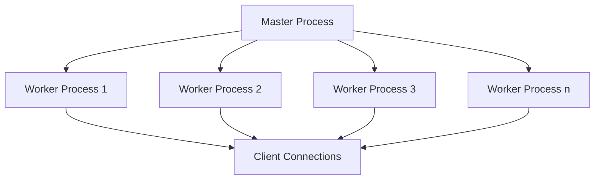

# Nginx Worker Processes

## Introduction

Nginx (pronounced "engine-x") is a popular web server known for its high performance, stability, and rich feature set. One of the key aspects that makes Nginx so efficient is its ability to handle multiple connections concurrently through its worker process architecture.

In this guide, we'll explore what Nginx worker processes are, how they function, and how to configure them properly to optimize your server's performance. Understanding worker processes is crucial for anyone looking to get the most out of their Nginx installation, whether you're running a small personal site or a high-traffic application.

## What Are Nginx Worker Processes?

Nginx uses an event-driven, asynchronous architecture with multiple worker processes to handle client requests. Here's a breakdown of the core components:

- **Master Process**: A single process that reads configuration, binds to ports, and creates worker processes
- **Worker Processes**: Multiple processes that handle all the actual work (processing connections, serving content)



Each worker process is single-threaded and handles multiple connections using an event loop. This design allows Nginx to achieve high concurrency with minimal resource consumption.

## Configuring Worker Processes

The primary configuration directive for worker processes is `worker_processes`, which specifies how many worker processes Nginx should spawn.

### Basic Configuration

The `worker_processes` directive is typically set in the main context of your Nginx configuration file (`nginx.conf`):

```nginx
# Set the number of worker processes
worker_processes 4;

events {
    worker_connections 1024;
}

http {
    # HTTP server configuration
}
```

### Understanding the Options

You have several options when setting the `worker_processes` directive:

1. **Specific number**: `worker_processes 4;`
2. **Auto**: `worker_processes auto;` (Nginx will try to detect the optimal number)

The `auto` setting is available in Nginx 1.3.8 and later and will set the number of worker processes equal to the number of CPU cores.

## How Many Worker Processes Should You Use?

The optimal number of worker processes depends primarily on your server's hardware, particularly the number of CPU cores available. Here are some guidelines:

### General Rule of Thumb

A good starting point is to set the worker processes equal to the number of CPU cores:

```nginx
# For a 4-core CPU
worker_processes 4;
```

You can determine the number of CPU cores on your system using:

```bash
# On Linux
nproc

# Or
grep processor /proc/cpuinfo | wc -l
```

### When to Use More or Less

- **CPU-bound workloads**: Use one worker per core
- **I/O-bound workloads**: You might benefit from slightly more workers than cores
- **Limited memory situations**: You might need to reduce the number of workers

## Worker Process Efficiency Directives

Besides `worker_processes`, several other directives affect how worker processes operate:

### worker_connections

This sets the maximum number of simultaneous connections that each worker process can handle:

```nginx
events {
    worker_connections 1024;
}
```

The maximum number of connections your server can handle is approximately:
`worker_processes × worker_connections = max connections`

### worker_cpu_affinity

This binds particular worker processes to specific CPU cores, which can improve CPU cache efficiency:

```nginx
# For a 4-core CPU, bind each worker to a specific core
worker_processes 4;
worker_cpu_affinity 0001 0010 0100 1000;
```

### worker_priority

This sets the scheduling priority of worker processes:

```nginx
# Lower values mean higher priority (-20 to 20)
worker_priority 0;
```

## Real-World Examples

Let's explore some practical examples of worker process configuration for different scenarios.

### Example 1: Small VPS Server

For a small virtual private server with 2 CPU cores and limited memory:

```nginx
worker_processes 2;
worker_priority 0;

events {
    worker_connections 512;
    multi_accept on;
}

http {
    # Other settings
}
```

### Example 2: High-Traffic Web Server

For a dedicated server with 16 CPU cores handling high traffic:

```nginx
worker_processes 16;
worker_cpu_affinity auto;
worker_rlimit_nofile 65535;

events {
    worker_connections 4096;
    multi_accept on;
    use epoll;
}

http {
    # Other settings
}
```

### Example 3: Mixed-Use Server

If your server runs other applications besides Nginx:

```nginx
worker_processes 6;  # Using 6 out of 8 available cores

events {
    worker_connections 2048;
}

http {
    # Other settings
}
```

## Monitoring Worker Processes

To ensure your worker process configuration is effective, you should monitor your Nginx server:

### Using Nginx Status Module

Enable the status module in your configuration:

```nginx
server {
    listen 80;
    server_name example.com;
    
    location /nginx_status {
        stub_status on;
        allow 127.0.0.1;  # Only allow local access
        deny all;
    }
}
```

Then access the stats via `http://example.com/nginx_status`.

### Using System Tools

Monitor CPU and memory usage:

```bash
# See all Nginx processes
ps aux | grep nginx

# Monitor Nginx resource usage
top -p $(pgrep -d ',' nginx)
```

## Tuning Worker Processes

When optimizing worker processes, follow these steps:

1. **Start with CPU core count**: Set `worker_processes` equal to CPU cores
2. **Load test your application**: Measure performance with tools like Apache Benchmark or wrk
3. **Monitor resource usage**: Watch CPU, memory, and I/O during tests
4. **Adjust incrementally**: Make small changes and test again
5. **Consider your workload**: I/O-bound vs CPU-bound applications need different configurations

## Troubleshooting Common Issues

### High CPU Usage

If you observe high CPU usage:

```bash
# Check which worker processes are using CPU
top -p $(pgrep -d ',' nginx)
```

Possible solutions:
- Reduce the number of worker processes
- Optimize your Nginx configuration
- Enable caching mechanisms

### Connection Errors

If you see "too many open files" errors in logs:

```nginx
worker_rlimit_nofile 65535;
```

Also update your system limits in `/etc/security/limits.conf`:

```
nginx soft nofile 65535
nginx hard nofile 65535
```

## Summary

Nginx worker processes are a fundamental part of what makes Nginx so efficient. Here's what we've covered:

- Worker processes handle all the actual connection processing in Nginx
- The optimal number of worker processes typically equals the number of CPU cores
- Additional directives like `worker_connections` and `worker_cpu_affinity` can further enhance performance
- Monitoring and testing are essential for effective optimization

By properly configuring worker processes, you can significantly improve your Nginx server's performance, handling more concurrent connections with less resource utilization.

## Additional Resources

- [Nginx Official Documentation](https://nginx.org/en/docs/)
- [Nginx Admin Guide](https://docs.nginx.com/nginx/admin-guide/)

## Exercises

1. **Configuration Practice**: Create an Nginx configuration optimized for a server with 4 CPU cores that needs to handle approximately 2000 concurrent connections.

2. **Performance Analysis**: Set up a test environment with two different worker process configurations and use a tool like Apache Benchmark to compare their performance.

3. **Research Project**: Investigate how different operating systems affect the optimal number of Nginx worker processes and why.