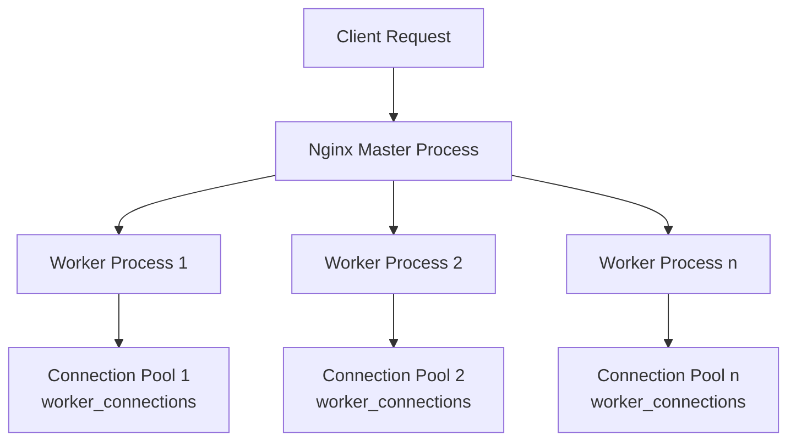

# Nginx Worker Connections

## Introduction

When optimizing your Nginx web server, understanding and properly configuring **worker connections** is essential. Worker connections determine how many simultaneous connections each worker process can handle, directly impacting your server's performance and scalability.

In this guide, we'll explore what worker connections are, how they work, and how to configure them optimally for your specific use case.

## What Are Worker Connections?

Worker connections represent the maximum number of simultaneous connections that each Nginx worker process can maintain. This includes connections to clients (browsers) and to upstream servers (like your application server).

A single client typically establishes multiple connections to your web server when loading a webpage (for HTML, CSS, JavaScript, images, etc.). Each of these connections consumes one worker connection from Nginx's available pool.

## Basic Configuration

Nginx worker connections are configured in the `events` block of your Nginx configuration file:

```nginx
events {
    worker_connections 1024;
}
```

The default value is typically 1024, but this can be adjusted based on your server's capacity and traffic patterns.

## How Worker Connections Work

To understand how worker connections affect your server, let's examine how Nginx processes connections:



Each worker process can handle up to the configured number of worker connections simultaneously. The total number of concurrent connections your Nginx server can handle is calculated as:

`max_connections = worker_processes × worker_connections`

## Calculating Optimal Worker Connections

The optimal number of worker connections depends on:

1. Your server's hardware resources
2. The type of connections (HTTP, HTTPS)
3. Your expected traffic patterns

For most scenarios, you can calculate a reasonable value using:

```
worker_connections = (RAM in MB / 2) / (average connection size in MB)
```

For typical web servers:
- Each connection consumes approximately 2-4KB of memory
- A server with 4GB RAM might support 10,000+ connections

## Practical Examples

### Example 1: Basic Web Server Configuration

For a standard web server with 2GB RAM serving mostly static content:

```nginx
user www-data;
worker_processes auto;
events {
    worker_connections 2048;
}
http {
    # Other HTTP settings
    keepalive_timeout 65;
    # ...
}
```

### Example 2: High-Traffic Server Configuration

For a high-traffic server with 8GB RAM:

```nginx
user www-data;
worker_processes auto;
events {
    worker_connections 4096;
    multi_accept on;
    use epoll;
}
http {
    # Other HTTP settings
    keepalive_timeout 65;
    keepalive_requests 100;
    # ...
}
```

### Example 3: Testing Your Configuration

To check your current worker connections setting:

```bash
# Command
nginx -V

# Sample Output
nginx version: nginx/1.18.0
built with OpenSSL 1.1.1f  31 Mar 2020
TLS SNI support enabled
configure arguments: --with-cc-opt='-g -O2 -fdebug-prefix-map=/build/nginx-zzWf90/nginx-1.18.0=. -fstack-protector-strong -Wformat -Werror=format-security -fPIC -Wdate-time -D_FORTIFY_SOURCE=2' --with-ld-opt='-Wl,-Bsymbolic-functions -Wl,-z,relro -Wl,-z,now -fPIC' --prefix=/usr/share/nginx --conf-path=/etc/nginx/nginx.conf --http-log-path=/var/log/nginx/access.log --error-log-path=/var/log/nginx/error.log --lock-path=/var/lock/nginx.lock --pid-path=/run/nginx.pid --modules-path=/usr/lib/nginx/modules --http-client-body-temp-path=/var/lib/nginx/body --http-fastcgi-temp-path=/var/lib/nginx/fastcgi --http-proxy-temp-path=/var/lib/nginx/proxy --http-scgi-temp-path=/var/lib/nginx/scgi --http-uwsgi-temp-path=/var/lib/nginx/uwsgi --with-debug --with-pcre-jit --with-http_ssl_module --with-http_stub_status_module --with-http_realip_module --with-http_auth_request_module --with-http_v2_module --with-http_dav_module --with-http_slice_module --with-threads --with-http_addition_module --with-http_gunzip_module --with-http_gzip_static_module --with-http_sub_module
```

To test if your server can handle the configured number of connections:

```bash
# Install Apache Bench
apt-get install apache2-utils

# Test with 1000 concurrent connections, 10000 total requests
ab -n 10000 -c 1000 http://your-server/
```

## Common Issues and Solutions

### Problem: Too Many Open Files Error

```
2023/01/15 12:34:56 [emerg] 1234#0: socket() failed (24: Too many open files)
```

**Solution**: Increase the system's file descriptor limit:

1. Add to `/etc/security/limits.conf`:
```
www-data soft nofile 65535
www-data hard nofile 65535
```

2. Add to your Nginx configuration:
```nginx
worker_rlimit_nofile 65535;
```

### Problem: Connection Queue Overflow

```
2023/01/15 12:34:56 [alert] 1234#0: *5678 socket() failed (24: Too many open files) while connecting to upstream
```

**Solution**: Adjust your worker connections and possibly backlog settings:

```nginx
events {
    worker_connections 4096;
    multi_accept on;
}
```

### Problem: High CPU Usage

**Solution**: Balance worker processes and connections:

```nginx
worker_processes auto;
worker_cpu_affinity auto;
events {
    worker_connections 2048;
    use epoll;
}
```

## Performance Tuning Tips

1. **Start Conservative**: Begin with the default settings and monitor performance.

2. **Monitor Memory Usage**:
   ```bash
   watch -n 1 "free -m"
   ```

3. **Check Connection Status**:
   ```bash
   # Enable status page in Nginx
   location /nginx_status {
       stub_status on;
       allow 127.0.0.1;
       deny all;
   }
   
   # Access status
   curl http://localhost/nginx_status

   # Sample output
   Active connections: 43
   server accepts handled requests
    1477 1477 4079
   Reading: 0 Writing: 5 Waiting: 38
   ```

4. **Adjust Gradually**: Increase worker connections in small increments, testing after each change.

## Real-World Scaling Example

Let's consider an e-commerce site that needs to handle Black Friday traffic:

```nginx
user www-data;
worker_processes auto;
worker_rlimit_nofile 65535;

events {
    worker_connections 8192;
    multi_accept on;
    use epoll;
}

http {
    keepalive_timeout 75;
    keepalive_requests 100;
    sendfile on;
    tcp_nopush on;
    tcp_nodelay on;
    
    # File cache configuration
    open_file_cache max=5000 inactive=20s;
    open_file_cache_valid 30s;
    open_file_cache_min_uses 2;
    open_file_cache_errors on;
    
    # Additional optimizations
    reset_timedout_connection on;
    client_body_timeout 10;
    send_timeout 2;
    limit_conn_zone $binary_remote_addr zone=addr:10m;
    limit_conn addr 100;
    
    # ... rest of configuration
}
```

## Summary

Worker connections are a crucial aspect of Nginx optimization that determine how many simultaneous connections your server can handle. The optimal setting depends on your server's resources, expected traffic, and the nature of your application.

Key takeaways:
1. Worker connections set the maximum connections per worker process
2. Total connections = worker_processes × worker_connections
3. Consider system limits (file descriptors) when configuring
4. Monitor and adjust based on actual performance
5. Balance with other settings like keepalive and timeouts

## Additional Resources and Exercises

### Resources
- [Nginx Official Documentation](https://nginx.org/en/docs/events.html)
- [Nginx Admin Guide](https://docs.nginx.com/nginx/admin-guide/)

### Exercises

1. **Basic Configuration**: Set up a basic Nginx server with custom worker connections and test its performance with Apache Bench.

2. **Resource Monitoring**: Configure a monitoring system (like Prometheus and Grafana) to track Nginx connection metrics.

3. **Load Testing**: Create a load testing scenario that gradually increases traffic to find your server's breaking point.

4. **Optimization Challenge**: Optimize an Nginx server to handle at least 10,000 concurrent connections on modest hardware.

5. **Comparative Analysis**: Compare the performance of different worker_connections settings on the same hardware and create a benchmark report.