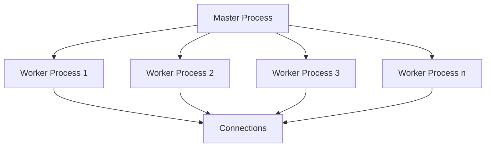

# Nginx Memory Optimization

## Introduction

Memory optimization is a critical aspect of configuring Nginx for production environments. When properly tuned, Nginx can efficiently serve thousands of concurrent connections with minimal memory footprint. This guide will walk you through understanding Nginx's memory usage patterns and implementing practical optimizations to make your web server both performant and resource-efficient.

## Understanding Nginx Memory Usage

Nginx uses a multi-process architecture that consists of:

1. A master process (runs as root)
2. Several worker processes (run as non-privileged user)



Each worker process handles multiple connections concurrently using an event-driven approach. This architecture means memory usage in Nginx stems from:

- Static memory allocation (code, shared libraries)
- Per-process memory (for each worker)
- Per-connection memory
- Caches and buffers

## Key Memory Configuration Directives

### Worker Processes

The `worker_processes` directive determines how many worker processes Nginx spawns:

```nginx
# Set to number of CPU cores for optimal performance
worker_processes auto;
```

Setting this to `auto` makes Nginx detect the number of CPU cores and create an equal number of worker processes. This balances CPU usage with memory consumption.

### Worker Connections

The `worker_connections` directive sets the maximum number of simultaneous connections each worker can handle:

```nginx
# Default is often 768 or 1024
worker_connections 1024;
```

Maximum concurrent connections = `worker_processes × worker_connections`

### Buffer Size Optimization

Nginx uses various buffers that impact memory usage:

#### Client Request Buffers

```nginx
# Buffer size for reading client request header
client_header_buffer_size 1k;
large_client_header_buffers 4 8k;

# Buffer size for client request body
client_body_buffer_size 16k;
```

#### Response Buffers

```nginx
# Buffer size for responses from proxied servers
proxy_buffer_size 4k;
proxy_buffers 8 16k;
proxy_busy_buffers_size 32k;
```

### Connection Timeouts

Reducing connection timeouts helps free up memory by closing idle connections:

```nginx
# Client connection timeouts
client_body_timeout 12;
client_header_timeout 12;
keepalive_timeout 15;
send_timeout 10;
```

## Practical Example: Optimizing for High Traffic

Let's look at a complete configuration for a high-traffic website with limited memory:

```nginx
user nginx;
worker_processes auto;
worker_rlimit_nofile 65535;
error_log /var/log/nginx/error.log warn;
pid /var/run/nginx.pid;

events {
    worker_connections 2048;
    multi_accept on;
    use epoll;
}

http {
    include /etc/nginx/mime.types;
    default_type application/octet-stream;
    
    # Logging settings
    log_format main '$remote_addr - $remote_user [$time_local] "$request" '
                    '$status $body_bytes_sent "$http_referer" '
                    '"$http_user_agent" "$http_x_forwarded_for"';
    access_log /var/log/nginx/access.log main buffer=16k flush=2m;
    
    # Buffer size settings
    client_body_buffer_size 16k;
    client_header_buffer_size 1k;
    client_max_body_size 8m;
    large_client_header_buffers 2 1k;
    
    # Timeouts
    client_body_timeout 12;
    client_header_timeout 12;
    keepalive_timeout 15;
    keepalive_requests 100;
    send_timeout 10;
    
    # File descriptors cache
    open_file_cache max=200000 inactive=20s;
    open_file_cache_valid 30s;
    open_file_cache_min_uses 2;
    open_file_cache_errors on;
    
    # Gzip compression
    gzip on;
    gzip_comp_level 5;
    gzip_min_length 256;
    gzip_proxied any;
    gzip_vary on;
    gzip_types
        application/javascript
        application/json
        application/xml
        text/css
        text/plain
        text/xml;
    
    # Include other configuration files
    include /etc/nginx/conf.d/*.conf;
}
```

## Memory Usage Monitoring

To optimize effectively, you need to monitor Nginx's memory usage. Here are some useful commands:

### Check Process Memory Usage

```bash
# See memory usage of all Nginx processes
ps -o pid,user,%mem,rss,vsz,cmd -C nginx

# Output example:
#  PID USER     %MEM    RSS     VSZ CMD
# 1234 root     0.1     2516   65532 nginx: master process
# 1235 nginx    0.2     4328   68644 nginx: worker process
# 1236 nginx    0.2     4328   68644 nginx: worker process
```

### Using `top` or `htop`

```bash
# Filter to show only Nginx processes
top -p $(pgrep -d ',' nginx)
```

## Advanced Memory Optimization Techniques

### Connection Pool Reuse

Using the `keepalive` directive for upstream connections reduces the overhead of creating new connections:

```nginx
upstream backend {
    server backend1.example.com;
    server backend2.example.com;
    
    keepalive 32;
}

server {
    # ...
    location /api/ {
        proxy_pass http://backend;
        proxy_http_version 1.1;
        proxy_set_header Connection "";
    }
}
```

### Caching to Reduce Memory Pressure

Implementing appropriate caching reduces memory pressure by serving requests without creating additional processing overhead:

```nginx
http {
    # Cache for static files
    open_file_cache max=10000 inactive=5m;
    open_file_cache_valid 2m;
    open_file_cache_min_uses 1;
    open_file_cache_errors on;
    
    # Response caching
    proxy_cache_path /var/cache/nginx levels=1:2 keys_zone=CACHE:10m 
                    inactive=60m max_size=1g;
    
    server {
        # ...
        location /static/ {
            expires 1d;
            add_header Cache-Control "public";
        }
        
        location /api/ {
            proxy_cache CACHE;
            proxy_cache_valid 200 1h;
            proxy_cache_use_stale error timeout updating http_500 http_502 http_503 http_504;
            proxy_cache_lock on;
            proxy_pass http://backend;
        }
    }
}
```

### Limiting and Controlling Requests

Use rate limiting to prevent memory exhaustion during traffic spikes:

```nginx
http {
    # Define a zone for rate limiting
    limit_req_zone $binary_remote_addr zone=api_limit:10m rate=10r/s;
    
    server {
        # ...
        location /api/ {
            # Apply rate limiting with a small burst
            limit_req zone=api_limit burst=20 nodelay;
            proxy_pass http://backend;
        }
    }
}
```

## Common Memory Issues and Solutions

### Problem: Worker Process Memory Growth

If worker processes continuously grow in memory usage, you might have a memory leak in a module or poor configuration.

**Solution:**
```nginx
# Set a maximum memory size for worker processes
worker_rlimit_nofile 65535;
worker_shutdown_timeout 10s;

# Periodically respawn workers
worker_processes auto;
worker_cpu_affinity auto;
```

### Problem: High Memory Usage During Traffic Spikes

**Solution:**
```nginx
# Implement request queueing
limit_conn_zone $binary_remote_addr zone=conn_limit:10m;
limit_conn conn_limit 20;

# Temporary disable logging during high traffic
access_log off;
```

## Tuning Nginx for Different Scenarios

### Low Memory VPS (512MB-1GB RAM)

```nginx
worker_processes 1;
worker_connections 512;
client_body_buffer_size 8k;
client_header_buffer_size 1k;
client_max_body_size 1m;
large_client_header_buffers 2 1k;
```

### Medium Server (2GB-4GB RAM)

```nginx
worker_processes auto;
worker_connections 1024;
client_body_buffer_size 16k;
client_header_buffer_size 1k;
client_max_body_size 8m;
large_client_header_buffers 2 1k;
```

### High-traffic Production Server (8GB+ RAM)

```nginx
worker_processes auto;
worker_connections 4096;
client_body_buffer_size 32k;
client_header_buffer_size 2k;
client_max_body_size 16m;
large_client_header_buffers 4 8k;
```

## Summary

Memory optimization in Nginx involves finding the right balance between performance and resource consumption. The key strategies are:

1. Set appropriate worker process count based on CPU cores
2. Configure connection limits and timeouts to manage concurrency
3. Optimize buffer sizes based on your application needs
4. Implement proper caching strategies
5. Monitor memory usage and adjust configurations accordingly

By following these guidelines, you can achieve a highly efficient Nginx setup that delivers excellent performance without excessive memory consumption.

## Additional Resources

- [Nginx Official Documentation](https://nginx.org/en/docs/)
- [Nginx Admin Guide](https://docs.nginx.com/nginx/admin-guide/)

## Practice Exercises

1. Set up a test Nginx server and benchmark its memory usage with different worker process configurations.
2. Monitor the memory usage of an Nginx server under load and identify potential optimization points.
3. Create an Nginx configuration for a specific use case (e.g., API gateway, static file server) with optimized memory settings.
4. Experiment with different buffer size settings and measure their impact on performance and memory usage.