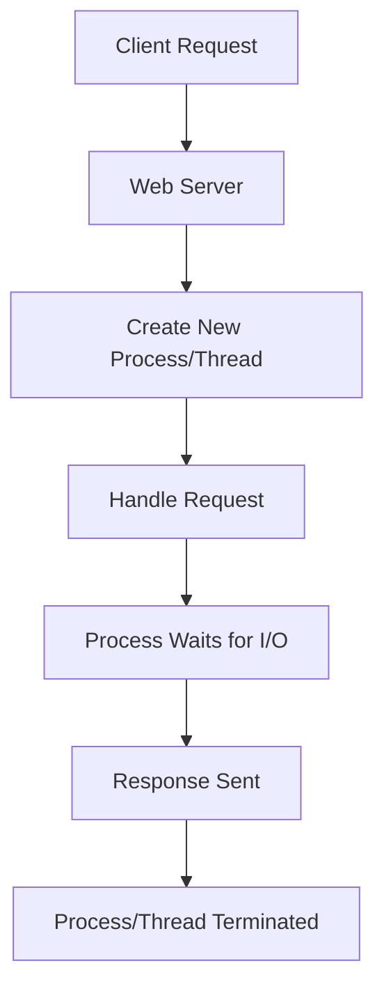
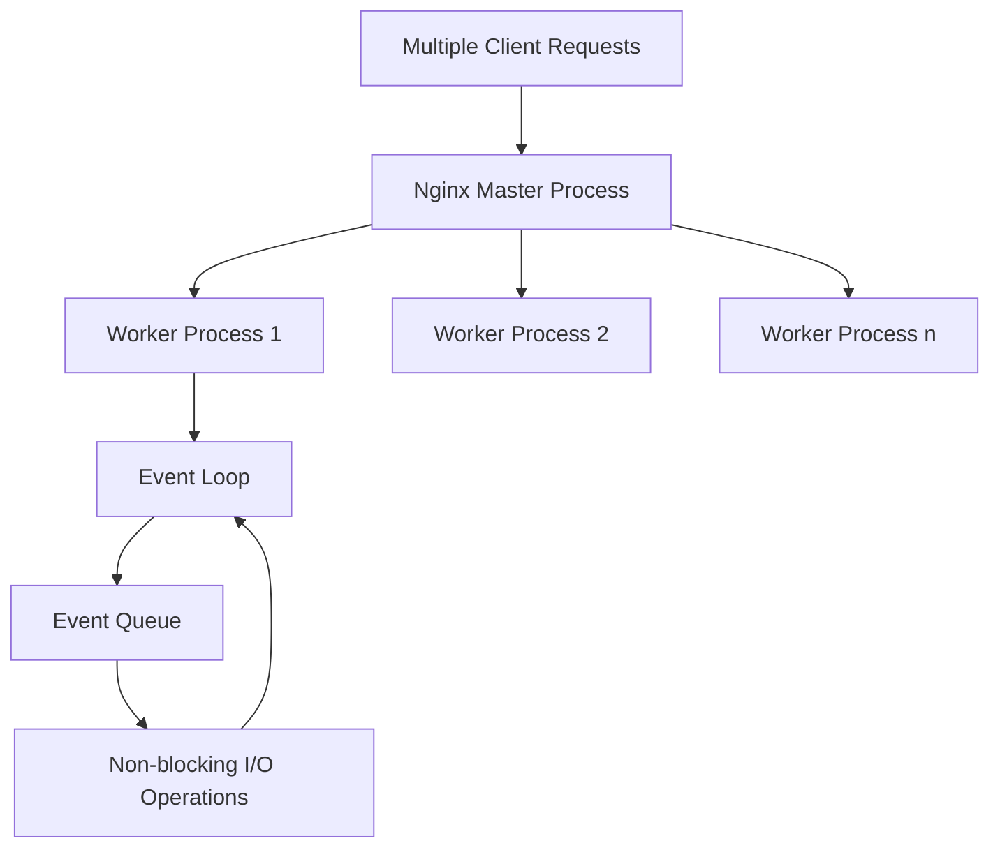

# Understanding the Nginx Event Model

## Introduction

When you're running a busy website or application, how your web server handles connections can make or break your performance. Nginx has become one of the most popular web servers precisely because of its innovative approach to connection handling - its **event-driven architecture**.

In this guide, we'll explore how Nginx's event model works, why it's so efficient, and how you can optimize it for your specific workloads. Unlike traditional web servers that create new processes or threads for each connection, Nginx uses an asynchronous, event-driven approach that allows it to handle thousands of concurrent connections with minimal resources.

## The Problem with Traditional Web Servers

Before diving into Nginx's approach, let's understand the limitations of traditional web servers like Apache's prefork model:



In this model, each connection requires:
- A new process or thread
- Memory allocation for that process/thread (can be 2-10MB each)
- Context switching overhead when the OS juggles between threads

This works fine for a few hundred connections, but quickly becomes inefficient as connections scale to thousands or tens of thousands.

## Nginx's Event-Driven Architecture

Nginx takes a fundamentally different approach:



### Key Components

1. **Master Process**: Manages worker processes, reads configuration, and binds to ports
2. **Worker Processes**: Handle actual connections (typically one per CPU core)
3. **Event Loop**: The heart of each worker process, continuously processing events
4. **Non-blocking I/O**: Operations that don't wait for completion before moving on

## How the Event Loop Works

At the core of Nginx's architecture is the event loop. Here's a simplified pseudocode representation:

```c
while (1) {
    events = get_new_events();  // Get new connection events
    
    for (i = 0; i < events.length; i++) {
        handle_event(events[i]);  // Process each event without blocking
    }
}
```

This seemingly simple loop powers Nginx's ability to handle massive concurrency. Let's break down what happens during each iteration:

1. The worker process checks for new events (incoming connections, data ready to read, etc.)
2. For each event, it processes it **non-blockingly**
3. If an operation would block (like waiting for disk I/O), it registers a callback and moves on
4. The loop continues, servicing other connections while waiting for blocked operations

## Practical Example: Handling Multiple Connections

Let's imagine a scenario where Nginx is handling 10,000 concurrent connections:

1. **Traditional server**: Would require 10,000 threads or processes, potentially consuming gigabytes of RAM
2. **Nginx**: Can handle all 10,000 connections with just a few worker processes

Here's how Nginx processes these connections:

```nginx
events {
    worker_connections 1024;  # Each worker can handle 1024 connections
    multi_accept on;          # Accept multiple connections per event
    use epoll;                # Use the efficient epoll event mechanism on Linux
}

http {
    keepalive_timeout 65;     # Keep connections open for 65 seconds
    keepalive_requests 100;   # Allow 100 requests per connection
    
    # Rest of configuration...
}
```

With this configuration and 4 worker processes (on a 4-core system), Nginx could theoretically handle over 4,000 concurrent connections efficiently.

## Event Mechanisms

Nginx uses different event handling mechanisms depending on the operating system:

| OS | Event Mechanism | Description |
|----|----------------|-------------|
| Linux | epoll | Highly efficient event notification |
| FreeBSD/macOS | kqueue | Kernel event notification interface |
| Solaris | /dev/poll, eventports | Solaris-specific notification methods |
| Windows | IOCP (I/O Completion Ports) | Windows asynchronous I/O |

Let's configure Nginx to use the appropriate mechanism for our Linux server:

```nginx
events {
    use epoll;  # Use epoll on Linux systems
    worker_connections 4096;
}
```

## Connection Processing States

When Nginx handles a connection, it moves through several states:

1. **Accept**: A new connection arrives and is accepted
2. **Read**: Data is read from the client (request headers and body)
3. **Process**: The request is processed (finding files, proxying, etc.)
4. **Write**: Response is written back to the client
5. **Close**: Connection is closed or kept alive for future requests

The key advantage is that at any step where Nginx would have to wait (for disk I/O, upstream responses, etc.), it can process other connections instead of sitting idle.

## Tuning the Event Model

Now that we understand how Nginx's event model works, let's look at how to optimize it:

### Worker Processes

The general recommendation is to set this to the number of CPU cores:

```nginx
# Auto-detect the number of CPU cores
worker_processes auto;

# Or set it manually
# worker_processes 4;
```

### Worker Connections

This sets how many connections each worker can handle:

```nginx
events {
    worker_connections 1024;
}
```

The maximum number of clients you can serve simultaneously is:

`max_clients = worker_processes × worker_connections ÷ (keepalive_requests)`

### Connection Timeouts

Timeouts help free up connections that are no longer active:

```nginx
http {
    keepalive_timeout 65;
    client_header_timeout 10s;
    client_body_timeout 10s;
    send_timeout 10s;
}
```

## Real-World Example: High-Traffic Website Configuration

Here's a configuration tuned for a high-traffic website:

```nginx
user nginx;
worker_processes auto;
worker_rlimit_nofile 30000;  # Increase system limits for file descriptors

events {
    worker_connections 8192;
    multi_accept on;
    use epoll;
}

http {
    # Basic settings
    sendfile on;
    tcp_nopush on;
    tcp_nodelay on;
    keepalive_timeout 15;
    keepalive_requests 100;
    
    # Buffer sizes
    client_body_buffer_size 128k;
    client_max_body_size 10m;
    client_header_buffer_size 1k;
    large_client_header_buffers 4 4k;
    
    # Timeouts
    client_body_timeout 12;
    client_header_timeout 12;
    send_timeout 10;
    
    # Cache settings
    open_file_cache max=200000 inactive=20s;
    open_file_cache_valid 30s;
    open_file_cache_min_uses 2;
    open_file_cache_errors on;
    
    # Gzip settings
    gzip on;
    gzip_comp_level 5;
    gzip_min_length 256;
    gzip_proxied any;
    gzip_vary on;
    gzip_types
        application/javascript
        application/json
        application/xml
        text/css
        text/plain
        text/xml;
        
    # Rest of configuration...
}
```

## Monitoring Nginx Connections

To see how your event model is performing in practice, you can enable the Nginx status module:

```nginx
server {
    listen 80;
    server_name example.com;
    
    location /nginx_status {
        stub_status on;
        allow 127.0.0.1;   # Only allow local access
        deny all;
    }
    
    # Rest of configuration...
}
```

Accessing `http://example.com/nginx_status` would show you:

```
Active connections: 291 
server accepts handled requests
 16630948 16630948 31070465 
Reading: 6 Writing: 179 Waiting: 106
```

This tells you:
- 291 active connections
- 16,630,948 connections accepted and handled
- 31,070,465 total requests processed
- 6 connections in the reading state, 179 in writing, 106 waiting

## Debugging Event Processing Issues

If you encounter event processing issues, you can enable debug logging:

```nginx
error_log /var/log/nginx/error.log debug;
```

This will provide detailed information about event processing, which can help identify bottlenecks or issues in your configuration.

## Summary

Nginx's event-driven architecture sets it apart from traditional web servers by:

1. Using an asynchronous, non-blocking event loop
2. Requiring fewer system resources per connection
3. Scaling efficiently to handle thousands of simultaneous connections
4. Providing various optimization options for different workloads

Understanding this model is crucial for properly configuring and scaling Nginx for high-performance applications. While the default settings work well for most cases, tuning the event model parameters can help you achieve even better performance for your specific use case.

## Additional Resources

- [Nginx Documentation on Event Model](https://nginx.org/en/docs/events.html)
- [Understanding Nginx High Performance Load Balancing](https://www.nginx.com/blog/nginx-high-performance-load-balancer/)
- [Tuning Nginx for Best Performance](https://www.nginx.com/blog/tuning-nginx/)

## Exercises

1. Set up Nginx on your local machine and configure it with different numbers of worker processes and connections. Use a benchmarking tool like `ab` (Apache Benchmark) to test the performance differences.

2. Monitor Nginx's memory usage while serving different amounts of traffic. How does it compare to Apache or other web servers you've used?

3. Configure Nginx as a reverse proxy and observe how it handles connections to upstream servers.

4. Experiment with different timeout settings and observe their effect on connection handling under load.