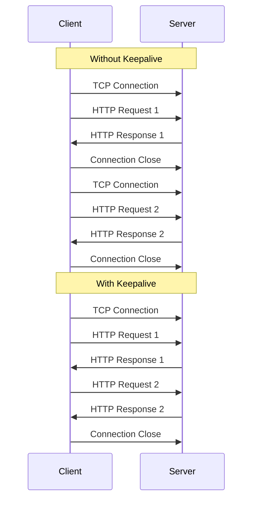

# Nginx Keepalive Connections

## Introduction

When a client (like a web browser) makes an HTTP request to a server, it typically establishes a TCP connection, sends the request, receives the response, and then closes the connection. This process involves significant overhead due to the TCP handshake and slow-start mechanisms. HTTP keepalive connections (also known as persistent connections) allow multiple HTTP requests to use a single TCP connection, significantly improving performance by reducing latency and resource usage.

In this guide, we'll explore how Nginx implements keepalive connections, why they're crucial for performance optimization, and how to configure them properly for your web applications.

## Understanding Keepalive Connections

### What Are Keepalive Connections?

Keepalive connections allow multiple HTTP requests to reuse the same TCP connection, eliminating the need to establish a new connection for each request.



### Benefits of Keepalive Connections

1. **Reduced Latency**: Eliminating the TCP handshake for subsequent requests reduces round-trip time.
2. **Lower CPU Usage**: Less processing required for connection establishment.
3. **Decreased Network Congestion**: Fewer TCP packets on the network.
4. **Better HTTP/1.1 Performance**: Essential for HTTP pipelining.
5. **Improved TLS Performance**: Avoiding repeated TLS handshakes saves significant time.

## Nginx Keepalive Configuration

Nginx provides several directives to control keepalive behavior. Let's explore the most important ones:

### Client-Side Keepalive Configuration

#### `keepalive_timeout`

This directive sets how long an idle keepalive connection remains open.

```nginx
http {
    keepalive_timeout 65s;
}
```

The default is 75 seconds. Setting it too high may consume server resources, while setting it too low reduces the benefits of keepalive connections.

#### `keepalive_requests`

This directive limits the number of requests a client can make over a single keepalive connection.

```nginx
http {
    keepalive_requests 1000;
}
```

The default is 1000 requests. After reaching this limit, the connection will close, and the client must establish a new one.

### Upstream Keepalive Configuration

When Nginx acts as a reverse proxy, it can maintain keepalive connections to upstream servers (like application servers).

#### `keepalive` Directive in Upstream Block

```nginx
upstream backend_servers {
    server backend1.example.com;
    server backend2.example.com;
    keepalive 32;
}

server {
    location /api/ {
        proxy_pass http://backend_servers;
        proxy_http_version 1.1;
        proxy_set_header Connection "";
    }
}
```

The `keepalive` directive specifies how many idle keepalive connections to maintain per worker process.

#### Required Headers

For upstream keepalive connections to work properly, you must:

1. Set `proxy_http_version` to 1.1
2. Clear the Connection header with `proxy_set_header Connection ""` 

These settings ensure Nginx uses HTTP/1.1 and doesn't forward the Connection header that could interfere with keepalive behavior.

## Practical Examples

### Basic Website Configuration

```nginx
server {
    listen 80;
    server_name example.com;
    root /var/www/html;
    
    keepalive_timeout 65s;
    keepalive_requests 1000;
    
    # ... other configurations
}
```

### Load Balancer Configuration

```nginx
http {
    # Global keepalive settings
    keepalive_timeout 65s;
    keepalive_requests 1000;
    
    # Upstream servers with keepalive
    upstream app_servers {
        server app1.internal:8080;
        server app2.internal:8080;
        keepalive 32;
    }
    
    server {
        listen 80;
        server_name example.com;
        
        location / {
            proxy_pass http://app_servers;
            proxy_http_version 1.1;
            proxy_set_header Connection "";
            proxy_set_header Host $host;
            proxy_set_header X-Real-IP $remote_addr;
        }
    }
}
```

### WebSocket Configuration with Keepalive

WebSockets naturally maintain long-lived connections, but proper keepalive settings are still important:

```nginx
map $http_upgrade $connection_upgrade {
    default upgrade;
    '' close;
}

server {
    listen 80;
    server_name websocket.example.com;
    
    location /ws/ {
        proxy_pass http://websocket_servers;
        proxy_http_version 1.1;
        proxy_set_header Upgrade $http_upgrade;
        proxy_set_header Connection $connection_upgrade;
        proxy_read_timeout 3600s; # Long timeout for WebSockets
        keepalive_timeout 65s;
    }
}
```

## Fine-Tuning Keepalive Settings

### Determining Optimal Values

Finding the right keepalive settings depends on your specific workload:

1. **Traffic Pattern**: Sites with repeat visitors benefit more from longer keepalive timeouts.
2. **Server Resources**: Higher concurrency requires more memory for keeping connections open.
3. **Client Behavior**: Modern browsers typically open multiple concurrent connections.

### Performance Testing

To find optimal settings, conduct load tests with different values:

```bash
# Using Apache Benchmark to test with keepalive
ab -n 10000 -c 100 -k http://example.com/
```

Monitor server metrics during testing:
- Connection rate
- Memory usage
- CPU usage
- Time to first byte

### Common Pitfalls

1. **Setting Timeouts Too Long**: Can exhaust server connection capacity.
2. **Setting Timeouts Too Short**: Negates keepalive benefits.
3. **Forgetting HTTP/1.1 for Upstream**: Keepalive won't work without proper HTTP version.
4. **Ignoring Proxy Servers**: Intermediate proxies might terminate keepalives.

## Debugging Keepalive Issues

### Logging Connection Information

Add custom logging to monitor keepalive behavior:

```nginx
log_format keepalive '$remote_addr - $remote_user [$time_local] '
                     '"$request" $status $body_bytes_sent '
                     '"$http_referer" "$http_user_agent" '
                     '$connection $connection_requests';

access_log /var/log/nginx/access.log keepalive;
```

The `$connection` variable contains the connection identifier, and `$connection_requests` shows how many requests have been made on the current connection.

### Using tcpdump to Analyze Traffic

```bash
# Capture TCP packets with FIN or RST flags to see connection terminations
tcpdump -i any 'tcp port 80 and (tcp[tcpflags] & (tcp-fin|tcp-rst)) != 0'
```

## Advanced Configuration

### Tuning Operating System Parameters

For high-performance setups, adjust system-level TCP settings:

```bash
# Increase system-wide limit on open files
sysctl -w fs.file-max=2097152

# Increase TCP timeouts to support longer keepalives
sysctl -w net.ipv4.tcp_keepalive_time=600
sysctl -w net.ipv4.tcp_keepalive_intvl=60
sysctl -w net.ipv4.tcp_keepalive_probes=10

# Enlarge connection tracking table
sysctl -w net.netfilter.nf_conntrack_max=1048576
```

Add these to `/etc/sysctl.conf` for persistence.

### Worker Connections

Ensure Nginx is configured with enough worker connections:

```nginx
events {
    worker_connections 8192;
}
```

Each keepalive connection occupies one worker connection slot, so this setting needs to accommodate your expected concurrent connections.

## Real-World Case Study

Imagine a website that serves both static content and API requests:

```nginx
http {
    # Global settings
    keepalive_timeout 30s;
    keepalive_requests 1000;
    
    # Upstream API servers
    upstream api_backend {
        server api1.internal:8080;
        server api2.internal:8080;
        keepalive 64;  # Higher value for busy API service
    }
    
    # Static content server
    server {
        listen 80;
        server_name static.example.com;
        root /var/www/static;
        
        # Shorter keepalive for static content
        keepalive_timeout 15s;
        
        # Cache headers for static content
        location ~* \.(jpg|jpeg|png|gif|ico|css|js)$ {
            expires 30d;
            add_header Cache-Control "public, no-transform";
        }
    }
    
    # API server
    server {
        listen 80;
        server_name api.example.com;
        
        # Longer keepalive for API clients that make multiple requests
        keepalive_timeout 60s;
        
        location / {
            proxy_pass http://api_backend;
            proxy_http_version 1.1;
            proxy_set_header Connection "";
            proxy_set_header Host $host;
            proxy_set_header X-Real-IP $remote_addr;
        }
    }
}
```

In this example:
- Static content uses shorter keepalive timeouts since browsers typically download files in parallel and don't benefit as much from keepalive.
- API server uses longer keepalive timeouts because clients often make sequential requests.
- Upstream connections maintain a larger keepalive pool (64) to handle frequent backend requests.

## Summary

Nginx keepalive connections are a powerful optimization that can significantly improve the performance of your web applications. By maintaining persistent connections, you reduce latency, decrease server load, and improve user experience.

Key points to remember:
- Keepalive connections allow multiple HTTP requests over a single TCP connection
- Configure `keepalive_timeout` and `keepalive_requests` to control client-side keepalive behavior
- Use the `keepalive` directive in upstream blocks for backend connections
- Always set `proxy_http_version 1.1` and clear the Connection header for upstream keepalives
- Monitor and tune your settings based on your specific workload

## Additional Resources

- [Nginx Official Documentation on HTTP Keepalive](http://nginx.org/en/docs/http/ngx_http_core_module.html#keepalive_timeout)
- [TCP/IP Illustrated, Volume 1](http://www.amazon.com/TCP-Illustrated-Vol-Addison-Wesley-Professional/dp/0201633469)

## Exercises

1. Configure Nginx as a reverse proxy with keepalive connections to an upstream application server. Use `curl` with the `-v` flag to observe the connection reuse.

2. Compare the performance of your website with and without keepalive connections using Apache Benchmark (`ab`). Try the commands:
```bash
# Without keepalive
ab -n 1000 -c 10 http://yoursite.com/

# With keepalive
ab -n 1000 -c 10 -k http://yoursite.com/
```

3. Set up custom logging to track keepalive connections and analyze how many requests are typically made over a single connection for your site.

4. Experiment with different `keepalive_timeout` values and measure their impact on server resource usage and response times.