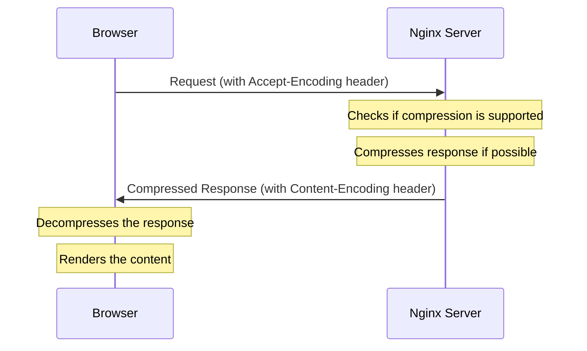

# Nginx Compression

## Introduction

When a web server delivers content to users, the size of the files directly impacts how quickly pages load. Compression is a technique that reduces file sizes before they're sent over the network, resulting in faster load times and lower bandwidth usage. Nginx, a popular web server and reverse proxy, offers powerful built-in compression capabilities that can significantly improve your website's performance.

In this guide, we'll explore how to implement and optimize compression in Nginx, helping you deliver a faster, more efficient user experience.

## Why Use Compression?

Before diving into implementation, let's understand why compression matters:

- **Faster page loads**: Smaller files travel across networks more quickly
- **Reduced bandwidth usage**: Save on hosting costs and improve mobile experience
- **Better user experience**: Studies show that faster websites have higher engagement
- **Improved SEO**: Page speed is a ranking factor for search engines

The following diagram illustrates how compression works in the request-response cycle:



## Enabling Gzip Compression in Nginx

Nginx comes with Gzip compression built-in. Gzip is widely supported across all modern browsers and provides a good balance of compression ratio and processing overhead.

### Basic Configuration

Add the following to your Nginx configuration file (typically located at `/etc/nginx/nginx.conf` or inside a virtual host configuration):

```nginx
http {
    # Enable Gzip compression
    gzip on;
    
    # Compression level (1-9)
    gzip_comp_level 5;
    
    # Minimum file size to compress (in bytes)
    gzip_min_length 256;
    
    # Compress these MIME types
    gzip_types
        text/plain
        text/css
        text/javascript
        application/javascript
        application/json
        application/xml
        application/xml+rss;
        
    # Add Vary header
    gzip_vary on;
    
    # Rest of your http configuration...
}
```

After adding these settings, restart Nginx to apply the changes:

```bash
sudo systemctl restart nginx
```

### Configuration Parameters Explained

Let's break down each parameter:

- **gzip on**: Enables Gzip compression
- **gzip_comp_level**: Sets compression level (1-9)
  - Lower values use less CPU but achieve less compression
  - Higher values use more CPU but achieve better compression
  - Level 5 is a good balance for most websites
- **gzip_min_length**: Only compresses responses larger than the specified size
  - Very small files may actually become larger when compressed
- **gzip_types**: List of MIME types to compress
  - Text-based content benefits most from compression
- **gzip_vary**: Adds the `Vary: Accept-Encoding` header
  - Helps caches store both compressed and uncompressed versions

## Testing Compression

After enabling compression, it's important to verify it's working correctly. You can use the following methods:

### Method 1: Using cURL

```bash
curl -H "Accept-Encoding: gzip" -I https://yourdomain.com/
```

You should see `Content-Encoding: gzip` in the response headers if compression is working.

### Method 2: Browser Developer Tools

1. Open your website in a browser
2. Open developer tools (F12 or right-click and select "Inspect")
3. Go to the Network tab
4. Refresh the page
5. Click on any resource and check the response headers for `Content-Encoding: gzip`

### Before and After Comparison

Let's look at a real-world example of compression in action:

| File Type | Original Size | Compressed Size | Reduction |
|-----------|---------------|-----------------|-----------|
| HTML      | 120 KB        | 20 KB           | 83%       |
| CSS       | 80 KB         | 15 KB           | 81%       |
| JavaScript| 300 KB        | 70 KB           | 77%       |
| JSON      | 50 KB         | 8 KB            | 84%       |

## Advanced Compression Settings

For websites with high traffic or specific requirements, consider these advanced settings:

### Optimizing Compression Level by Content Type

Different types of content compress differently. You can optimize by applying different compression levels:

```nginx
# For JavaScript and CSS files (higher compression)
location ~* \.(js|css)$ {
    gzip_comp_level 7;
}

# For HTML files (medium compression for faster processing)
location ~* \.html$ {
    gzip_comp_level 4;
}
```

### Compressing Proxied Requests

If you're using Nginx as a reverse proxy, you can control which proxied requests get compressed:

```nginx
# Compress all proxied requests
gzip_proxied any;

# Or be more selective
gzip_proxied expired no-cache no-store private auth no_last_modified no_etag;
```

### Adjusting Buffer Size

The buffer size affects how Nginx processes compression:

```nginx
# Number of buffers
gzip_buffers 16 8k;
```

This allocates 16 buffers of 8 kilobytes each.

## Implementing Brotli Compression

Brotli is a newer compression algorithm developed by Google that provides better compression ratios than Gzip. It's supported by all modern browsers and can further reduce file sizes.

### Installing Nginx with Brotli Support

Brotli isn't included in standard Nginx packages, so you'll need to either:

1. Install a pre-built package with Brotli support:

```bash
# For Ubuntu/Debian
sudo add-apt-repository ppa:hda-me/nginx-stable
sudo apt-get update
sudo apt-get install nginx-full
```

2. Or compile Nginx with the Brotli module:

```bash
# Download and compile the module
git clone https://github.com/google/ngx_brotli.git
cd ngx_brotli && git submodule update --init

# Then compile Nginx with the module
./configure --with-compat --add-dynamic-module=path/to/ngx_brotli
make modules
```

### Configuring Brotli

Once installed, configure Brotli in your Nginx configuration:

```nginx
# Load the Brotli module (if installed as dynamic module)
load_module modules/ngx_http_brotli_filter_module.so;
load_module modules/ngx_http_brotli_static_module.so;

http {
    # Enable Brotli
    brotli on;
    brotli_comp_level 6;
    brotli_static on;
    brotli_types
        text/plain
        text/css
        text/javascript
        application/javascript
        application/json
        application/xml
        application/xml+rss
        image/svg+xml;
        
    # Keep Gzip as fallback for older browsers
    gzip on;
    # ... (gzip settings)
}
```

### Using Both Brotli and Gzip

It's recommended to use both compression methods:

- Brotli for modern browsers (higher compression)
- Gzip as a fallback for older browsers

Nginx will automatically select the appropriate method based on the browser's `Accept-Encoding` header.

## Practical Example: Complete Server Block

Here's a complete example of an Nginx server block with optimized compression settings:

```nginx
server {
    listen 80;
    server_name example.com www.example.com;
    
    # Redirect to HTTPS
    return 301 https://$host$request_uri;
}

server {
    listen 443 ssl http2;
    server_name example.com www.example.com;
    
    # SSL configuration
    ssl_certificate /etc/letsencrypt/live/example.com/fullchain.pem;
    ssl_certificate_key /etc/letsencrypt/live/example.com/privkey.pem;
    
    # Root directory
    root /var/www/html;
    index index.html;
    
    # Compression settings
    # Enable Gzip
    gzip on;
    gzip_comp_level 5;
    gzip_min_length 256;
    gzip_proxied any;
    gzip_vary on;
    gzip_types
        text/plain
        text/css
        text/javascript
        application/javascript
        application/json
        application/xml
        application/xml+rss
        image/svg+xml;
    
    # Enable Brotli if available
    brotli on;
    brotli_comp_level 6;
    brotli_types
        text/plain
        text/css
        text/javascript
        application/javascript
        application/json
        application/xml
        application/xml+rss
        image/svg+xml;
    
    # Cache settings for static files
    location ~* \.(jpg|jpeg|png|gif|ico|css|js)$ {
        expires 30d;
        add_header Cache-Control "public, no-transform";
    }
    
    # Handle requests
    location / {
        try_files $uri $uri/ /index.html;
    }
}
```

## Performance Monitoring

After implementing compression, monitor your website's performance to ensure it's delivering the expected benefits:

1. **Use Monitoring Tools**:
   - Google PageSpeed Insights
   - Lighthouse
   - WebPageTest
   - GTmetrix

2. **Check Server Load**:
   - Monitor CPU usage as compression requires processing power
   - Adjust settings if server load becomes too high

3. **Track Bandwidth Usage**:
   - Compare bandwidth usage before and after implementing compression
   - Calculate cost savings

## Common Issues and Troubleshooting

### Double Compression

Problem: Content gets compressed twice (by application and Nginx), causing display issues.

Solution: Add this to your configuration:

```nginx
# Avoid compressing already compressed content
gzip_proxied any;
gzip_disable "MSIE [1-6]\.(?!.*SV1)";
```

### High CPU Usage

Problem: Server CPU usage spikes with compression enabled.

Solution: Lower the compression level or be more selective about what you compress:

```nginx
# Lower compression level
gzip_comp_level 3;

# Only compress larger files
gzip_min_length 1000;
```

### Not Working for API Responses

Problem: API responses aren't being compressed.

Solution: Ensure the content type is included in `gzip_types` and `brotli_types`:

```nginx
gzip_types application/json application/javascript;
brotli_types application/json application/javascript;
```

## Summary

Nginx compression is a powerful technique for improving website performance by reducing the size of transmitted data. By properly configuring Gzip and Brotli compression, you can:

- Reduce page load times by up to 70%
- Decrease bandwidth usage
- Improve user experience
- Potentially boost search engine rankings

Remember these key points:
- Gzip provides good compression and is widely supported
- Brotli offers better compression but requires additional setup
- Balance compression level against server resources
- Monitor performance after implementation
- Adjust settings based on your specific needs

## Additional Resources

- [Nginx Documentation on Gzip Module](https://nginx.org/en/docs/http/ngx_http_gzip_module.html)
- [Google Developers: Web Performance Optimization](https://developers.google.com/web/fundamentals/performance/optimizing-content-efficiency/optimize-encoding-and-transfer)
- [Mozilla Developer Network: HTTP Compression](https://developer.mozilla.org/en-US/docs/Web/HTTP/Compression)

## Exercises

1. Configure Nginx with Gzip compression and measure the performance improvement using Google PageSpeed Insights.
2. Compare the compression ratios of different file types (HTML, CSS, JavaScript) on your website.
3. Set up Brotli compression alongside Gzip and analyze the additional benefits.
4. Create a benchmark test comparing load times of compressed versus uncompressed versions of your website.
5. Experiment with different compression levels and find the optimal balance between file size reduction and server load for your specific use case.