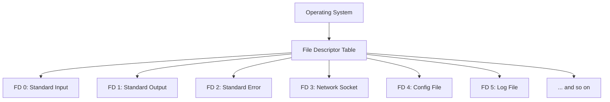

# Nginx File Descriptors

## Introduction

When running a busy web server, understanding how Nginx handles resources is crucial for optimal performance. One of the most important resources to manage is **file descriptors**. This guide will explain what file descriptors are, why they matter for Nginx performance, and how to properly configure them to avoid common bottlenecks.

File descriptors are numeric identifiers that the operating system uses to track open files, sockets, and other I/O resources. For Nginx, which handles many simultaneous connections, properly configuring file descriptor limits can mean the difference between a responsive website and one that crashes under moderate load.

## What Are File Descriptors?

In Unix-like operating systems (including Linux), everything is treated as a file. This includes:

- Actual files on disk
- Network connections
- Pipes
- Sockets
- Devices

When any of these resources are accessed, the operating system assigns a unique identifier called a **file descriptor** to track that open resource. These are simply integer values, typically starting from 3 (as 0, 1, and 2 are reserved for standard input, output, and error).



## Why File Descriptors Matter for Nginx

Nginx uses file descriptors for:

1. Each client connection
2. Log files
3. Configuration files
4. Static files being served
5. Connections to upstream servers (when acting as a proxy)

When Nginx runs out of available file descriptors, it cannot establish new connections, which results in errors like:

```
Too many open files
```

This is one of the most common scaling bottlenecks for busy Nginx servers. Understanding and properly configuring file descriptor limits is essential for maintaining a high-performance web server.

## Checking Current Limits

Before making changes, it's important to understand your current file descriptor limits. You can check different levels of limits:

### System-Wide Limits

Check kernel file descriptor limits:

```bash
cat /proc/sys/fs/file-max
```

Output example:
```
1597376
```

This shows the maximum number of file descriptors the system can allocate across all processes.

### Current Nginx Process Limits

To check the file descriptor limits for a running Nginx process:

1. Find the Nginx master process ID:

```bash
ps -ef | grep nginx
```

Output example:
```
root      2164     1  0 Apr10 ?        00:00:00 nginx: master process /usr/sbin/nginx
www-data  2165  2164  0 Apr10 ?        00:00:12 nginx: worker process
```

2. Check the limits for that process ID:

```bash
cat /proc/2164/limits | grep "open files"
```

Output example:
```
Max open files            1024                 4096                 files
```

This shows the soft limit (1024) and hard limit (4096) for open files.

## How Nginx Uses File Descriptors

Let's understand how Nginx utilizes file descriptors in a typical request flow:

1. A client connects to Nginx, using one file descriptor
2. Nginx may open a configuration file, using another descriptor
3. If serving static content, Nginx opens that file, using another descriptor
4. Nginx writes to access and error logs, using two more descriptors
5. If proxying, Nginx opens a connection to an upstream server, using another descriptor

So a single request could use anywhere from 2-5+ file descriptors, depending on the configuration.

For a busy server handling thousands of concurrent connections, these add up quickly!

## Configuring File Descriptor Limits

Setting appropriate limits involves multiple layers of configuration:

### 1. System-Level Configuration

First, modify system-wide limits by editing `/etc/sysctl.conf`:

```bash
sudo nano /etc/sysctl.conf
```

Add or modify the following line:

```
fs.file-max = 65535
```

Apply the changes:

```bash
sudo sysctl -p
```

### 2. User-Level Limits

Next, modify the limits for the user running Nginx (often `www-data` or `nginx`) by editing `/etc/security/limits.conf`:

```bash
sudo nano /etc/security/limits.conf
```

Add the following lines:

```
www-data soft nofile 10000
www-data hard nofile 30000
```

This sets the soft limit to 10,000 and the hard limit to 30,000 file descriptors for the www-data user.

### 3. Nginx Configuration

Finally, configure Nginx itself by editing the main configuration file:

```bash
sudo nano /etc/nginx/nginx.conf
```

Add or modify the `worker_rlimit_nofile` directive in the main context:

```nginx
worker_rlimit_nofile 30000;
```

Add or modify the `worker_connections` directive in the events context:

```nginx
events {
    worker_connections 10000;
    # Other event settings...
}
```

The `worker_connections` value should typically be less than or equal to your user soft limit, while the `worker_rlimit_nofile` should match your user hard limit.

## Calculating Optimal Values

To calculate appropriate values for your server, consider:

1. **Available System Memory**: Higher limits consume more kernel memory
2. **Expected Concurrent Connections**: Each needs at least one file descriptor
3. **Worker Processes**: Multiply by the number of worker processes

A common formula for estimating needed file descriptors:

```
Required FDs = (Max Concurrent Connections × 2) + (Number of Static Files × Number of Worker Processes) + Reserved FDs
```

Where "Reserved FDs" includes descriptors for logs, config files, etc. (typically 20-50).

## Verifying Your Configuration

After making changes and restarting Nginx, verify that your settings took effect:

```bash
sudo systemctl restart nginx
ps -ef | grep nginx # Find the master process ID
cat /proc/[NGINX_PID]/limits | grep "open files"
```

You should see your new limits reflected in the output.

## Monitoring File Descriptor Usage

Monitor your file descriptor usage to ensure you're not approaching limits:

```bash
lsof -p [NGINX_PID] | wc -l
```

This counts the number of open file descriptors for the Nginx process.

For continuous monitoring, you might want to add this to your system monitoring solution (like Prometheus, Nagios, or similar tools).

## Troubleshooting Common Issues

### "Too many open files" Errors

If you see this error in Nginx logs:

```
2023/04/10 12:34:56 [crit] 2164#0: *42 open() "/var/www/html/index.html" failed (24: Too many open files)
```

It means Nginx has reached its file descriptor limit. Follow the steps above to increase the limits.

### Configuration Not Taking Effect

If your changes don't seem to be applied:

1. Make sure you're restarting Nginx completely:
   ```bash
   sudo systemctl stop nginx
   sudo systemctl start nginx
   ```

2. For systemd-based systems, you may need to create a service override:
   ```bash
   sudo mkdir -p /etc/systemd/system/nginx.service.d/
   sudo nano /etc/systemd/system/nginx.service.d/override.conf
   ```

   Add:
   ```
   [Service]
   LimitNOFILE=30000
   ```

   Then reload and restart:
   ```bash
   sudo systemctl daemon-reload
   sudo systemctl restart nginx
   ```

## Real-World Example: Scaling for High Traffic

Let's look at a real-world scenario. A website experiencing sudden traffic spikes needed to handle 5,000 concurrent connections.

Initial configuration:
- Default file descriptor limit: 1,024
- Nginx worker processes: 4
- Static files per request: ~3 (HTML, CSS, JS)

This resulted in Nginx failing during traffic spikes with "too many open files" errors.

After applying our optimization:
1. System limit increased to 65,535
2. User limits set to 15,000 (soft) and 30,000 (hard)
3. Nginx `worker_rlimit_nofile` set to 30,000
4. Nginx `worker_connections` set to 15,000

The result: The server handled the traffic spike with CPU becoming the bottleneck rather than file descriptors - a much more manageable scaling challenge.

## Summary

File descriptors are a critical resource for Nginx performance. By understanding how they work and properly configuring limits at the system, user, and Nginx levels, you can prevent one of the most common bottlenecks in web server performance.

Remember these key points:
- Each connection and file operation requires a file descriptor
- Limits need to be set at multiple levels
- Monitor usage to stay ahead of potential issues
- Higher isn't always better - balance with your system resources

## Additional Resources

For further learning:
- The [Nginx documentation](http://nginx.org/en/docs/) on worker_connections and worker_rlimit_nofile
- Linux manual pages for `ulimit`, `limits.conf`, and `sysctl`

## Exercises

1. Check the current file descriptor limits on your server
2. Calculate the appropriate limits for a server with 8GB RAM and 4 CPU cores
3. Configure Nginx to handle 3,000 concurrent connections
4. Set up a monitoring script to alert you when file descriptor usage reaches 80% of capacity