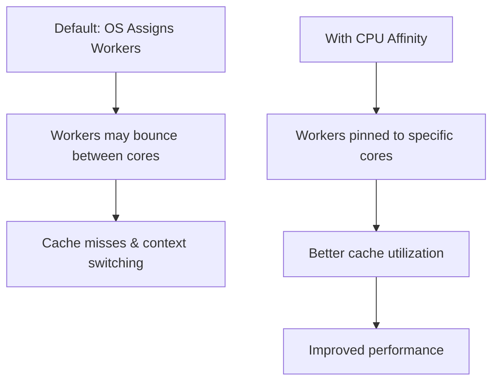

# Nginx CPU Affinity

## Introduction

When running high-traffic web servers, getting the most out of your hardware becomes crucial. One powerful optimization technique for Nginx is **CPU affinity** (also called CPU pinning), which allows you to bind specific Nginx worker processes to particular CPU cores.

By default, the operating system decides which CPU core runs each process, potentially moving processes between cores. This can cause cache misses and context switching overhead. CPU affinity gives you control over this process distribution, potentially improving performance in high-load environments.

## What is CPU Affinity?

CPU affinity refers to the ability to bind or "pin" a process to one or more specific CPU cores, ensuring that:

1. The process runs only on the designated core(s)
2. The CPU cache is used more efficiently
3. Context switching overhead is reduced



## Configuring CPU Affinity in Nginx

Nginx provides the `worker_cpu_affinity` directive to control which CPU cores each worker process can use. This directive is only available in the Nginx **main context** within your configuration.

### Basic Syntax

```nginx
worker_processes 4;
worker_cpu_affinity 0001 0010 0100 1000;
```

In this example:
- We set up 4 worker processes
- Each binary mask (0001, 0010, 0100, 1000) assigns one worker to one specific CPU core

The binary mask representation works as follows:
- Reading from right to left, each position represents a CPU core (Core 0, Core 1, etc.)
- A `1` means the worker can use that core
- A `0` means the worker cannot use that core

### Practical Example 1: One-to-One Mapping

For a server with 4 CPU cores:

```nginx
# One worker per CPU core
worker_processes 4;
worker_cpu_affinity 0001 0010 0100 1000;
```

This configuration:
- Worker 1 runs on CPU core 0 (0001)
- Worker 2 runs on CPU core 1 (0010)
- Worker 3 runs on CPU core 2 (0100)
- Worker 4 runs on CPU core 3 (1000)

### Practical Example 2: Assigning Multiple Cores

You can assign multiple cores to a worker by setting multiple bits to 1:

```nginx
# Two workers, each with access to 2 cores
worker_processes 2;
worker_cpu_affinity 0011 1100;
```

This configuration:
- Worker 1 can use CPU cores 0 and 1 (0011)
- Worker 2 can use CPU cores 2 and 3 (1100)

### Simplified Syntax for Many Cores

For systems with many CPU cores, Nginx offers a simplified syntax:

```nginx
# For an 8-core system
worker_processes 8;
worker_cpu_affinity auto;
```

The `auto` parameter automatically distributes workers across all available cores.

## When to Use CPU Affinity

CPU affinity is most beneficial in these scenarios:

1. **High-traffic production servers** where maximum performance is critical
2. **NUMA (Non-Uniform Memory Access) architectures** where memory access times depend on memory location relative to the processor
3. **When you need deterministic performance** with predictable latency

It may not be necessary for:
- Development environments
- Low-traffic servers
- Virtual machines with limited resources

## Implementation Steps

Let's walk through a complete implementation:

### Step 1: Determine your CPU core count

```bash
# Linux
nproc
# or
grep -c processor /proc/cpuinfo

# FreeBSD/macOS
sysctl -n hw.ncpu
```

Output example:
```
8
```

### Step 2: Configure Nginx

Edit your `nginx.conf` file:

```bash
sudo nano /etc/nginx/nginx.conf
```

Add or modify these directives:

```nginx
worker_processes 8;  # Match your core count
worker_cpu_affinity 00000001 00000010 00000100 00001000 00010000 00100000 01000000 10000000;
```

### Step 3: Test and reload Nginx

```bash
sudo nginx -t
sudo nginx -s reload
```

Expected output:
```
nginx: the configuration file /etc/nginx/nginx.conf syntax is ok
nginx: configuration file /etc/nginx/nginx.conf test is successful
```

## Advanced Considerations

### Reserving Cores for System Tasks

In some cases, it's beneficial to reserve some CPU cores for the operating system and other processes:

```nginx
# 8-core system, reserve core 0 for the OS
worker_processes 7;
worker_cpu_affinity 00000010 00000100 00001000 00010000 00100000 01000000 10000000;
```

### Combining with Process Priority

For even more control, combine CPU affinity with the `worker_priority` directive:

```nginx
worker_processes 4;
worker_cpu_affinity 0001 0010 0100 1000;
worker_priority -5;  # Higher priority (lower number)
```

### Real-world Tuning Example

For a server handling primarily CPU-bound SSL traffic:

```nginx
worker_processes 8;
worker_cpu_affinity 00000001 00000010 00000100 00001000 00010000 00100000 01000000 10000000;
worker_priority -10;
worker_connections 4096;
ssl_session_cache shared:SSL:50m;
```

## Monitoring and Validating CPU Affinity

To verify your CPU affinity settings are working:

```bash
# Get Nginx worker PIDs
ps aux | grep nginx

# Check CPU affinity for a specific PID
taskset -p [PID]
```

Example output:
```
pid 12345's current affinity mask: 1
```

This confirms the process is bound to CPU core 0.

## Performance Benchmarking

Always benchmark before and after CPU affinity changes. A simple benchmark with `ab` (Apache Benchmark):

```bash
# Before CPU affinity
ab -n 10000 -c 100 https://your-server/

# After CPU affinity
ab -n 10000 -c 100 https://your-server/
```

Compare the requests per second and response times.

## Common Pitfalls

1. **Over-optimization**: Excessive tuning can sometimes degrade performance
2. **Ignoring workload characteristics**: CPU-bound vs I/O-bound workloads need different strategies
3. **Not accounting for hyperthreading**: Logical cores ≠ physical cores

## Summary

CPU affinity in Nginx gives you precise control over which CPU cores handle your web server's workload. By properly configuring CPU affinity, you can:

- Improve cache utilization
- Reduce context switching
- Optimize performance for specific workloads
- Achieve more predictable performance characteristics

Remember that CPU affinity is just one aspect of server optimization. It works best when combined with other tuning parameters and proper monitoring.

## Additional Resources

- [Nginx Official Documentation](https://nginx.org/en/docs/ngx_core_module.html#worker_cpu_affinity)
- Linux commands: `taskset`, `mpstat`, and `htop` for CPU monitoring
- Consider learning about related concepts like NUMA architecture and processor cache hierarchy

## Practice Exercises

1. Configure CPU affinity for a 4-core system, mapping each worker to a single core
2. Create a configuration for an 8-core system where you reserve 2 cores for the operating system
3. Set up CPU affinity for a dual-socket NUMA system (advanced)
4. Benchmark your server before and after implementing CPU affinity to measure performance impact