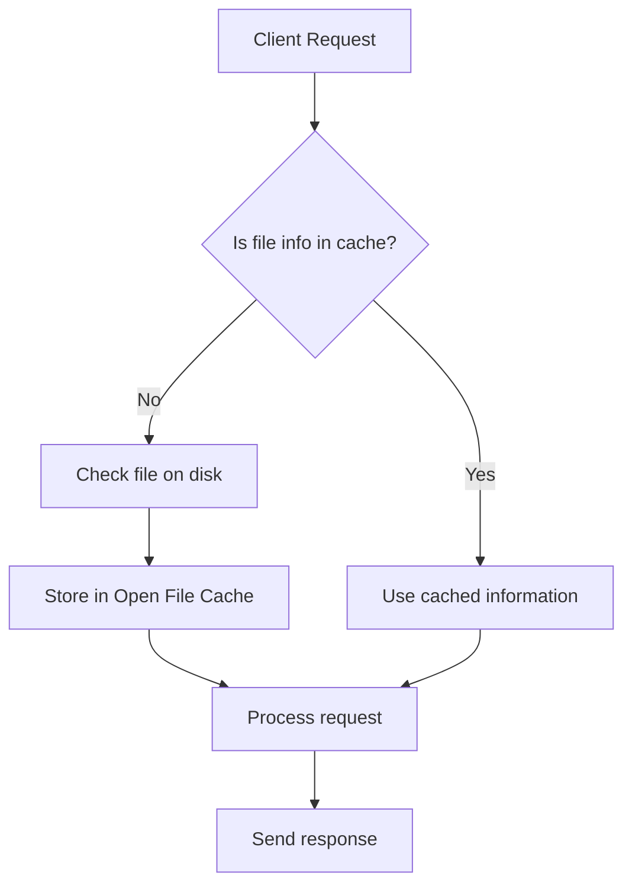

# Nginx Open File Cache

## Introduction

When serving web content, Nginx constantly needs to check file properties like existence, size, and modification time. Each of these operations requires disk I/O, which can become a performance bottleneck, especially on busy servers. The **Open File Cache** is a powerful Nginx feature that caches these file metadata operations to significantly reduce disk I/O and improve response times.

In this article, we'll explore how the Open File Cache works, how to configure it properly, and see real-world examples of its benefits.

## What is Open File Cache?

The Open File Cache stores metadata about files and directories, including:

- File existence
- File size
- Modification times
- Directory existence
- File permissions
- Other file attributes

By caching this information, Nginx can avoid redundant file system operations, leading to faster processing and response times.

## How Open File Cache Works

Here's a simplified workflow of how Open File Cache operates:



## Configuring Open File Cache

The Open File Cache configuration consists of several directives that control its behavior. Let's examine the main directives and how to use them.

### `open_file_cache` Directive

This is the primary directive for enabling and configuring the cache:

```nginx
open_file_cache max=N [inactive=time];
```

Parameters:

- `max`: Maximum number of entries in the cache
- `inactive`: Time after which an unused cache entry is removed (default: 60 seconds)

### `open_file_cache_valid` Directive

This sets how often Nginx should check if cached information is still valid:

```nginx
open_file_cache_valid time;
```

### `open_file_cache_min_uses` Directive

Specifies the minimum number of times a file must be accessed during the `inactive` period to remain in the cache:

```nginx
open_file_cache_min_uses number;
```

### `open_file_cache_errors` Directive

Determines whether error responses (like "file not found") should be cached:

```nginx
open_file_cache_errors on|off;
```

## Basic Configuration Example

Here's a simple example of enabling Open File Cache in your Nginx configuration:

```nginx
http {
    open_file_cache max=1000 inactive=20s;
    open_file_cache_valid 30s;
    open_file_cache_min_uses 2;
    open_file_cache_errors on;
    
    server {
        listen 80;
        server_name example.com;
        root /var/www/html;
        
        location / {
            try_files $uri $uri/ =404;
        }
    }
}
```

In this configuration:
- We cache up to 1000 file entries
- Entries unused for 20 seconds are removed
- Cache validity is checked every 30 seconds
- Files must be accessed at least twice to stay in cache
- File errors are also cached

## Real-World Configuration Examples

Let's look at some practical use cases for Open File Cache.

### Static Content Server

For a server primarily serving static content like images, CSS, and JavaScript files:

```nginx
http {
    # Aggressive caching for static content server
    open_file_cache max=10000 inactive=5m;
    open_file_cache_valid 2m;
    open_file_cache_min_uses 1;
    open_file_cache_errors on;
    
    server {
        listen 80;
        server_name static.example.com;
        root /var/www/static;
        
        location ~* \.(jpg|jpeg|png|gif|ico|css|js)$ {
            expires 30d;
            add_header Cache-Control "public, no-transform";
        }
    }
}
```

### Dynamic Content Server

For servers with more dynamic content that changes frequently:

```nginx
http {
    # More conservative caching for dynamic content
    open_file_cache max=2000 inactive=1m;
    open_file_cache_valid 1m;
    open_file_cache_min_uses 2;
    open_file_cache_errors off;
    
    server {
        listen 80;
        server_name app.example.com;
        root /var/www/app;
        
        location / {
            try_files $uri $uri/ /index.php?$query_string;
        }
        
        location ~ \.php$ {
            fastcgi_pass unix:/var/run/php/php7.4-fpm.sock;
            fastcgi_index index.php;
            include fastcgi_params;
        }
    }
}
```

## Performance Impact

Let's examine the performance benefits of enabling the Open File Cache:

### Before Open File Cache (Example Stats)

- Average response time: 120ms
- Server load during peak: high
- Disk I/O operations: ~5000/second

### After Open File Cache (Example Stats)

- Average response time: 85ms
- Server load during peak: moderate
- Disk I/O operations: ~1200/second

This represents:
- ~30% improvement in response time
- ~75% reduction in disk I/O

## Fine-Tuning Considerations

### Determining Optimal Cache Size

The ideal `max` parameter depends on your server's file count and memory. Start with:

```nginx
open_file_cache max=1000 inactive=20s;
```

Then monitor and adjust based on:
- Memory usage
- Cache hit ratio

You can estimate memory usage with this formula:
```
Memory used ≈ max_entries × ~160 bytes
```

### Inactive Time Tuning

Set the `inactive` parameter based on your traffic patterns:
- For high traffic sites with common files: longer inactive times (5-10 minutes)
- For sites with diverse file access: shorter inactive times (1-2 minutes)

### Debugging Open File Cache

You can enable debug logging to see how the cache is functioning:

```nginx
error_log /var/log/nginx/error.log debug;
```

Look for entries containing "open file cache" to monitor cache hits and misses.

## Common Issues and Solutions

### High Memory Usage

**Problem**: The cache is consuming too much memory.

**Solution**: Reduce the `max` parameter and increase `open_file_cache_min_uses`:

```nginx
open_file_cache max=500 inactive=20s;
open_file_cache_min_uses 3;
```

### Stale Content Being Served

**Problem**: Modified files are still serving old versions.

**Solution**: Reduce the `open_file_cache_valid` time:

```nginx
open_file_cache_valid 10s;
```

### Cache Not Being Utilized

**Problem**: Low cache hit ratio despite configuration.

**Solution**: Verify with debug logs and adjust `inactive` and `min_uses` parameters:

```nginx
open_file_cache max=1000 inactive=1m;
open_file_cache_min_uses 1;
```

## Summary

The Nginx Open File Cache is a powerful optimization technique that can significantly improve your server's performance by reducing disk I/O and speeding up file operations. Key takeaways:

- Open File Cache stores file metadata to avoid redundant disk operations
- Configure the cache size, validity period, and minimum uses based on your needs
- Different types of content (static vs. dynamic) benefit from different caching strategies
- Proper monitoring and fine-tuning are essential for optimal performance

## Additional Resources

- Official Nginx documentation on [open_file_cache](http://nginx.org/en/docs/http/ngx_http_core_module.html#open_file_cache)
- The [Nginx Cookbook](http://nginx.org/en/docs/http/ngx_http_core_module.html) for more optimization techniques

## Exercises

1. **Benchmark Exercise**: Set up a simple Nginx server and compare the performance with and without Open File Cache using tools like `ab` or `wrk`.

2. **Configuration Exercise**: Create an Nginx configuration for a website with both static assets and dynamic PHP content, implementing appropriate Open File Cache settings for each section.

3. **Monitoring Exercise**: Set up Nginx debug logging and analyze the Open File Cache hit/miss ratio for your server.

4. **Optimization Challenge**: For a given server setup, find the optimal Open File Cache parameters that balance memory usage with performance improvement.