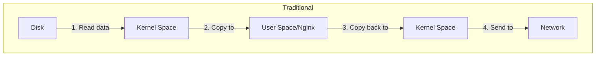

# Nginx Sendfile

## Introduction

When serving static files from your web server, efficiency matters. Nginx's `sendfile` directive is a powerful optimization technique that significantly improves how your server handles file transfers. This feature leverages kernel-level operations to deliver files more efficiently than traditional methods.

In this tutorial, we'll explore what `sendfile` is, how it works, and how you can implement it to boost your Nginx server's performance.

## What is Sendfile?

The `sendfile` directive in Nginx enables a zero-copy optimization for serving static files. But what does "zero-copy" actually mean, and why is it important?

### Traditional File Serving vs. Sendfile

Let's compare how files are served with and without the `sendfile` optimization:




Without `sendfile`, the process involves:
1. The kernel reads data from disk
2. Data is copied from kernel space to Nginx in user space
3. Nginx copies the data back to kernel space
4. The kernel sends the data to the network

With `sendfile` enabled:
1. The kernel reads data from disk
2. The kernel sends the data directly to the network

By eliminating unnecessary data copying between user and kernel space, `sendfile` reduces:
- CPU utilization
- Context switching
- Memory usage
- Overall latency

## How to Enable Sendfile in Nginx

Enabling `sendfile` in your Nginx configuration is straightforward:

```nginx
http {
    sendfile on;
    # Other directives...
}
```

You can specify `sendfile` in different configuration contexts:
- `http` context: Applies to all virtual hosts
- `server` context: Applies to a specific virtual host
- `location` context: Applies to specific locations

### Example Configuration

Here's a complete example showing how to implement `sendfile` in your Nginx configuration:

```nginx
http {
    # Enable sendfile
    sendfile on;
    
    # Complement sendfile with tcp_nopush for optimal performance
    tcp_nopush on;
    
    # Other global settings
    # ...
    
    server {
        listen 80;
        server_name example.com;
        
        # Static content location with sendfile enabled
        location /static/ {
            root /var/www/example.com;
            sendfile on;
            
            # Optional: Set a rate limit for sendfile
            # Useful for very large files to prevent network saturation
            sendfile_max_chunk 1m;
        }
        
        # Dynamic content where sendfile might not be beneficial
        location /dynamic/ {
            sendfile off;
            # Other directives for dynamic content
        }
    }
}
```

## Advanced Sendfile Optimization

### Combining with tcp_nopush and tcp_nodelay

For optimal performance, `sendfile` is often used with other directives:

```nginx
http {
    sendfile on;
    tcp_nopush on;   # Optimizes the amount of data sent at once
    tcp_nodelay on;  # Disables the Nagle algorithm for smaller data packets
}
```

- `tcp_nopush`: Causes Nginx to send the response header and the beginning of a file in one packet
- `tcp_nodelay`: Ensures small packets are sent immediately, reducing latency

### Controlling Chunk Size with sendfile_max_chunk

For very large files, you can control how much data is transferred at once using `sendfile_max_chunk`:

```nginx
location /large-files/ {
    sendfile on;
    sendfile_max_chunk 1m;  # Limits sendfile to 1MB chunks
}
```

This prevents a single large file transfer from monopolizing network resources.

## Real-World Applications

### High-Traffic Media Server

Imagine you're running a media server delivering images, videos, and documents to thousands of users. Here's how you might configure it:

```nginx
http {
    sendfile on;
    tcp_nopush on;
    
    # Optimize output buffers
    output_buffers 2 512k;
    
    server {
        listen 80;
        server_name media.example.com;
        
        location /videos/ {
            root /var/media;
            sendfile on;
            sendfile_max_chunk 2m;  # Larger chunks for video files
            
            # Set appropriate MIME types
            types {
                video/mp4 mp4;
                video/webm webm;
            }
        }
        
        location /images/ {
            root /var/media;
            sendfile on;
            # No need for large chunks with smaller files
            
            # Enable browser caching for images
            expires 7d;
            add_header Cache-Control "public";
        }
    }
}
```

### API Server with Mixed Content

For an API server that serves both dynamic content and static assets:

```nginx
server {
    listen 80;
    server_name api.example.com;
    
    # Dynamic API endpoints (sendfile not needed)
    location /api/ {
        sendfile off;  # Explicitly disable for dynamic content
        proxy_pass http://backend_servers;
    }
    
    # Static documentation files
    location /docs/ {
        root /var/www/api;
        sendfile on;
        tcp_nopush on;
    }
    
    # Static resources like images, CSS, JS
    location /static/ {
        root /var/www/api;
        sendfile on;
        expires 30d;  # Long cache time for static assets
    }
}
```

## Monitoring and Troubleshooting

### Checking if Sendfile is Working

To verify if `sendfile` is being used, enable debug logging:

```nginx
error_log /var/log/nginx/error.log debug;
```

Look for log entries containing "sendfile" to confirm it's being used.

Alternatively, you can use `strace` to see if the `sendfile()` system call is being made:

```bash
strace -p $(pgrep -f "nginx: worker") -e sendfile
```

### Common Issues

1. **File System Limitations**: Some file systems might not support `sendfile` efficiently
2. **NFS Issues**: `sendfile` might not work correctly with NFS-mounted filesystems
3. **SSL/TLS Limitations**: `sendfile` cannot be used with SSL/TLS connections

If you encounter performance issues, try disabling `sendfile` temporarily to see if it's the cause:

```nginx
sendfile off;
```

## Performance Benchmarking

To measure the impact of `sendfile`, you can use benchmarking tools like Apache Bench (ab) or wrk:

```bash
# Without sendfile
ab -n 10000 -c 100 http://example.com/static/large-file.zip

# Enable sendfile, then test again
ab -n 10000 -c 100 http://example.com/static/large-file.zip
```

Compare metrics like:
- Request per second
- Time per request
- Transfer rate

A typical improvement with `sendfile` enabled might show:
- 15-30% increase in requests per second
- 10-25% reduction in CPU usage
- Significantly lower system CPU time

## Summary

The `sendfile` directive is a powerful optimization technique that can dramatically improve your Nginx server's performance when serving static files. By leveraging kernel-level zero-copy operations, it reduces CPU usage, memory consumption, and latency.

Key takeaways:
- Enable `sendfile` for static content delivery
- Combine with `tcp_nopush` and `tcp_nodelay` for optimal performance
- Use `sendfile_max_chunk` to prevent network saturation with large files
- Consider context-specific settings for different types of content
- Monitor and benchmark to ensure you're getting the expected performance boost

## Additional Resources

To deepen your understanding of Nginx optimization:

1. Explore the official [Nginx documentation](http://nginx.org/en/docs/http/ngx_http_core_module.html#sendfile)
2. Learn about related optimizations like AIO (Asynchronous I/O) and directio
3. Study complementary techniques like:
   - HTTP/2 configuration
   - Gzip compression
   - Browser caching

## Exercises

1. Configure an Nginx server with `sendfile` enabled and benchmark its performance against the same server with `sendfile` disabled.
2. Set up different `sendfile` configurations for various content types (images, videos, documents) and measure the performance differences.
3. Experiment with different values for `sendfile_max_chunk` to find the optimal setting for your specific hardware and network conditions.
4. Create a configuration that uses `sendfile` for specific file extensions only.