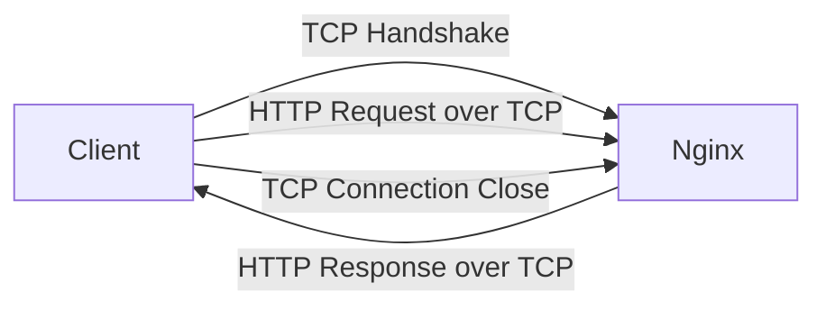

# Nginx TCP Settings

## Introduction

When optimizing Nginx for performance, most developers focus on HTTP-specific settings. However, the underlying TCP (Transmission Control Protocol) settings can significantly impact your server's performance, especially for high-traffic websites. In this guide, we'll explore how to fine-tune Nginx's TCP settings to improve connection handling, reduce latency, and increase throughput.

TCP is the foundation of most internet communications, responsible for establishing connections, ensuring data delivery, and managing network congestion. By optimizing how Nginx interacts with TCP, you can dramatically improve your server's performance under load.

## Understanding TCP in Nginx

Nginx uses TCP as its primary transport protocol for HTTP, HTTPS, and other services. When a client connects to your Nginx server, a TCP connection is established before any HTTP communication occurs.



The efficiency of this TCP communication affects everything from connection times to data transfer speeds and server resource usage.

## Key TCP Settings in Nginx

Let's explore the most important TCP settings you can configure in Nginx:

### 1. TCP Keepalive

TCP keepalive helps maintain idle connections and detect when clients disconnect unexpectedly.

```nginx
http {
    tcp_nodelay on;
    tcp_nopush on;
    keepalive_timeout 65;
    keepalive_requests 100;
}
```

- `tcp_nodelay`: Enables Nagle's algorithm, which improves network efficiency by combining small packets
- `tcp_nopush`: Optimizes the amount of data sent in each packet
- `keepalive_timeout`: How long (in seconds) an idle connection will stay open
- `keepalive_requests`: Maximum number of requests a client can make over a single keepalive connection

### 2. TCP Socket Optimizations

These settings control how Nginx handles TCP sockets:

```nginx
worker_rlimit_nofile 65535;
worker_connections 8192;
```

- `worker_rlimit_nofile`: Maximum number of open files (including sockets) per worker process
- `worker_connections`: Maximum number of simultaneous connections each worker process can handle

### 3. TCP Connection Pools

For upstream connections (like to application servers), you can configure connection pooling:

```nginx
upstream app_servers {
    server app1.example.com:8080;
    server app2.example.com:8080;
    
    keepalive 32;
    keepalive_timeout 60s;
    keepalive_requests 1000;
}
```

- `keepalive`: Number of idle keepalive connections to upstream servers per worker process
- `keepalive_timeout`: How long idle upstream connections remain open
- `keepalive_requests`: Maximum requests per upstream connection

## System-Level TCP Optimizations

Nginx's performance also depends on your operating system's TCP stack settings. These can be adjusted through sysctl configurations:

```bash
# Increase TCP max buffer size
sudo sysctl -w net.core.rmem_max=16777216
sudo sysctl -w net.core.wmem_max=16777216

# Increase TCP autotuning buffer limits
sudo sysctl -w net.ipv4.tcp_rmem="4096 87380 16777216"
sudo sysctl -w net.ipv4.tcp_wmem="4096 65536 16777216"

# Enable TCP Fast Open
sudo sysctl -w net.ipv4.tcp_fastopen=3

# Improve congestion control
sudo sysctl -w net.ipv4.tcp_congestion_control=bbr
```

To make these changes permanent, add them to `/etc/sysctl.conf`.

## Practical Examples

Let's look at real-world examples of TCP optimization for different scenarios:

### Example 1: High-Traffic Web Server

```nginx
http {
    # TCP optimizations
    tcp_nodelay on;
    tcp_nopush on;
    
    # Keep connections open longer
    keepalive_timeout 75;
    keepalive_requests 500;
    
    # File descriptor settings
    worker_rlimit_nofile 65535;
    worker_connections 16384;
    
    server {
        listen 80 backlog=4096;
        # ... other settings ...
    }
}
```

The `backlog` parameter on the listen directive controls the queue size for pending connections.

### Example 2: API Gateway Configuration

```nginx
http {
    # Basic TCP settings
    tcp_nodelay on;
    tcp_nopush on;
    
    # Upstream connection pool
    upstream api_backends {
        server api1.example.com:8080;
        server api2.example.com:8080;
        
        keepalive 64;
        keepalive_timeout 120s;
        keepalive_requests 10000;
    }
    
    server {
        # ...
        
        location /api/ {
            proxy_pass http://api_backends;
            proxy_http_version 1.1;
            proxy_set_header Connection "";  # Required for keepalive connections
        }
    }
}
```

### Example 3: TCP Load Balancer

Nginx can function as a TCP load balancer using the stream module:

```nginx
stream {
    upstream database {
        server db1.example.com:5432 weight=1 max_fails=3 fail_timeout=30s;
        server db2.example.com:5432 weight=1 max_fails=3 fail_timeout=30s;
    }
    
    server {
        listen 5432;
        proxy_pass database;
        proxy_connect_timeout 1s;
        proxy_timeout 3s;
    }
}
```

## Monitoring TCP Performance

To ensure your TCP optimizations are effective, monitor these metrics:

1. **Connection counts**: Track active, idle, and total connections
2. **Time to first byte (TTFB)**: Measures connection establishment speed
3. **Retransmission rate**: Indicates network reliability issues
4. **Connection timeout rate**: Shows if settings are too aggressive

You can use these commands for basic TCP connection monitoring:

```bash
# Check current TCP connections
netstat -an | grep ':80' | grep ESTABLISHED | wc -l

# Monitor retransmission statistics
netstat -s | grep retransm

# View Nginx connection statistics
curl http://localhost/nginx_status
```

## Common TCP Issues and Solutions

| Issue | Symptoms | Solution |
|-------|----------|----------|
| Connection resets | Unexpected client disconnections | Increase keepalive timeouts |
| Connection timeouts | Slow initial page loads | Tune backlog parameter, check for SYN flood protection |
| Memory exhaustion | Nginx worker crashes under load | Adjust worker_connections and system TCP memory limits |
| Port exhaustion | "Address already in use" errors | Enable TCP socket reuse with `net.ipv4.tcp_tw_reuse=1` |

## Best Practices

1. **Start conservative**: Begin with default settings and adjust incrementally
2. **Test under load**: Use tools like `wrk` or `ab` to simulate realistic traffic
3. **Monitor changes**: Always measure the impact of configuration changes
4. **Match client behavior**: Align settings with how your clients typically connect
5. **Consider your workload**: Short-lived connections need different optimizations than long-lived ones

## Summary

Optimizing Nginx's TCP settings can significantly improve your server's performance, especially under high load. Key areas to focus on include:

- TCP keepalive settings to maintain efficient connections
- Worker process and connection limits to manage resources
- System-level TCP stack tuning for optimal network performance
- Connection pooling for upstream servers

By thoughtfully adjusting these settings based on your specific workload and monitoring the results, you can achieve better throughput, lower latency, and more stable performance for your Nginx-powered applications.

## Additional Resources

- [Nginx Official Documentation on TCP Settings](https://nginx.org/en/docs/)
- [Linux TCP Tuning Guide](https://www.kernel.org/doc/Documentation/networking/ip-sysctl.txt)
- [TCP/IP Illustrated Series](https://www.oreilly.com/library/view/tcpip-illustrated-volume/9780132808200/) for deeper understanding of TCP/IP

## Practice Exercises

1. Set up a test Nginx server and experiment with different TCP keepalive settings. Measure the impact on connection reuse.
2. Configure a TCP load balancer for a simple service using the stream module.
3. Create a monitoring dashboard to track TCP connection metrics for your Nginx servers.
4. Benchmark your Nginx server before and after TCP optimizations using tools like `wrk` or `siege`.