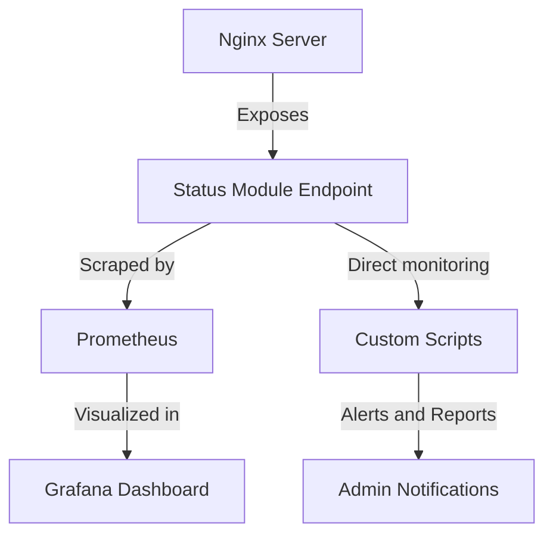

# Nginx Status Module

## Introduction

The Nginx Status Module is a built-in feature that provides essential real-time metrics about your Nginx web server's performance. This module allows system administrators and developers to monitor server activity, track connection statistics, and identify potential performance bottlenecks without requiring external tools.

For beginners working with Nginx, understanding how to enable and interpret the Status Module is a fundamental skill that helps ensure your web applications run smoothly and efficiently.

## Enabling the Nginx Status Module

The Nginx Status Module (ngx_http_stub_status_module) is typically included in standard Nginx installations but must be explicitly enabled in your configuration. Here's how to set it up:

### Step 1: Verify the module is available

First, check if the module is compiled into your Nginx installation:

```bash
nginx -V 2>&1 | grep -o with-http_stub_status_module
```

If the module is available, you'll see `with-http_stub_status_module` in the output.

### Step 2: Configure the status page

Edit your Nginx configuration file (typically located at `/etc/nginx/nginx.conf` or in a site-specific config file within `/etc/nginx/sites-available/`):

```nginx
server {
    listen 80;
    server_name example.com;

    # Other configuration settings
    
    location /nginx_status {
        stub_status on;
        
        # Optional: Restrict access to specific IP addresses
        allow 127.0.0.1;        # Allow localhost
        allow 192.168.1.0/24;   # Allow local network
        deny all;               # Deny all other IPs
        
        # Optional: Disable access logging for status requests
        access_log off;
    }
}
```

### Step 3: Apply the configuration

After editing the configuration, check its syntax and reload Nginx:

```bash
sudo nginx -t
sudo systemctl reload nginx
```

## Understanding the Status Page Output

Once configured, accessing the status page (e.g., http://example.com/nginx_status) will display output similar to:

```
Active connections: 2
server accepts handled requests
 16 16 20
Reading: 0 Writing: 1 Waiting: 1
```

Let's break down what each line means:

1. **Active connections**: The current number of active client connections, including waiting connections.

2. **Server accepts handled requests**:
   - **accepts**: Total accepted client connections
   - **handled**: Total handled connections (normally equals accepts unless resource limits were reached)
   - **requests**: Total number of client requests

3. **Reading**: The current number of connections where Nginx is reading the request header.

4. **Writing**: The current number of connections where Nginx is writing the response back to the client.

5. **Waiting**: The current number of idle client connections waiting for a request.

## Practical Monitoring Examples

### Example 1: Simple Bash Monitoring Script

This script fetches the status page and formats the output:

```bash
#!/bin/bash

NGINX_STATUS_URL="http://localhost/nginx_status"

echo "Nginx Status Monitor"
echo "===================="

# Fetch the status page
status=$(curl -s $NGINX_STATUS_URL)

# Extract metrics
active=$(echo "$status" | grep "Active connections" | awk '{print $3}')
accepts=$(echo "$status" | grep -A 1 "server accepts" | tail -n 1 | awk '{print $1}')
handled=$(echo "$status" | grep -A 1 "server accepts" | tail -n 1 | awk '{print $2}')
requests=$(echo "$status" | grep -A 1 "server accepts" | tail -n 1 | awk '{print $3}')
reading=$(echo "$status" | grep "Reading" | awk '{print $2}')
writing=$(echo "$status" | grep "Writing" | awk '{print $4}')
waiting=$(echo "$status" | grep "Waiting" | awk '{print $6}')

# Display formatted output
echo "Active connections: $active"
echo "Connections accepted: $accepts"
echo "Connections handled: $handled"
echo "Requests: $requests"
echo "Reading: $reading | Writing: $writing | Waiting: $waiting"

# Calculate requests per connection
if [ "$handled" -gt 0 ]; then
  rpc=$(echo "scale=2; $requests / $handled" | bc)
  echo "Requests per connection: $rpc"
fi
```

### Example 2: Monitoring with Prometheus and Grafana

For more advanced monitoring, you can use the Nginx Prometheus Exporter. First, install the exporter:

```bash
wget https://github.com/nginxinc/nginx-prometheus-exporter/releases/download/v0.10.0/nginx-prometheus-exporter_0.10.0_linux_amd64.tar.gz
tar xvfz nginx-prometheus-exporter_0.10.0_linux_amd64.tar.gz
sudo mv nginx-prometheus-exporter /usr/local/bin/
```

Create a systemd service file (`/etc/systemd/system/nginx-prometheus-exporter.service`):

```
[Unit]
Description=Nginx Prometheus Exporter
After=network.target

[Service]
Type=simple
User=nginx
ExecStart=/usr/local/bin/nginx-prometheus-exporter -nginx.scrape-uri=http://localhost/nginx_status

[Install]
WantedBy=multi-user.target
```

Start and enable the service:

```bash
sudo systemctl start nginx-prometheus-exporter
sudo systemctl enable nginx-prometheus-exporter
```

Now you can configure Prometheus to scrape these metrics and visualize them in Grafana.

## Visualizing Status Module Data

You can visualize the data from the status module to better understand trends over time:



## Extended Monitoring with Extended Status Module

For more detailed metrics, you might want to consider the Nginx Plus extended status module or third-party modules like ngx_http_extended_status_module.

With the extended status features (available in Nginx Plus), you can access additional metrics such as:

- SSL handshake failures
- Zone-specific connection details
- Cache hit/miss ratios
- Upstream server health checks

Example extended status configuration:

```nginx
server {
    # ...other settings...
    
    location /api {
        api write=on;
    }
    
    location = /dashboard.html {
        root /usr/share/nginx/html;
    }
}
```

## Common Troubleshooting Issues

1. **403 Forbidden errors**: Check your access restrictions in the location block. Ensure your client IP is allowed.

2. **Module not found**: Verify Nginx was compiled with stub_status support. You may need to rebuild Nginx with the appropriate flags.

3. **High connection counts**: If "waiting" connections are consistently high, you might need to tune your `keepalive_timeout` settings.

4. **Monitoring load impact**: The status module itself has minimal performance impact, but frequent polling could create additional load.

## Summary

The Nginx Status Module provides essential metrics for monitoring your web server's health and performance. By enabling this module, you can:

- Track active connections and request rates
- Identify potential bottlenecks
- Integrate with monitoring systems like Prometheus
- Make informed decisions about server optimization

For beginners, starting with the built-in status module is the perfect first step in developing a comprehensive monitoring strategy for your Nginx servers.

## Additional Resources

- [Official Nginx documentation on the stub_status module](http://nginx.org/en/docs/http/ngx_http_stub_status_module.html)
- [Nginx Plus Status Module (for commercial users)](https://docs.nginx.com/nginx/admin-guide/monitoring/live-activity-monitoring/)
- [Prometheus Nginx Exporter documentation](https://github.com/nginxinc/nginx-prometheus-exporter)

## Exercises

1. Enable the Nginx Status Module on your local development server and restrict access to localhost only.
2. Write a simple Python script that fetches the status page every minute and logs the results to a CSV file.
3. Calculate the requests-per-second rate by taking two status snapshots with a known time interval.
4. Set up email alerts that trigger when active connections exceed a certain threshold.
5. If you have access to Grafana, create a dashboard that visualizes your Nginx metrics from the status module.