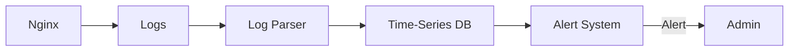

# Nginx Metrics Collection

## Introduction

Monitoring Nginx is essential for maintaining healthy web applications and services. By collecting and analyzing Nginx metrics, you can gain valuable insights into server performance, identify bottlenecks, detect issues before they affect users, and make data-driven decisions for optimization.

This guide explores the various metrics available in Nginx, how to access them, and different methods for collecting and visualizing these metrics. We'll cover both built-in Nginx features and third-party tools to provide a comprehensive understanding of Nginx metrics collection.

## Why Collect Nginx Metrics?

Before diving into the technical details, let's understand why metrics collection is crucial:

- **Performance Optimization**: Identify slow-responding endpoints and optimize them
- **Capacity Planning**: Determine when to scale your infrastructure based on traffic patterns
- **Issue Detection**: Catch problems before they affect users
- **Resource Utilization**: Monitor CPU, memory, and network usage
- **Security Monitoring**: Identify unusual traffic patterns that might indicate attacks

## Key Nginx Metrics to Monitor

Nginx offers various metrics that provide insights into different aspects of its operation:

### Connection Metrics

- **Active Connections**: Number of connections currently being processed
- **Accepted Connections**: Total connections accepted since Nginx started
- **Handled Connections**: Total connections handled (usually the same as accepted)
- **Connection Queue**: Number of connections waiting to be processed

### Request Metrics

- **Total Requests**: Number of client requests received
- **Requests per Second**: Rate of incoming client requests
- **Request Processing Time**: Time taken to process each request

### HTTP Status Metrics

- **2xx Responses**: Successful requests
- **3xx Responses**: Redirections
- **4xx Responses**: Client errors (like 404 Not Found)
- **5xx Responses**: Server errors (like 503 Service Unavailable)

### Worker Process Metrics

- **Worker Connections**: Connections per worker process
- **Worker Processes**: Number of worker processes running

## Enabling Nginx Status Module

The first step in collecting Nginx metrics is enabling the built-in `ngx_http_stub_status_module`. This module provides basic status information about Nginx.

### Step 1: Verify if the Status Module is Enabled

Check if your Nginx installation has the status module compiled:

```bash
nginx -V 2>&1 | grep --color=auto -o with-http_stub_status_module
```

If the command returns `with-http_stub_status_module`, the module is enabled.

### Step 2: Configure Nginx to Expose Status Page

Add the following configuration to your Nginx configuration file (often found at `/etc/nginx/nginx.conf` or `/etc/nginx/conf.d/default.conf`):

```nginx
server {
    listen 80;
    server_name localhost;
    
    # Status page configuration
    location /nginx_status {
        stub_status on;
        
        # Optional: restrict access to specific IPs
        allow 127.0.0.1; # localhost
        allow 192.168.1.0/24; # local network
        deny all; # deny everyone else
    }
}
```

### Step 3: Test the Configuration and Restart Nginx

```bash
# Test the configuration
nginx -t

# If the test is successful, restart Nginx
systemctl restart nginx
```

### Step 4: Access the Status Page

Now you can access the status page at `http://your-server/nginx_status`. You should see output similar to:

```
Active connections: 2 
server accepts handled requests
 16 16 26 
Reading: 0 Writing: 1 Waiting: 1 
```

Let's understand this output:

- **Active connections**: 2 connections are currently active
- **Server accepts handled requests**: Nginx has accepted 16 connections, handled 16 connections, and processed 26 requests
- **Reading**: 0 connections are reading request headers
- **Writing**: 1 connection is writing responses back to the client
- **Waiting**: 1 connection is in the "keep-alive" state, waiting for new requests

## Collecting Nginx Metrics with Prometheus

While the status module provides basic metrics, more advanced monitoring typically involves tools like Prometheus. Prometheus is a popular open-source monitoring system that can scrape and store metrics from various sources, including Nginx.

### Step 1: Install the Nginx Prometheus Exporter

The Nginx Prometheus Exporter is a tool that converts Nginx statistics into Prometheus metrics format.

```bash
# Download the latest release
wget https://github.com/nginxinc/nginx-prometheus-exporter/releases/download/v0.11.0/nginx-prometheus-exporter_0.11.0_linux_amd64.tar.gz

# Extract the archive
tar xvzf nginx-prometheus-exporter_0.11.0_linux_amd64.tar.gz

# Move the executable to a system path
sudo mv nginx-prometheus-exporter /usr/local/bin/
```

### Step 2: Run the Exporter

```bash
nginx-prometheus-exporter -nginx.scrape-uri http://localhost/nginx_status
```

By default, the exporter serves metrics on port 9113, so you can access them at `http://localhost:9113/metrics`.

### Step 3: Configure Prometheus to Scrape Nginx Metrics

Add the following to your `prometheus.yml` configuration file:

```yaml
scrape_configs:
  - job_name: 'nginx'
    static_configs:
      - targets: ['localhost:9113']
```

### Step 4: Query Nginx Metrics in Prometheus

After setting up Prometheus and the exporter, you can query metrics like:

- `nginx_up`: Shows if the Nginx instance is up (1) or down (0)
- `nginx_connections_active`: Number of active connections
- `nginx_connections_reading`: Connections where Nginx is reading the request header
- `nginx_connections_writing`: Connections where Nginx is writing the response back to the client
- `nginx_connections_waiting`: Idle connections

## Using Grafana for Visualization

Grafana is an open-source visualization tool that works well with Prometheus. Let's set up a basic Nginx dashboard:

### Step 1: Install Grafana

Follow the official installation instructions for your operating system from the [Grafana website](https://grafana.com/docs/grafana/latest/installation/).

### Step 2: Add Prometheus as a Data Source

1. Log in to Grafana (default: http://localhost:3000)
2. Go to Configuration > Data Sources
3. Click "Add data source"
4. Select "Prometheus"
5. Set the URL to your Prometheus server (e.g., http://localhost:9090)
6. Click "Save & Test"

### Step 3: Create a Dashboard

You can either create a dashboard from scratch or import an existing one. Here's a sample query for a panel showing active connections:

```
nginx_connections_active
```

## Collecting Advanced Metrics with Nginx Plus

Nginx Plus, the commercial version of Nginx, provides more detailed metrics through its API:

```nginx
server {
    listen 80;
    
    location /api {
        api write=on;
        allow 127.0.0.1;
        deny all;
    }
}
```

This exposes a RESTful API at `/api` with detailed metrics in JSON format.

## Real-World Examples

### Monitoring HTTP Status Codes

To monitor HTTP status codes, you can configure Nginx logging to capture status codes:

```nginx
log_format extended '$remote_addr - $remote_user [$time_local] '
                    '"$request" $status $body_bytes_sent '
                    '"$http_referer" "$http_user_agent" '
                    '$request_time';

access_log /var/log/nginx/access.log extended;
```

Then use a log parser like Fluentd or Logstash to extract and analyze the status codes.

### Detecting Slow Endpoints

Here's a practical example of identifying slow endpoints:

```nginx
log_format response_time '$request_uri $request_time';
access_log /var/log/nginx/response_time.log response_time;
```

You can then process this log to find the slowest endpoints:

```bash
awk '{print $1, $2}' /var/log/nginx/response_time.log | sort -k2 -nr | head -10
```

This shows the top 10 slowest endpoints.

### Monitoring Request Rate for DDoS Detection

Sudden spikes in request rates might indicate a DDoS attack. You can monitor this metric:



## Setting Up Alerting

Alerting is crucial for proactive monitoring. Using Prometheus and Alertmanager, you can set up rules like:

```yaml
groups:
- name: nginx.rules
  rules:
  - alert: NginxDown
    expr: nginx_up == 0
    for: 1m
    labels:
      severity: critical
    annotations:
      summary: "Nginx is down"
      description: "Nginx has been down for more than a minute."
  
  - alert: HighErrorRate
    expr: sum(rate(nginx_http_requests_total{status=~"5.."}[5m])) / sum(rate(nginx_http_requests_total[5m])) > 0.05
    for: 5m
    labels:
      severity: warning
    annotations:
      summary: "High HTTP 5xx error rate"
      description: "More than 5% of requests are resulting in 5xx errors."
```

## Summary

In this guide, we've explored:

1. The importance of Nginx metrics collection for monitoring and optimization
2. Key metrics to monitor for comprehensive Nginx visibility
3. How to enable and use the built-in Nginx status module
4. Setting up Prometheus and Grafana for advanced metrics collection and visualization
5. Real-world examples of metrics usage for performance monitoring and issue detection

By implementing these practices, you'll have excellent visibility into your Nginx servers, allowing you to maintain high performance and quickly resolve issues as they arise.

## Additional Resources

- [Nginx Official Documentation](https://nginx.org/en/docs/)
- [Prometheus Documentation](https://prometheus.io/docs/introduction/overview/)
- [Grafana Documentation](https://grafana.com/docs/grafana/latest/)

## Exercises

1. Set up the Nginx status module on your server and create a simple script to fetch and parse the metrics.
2. Install Prometheus and the Nginx exporter to collect metrics from your Nginx server.
3. Create a Grafana dashboard showing key Nginx metrics like active connections, requests per second, and status code distribution.
4. Configure alerts for critical conditions like high error rates or server unavailability.
5. Analyze your Nginx access logs to identify the top 10 most frequently accessed URLs and their average response times.