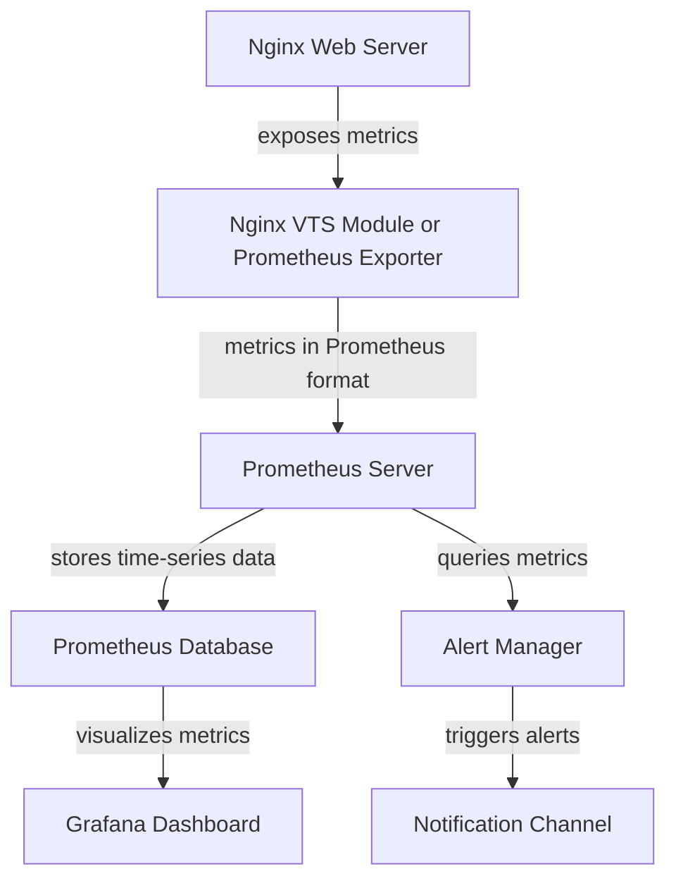

# Nginx Prometheus Integration

## Introduction

Monitoring your web servers is crucial for maintaining reliability and performance in production environments. Nginx, one of the most popular web servers and reverse proxies, can be integrated with Prometheus, a powerful open-source monitoring and alerting system, to collect and visualize important metrics.

In this tutorial, you'll learn how to integrate Nginx with Prometheus to monitor key performance metrics. This integration will help you track request rates, error rates, response times, and other critical indicators of your web server's health.

## Prerequisites

Before we begin, make sure you have:

- A basic understanding of Nginx
- Nginx installed and running
- Prometheus installed (or planning to install it)
- Basic familiarity with metrics and monitoring concepts

## Understanding Prometheus and Its Benefits

Prometheus is an open-source monitoring and alerting toolkit designed for reliability and scalability. Here's why it's an excellent choice for monitoring Nginx:

- **Pull-based architecture**: Prometheus pulls metrics from your services rather than requiring services to push them
- **Powerful query language (PromQL)**: Allows for complex querying and analysis of metrics
- **Built-in alerting**: Can trigger alerts based on metric thresholds
- **Time-series database**: Efficiently stores time-series data
- **Rich ecosystem**: Integrates well with visualization tools like Grafana

## Approaches to Nginx Prometheus Integration

There are two main ways to expose Nginx metrics to Prometheus:

1. **Using the Nginx VTS (Virtual host Traffic Status) module**
2. **Using the Nginx Prometheus Exporter**

Let's explore both approaches.

## Method 1: Using Nginx VTS Module

The VTS module exposes Nginx metrics in a format that can be consumed by Prometheus.

### Step 1: Install Nginx VTS Module

If you're installing Nginx from source:

```bash
# Download Nginx and VTS module
wget https://nginx.org/download/nginx-1.20.1.tar.gz
tar -xzvf nginx-1.20.1.tar.gz
cd nginx-1.20.1/

# Clone the VTS module repository
git clone https://github.com/vozlt/nginx-module-vts.git

# Configure Nginx with the VTS module
./configure --add-module=./nginx-module-vts [other-options]
make
make install
```

If you're using a package manager (for Ubuntu/Debian):

```bash
sudo apt-get install nginx-module-vts
```

### Step 2: Configure Nginx with VTS

Edit your Nginx configuration file (usually `/etc/nginx/nginx.conf`):

```nginx
http {
    # Other configurations...
    
    # VTS module configuration
    vhost_traffic_status_zone;
    vhost_traffic_status_filter_by_set_key $host zone=vhost;
    
    server {
        # Your server configuration...
        
        # Expose VTS metrics
        location /metrics {
            vhost_traffic_status_display;
            vhost_traffic_status_display_format prometheus;
        }
    }
}
```

### Step 3: Reload Nginx configuration

```bash
sudo nginx -t       # Test configuration
sudo nginx -s reload  # Reload configuration
```

## Method 2: Using Nginx Prometheus Exporter

The Nginx Prometheus Exporter is a dedicated tool that collects Nginx metrics and exposes them in Prometheus format.

### Step 1: Install Nginx Prometheus Exporter

Download the latest release from GitHub:

```bash
# Download and extract
wget https://github.com/nginxinc/nginx-prometheus-exporter/releases/download/v0.10.0/nginx-prometheus-exporter_0.10.0_linux_amd64.tar.gz
tar -xzvf nginx-prometheus-exporter_0.10.0_linux_amd64.tar.gz

# Move to a suitable location
sudo mv nginx-prometheus-exporter /usr/local/bin/
```

### Step 2: Configure Nginx to expose metrics

Enable the stub_status module in your Nginx configuration:

```nginx
http {
    # Other configurations...
    
    server {
        # Your server configuration...
        
        # Expose stub_status page (restricted to localhost)
        location /nginx_status {
            stub_status on;
            allow 127.0.0.1;  # Only allow access from localhost
            deny all;         # Deny access from everywhere else
        }
    }
}
```

### Step 3: Start the Nginx Prometheus Exporter

```bash
nginx-prometheus-exporter -nginx.scrape-uri=http://localhost/nginx_status
```

The exporter will run on port 9113 by default and expose metrics at `/metrics`.

## Configure Prometheus to Scrape Nginx Metrics

Now that your Nginx metrics are exposed, configure Prometheus to scrape them.

### Add Nginx target to Prometheus configuration

Edit your `prometheus.yml` file:

```yaml
global:
  scrape_interval: 15s

scrape_configs:
  - job_name: 'nginx'
    static_configs:
      - targets: ['localhost:9113']  # If using the exporter
        # OR
      - targets: ['localhost:80']    # If using VTS module
        metrics_path: /metrics      # Path where metrics are exposed
```

### Restart Prometheus to apply changes

```bash
sudo systemctl restart prometheus
```

## Understanding Key Nginx Metrics

Once integrated, you'll have access to various important Nginx metrics:

### Connection Metrics
- `nginx_connections_active`: Currently active client connections
- `nginx_connections_accepted`: Total accepted client connections
- `nginx_connections_handled`: Total handled connections
- `nginx_connections_reading`: Connections where Nginx is reading the request header
- `nginx_connections_writing`: Connections where Nginx is writing the response back
- `nginx_connections_waiting`: Keep-alive connections waiting for the next request

### HTTP Request Metrics
- `nginx_http_requests_total`: Total HTTP requests processed by Nginx
- `nginx_http_requests_current`: Current HTTP requests being processed

### Response Status Metrics
When using the VTS module, you also get metrics broken down by HTTP status codes:
- `nginx_vts_server_requests_total{code="2xx"}`: Total successful requests
- `nginx_vts_server_requests_total{code="3xx"}`: Total redirections
- `nginx_vts_server_requests_total{code="4xx"}`: Total client errors
- `nginx_vts_server_requests_total{code="5xx"}`: Total server errors

## Building Dashboards with Grafana

Once your metrics are in Prometheus, you can visualize them using Grafana.

### Step 1: Install and configure Grafana

```bash
# Install Grafana
sudo apt-get install -y software-properties-common
sudo add-apt-repository "deb https://packages.grafana.com/oss/deb stable main"
wget -q -O - https://packages.grafana.com/gpg.key | sudo apt-key add -
sudo apt-get update
sudo apt-get install grafana

# Start Grafana
sudo systemctl start grafana-server
```

### Step 2: Add Prometheus as a data source

1. Open Grafana (usually at http://localhost:3000)
2. Navigate to Configuration > Data Sources
3. Click "Add data source" and select Prometheus
4. Set the URL to your Prometheus server (default: http://localhost:9090)
5. Click "Save & Test"

### Step 3: Create an Nginx dashboard

You can either create a dashboard from scratch or import an existing one. Here's a simple example of PromQL queries for common Nginx metrics:

- Request Rate: `rate(nginx_http_requests_total[1m])`
- Error Rate: `rate(nginx_vts_server_requests_total{code=~"5.."}[1m])`
- Active Connections: `nginx_connections_active`

## Real-world Monitoring Example

Let's build a real-world monitoring setup for a production Nginx server.

### Example Dashboard Panels

1. **Traffic Overview**:
   - Total Requests per Second
   - Bandwidth Usage
   - Active Connections

2. **Error Tracking**:
   - 4xx Error Rate
   - 5xx Error Rate
   - Error Percentage of Total Requests

3. **Performance**:
   - Average Response Time
   - Request Processing Time Distribution
   - Connection States (reading/writing/waiting)

### Example PromQL Queries for Alerts

```
# Alert on high error rate
rate(nginx_vts_server_requests_total{code=~"5.."}[5m]) / rate(nginx_http_requests_total[5m]) > 0.05

# Alert on connection saturation
nginx_connections_active / nginx_connections_handled > 0.8

# Alert on increased latency
histogram_quantile(0.95, rate(nginx_http_request_duration_seconds_bucket[5m])) > 0.5
```

## Implementation Flow Diagram



## Troubleshooting Common Issues

### Metrics Not Showing Up

1. Check if the Nginx status page is accessible:
```bash
curl http://localhost/nginx_status
# or for VTS module
curl http://localhost/metrics
```

2. Verify the exporter can access the status page:
```bash
curl http://localhost:9113/metrics
```

3. Check Prometheus target status in the Prometheus UI (usually at http://localhost:9090/targets)

### Error: "Connection refused"

Ensure that:
- Nginx is running
- The status page is correctly configured
- Firewall rules allow connections to the metrics port

### Incorrect Metrics

If metrics values seem incorrect:
- Verify your Nginx configuration
- Check for any proxy or load balancer that might be affecting the metrics
- Ensure you're using the correct metric names in your queries

## Best Practices

1. **Security**: Always restrict access to your metrics endpoints using authentication or IP restrictions
2. **Granularity**: Adjust the scrape interval based on your needs (shorter for more detailed data, longer for reduced storage)
3. **Retention**: Configure appropriate data retention periods in Prometheus
4. **Alerts**: Set up alerts for critical metrics to detect issues early
5. **Documentation**: Document your metrics and dashboards for easier troubleshooting

## Summary

In this tutorial, you've learned how to:
- Integrate Nginx with Prometheus using two different methods
- Configure Prometheus to collect Nginx metrics
- Understand key Nginx performance metrics
- Visualize your metrics with Grafana
- Create alerts for monitoring your Nginx servers

Implementing proper monitoring for your Nginx servers is essential for maintaining reliability and performance. By integrating Nginx with Prometheus, you gain valuable insights into your web server's behavior and can quickly identify and resolve issues before they impact your users.

## Additional Resources

- [Prometheus Documentation](https://prometheus.io/docs/introduction/overview/)
- [Nginx Documentation](https://nginx.org/en/docs/)
- [Nginx VTS Module GitHub](https://github.com/vozlt/nginx-module-vts)
- [Nginx Prometheus Exporter GitHub](https://github.com/nginxinc/nginx-prometheus-exporter)
- [Grafana Documentation](https://grafana.com/docs/)

## Practice Exercises

1. Set up Nginx with the Prometheus Exporter in a test environment
2. Create a custom Grafana dashboard with panels for request rate, error rate, and connection stats
3. Configure alerts for high error rates and server overloads
4. Try to identify performance bottlenecks by analyzing collected metrics during a load test
5. Extend your monitoring setup to track metrics for multiple virtual hosts separately