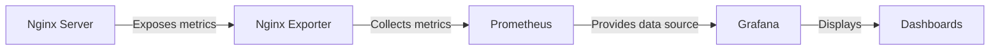

# Nginx Grafana Dashboards

## Introduction

Monitoring your Nginx web server is crucial for maintaining performance, reliability, and security. While Nginx provides access to various metrics and logs, visualizing this data makes it much easier to understand server behavior, identify issues, and optimize performance. Grafana is a powerful open-source visualization and analytics platform that pairs perfectly with Nginx, enabling you to create informative, interactive dashboards that display your Nginx metrics in real-time.

In this guide, we'll explore how to set up Grafana dashboards specifically tailored for Nginx monitoring. We'll cover the entire process from data collection to dashboard creation and customization, making complex monitoring accessible even for beginners.

## Prerequisites

Before we begin creating Nginx Grafana dashboards, you should have:

- A running Nginx server
- Prometheus or another metrics collector configured to scrape Nginx metrics
- Grafana installed and accessible
- Basic understanding of Nginx configuration

If you need help setting up these prerequisites, check out our earlier guides on Installing Nginx and Basic Nginx Monitoring Setup.

## Understanding the Monitoring Pipeline

To visualize Nginx data in Grafana, we need to understand the complete monitoring pipeline:



1. **Nginx** generates logs and metrics during operation
2. **Nginx Exporter** converts Nginx metrics into a format Prometheus can understand
3. **Prometheus** collects and stores the time-series data
4. **Grafana** connects to Prometheus as a data source
5. **Dashboards** in Grafana visualize the Nginx metrics in a user-friendly way

## Setting Up the Nginx Exporter

Before creating dashboards, we need to ensure Nginx metrics are being exported to Prometheus. The most common tool for this is the Nginx Prometheus Exporter.

### Installing Nginx Exporter

```bash
# Download the Nginx Prometheus Exporter
wget https://github.com/nginxinc/nginx-prometheus-exporter/releases/download/v0.11.0/nginx-prometheus-exporter_0.11.0_linux_amd64.tar.gz

# Extract the archive
tar xvzf nginx-prometheus-exporter_0.11.0_linux_amd64.tar.gz

# Move the binary to a system path
sudo mv nginx-prometheus-exporter /usr/local/bin/

# Make it executable
sudo chmod +x /usr/local/bin/nginx-prometheus-exporter
```

### Running the Exporter

To run the exporter, you need the Nginx status endpoint enabled. Add this to your Nginx configuration:

```nginx
server {
    # ... your existing server configuration

    location /nginx_status {
        stub_status on;
        allow 127.0.0.1; # Only allow localhost
        deny all;        # Deny everyone else
    }
}
```

After adding this configuration, restart Nginx:

```bash
sudo systemctl restart nginx
```

Now start the exporter:

```bash
nginx-prometheus-exporter -nginx.scrape-uri=http://localhost/nginx_status
```

This will start the exporter on port 9113, which Prometheus can scrape.

## Configuring Prometheus to Scrape Nginx Metrics

Add the following to your `prometheus.yml` configuration file:

```yaml
scrape_configs:
  - job_name: 'nginx'
    static_configs:
      - targets: ['localhost:9113']
```

Restart Prometheus to apply the changes:

```bash
sudo systemctl restart prometheus
```

## Creating Your First Nginx Grafana Dashboard

Now that we have Nginx metrics flowing into Prometheus, let's create a Grafana dashboard to visualize them.

### Step 1: Add Prometheus as a Data Source

1. Log in to your Grafana instance
2. Go to Configuration → Data Sources
3. Click "Add data source"
4. Select "Prometheus"
5. Set the URL to your Prometheus server (e.g., `http://localhost:9090`)
6. Click "Save & Test" to verify the connection

### Step 2: Create a New Dashboard

1. Click on the "+" icon in the side menu
2. Select "Dashboard"
3. Click "Add new panel"

### Step 3: Add Basic Nginx Metrics

Let's create a panel showing active connections:

1. In the query editor, select your Prometheus data source
2. Enter the following PromQL query:

```
nginx_up
```

This metric shows if Nginx is up (1) or down (0).

3. Set the visualization type to "Stat"
4. Click "Apply"

Now let's add another panel for connections:

1. Click "Add panel"
2. Enter the query:

```
nginx_connections_active
```

3. Set the visualization to "Graph"
4. Click "Apply"

### Step 4: Creating a Complete Dashboard

Let's create a more comprehensive dashboard by adding multiple panels:

#### Connections Panel

```
# Active connections
nginx_connections_active

# Accepted connections rate
rate(nginx_connections_accepted[5m])

# Handled connections rate
rate(nginx_connections_handled[5m])
```

#### HTTP Requests Panel

```
# HTTP Request rate
rate(nginx_http_requests_total[5m])
```

#### Connection States Panel

```
# Reading connections
nginx_connections_reading

# Writing connections
nginx_connections_writing

# Waiting connections
nginx_connections_waiting
```

## Customizing Your Dashboard

Now that we have the basic metrics displayed, let's make our dashboard more useful and visually appealing.

### Adding Thresholds and Alerts

For the active connections panel:

1. Edit the panel
2. Go to the "Thresholds" section
3. Add thresholds like:
   - 0-100: Green
   - 100-200: Yellow
   - >200: Red

### Creating a Heatmap for Request Distribution

1. Add a new panel
2. Use the query:

```
rate(nginx_http_requests_total[1m])
```

3. Set visualization to "Heatmap"
4. Configure to show patterns over time

### Dashboard Variables for Multiple Servers

If you're monitoring multiple Nginx instances, add a dashboard variable:

1. Go to Dashboard settings → Variables
2. Add a new variable:
   - Name: `server`
   - Type: Query
   - Data source: Prometheus
   - Query: `label_values(nginx_up, instance)`
3. Use this variable in your queries like:

```
nginx_connections_active{instance="$server"}
```

## Advanced Grafana Dashboard Features

### Time Range Controls

Customize the time range selector to include preset ranges that make sense for your Nginx monitoring:

1. Go to Dashboard settings → Time options
2. Set appropriate auto-refresh intervals
3. Define useful relative time ranges (last hour, last day, last week)

### Annotations for Important Events

Add annotations to mark significant events:

1. Go to Dashboard settings → Annotations
2. Create a new annotation
3. Use a query like:

```
changes(nginx_up[5m])
```

This will mark times when Nginx went up or down.

### Creating a Health Overview Row

Group critical health metrics in a collapsible row:

1. Add a new row titled "Nginx Health"
2. Add panels for:
   - Uptime
   - Error rates
   - Response time

## Sample Complete Dashboard Configuration

Here's a JSON example of a basic Nginx monitoring dashboard configuration that you can import into Grafana:

```json
{
  "annotations": {
    "list": [
      {
        "builtIn": 1,
        "datasource": "-- Grafana --",
        "enable": true,
        "hide": true,
        "iconColor": "rgba(0, 211, 255, 1)",
        "name": "Annotations & Alerts",
        "type": "dashboard"
      }
    ]
  },
  "editable": true,
  "gnetId": null,
  "graphTooltip": 0,
  "id": 1,
  "links": [],
  "panels": [
    {
      "datasource": null,
      "fieldConfig": {
        "defaults": {
          "color": {
            "mode": "thresholds"
          },
          "mappings": [],
          "thresholds": {
            "mode": "absolute",
            "steps": [
              {
                "color": "green",
                "value": null
              },
              {
                "color": "red",
                "value": 0
              },
              {
                "color": "green",
                "value": 1
              }
            ]
          }
        },
        "overrides": []
      },
      "gridPos": {
        "h": 8,
        "w": 12,
        "x": 0,
        "y": 0
      },
      "id": 2,
      "options": {
        "colorMode": "value",
        "graphMode": "area",
        "justifyMode": "auto",
        "orientation": "auto",
        "reduceOptions": {
          "calcs": [
            "lastNotNull"
          ],
          "fields": "",
          "values": false
        },
        "text": {},
        "textMode": "auto"
      },
      "pluginVersion": "7.5.3",
      "targets": [
        {
          "expr": "nginx_up",
          "interval": "",
          "legendFormat": "",
          "refId": "A"
        }
      ],
      "title": "Nginx Status",
      "type": "stat"
    }
  ],
  "refresh": "5s",
  "schemaVersion": 27,
  "style": "dark",
  "tags": [],
  "templating": {
    "list": []
  },
  "time": {
    "from": "now-6h",
    "to": "now"
  },
  "timepicker": {},
  "timezone": "",
  "title": "Nginx Monitoring",
  "uid": "nginx",
  "version": 1
}
```

## Creating Dashboards for Specific Use Cases

### Web Server Performance Dashboard

Focus on metrics relevant to web serving:

- Request rate
- Response time (if available)
- Error rates
- Bandwidth usage

### SSL/TLS Monitoring Dashboard

If you're using Nginx as an SSL terminator:

- SSL handshake time
- SSL session reuse rate
- Certificate expiration dates (via separate exporter)

### Load Balancer Dashboard

If using Nginx as a load balancer:

- Backend server response times
- Distribution of requests across backends
- Failed upstream connections

## Best Practices for Nginx Grafana Dashboards

### Organization Tips

1. **Group related metrics** - Keep panels with related metrics together
2. **Use consistent naming** - Maintain a clear naming convention
3. **Add documentation** - Use text panels to explain dashboard sections
4. **Create focused dashboards** - Build separate dashboards for different aspects of Nginx

### Visual Design Guidelines

1. **Keep it simple** - Don't overcrowd dashboards
2. **Use color effectively** - Reserve red for actual problems
3. **Choose appropriate visualizations** - Use the right chart type for each metric
4. **Standardize units and scales** - Maintain consistency across panels

### Performance Considerations

1. **Optimize queries** - Use efficient PromQL queries
2. **Set appropriate refresh rates** - Balance between freshness and server load
3. **Use template variables** - Make dashboards reusable across instances

## Troubleshooting Nginx Dashboards

### Common Issues and Solutions

#### No Data Appears in Panels

- Check if Nginx exporter is running
- Verify Prometheus is scraping the exporter
- Test queries directly in Prometheus UI

#### Dashboard is Slow to Load

- Simplify complex queries
- Reduce the time range
- Check Grafana server resources

#### Metrics Don't Match Expected Values

- Verify exporter configuration
- Check for metric name changes between versions
- Confirm correct instance selection

## Summary

In this guide, we've covered how to create effective Grafana dashboards for monitoring Nginx. We started with the basics of setting up the monitoring pipeline, created simple dashboards, and then explored advanced customization options. With these skills, you can build comprehensive monitoring solutions that provide real-time insights into your Nginx servers.

Effective dashboards help you:

- Identify performance issues before they affect users
- Understand traffic patterns and plan capacity accordingly
- Quickly diagnose problems when they occur
- Track the health of your Nginx infrastructure at a glance

## Additional Resources

### Further Learning

- [Official Grafana Documentation](https://grafana.com/docs/)
- [Prometheus Query Language Documentation](https://prometheus.io/docs/prometheus/latest/querying/basics/)
- [Nginx Metrics Documentation](https://nginx.org/en/docs/http/ngx_http_stub_status_module.html)

### Exercises to Reinforce Learning

1. Create a dashboard showing Nginx error rates by status code
2. Build a dashboard that compares multiple Nginx servers
3. Set up alerting based on connection thresholds
4. Create a dashboard specifically for monitoring Nginx caching performance
5. Export your dashboard to JSON and version control it

By mastering Nginx Grafana dashboards, you'll gain powerful insights into your web servers and develop skills applicable to monitoring many other systems.