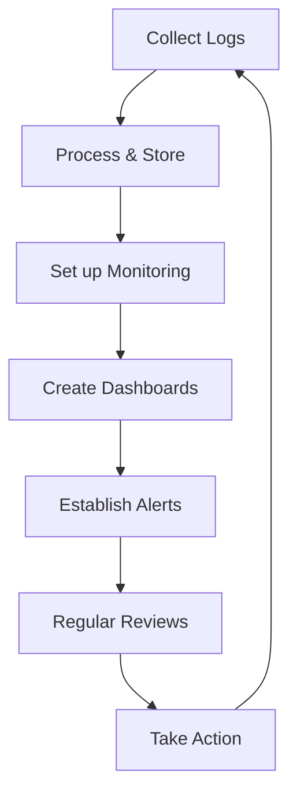

# Nginx Log Analysis

## Introduction

Nginx (pronounced "engine-x") is a popular web server, reverse proxy, and load balancer used by millions of websites worldwide. As your web applications run, Nginx continuously records valuable information about requests, responses, errors, and performance metrics in its log files. Learning to analyze these logs is an essential skill for effectively monitoring and troubleshooting your web infrastructure.

In this guide, we'll explore how to extract meaningful insights from Nginx logs, from basic log formats to advanced analysis techniques. By the end of this tutorial, you'll be equipped with the knowledge to identify performance bottlenecks, detect security threats, and understand user behavior patterns through log analysis.

## Understanding Nginx Log Types

Nginx primarily maintains two types of logs:

1. **Access Logs** - Record information about every request to your server
2. **Error Logs** - Record problems encountered during processing requests

Let's explore each of these in detail.

### Access Logs

Access logs capture details about client requests, including:

- Client IP address
- Request time
- HTTP method (GET, POST, etc.)
- Request URL
- HTTP status code
- Response size
- Referrer
- User agent (browser/client information)

By default, Nginx stores access logs in `/var/log/nginx/access.log` (on Linux/Unix systems).

### Error Logs

Error logs contain information about:

- Server startup/shutdown messages
- Critical errors
- Warning messages
- Debugging information (when enabled)

The default location for error logs is `/var/log/nginx/error.log`.

## Nginx Log Formats

### Default Access Log Format

Nginx uses a predefined format for access logs called the "combined" format. Here's what it looks like in the configuration:

```nginx
log_format combined '$remote_addr - $remote_user [$time_local] '
                    '"$request" $status $body_bytes_sent '
                    '"$http_referer" "$http_user_agent"';
```

A sample log entry in this format:

```
192.168.1.1 - - [10/Feb/2023:13:55:36 +0000] "GET /index.html HTTP/1.1" 200 2326 "https://example.com" "Mozilla/5.0 (Windows NT 10.0; Win64; x64) AppleWebKit/537.36 (KHTML, like Gecko) Chrome/91.0.4472.124 Safari/537.36"
```

Let's break down this entry:

- `192.168.1.1` - The client's IP address
- `-` - Remote user identifier (not provided in this case)
- `-` - Remote user id (not provided in this case)
- `[10/Feb/2023:13:55:36 +0000]` - Timestamp of the request
- `"GET /index.html HTTP/1.1"` - The request method, path, and HTTP version
- `200` - HTTP status code (success)
- `2326` - Size of the response in bytes
- `"https://example.com"` - Referrer URL
- `"Mozilla/5.0..."` - User agent string

### Customizing Log Formats

You can define custom log formats in your Nginx configuration to capture additional information:

```nginx
log_format detailed '$remote_addr - $remote_user [$time_local] '
                    '"$request" $status $body_bytes_sent '
                    '"$http_referer" "$http_user_agent" '
                    '$request_time $upstream_response_time $pipe';

access_log /var/log/nginx/access.log detailed;
```

This custom format adds:
- `$request_time` - Time taken to process the request
- `$upstream_response_time` - Time taken by the upstream server to respond
- `$pipe` - Indicates if the request was pipelined

## Basic Log Analysis Techniques

### Viewing Logs with Common Unix Tools

The simplest way to examine Nginx logs is using common Unix command-line tools:

#### Using `cat` to Display Logs

```bash
cat /var/log/nginx/access.log
```

#### Using `tail` to View Recent Entries

```bash
# Display the last 10 entries
tail /var/log/nginx/access.log

# Follow the log file in real-time
tail -f /var/log/nginx/access.log
```

#### Using `grep` to Filter Logs

```bash
# Find all 404 errors
grep "HTTP/1.1\" 404" /var/log/nginx/access.log

# Find requests from a specific IP
grep "192.168.1.1" /var/log/nginx/access.log

# Find requests for a specific URL
grep "GET /api/users" /var/log/nginx/access.log
```

#### Using `awk` for More Complex Filtering

```bash
# Count requests by status code
awk '{print $9}' /var/log/nginx/access.log | sort | uniq -c | sort -rn

# Calculate the average response size
awk '{sum+=$10; count++} END {print sum/count}' /var/log/nginx/access.log
```

### Creating Basic Reports with `cut` and `sort`

```bash
# Top 10 requested URLs
cut -d '"' -f 2 /var/log/nginx/access.log | cut -d ' ' -f 2 | sort | uniq -c | sort -rn | head -10

# Top 10 visitors by IP
awk '{print $1}' /var/log/nginx/access.log | sort | uniq -c | sort -rn | head -10
```

## Advanced Log Analysis

While command-line tools are great for quick insights, more sophisticated analysis requires dedicated tools.

### Using GoAccess for Real-time Web Log Analysis

[GoAccess](https://goaccess.io/) is a real-time web log analyzer that provides visual reports directly in your terminal or as HTML reports.

Installation:

```bash
# On Debian/Ubuntu
apt-get install goaccess

# On CentOS/RHEL
yum install goaccess

# On macOS
brew install goaccess
```

Basic usage:

```bash
# Terminal-based dashboard
goaccess /var/log/nginx/access.log -c

# Generate HTML report
goaccess /var/log/nginx/access.log -o report.html --log-format=COMBINED
```

Example output:

```
└─ GoAccess 1.5.1 - (C) by Gerardo Orellana
   ├─ Unique visitors:                   1,254
   ├─ Requests:                          15,712
   ├─ Bandwidth:                         157.5 MiB
   ├─ Views per visitor:                 12.53
   ├─ Log size:                          20.2 MiB
   ├─ Referrers:                         218
   └─ Valid requests:                    97.18%
```

GoAccess provides detailed information on:
- Visitor statistics
- Requested files/URLs
- Static files (CSS/JS/images)
- HTTP status codes
- Referring sites
- 404 errors
- Operating systems
- Browsers
- Time distributions
- And more

### Analyzing Logs with ELK Stack

For more sophisticated analysis, especially in production environments, the ELK Stack (Elasticsearch, Logstash, and Kibana) provides a powerful solution.

Here's a basic setup:

1. **Collect logs with Filebeat**:

```yaml
# filebeat.yml
filebeat.inputs:
- type: log
  enabled: true
  paths:
    - /var/log/nginx/access.log
  fields:
    log_type: nginx_access
  
output.logstash:
  hosts: ["localhost:5044"]
```

2. **Process logs with Logstash**:

```
# nginx.conf in Logstash
input {
  beats {
    port => 5044
  }
}

filter {
  if [fields][log_type] == "nginx_access" {
    grok {
      match => { "message" => "%{IPORHOST:remote_ip} - %{DATA:user_name} \[%{HTTPDATE:time}\] \"%{WORD:http_method} %{DATA:url} HTTP/%{NUMBER:http_version}\" %{NUMBER:response_code} %{NUMBER:body_sent_bytes} \"%{DATA:referrer}\" \"%{DATA:agent}\"" }
    }
    date {
      match => [ "time", "dd/MMM/YYYY:HH:mm:ss Z" ]
      target => "@timestamp"
    }
    geoip {
      source => "remote_ip"
      target => "geoip"
    }
    useragent {
      source => "agent"
      target => "user_agent"
    }
  }
}

output {
  elasticsearch {
    hosts => ["localhost:9200"]
    index => "nginx-access-%{+YYYY.MM.dd}"
  }
}
```

3. **Visualize in Kibana**:

With your logs in Elasticsearch, you can create dashboards in Kibana to visualize:
- Traffic patterns over time
- Geographic distribution of visitors
- Browser and device usage
- Error rates and types
- Performance metrics
- Top URLs and resources

## Real-world Examples

### Example 1: Detecting a DDoS Attack

A sudden increase in requests from multiple IPs could indicate a DDoS attack. This command helps identify unusual traffic patterns:

```bash
# Count requests per minute
awk '{print substr($4, 2, 17)}' /var/log/nginx/access.log | uniq -c

# Count requests by IP
awk '{print $1}' /var/log/nginx/access.log | sort | uniq -c | sort -nr | head -20
```

If you see a single IP making hundreds or thousands of requests per minute, you might be under attack. You can block the IP using:

```bash
# Block an IP with iptables
iptables -A INPUT -s malicious-ip-address -j DROP
```

### Example 2: Identifying Slow Pages

To find pages with slow response times:

```bash
# With custom log format that includes $request_time
awk '$request_time > 1 {print $7, $request_time}' /var/log/nginx/access.log | sort -k2 -nr | head -10
```

This helps identify URLs that might need optimization or caching.

### Example 3: Tracking 404 Errors

To find broken links on your site:

```bash
grep "HTTP/1.1\" 404" /var/log/nginx/access.log | awk '{print $7}' | sort | uniq -c | sort -nr
```

You can then redirect these URLs or fix broken links.

### Example 4: Visualizing Traffic Patterns

Using GoAccess, you can generate a time-based distribution chart:

```bash
goaccess /var/log/nginx/access.log -o report.html --time-format=%H:%M:%S --date-format=%d/%b/%Y --log-format=COMBINED
```

This helps identify peak traffic hours and plan for capacity accordingly.

## Log Rotation

To prevent log files from growing too large, Nginx uses log rotation. On most systems, this is configured via `logrotate`:

```
# /etc/logrotate.d/nginx
/var/log/nginx/*.log {
    daily
    missingok
    rotate 14
    compress
    delaycompress
    notifempty
    create 0640 www-data adm
    sharedscripts
    postrotate
        [ -s /run/nginx.pid ] && kill -USR1 `cat /run/nginx.pid`
    endscript
}
```

This configuration:
- Rotates logs daily
- Keeps logs for 14 days
- Compresses old logs
- Sends a USR1 signal to Nginx to reopen log files

## Security Considerations

When analyzing logs, keep these security practices in mind:

1. **Protect log files**: Restrict access to log files to prevent unauthorized access
2. **Sanitize logs**: Avoid logging sensitive data like passwords or tokens
3. **Regular log review**: Set up automated alerts for suspicious activities
4. **Retention policies**: Define how long to keep logs based on your compliance requirements

## Log Analysis Workflow

A typical log analysis workflow includes:



1. **Collect Logs**: Configure proper log formats and collection methods
2. **Process & Store**: Use tools like ELK or centralized logging solutions
3. **Set up Monitoring**: Create baselines for normal behavior
4. **Create Dashboards**: Visualize key metrics for quick assessment
5. **Establish Alerts**: Set up notifications for anomalies
6. **Regular Reviews**: Schedule time to analyze trends
7. **Take Action**: Implement fixes based on insights

## Summary

Nginx log analysis is a powerful skill for web administrators and developers. By understanding the structure of logs and applying appropriate analysis techniques, you can:

- Improve website performance
- Enhance security posture
- Better understand user behavior
- Troubleshoot issues efficiently
- Make data-driven decisions

Remember that log analysis is not a one-time task but an ongoing process that evolves with your application.

## Additional Resources

Here are some resources to deepen your understanding of Nginx log analysis:

- [Nginx Official Documentation](https://nginx.org/en/docs/)
- [GoAccess Documentation](https://goaccess.io/man)
- [Elastic Stack Documentation](https://www.elastic.co/guide/index.html)
- [Linux Command Line Basics](https://linuxcommand.org/)

## Exercises

1. Set up a custom log format that includes request processing time and upstream response time.
2. Write a shell script that generates a daily report of the top 10 URLs by traffic.
3. Create a simple dashboard in Kibana that shows traffic by country, browser, and time of day.
4. Set up an alert that notifies you when the 5xx error rate exceeds 1% of total requests.
5. Analyze your logs to identify potential SEO improvements (like frequently crawled pages or common 404 errors).

By practicing these exercises, you'll develop a strong foundation in Nginx log analysis and monitoring, preparing you for real-world scenarios in web application management.