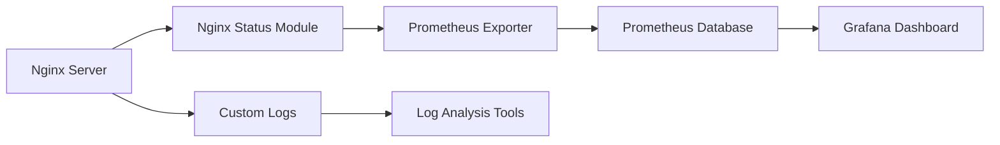

# Nginx Performance Monitoring

## Introduction

Monitoring the performance of your Nginx web server is crucial for maintaining a fast, reliable web application. Nginx is one of the most popular web servers and reverse proxies used today due to its efficiency and scalability. However, without proper monitoring, you might miss performance bottlenecks, resource constraints, or even potential security issues.

In this guide, we'll explore various methods and tools to monitor Nginx performance, interpret key metrics, and take appropriate actions to optimize your server. Whether you're running a small personal site or managing enterprise-level infrastructure, these monitoring concepts will help you ensure your web services remain responsive and reliable.

## Why Monitor Nginx Performance?

Before diving into the "how," let's understand the "why":

- **Identify bottlenecks**: Find performance issues before they affect users
- **Capacity planning**: Determine when to scale resources
- **Troubleshooting**: Quickly diagnose issues when they occur
- **Optimization**: Make data-driven decisions to improve performance
- **Security**: Detect unusual patterns that may indicate security threats

## Key Nginx Metrics to Monitor

### Connection Metrics

Connection metrics help you understand how many clients are connecting to your server and how Nginx is handling those connections.

- **Active connections**: Currently open connections
- **Accepted connections**: Total connections Nginx has accepted
- **Handled connections**: Connections successfully handled
- **Requests**: Total number of client requests

### HTTP Status Codes

HTTP status codes provide insights into how well your server is serving requests:

- **2xx (Success)**: Successful requests
- **3xx (Redirection)**: Redirected requests
- **4xx (Client Errors)**: Client-side errors (e.g., 404 Not Found)
- **5xx (Server Errors)**: Server-side errors (critical to monitor!)

### Performance Metrics

These metrics help you understand the server's performance characteristics:

- **Request processing time**: How long it takes to process requests
- **Upstream response time**: For proxied requests, how long backend servers take to respond
- **Request rate**: Number of requests per second
- **Bandwidth usage**: Amount of data transferred

## Enabling Nginx Status Module

Nginx provides a built-in status module that exposes basic metrics. Let's set it up:

1. First, ensure the `ngx_http_stub_status_module` is enabled. It's included by default in most installations, but you can verify with:

```bash
nginx -V 2>&1 | grep -o with-http_stub_status_module
```

If this returns `with-http_stub_status_module`, you're good to go.

2. Next, configure Nginx to expose the status page by adding the following to your server configuration (typically in `/etc/nginx/nginx.conf` or a site-specific config):

```nginx
server {
    # Your existing server configuration
    
    location /nginx_status {
        stub_status on;
        allow 127.0.0.1; # Only allow access from localhost
        deny all;        # Deny access from anywhere else
    }
}
```

3. Reload Nginx to apply changes:

```bash
sudo nginx -t       # Test configuration
sudo nginx -s reload # Reload if test passes
```

4. Now you can access the status page:

```bash
curl http://localhost/nginx_status
```

Example output:

```
Active connections: 43
server accepts handled requests
 78032 78032 145201
Reading: 0 Writing: 5 Waiting: 38
```

Let's break down this output:

- **Active connections**: 43 current connections
- **78032 accepts**: Total connections accepted
- **78032 handled**: Total connections handled (when equal to accepts, no connections were dropped)
- **145201 requests**: Total requests processed
- **Reading**: Connections where Nginx is reading the request header
- **Writing**: Connections where Nginx is writing the response back
- **Waiting**: Keep-alive connections waiting for the next request

## Enhanced Logging for Performance Monitoring

While the status module provides basic metrics, detailed logging can give you much more insight into performance.

### Configure Custom Log Format

Edit your Nginx configuration to include timing information:

```nginx
http {
    # Define a log format that includes timing information
    log_format performance '$remote_addr - $remote_user [$time_local] '
                          '"$request" $status $body_bytes_sent '
                          '"$http_referer" "$http_user_agent" '
                          '$request_time $upstream_response_time $pipe';
    
    access_log /var/log/nginx/access.log performance;
    
    # Rest of your configuration
}
```

Key timing fields:

- **$request_time**: Total time spent processing the request (in seconds, with millisecond precision)
- **$upstream_response_time**: Time spent waiting for the upstream server response (for proxy configurations)
- **$pipe**: Whether the request was pipelined (p) or not (.)

### Analyzing Performance Logs

With enhanced logging in place, you can use command-line tools to extract valuable insights:

#### Identify slow requests:

```bash
awk '$9 > 1.0 {print $7, $9, $0}' /var/log/nginx/access.log | sort -k2nr | head -10
```

This command finds requests taking more than 1 second and shows the 10 slowest.

#### Calculate average response time:

```bash
awk '{sum+=$9; count++} END {print "Average response time:", sum/count, "seconds"}' /var/log/nginx/access.log
```

#### Find requests per second during a specific time period:

```bash
grep "14/Mar/2025:15:" /var/log/nginx/access.log | wc -l
```

Divide the result by 3600 to get requests per second for that hour.

## Monitoring Tools for Nginx

While manual log analysis is useful, automated monitoring tools provide real-time insights and alerting capabilities.

### Prometheus and Grafana

Prometheus is a powerful time-series database, and Grafana provides beautiful visualizations. Here's how to set them up for Nginx monitoring:

1. Install the Nginx Prometheus Exporter:

```bash
# Download the exporter
wget https://github.com/nginx/nginx-prometheus-exporter/releases/download/v0.10.0/nginx-prometheus-exporter_0.10.0_linux_amd64.tar.gz

# Extract and install
tar xvfz nginx-prometheus-exporter_0.10.0_linux_amd64.tar.gz
sudo mv nginx-prometheus-exporter /usr/local/bin/
```

2. Create a systemd service for the exporter:

```bash
sudo tee /etc/systemd/system/nginx-prometheus-exporter.service > /dev/null <<EOF
[Unit]
Description=Nginx Prometheus Exporter
After=network.target

[Service]
Type=simple
User=nginx
ExecStart=/usr/local/bin/nginx-prometheus-exporter -nginx.scrape-uri=http://localhost/nginx_status

[Install]
WantedBy=multi-user.target
EOF
```

3. Start and enable the service:

```bash
sudo systemctl daemon-reload
sudo systemctl start nginx-prometheus-exporter
sudo systemctl enable nginx-prometheus-exporter
```

4. Configure Prometheus to scrape this exporter by adding to your `prometheus.yml`:

```yaml
scrape_configs:
  - job_name: 'nginx'
    static_configs:
      - targets: ['localhost:9113']
```

5. Create a Grafana dashboard to visualize the metrics.

Here's a simple Mermaid diagram showing the monitoring flow:



### ELK Stack for Log Analysis

The ELK Stack (Elasticsearch, Logstash, Kibana) is excellent for analyzing Nginx logs:

1. Configure Filebeat to collect Nginx logs:

```yaml
filebeat.inputs:
- type: log
  enabled: true
  paths:
    - /var/log/nginx/access.log
  fields:
    log_type: nginx_access
  fields_under_root: true
```

2. Configure Logstash to parse the Nginx logs:

```conf
filter {
  if [log_type] == "nginx_access" {
    grok {
      match => { "message" => "%{COMBINEDAPACHELOG} %{NUMBER:request_time:float} %{NUMBER:upstream_response_time:float} %{WORD:pipe}" }
    }
    date {
      match => [ "timestamp", "dd/MMM/yyyy:HH:mm:ss Z" ]
      target => "@timestamp"
    }
  }
}
```

3. Use Kibana to create visualizations and dashboards.

## Real-World Monitoring Example

Let's walk through a typical performance monitoring scenario:

### Scenario: Identifying and Resolving a Performance Bottleneck

Imagine you're receiving reports of slow page loads. Here's how you'd use monitoring to identify and fix the issue:

1. Check your Grafana dashboard (or Nginx status) and notice a spike in response times.

2. Analyze recent logs to find slow requests:

```bash
awk '$9 > 1.0 {print $7, $9, $0}' /var/log/nginx/access.log | sort -k2nr | head -10
```

3. You discover that requests to `/api/products` are taking 5+ seconds and that the `$upstream_response_time` matches the total `$request_time`.

4. This indicates a backend issue rather than an Nginx configuration problem.

5. You investigate the backend service and discover it's making unoptimized database queries.

6. After optimizing the database queries, you monitor the metrics again and confirm response times have returned to normal levels.

## Performance Tuning Based on Monitoring Data

Once you've identified performance issues through monitoring, you can implement appropriate optimizations:

### Worker Processes and Connections

If monitoring shows high CPU usage:

```nginx
# Set worker_processes to match CPU cores
worker_processes auto;

# Increase worker connections if handling many concurrent connections
events {
    worker_connections 2048;
}
```

### Buffering and Timeouts

If monitoring reveals slowdowns due to large responses:

```nginx
http {
    # Adjust buffer sizes
    client_body_buffer_size 10K;
    client_header_buffer_size 1k;
    client_max_body_size 8m;
    large_client_header_buffers 2 1k;
    
    # Set timeouts
    client_body_timeout 12;
    client_header_timeout 12;
    keepalive_timeout 15;
    send_timeout 10;
}
```

### Caching

If monitoring shows repeated requests for static content:

```nginx
http {
    # Enable caching
    proxy_cache_path /var/cache/nginx levels=1:2 keys_zone=my_cache:10m max_size=1g inactive=60m;
    
    server {
        location / {
            proxy_pass http://backend;
            proxy_cache my_cache;
            proxy_cache_valid 200 302 10m;
            proxy_cache_valid 404 1m;
        }
    }
}
```

## Setting Up Alerts

Monitoring is only effective if you're notified of issues promptly. Here's how to set up basic alerts:

### Prometheus Alerting Rules

Create alerting rules in Prometheus for critical conditions:

```yaml
groups:
- name: nginx_alerts
  rules:
  - alert: NginxHighErrorRate
    expr: sum(rate(nginx_http_requests_total{status=~"5.."}[5m])) / sum(rate(nginx_http_requests_total[5m])) > 0.05
    for: 5m
    labels:
      severity: critical
    annotations:
      summary: "High error rate on Nginx"
      description: "Nginx error rate is above 5% (current value: {{ $value }})"
  
  - alert: NginxHighResponseTime
    expr: avg(nginx_http_request_duration_seconds) > 1
    for: 5m
    labels:
      severity: warning
    annotations:
      summary: "Slow Nginx responses"
      description: "Nginx average response time is above 1 second (current value: {{ $value }}s)"
```

Connect Prometheus alerts to notification channels like email, Slack, or PagerDuty using Alertmanager.

## Summary

Effective Nginx performance monitoring is essential for maintaining reliable and responsive web services. We've covered:

1. Key metrics to monitor (connections, status codes, response times)
2. Setting up the Nginx status module for basic monitoring
3. Configuring enhanced logging for detailed performance insights
4. Implementing monitoring tools like Prometheus/Grafana and ELK
5. Real-world monitoring and troubleshooting scenarios
6. Performance tuning based on monitoring data
7. Setting up alerts for proactive issue detection

By implementing these monitoring practices, you'll be able to identify and resolve performance issues before they impact your users, leading to a better overall experience.

## Additional Resources

- [Official Nginx Documentation](https://nginx.org/en/docs/)
- [Prometheus Documentation](https://prometheus.io/docs/introduction/overview/)
- [Grafana Dashboard Examples](https://grafana.com/grafana/dashboards/)
- [ELK Stack Documentation](https://www.elastic.co/guide/index.html)

## Exercises

1. Set up the Nginx status module on your server and access the stats page.
2. Configure custom logging with timing information and analyze the logs to find the 5 slowest URLs.
3. Install and configure the Prometheus Nginx exporter.
4. Create a basic Grafana dashboard showing key Nginx metrics.
5. Write a shell script that alerts you when the error rate exceeds a threshold.

By practicing these exercises, you'll gain hands-on experience with Nginx performance monitoring and be better equipped to maintain high-performing web services.