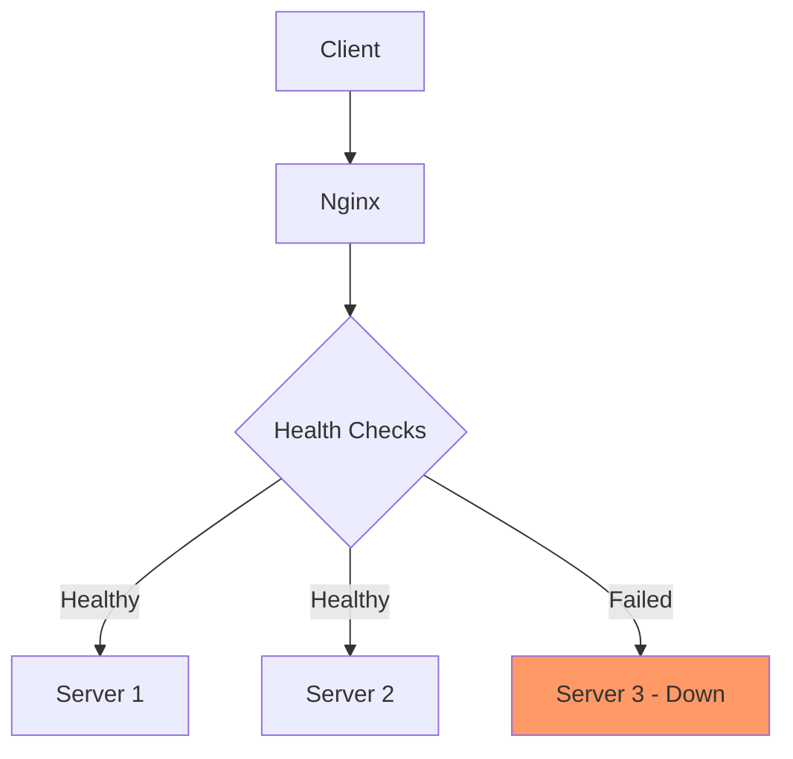

# Nginx Health Checks

## Introduction

Health checks are an essential component of any robust web infrastructure. They allow Nginx to continuously monitor the status of your backend servers, ensuring that traffic is only directed to healthy, operational servers. This is particularly crucial in load-balanced environments where service reliability and high availability are top priorities.

In this guide, we'll explore how to implement health checks in Nginx, understand their significance, and see real-world applications that demonstrate their effectiveness.

## Why Health Checks Matter

When Nginx serves as a reverse proxy or load balancer, it distributes incoming requests across multiple backend servers. Without health checks:

- Users might be directed to failing servers
- Downtime could increase when servers fail
- Recovery from failures would require manual intervention

Let's visualize the role of health checks in a typical setup:



## Basic Health Check Configuration

Nginx provides two main approaches to health checks:

1. **Passive health checks** - Monitoring real client connections
2. **Active health checks** - Proactively testing backend servers at regular intervals

### Passive Health Checks

Passive health checks monitor the results of actual client requests and can be configured within an `upstream` block:

```nginx
upstream backend {
    server backend1.example.com max_fails=3 fail_timeout=30s;
    server backend2.example.com max_fails=3 fail_timeout=30s;
    server backend3.example.com max_fails=3 fail_timeout=30s;
}
```

Parameters explained:
- `max_fails`: Maximum number of failed attempts before marking the server as unavailable
- `fail_timeout`: Time period during which `max_fails` is counted, and also the time the server is considered unavailable

### Active Health Checks (Nginx Plus)

Active health checks are available in Nginx Plus and allow for proactive testing of backend servers:

```nginx
http {
    upstream backend {
        zone backend 64k;
        server backend1.example.com:80;
        server backend2.example.com:80;
        server backend3.example.com:80;
    }
    
    server {
        listen 80;
        
        location / {
            proxy_pass http://backend;
            health_check interval=5s fails=3 passes=2;
        }
    }
}
```

Parameters explained:
- `interval`: Time between health checks (5 seconds in this example)
- `fails`: Number of consecutive failed checks before considering a server unhealthy
- `passes`: Number of consecutive successful checks before restoring a server

## Advanced Health Check Configurations

For more control over your health checks, Nginx Plus offers additional configurations:

### Custom Health Check Endpoints

You can specify a dedicated endpoint for health checks:

```nginx
location / {
    proxy_pass http://backend;
    health_check uri=/health interval=10s;
}
```

### Match Blocks for Response Validation

You can define expected responses to consider a server healthy:

```nginx
http {
    # Define what constitutes a successful response
    match server_ok {
        status 200-399;
        header Content-Type ~ text/html;
        body !~ "maintenance mode";
    }
    
    server {
        location / {
            proxy_pass http://backend;
            health_check match=server_ok;
        }
    }
}
```

### Different Check Types

Nginx Plus supports various health check types:

```nginx
# HTTP health check (default)
health_check;

# HTTPS health check
health_check type=https;

# TCP-only health check (faster but less thorough)
health_check type=tcp;
```

## Implementing a Simple Health Check API

For open-source Nginx users, a common approach is to create a dedicated health check endpoint in your application:

**Example Node.js Health API:**

```javascript
const express = require('express');
const app = express();

// System health variables
let isHealthy = true;

// Health check endpoint
app.get('/health', (req, res) => {
  if (isHealthy) {
    res.status(200).json({ status: 'ok' });
  } else {
    res.status(503).json({ status: 'unavailable' });
  }
});

// Toggle health status (for demonstration)
app.get('/toggle-health', (req, res) => {
  isHealthy = !isHealthy;
  res.status(200).json({ status: isHealthy ? 'now healthy' : 'now unhealthy' });
});

app.listen(3000, () => {
  console.log('Health check server running on port 3000');
});
```

**Corresponding Nginx Configuration:**

```nginx
upstream backend {
    server app1.example.com:3000 max_fails=2 fail_timeout=30s;
    server app2.example.com:3000 max_fails=2 fail_timeout=30s;
    server app3.example.com:3000 backup;  # backup server
}

server {
    listen 80;
    server_name example.com;
    
    location / {
        proxy_pass http://backend;
        proxy_next_upstream error timeout http_500 http_502 http_503 http_504;
    }
    
    # Dedicated endpoint for checking status from monitoring tools
    location /nginx_status {
        stub_status on;
        allow 127.0.0.1;  # Only allow local access
        deny all;
    }
}
```

## Real-World Applications

### Case 1: Microservices Architecture

In a microservices environment, health checks ensure service resilience:

```nginx
# Gateway Nginx configuration
http {
    upstream auth_service {
        server auth1.internal:8000 max_fails=3 fail_timeout=15s;
        server auth2.internal:8000 max_fails=3 fail_timeout=15s;
    }
    
    upstream payment_service {
        server payment1.internal:8100 max_fails=3 fail_timeout=15s;
        server payment2.internal:8100 max_fails=3 fail_timeout=15s;
    }
    
    server {
        listen 443 ssl;
        server_name api.example.com;
        
        # SSL configuration omitted for brevity
        
        location /auth/ {
            proxy_pass http://auth_service/;
            proxy_next_upstream error timeout http_500 http_503;
        }
        
        location /payments/ {
            proxy_pass http://payment_service/;
            proxy_next_upstream error timeout http_500 http_503;
        }
    }
}
```

### Case 2: Blue-Green Deployment

Health checks facilitate zero-downtime deployments:

```nginx
upstream production {
    server blue.example.com:8000;  # Currently active
    server green.example.com:8000 down;  # Ready but not receiving traffic
}

server {
    listen 80;
    server_name example.com;
    
    location / {
        proxy_pass http://production;
    }
}
```

During deployment, you would:
1. Deploy the new version to the "green" environment
2. Verify it's working correctly
3. Update the Nginx configuration to bring "green" online and set "blue" to down
4. Reload Nginx to switch traffic over

## Monitoring and Debugging Health Checks

### Status Monitoring

For Nginx Plus, you can view health check status through the built-in dashboard or API:

```bash
# Query the Nginx Plus API
curl http://nginx-plus-server/api/6/http/upstreams/backend/servers

# Sample output
[
  {
    "id": 0,
    "server": "backend1.example.com:80",
    "backup": false,
    "weight": 1,
    "state": "up",
    "active": 0,
    "max_conns": 0,
    "requests": 15,
    "responses": {"1xx": 0, "2xx": 15, "3xx": 0, "4xx": 0, "5xx": 0},
    "sent": 7050,
    "received": 48630,
    "fails": 0,
    "unavail": 0,
    "health_checks": {
      "checks": 32,
      "fails": 0,
      "unhealthy": 0,
      "last_passed": true
    }
  }
]
```

### Common Issues and Solutions

| Problem | Possible Cause | Solution |
|---------|----------------|----------|
| False negatives | Timeout too short | Increase `fail_timeout` or adjust `interval` |
| All servers marked unhealthy | Application issue | Implement circuit breaker pattern |
| Intermittent failures | Network glitches | Increase `max_fails` threshold |
| High server load from checks | Check frequency too high | Increase check interval |

## Integrating with External Monitoring

Health checks complement external monitoring systems. Consider integrating with:

- Prometheus for metrics collection
- Grafana for visualization
- Alertmanager for notifications

Example Prometheus configuration to scrape Nginx status:

```yaml
scrape_configs:
  - job_name: 'nginx'
    metrics_path: /nginx_status
    static_configs:
      - targets: ['nginx.example.com']
```

## Summary

Nginx health checks are a critical component for maintaining reliable and highly available services. They automatically detect and route around failed servers, ensuring users experience minimal disruption.

Key takeaways:
- Passive health checks are available in open-source Nginx
- Active health checks offer more advanced capabilities in Nginx Plus
- Custom health endpoints provide granular control
- Proper health check configuration is essential for microservices and modern deployment strategies

## Exercises for Practice

1. Configure a basic passive health check for a two-server upstream.
2. Create a simple health check endpoint in your preferred programming language.
3. Set up a blue-green deployment scenario using Nginx and test failover.
4. Experiment with different `max_fails` and `fail_timeout` values to see how they affect server availability.

## Additional Resources

- [Nginx Documentation on HTTP Health Checks](https://nginx.org/en/docs/)
- [Nginx Plus Features - Health Checks](https://www.nginx.com/products/nginx/)
- [High Availability Architecture Patterns](https://www.nginx.com/blog/tag/high-availability/)
- [Load Balancing with Nginx](https://www.nginx.com/resources/glossary/load-balancing/)