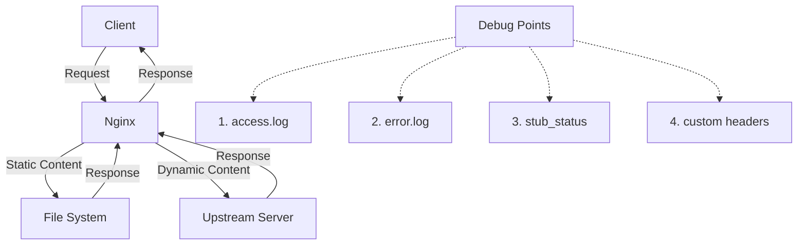

# Nginx Debugging Techniques

## Introduction

When running Nginx as your web server or reverse proxy, you'll inevitably encounter situations where things don't work as expected. Effective debugging is crucial for maintaining reliable web services. This guide explores various techniques to identify, diagnose, and resolve common Nginx issues.

Debugging Nginx involves several approaches:
- Analyzing log files
- Testing configuration syntax
- Checking process status
- Monitoring connections and performance
- Using debugging modules

Whether you're troubleshooting 502 errors, slow response times, or unexpected behavior, these techniques will help you quickly identify the root cause.

## Understanding Nginx Logs

### Error Logs

The error log is your first stop when troubleshooting Nginx issues. It contains information about server errors, startup problems, and worker process crashes.

Default error log locations:
- Ubuntu/Debian: `/var/log/nginx/error.log`
- CentOS/RHEL: `/var/log/nginx/error.log`
- Custom location defined in `nginx.conf`

You can configure error log verbosity in your Nginx configuration:

```nginx
# In nginx.conf or server block
error_log /var/log/nginx/error.log warn;
```

Possible log levels (from least to most verbose):
- `emerg`: Emergency situations
- `alert`: Immediate action required
- `crit`: Critical conditions
- `error`: Error conditions (default)
- `warn`: Warning conditions
- `notice`: Normal but significant conditions
- `info`: Informational messages
- `debug`: Debug messages

For intensive debugging, temporarily increase the verbosity:

```nginx
error_log /var/log/nginx/error.log debug;
```

Remember to reset it to a less verbose level (like `warn` or `error`) in production to avoid excessive logging.

### Access Logs

Access logs record client requests and are essential for understanding traffic patterns and identifying problematic requests.

Standard format example:

```nginx
log_format main '$remote_addr - $remote_user [$time_local] "$request" '
                '$status $body_bytes_sent "$http_referer" '
                '"$http_user_agent"';

access_log /var/log/nginx/access.log main;
```

For debugging specific issues, you can create custom log formats:

```nginx
# Log format with request processing time
log_format detailed '$remote_addr - $remote_user [$time_local] '
                    '"$request" $status $body_bytes_sent '
                    '"$http_referer" "$http_user_agent" '
                    '$request_time $upstream_response_time $pipe';

access_log /var/log/nginx/detailed_access.log detailed;
```

### Real-time Log Monitoring

Use `tail` command to monitor logs in real-time:

```bash
# Monitor error log
tail -f /var/log/nginx/error.log

# Monitor access log
tail -f /var/log/nginx/access.log
```

For more advanced filtering, combine with `grep`:

```bash
# Find 404 errors
tail -f /var/log/nginx/access.log | grep ' 404 '

# Find 500-level errors
tail -f /var/log/nginx/access.log | grep -E ' 50[0-9] '

# Monitor specific IP address
tail -f /var/log/nginx/access.log | grep '192.168.1.1'
```

## Configuration Testing and Validation

### Syntax Checking

Always check your configuration syntax before applying changes:

```bash
# Test configuration
nginx -t

# Test with a specific configuration file
nginx -t -c /path/to/nginx.conf
```

A successful test produces output like:

```
nginx: the configuration file /etc/nginx/nginx.conf syntax is ok
nginx: configuration file /etc/nginx/nginx.conf test is successful
```

### Debugging Configuration with Debug Mode

You can run Nginx with debug mode to gain insights into how it processes configurations:

```bash
nginx -T
```

This command dumps the entire configuration, including all included files, which helps verify that includes and variables are working correctly.

### Common Configuration Issues

1. **Permission problems**:
   ```bash
   # Check Nginx process owner
   ps aux | grep nginx
   
   # Ensure proper permissions
   sudo chown -R www-data:www-data /var/www/html
   sudo chmod -R 755 /var/www/html
   ```

2. **SSL certificate issues**:
   ```bash
   # Verify certificate validity
   openssl x509 -in /etc/nginx/ssl/your_certificate.crt -text -noout
   
   # Check private key match
   openssl pkey -in /etc/nginx/ssl/your_private.key -pubout -outform pem | \
   sha256sum && \
   openssl x509 -in /etc/nginx/ssl/your_certificate.crt -pubkey -noout -outform pem | \
   sha256sum
   ```

3. **Path and file existence**:
   ```bash
   # Check if files referenced in configuration exist
   ls -la /path/to/referenced/file
   ```

## Debugging Process and Connections

### Checking Process Status

Verify that Nginx is running:

```bash
# Check process status
systemctl status nginx

# List Nginx processes
ps aux | grep nginx
```

A healthy Nginx installation shows one master process and multiple worker processes.

### Monitoring Connections

Check current connections to Nginx:

```bash
# Count active connections
netstat -an | grep ESTABLISHED | grep -c ':80'

# List all connections to port 80
netstat -tulpn | grep :80

# Check if Nginx is listening
ss -tulpn | grep nginx
```

### Socket Statistics

The `ss` command can provide detailed socket information:

```bash
# Check socket statistics
ss -s

# Display all TCP sockets with process information
ss -tpl
```

## Advanced Debugging Techniques

### Debugging with Headers

Add custom headers to understand request flow, especially useful for proxy configurations:

```nginx
# Add custom headers for debugging
location /api/ {
    proxy_pass http://backend_servers;
    
    # Add debug headers
    add_header X-Debug-Info "Proxied via Nginx" always;
    
    # Pass request headers to upstream
    proxy_set_header X-Original-URI $request_uri;
    proxy_set_header X-Forwarded-For $proxy_add_x_forwarded_for;
}
```

Check these headers in your browser's developer tools or with `curl`:

```bash
curl -I https://yourdomain.com/api/endpoint
```

### Core Dumps and Debugging Crashes

For server crashes, enable core dumps:

1. Configure system for core dumps:
   ```bash
   sudo sysctl -w kernel.core_pattern=/tmp/core.%e.%p
   ulimit -c unlimited
   ```

2. Configure Nginx to create core dumps:
   ```nginx
   worker_rlimit_core 500m;
   working_directory /tmp;
   ```

3. Analyze core dump with GDB:
   ```bash
   gdb /usr/sbin/nginx /tmp/core.nginx.1234
   ```

### Using the debug_connection Directive

Enable debug logging only for specific IP addresses:

```nginx
# In http block of nginx.conf
events {
    debug_connection 192.168.1.1;
    debug_connection 10.0.0.0/24;
}
```

This helps focus on problematic clients without excessive logging.

## Performance Debugging

### Slow Request Detection

Identify slow requests using custom log formats:

```nginx
# Log format for timing information
log_format timing '$remote_addr - $remote_user [$time_local] '
                 '"$request" $status $body_bytes_sent '
                 '"$http_referer" "$http_user_agent" '
                 'upstream_response_time=$upstream_response_time '
                 'request_time=$request_time';

access_log /var/log/nginx/timing.log timing;
```

Find slow requests with:

```bash
# Requests taking more than 1 second
grep -E 'request_time=[1-9][0-9]*\.' /var/log/nginx/timing.log
```

### Using the stub_status Module

Enable the stub_status module to get basic statistics:

```nginx
# In server or location block
location /nginx_status {
    stub_status on;
    allow 127.0.0.1;
    deny all;
}
```

Access stats at `http://localhost/nginx_status`:

```
Active connections: 43
server accepts handled requests
 2849 2849 7326
Reading: 0 Writing: 5 Waiting: 38
```

- Active connections: Current active client connections
- Accepts: Total accepted connections
- Handled: Successfully handled connections
- Requests: Total client requests
- Reading: Connections reading request headers
- Writing: Connections writing responses
- Waiting: Keep-alive connections

## Debugging with Third-party Tools

### Using Curl for Request Testing

Test endpoints with curl:

```bash
# Basic GET request
curl -v http://yourdomain.com/path

# Test with specific headers
curl -v -H "Host: example.com" http://your-server-ip/path

# Test POST request
curl -v -X POST -d "param1=value1&param2=value2" http://yourdomain.com/path
```

The `-v` (verbose) flag shows request/response headers and connection details.

### Debugging with OpenResty's Echo Module

If you're using OpenResty, the echo module can output debug information directly:

```nginx
location /debug {
    echo "URI: $uri";
    echo "Request method: $request_method";
    echo "Client IP: $remote_addr";
    echo "Server name: $server_name";
    echo "Server address: $server_addr";
    echo "Server port: $server_port";
    echo "Server protocol: $server_protocol";
    echo "All Headers:";
    echo_foreach_header "echo ' $header: $echo_it;'";
}
```

### Visualizing Request Flow

Use Mermaid diagrams to understand and debug complex request flows:



## Common Debugging Scenarios

### Debugging 502 Bad Gateway

The 502 Bad Gateway error typically occurs when Nginx can't communicate with upstream servers:

1. Check upstream server status:
   ```bash
   curl -I http://backend-server:port/
   ```

2. Verify Nginx proxy configuration:
   ```nginx
   # Increase timeouts
   location /api/ {
       proxy_pass http://backend;
       proxy_connect_timeout 60s;
       proxy_read_timeout 60s;
       proxy_send_timeout 60s;
   }
   ```

3. Check error logs for specific errors:
   ```bash
   grep "upstream timed out" /var/log/nginx/error.log
   ```

### Debugging SSL/TLS Issues

Troubleshoot SSL problems:

1. Test SSL configuration:
   ```bash
   openssl s_client -connect yourdomain.com:443 -tls1_2
   ```

2. Verify certificate chain:
   ```bash
   echo | openssl s_client -connect yourdomain.com:443 -servername yourdomain.com 2>/dev/null | openssl x509 -noout -text
   ```

3. Check for common issues in Nginx config:
   ```nginx
   server {
       listen 443 ssl;
       server_name yourdomain.com;
       
       ssl_certificate /path/to/cert.pem;
       ssl_certificate_key /path/to/key.pem;
       
       # Enable these for debugging
       ssl_verify_client optional;
       ssl_verify_depth 2;
       
       # Log SSL handshake errors
       error_log /var/log/nginx/ssl-error.log debug;
   }
   ```

## Summary

Effective Nginx debugging requires a systematic approach:

1. **Start with logs**: Check error and access logs for immediate clues
2. **Validate configuration**: Use `nginx -t` and `nginx -T` to verify configurations
3. **Monitor connections**: Use `netstat`, `ss` or stub_status to understand traffic patterns
4. **Test thoroughly**: Use `curl` and browser tools to simulate requests
5. **Isolate issues**: Test components separately to narrow down problems
6. **Implement specific debugging**: Use custom headers, debug_connection, and specialized logging

Remember that debugging is iterative - start with simple checks before diving into complex techniques.

## Additional Resources

- [Official Nginx Documentation](https://nginx.org/en/docs/)
- [Nginx Wiki Debugging Guide](https://www.nginx.com/resources/wiki/start/topics/tutorials/debugging/)
- [OpenResty Developer Guide](https://openresty.org/en/getting-started.html)

## Practice Exercises

1. Set up custom logging to track slow requests (>1s) on your server
2. Configure stub_status and create a simple bash script to monitor connections
3. Create a test environment with deliberate issues (wrong permissions, incorrect proxy_pass) and practice troubleshooting
4. Implement a debug endpoint that displays request information using echo module or custom headers
5. Use curl to test different request scenarios against your server, capturing and analyzing the responses