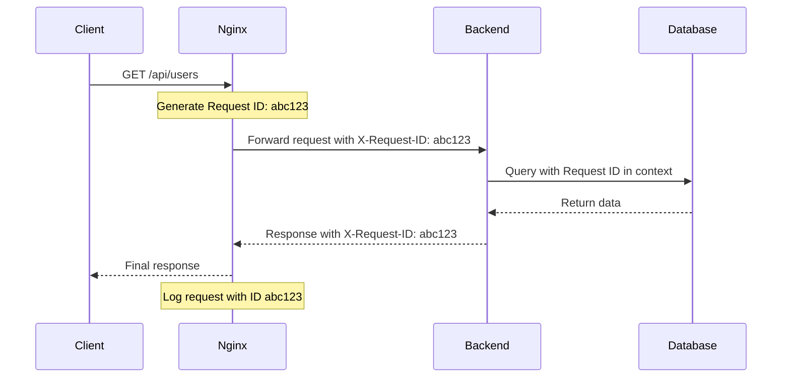

# Nginx Tracing Requests

## Introduction

When running web applications behind Nginx, understanding how requests flow through your server is crucial for debugging issues, optimizing performance, and maintaining system health. Request tracing provides visibility into the journey of HTTP requests from the moment they hit your Nginx server until a response is sent back to the client.

In this guide, we'll explore different techniques for tracing requests in Nginx, from basic logging configurations to advanced debugging approaches. By the end, you'll have the knowledge to effectively monitor and troubleshoot request-related issues in your Nginx deployments.

## Why Trace Requests in Nginx?

Before diving into implementation details, let's understand why request tracing is important:

- **Troubleshooting:** Identify where and why requests are failing
- **Performance optimization:** Discover bottlenecks in request processing
- **Security monitoring:** Detect suspicious request patterns
- **Capacity planning:** Analyze traffic patterns to plan infrastructure needs
- **Debugging:** Understand complex request flows in microservice architectures

## Basic Request Tracing with Access Logs

The simplest way to trace requests in Nginx is through access logs. By default, Nginx logs basic information about each request.

### Default Access Log Configuration

The default configuration in `nginx.conf` typically includes:

```nginx
http {
    log_format main '$remote_addr - $remote_user [$time_local] "$request" '
                     '$status $body_bytes_sent "$http_referer" '
                     '"$http_user_agent" "$http_x_forwarded_for"';
    
    access_log /var/log/nginx/access.log main;
}
```

This logs the client IP, timestamp, HTTP request, status code, bytes sent, referrer, user agent, and forwarded-for header.

### Customizing Access Logs for Better Tracing

To improve request tracing, we can customize the log format to include more information:

```nginx
http {
    log_format detailed '$remote_addr - $remote_user [$time_local] '
                         '"$request" $status $body_bytes_sent '
                         '"$http_referer" "$http_user_agent" '
                         '$request_time $upstream_response_time $pipe '
                         '$upstream_cache_status $sent_http_content_type';
    
    access_log /var/log/nginx/detailed_access.log detailed;
}
```

This enhanced format adds:
- `$request_time`: Total request processing time
- `$upstream_response_time`: Time spent waiting for the upstream server
- `$pipe`: Whether request was pipelined (p) or not (.)
- `$upstream_cache_status`: Cache status (HIT, MISS, BYPASS, etc.)
- `$sent_http_content_type`: Content type of the response

### Example Output

With this configuration, a log entry might look like:

```
192.168.1.10 - john [10/Mar/2024:13:55:36 +0000] "GET /api/users HTTP/1.1" 200 1234 "https://example.com" "Mozilla/5.0 (Windows NT 10.0; Win64; x64) AppleWebKit/537.36" 0.005 0.003 . MISS application/json
```

This tells us that:
- The request came from 192.168.1.10
- It was a GET request to /api/users
- It returned a 200 (success) status code
- The total request processing took 5ms
- The upstream server responded in 3ms
- The response was not cached (MISS)
- The content type was application/json

## Advanced Request Tracing with Request IDs

For more sophisticated tracing, especially in microservice architectures, we can generate and track request IDs through the system.

### Configuring Request ID Generation

First, add the following to your `http` block in `nginx.conf`:

```nginx
http {
    # ... other configurations
    
    map $request_id $req_id {
        default   $request_id;
        ""        $pid-$msec-$remote_addr-$request_length;
    }
    
    log_format with_req_id '$remote_addr - $remote_user [$time_local] "$request" '
                            '$status $body_bytes_sent "$http_referer" '
                            '"$http_user_agent" "$http_x_forwarded_for" '
                            'req_id=$req_id';
    
    access_log /var/log/nginx/access.log with_req_id;
}
```

This configuration:
1. Creates a unique request ID if one doesn't exist
2. Includes this ID in the logs
3. Can pass the ID to upstream services

### Passing Request IDs to Upstream Services

To make this truly useful, we need to pass the request ID to our backend services:

```nginx
server {
    listen 80;
    server_name example.com;
    
    location /api/ {
        proxy_pass http://backend_servers;
        proxy_set_header X-Request-ID $req_id;
    }
}
```

Now, your backend services can log this same request ID, allowing you to trace a request across your entire system.

### Example End-to-End Tracing

Here's how the flow looks:



By having this ID propagated throughout your system, you can correlate logs from different services that handled the same request.

## Debugging with Error Logs

Access logs are great for general tracing, but error logs provide critical information when things go wrong.

### Configuring Error Logs

In your `nginx.conf`:

```nginx
http {
    # ... other configurations
    error_log /var/log/nginx/error.log warn;
}
```

The log level can be one of: `debug`, `info`, `notice`, `warn`, `error`, `crit`, `alert`, or `emerg`.

### Using Conditional Logging for Specific Requests

You can also configure conditional error logging to capture more details for specific requests:

```nginx
server {
    # ... server configuration
    
    location /api/ {
        # Increase log level for specific endpoints
        if ($request_uri ~* "^/api/critical-endpoint") {
            error_log /var/log/nginx/critical-debug.log debug;
        }
        
        proxy_pass http://backend_servers;
    }
}
```

This will log detailed debug information only for requests to your critical endpoint.

## Tracing with HTTP Headers

HTTP headers provide another powerful way to trace requests through Nginx.

### Adding Custom Headers

You can add custom headers to responses to help with debugging:

```nginx
server {
    listen 80;
    server_name example.com;
    
    location / {
        add_header X-Served-By $hostname;
        add_header X-Request-Time $request_time;
        add_header X-Cache-Status $upstream_cache_status;
        
        proxy_pass http://backend;
    }
}
```

These headers tell the client:
- Which server handled the request
- How long the request took
- Whether it was a cache hit or miss

### Inspecting Incoming Headers

You can also log specific request headers that might be useful for tracing:

```nginx
http {
    log_format with_headers '$remote_addr - $remote_user [$time_local] "$request" '
                            '$status $body_bytes_sent "$http_referer" '
                            '"$http_user_agent" "auth=$http_authorization" '
                            '"origin=$http_origin"';
    
    access_log /var/log/nginx/headers.log with_headers;
}
```

This would log the Authorization and Origin headers, which can be useful for debugging authentication or CORS issues.

## Using OpenTelemetry for Distributed Tracing

For production environments, especially in microservice architectures, a more structured approach to tracing is recommended using OpenTelemetry.

### Installing the OpenTelemetry Module

First, you'll need to build Nginx with the OpenTelemetry module:

```bash
# Download Nginx source
wget http://nginx.org/download/nginx-1.22.1.tar.gz
tar -xzvf nginx-1.22.1.tar.gz
cd nginx-1.22.1

# Download the OpenTelemetry module
git clone https://github.com/open-telemetry/opentelemetry-cpp-contrib.git

# Build Nginx with the module
./configure --add-module=opentelemetry-cpp-contrib/instrumentation/nginx
make
make install
```

### Configuring OpenTelemetry in Nginx

Once installed, configure it in your `nginx.conf`:

```nginx
load_module modules/ngx_http_opentelemetry_module.so;

http {
    opentelemetry_config /etc/nginx/opentelemetry.toml;
    
    server {
        # ... server configuration
        opentelemetry on;
    }
}
```

And create the configuration file `/etc/nginx/opentelemetry.toml`:

```toml
[service]
name = "nginx-service"

[sampler]
type = "always_on"

[exporter]
type = "otlp"
endpoint = "localhost:4317"
```

This setup will:
1. Generate traces for all requests
2. Send them to an OpenTelemetry collector running on localhost:4317
3. Allow you to visualize request flows in tools like Jaeger or Zipkin

### Example Visualization

Using a tool like Jaeger, you'll be able to see a trace that looks something like this:

```mermaid
gantt
    title Request Trace for /api/users
    dateFormat  s
    axisFormat %S.%L
    
    Nginx Processing     :a1, 0.000, 0.002
    Authentication       :a2, after a1, 0.010
    API Gateway          :a3, after a2, 0.005
    Users Service Query  :a4, after a3, 0.050
    Database Query       :a5, after a4, 0.100
    Response Assembly    :a6, after a5, 0.015
    Nginx Response       :a7, after a6, 0.003
```

This visualization shows exactly where time is spent processing a request, making it easy to identify bottlenecks.

## Debugging with the Debug Module

For detailed low-level debugging, Nginx provides a debug module that offers extensive insights into request processing.

### Building Nginx with Debug Support

First, you need to compile Nginx with debug:

```bash
./configure --with-debug
make
make install
```

### Configuring Debug Logging

Then, enable debug logging in your configuration:

```nginx
error_log /var/log/nginx/debug.log debug;

http {
    # ... http configuration
}
```

### Understanding Debug Output

Debug logs are very verbose and include detailed information about every step of request processing. Here's a simplified example:

```
2024/03/10 12:34:56 [debug] 1234#0: *5 http request line: "GET /api/users HTTP/1.1"
2024/03/10 12:34:56 [debug] 1234#0: *5 http uri: "/api/users"
2024/03/10 12:34:56 [debug] 1234#0: *5 http args: ""
2024/03/10 12:34:56 [debug] 1234#0: *5 http header: "Host: example.com"
2024/03/10 12:34:56 [debug] 1234#0: *5 http header: "User-Agent: Mozilla/5.0"
2024/03/10 12:34:56 [debug] 1234#0: *5 http header done
2024/03/10 12:34:56 [debug] 1234#0: *5 event timer add: 7: 60000:1615379756942
2024/03/10 12:34:56 [debug] 1234#0: *5 proxy handler
2024/03/10 12:34:56 [debug] 1234#0: *5 http upstream check client, write event:1
...
```

While overwhelming at first, these logs can be invaluable for troubleshooting complex issues.

## Best Practices for Request Tracing

To make the most of request tracing in Nginx, follow these best practices:

1. **Use log rotation**: Set up logrotate to manage your logs and prevent disk space issues
   ```nginx
   access_log /var/log/nginx/access.log main buffer=16k flush=10s;
   ```

2. **Implement buffered logging**: This improves performance by writing logs in chunks
   ```nginx
   access_log /var/log/nginx/access.log main buffer=64k flush=5s;
   ```

3. **Balance verbosity with performance**: More detailed logs impact performance
   ```nginx
   # For production
   error_log /var/log/nginx/error.log warn;
   
   # For troubleshooting specific issues
   error_log /var/log/nginx/debug.log debug;
   ```

4. **Use conditional logging**: Log only what you need
   ```nginx
   map $status $loggable {
       ~^[23]  0;
       default 1;
   }
   
   access_log /var/log/nginx/errors_only.log combined if=$loggable;
   ```

5. **Centralize logs**: Use a logging system like ELK (Elasticsearch, Logstash, Kibana) or Grafana Loki to centralize and analyze logs

6. **Set up alerts**: Monitor logs for errors and set up alerts for critical issues

## Practical Example: Troubleshooting a 504 Gateway Timeout

Let's walk through a real-world example of using request tracing to troubleshoot a common issue.

### Scenario

Users report intermittent 504 Gateway Timeout errors when accessing your API. Let's use request tracing to identify the cause.

### Step 1: Enhance Logging

First, let's modify our log format to capture timing information:

```nginx
log_format debug_504 '$remote_addr - [$time_local] "$request" '
                      '$status $request_time $upstream_connect_time '
                      '$upstream_header_time $upstream_response_time';

server {
    # Only log 504 errors with detailed timing information
    access_log /var/log/nginx/timeout_debug.log debug_504 if=$status_504;
    
    location /api/ {
        proxy_pass http://backend;
        proxy_connect_timeout 5s;
        proxy_send_timeout 10s;
        proxy_read_timeout 30s;
    }
}
```

### Step 2: Analyze the Logs

After capturing some 504 errors, we analyze the logs:

```
192.168.1.100 - [10/Mar/2024:14:30:45 +0000] "GET /api/users/details HTTP/1.1" 504 30.001 0.002 30.001 -
192.168.1.101 - [10/Mar/2024:14:32:12 +0000] "GET /api/users/details HTTP/1.1" 504 30.001 0.003 30.001 -
```

The key observation is that `$upstream_response_time` is missing (shown as `-`), and the `$upstream_header_time` is exactly 30.001 seconds, matching our `proxy_read_timeout` setting.

### Step 3: Diagnose and Fix

This pattern indicates that the backend is accepting connections but not responding within the timeout period. Possible solutions:

1. Increase the timeout if the operation legitimately needs more time:
   ```nginx
   location /api/users/details {
       proxy_pass http://backend;
       proxy_read_timeout 60s;  # Increased from 30s
   }
   ```

2. Or better, fix the backend performance issue:
   ```bash
   # Example: Add an index to the database
   sudo -u postgres psql -d app_db -c "CREATE INDEX idx_user_details ON users(id);"
   ```

3. Add a circuit breaker to prevent cascading failures:
   ```nginx
   # Limit concurrent connections to the slow endpoint
   limit_conn_zone $binary_remote_addr zone=conn_limit_per_ip:10m;
   
   location /api/users/details {
       limit_conn conn_limit_per_ip 10;
       proxy_pass http://backend;
   }
   ```

This example shows how proper request tracing helped identify and resolve a specific issue.

## Summary

Tracing requests in Nginx is a powerful skill that helps you understand, debug, and optimize your web server's behavior. In this guide, we've covered:

- Basic request tracing with access logs
- Advanced tracing with request IDs
- Using error logs for debugging
- HTTP header-based tracing
- OpenTelemetry for distributed tracing
- Low-level debugging with the debug module
- Best practices for effective request tracing
- A practical troubleshooting example

By implementing these techniques, you'll gain deeper visibility into your Nginx server's behavior and be better equipped to diagnose and resolve issues quickly.

## Further Resources

To continue learning about Nginx request tracing and monitoring:

- [Official Nginx Documentation on Logging](https://nginx.org/en/docs/http/ngx_http_log_module.html)
- [Nginx Debugging Guide](https://nginx.org/en/docs/debugging_log.html)
- [OpenTelemetry Documentation](https://opentelemetry.io/docs/)

## Exercises

1. Configure a custom log format that captures timing, status codes, and user agent information.
2. Set up request ID generation and propagation to a simple backend service.
3. Create a conditional logging rule that only logs requests that take more than 1 second to process.
4. Implement buffered logging with appropriate flush intervals for your traffic patterns.
5. Set up a local OpenTelemetry collector and configure Nginx to send traces to it.