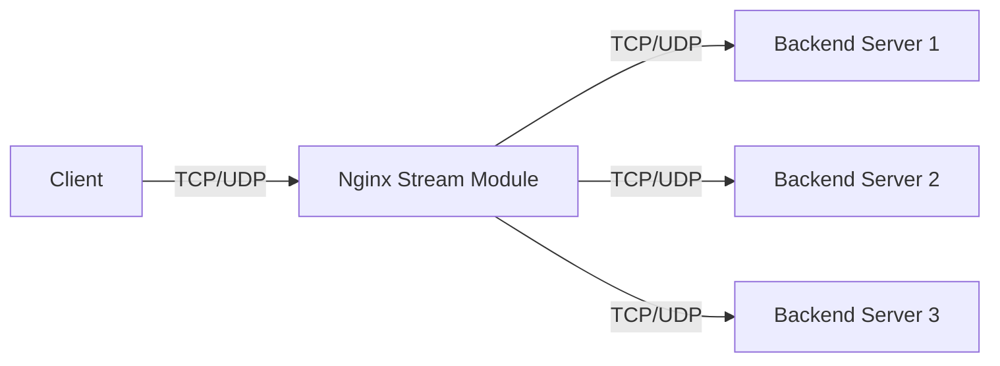

# Nginx Stream Module

## Introduction

The Nginx Stream Module is a powerful feature that extends Nginx beyond HTTP traffic handling, allowing it to proxy and load balance TCP and UDP traffic. While Nginx is widely known for its HTTP capabilities, the Stream Module opens up possibilities for handling a variety of network protocols like MySQL, Redis, SMTP, and any other TCP or UDP based service.

This module was introduced in Nginx 1.9.0 and became a standard feature in Nginx 1.9.11. It provides similar functionality to HAProxy but integrated within the Nginx ecosystem, making it an excellent choice for organizations already using Nginx for HTTP traffic.

## Understanding TCP/UDP Proxying

Before diving into the Stream Module, let's clarify what TCP/UDP proxying means:

- **TCP (Transmission Control Protocol)** is a connection-oriented protocol that ensures reliable, ordered delivery of data.
- **UDP (User Datagram Protocol)** is a connectionless protocol with no guarantee of delivery, ordering, or duplicate protection.

When Nginx proxies these protocols, it acts as an intermediary between clients and backend servers, forwarding traffic without interpreting the content (unlike HTTP proxying where Nginx understands the protocol).



## Getting Started with Nginx Stream Module

### Step 1: Verify Nginx Installation with Stream Module

First, check if your Nginx installation includes the Stream Module:

```bash
nginx -V 2>&1 | grep -- 'with-stream'
```

If the output contains `--with-stream`, you're good to go. If not, you'll need to reinstall Nginx with Stream Module support.

For Ubuntu/Debian:

```bash
sudo apt-get install nginx-full
```

For compilation from source, add the `--with-stream` flag:

```bash
./configure --with-stream
make
sudo make install
```

### Step 2: Configure the Stream Module

The Stream Module configuration lives in a separate `stream` context in the Nginx configuration. Typically, it's best to organize this in a separate file for clarity.

1. Create a stream configuration file:

```bash
sudo mkdir -p /etc/nginx/stream.d
sudo nano /etc/nginx/stream.d/streams.conf
```

2. Update the main Nginx configuration to include this file:

```bash
sudo nano /etc/nginx/nginx.conf
```

Add this line outside any existing contexts:

```nginx
include /etc/nginx/stream.d/*.conf;
```

3. Basic stream configuration example:

```nginx
stream {
    server {
        listen 12345;
        proxy_pass backend_server:5432;
    }
}
```

This simple configuration will forward TCP traffic from port 12345 to a backend server on port 5432.

## TCP Load Balancing with Stream Module

One of the most common uses of the Stream Module is load balancing TCP connections across multiple backend servers.

### Basic TCP Load Balancing Example

```nginx
stream {
    upstream mysql_servers {
        server 10.0.0.1:3306 weight=5;
        server 10.0.0.2:3306 weight=1;
        server 10.0.0.3:3306 backup;
    }

    server {
        listen 3306;
        proxy_pass mysql_servers;
    }
}
```

In this example:
- We create an upstream group called `mysql_servers` with three backend MySQL servers
- The first server has a weight of 5, receiving more connections
- The second server has a weight of 1, receiving fewer connections
- The third server is a backup, only receiving connections when others are unavailable
- Nginx listens on port 3306 and forwards connections to the upstream group

### Load Balancing Methods

The Stream Module supports several load balancing methods:

```nginx
upstream postgres_servers {
    # Round Robin (default)
    server 10.0.0.1:5432;
    server 10.0.0.2:5432;

    # Or specify a method
    least_conn; # Send to server with fewest active connections
    # hash $remote_addr consistent; # Use consistent hashing based on client IP
}
```

Available methods include:
- `round_robin`: Default method, distributing requests sequentially
- `least_conn`: Sends to the server with the fewest active connections
- `hash`: Uses a hash function on a specified key (often client IP)
- `random`: Selects a random server, with optional weighting

## UDP Load Balancing

The Stream Module also supports UDP protocol load balancing:

```nginx
stream {
    upstream dns_servers {
        server 10.0.0.1:53;
        server 10.0.0.2:53;
    }

    server {
        listen 53 udp;
        proxy_pass dns_servers;
    }
}
```

The key difference is adding the `udp` parameter to the `listen` directive.

## Advanced Stream Module Features

### Connection Limiting

Control the number of connections to protect your backend servers:

```nginx
stream {
    server {
        listen 3306;
        proxy_pass mysql_backend;
        
        # Limit to 100 connections per server
        proxy_buffer_size 16k;
        proxy_connect_timeout 3s;
        proxy_timeout 30s;
        limit_conn_zone $binary_remote_addr zone=addr:10m;
        limit_conn addr 100;
    }
}
```

### SSL/TLS Termination

Encrypt traffic between clients and Nginx:

```nginx
stream {
    server {
        listen 5432 ssl;
        
        ssl_certificate /etc/nginx/ssl/postgres.crt;
        ssl_certificate_key /etc/nginx/ssl/postgres.key;
        ssl_protocols TLSv1.2 TLSv1.3;
        
        proxy_pass postgres_backend;
    }
}
```

This configuration:
1. Terminates SSL/TLS at Nginx
2. Communicates with backend servers in plaintext (within your secure network)
3. Reduces SSL processing load on backend servers

### Health Checks

Monitor backend server health:

```nginx
stream {
    upstream redis_servers {
        server 10.0.0.1:6379 max_fails=3 fail_timeout=30s;
        server 10.0.0.2:6379 max_fails=3 fail_timeout=30s;
        
        # Check every 10 seconds
        health_check interval=10 passes=2 fails=3;
    }
    
    server {
        listen 6379;
        proxy_pass redis_servers;
    }
}
```

This configuration:
- Checks server health every 10 seconds
- Requires 2 successful checks to mark a server as healthy
- Requires 3 failed checks to mark a server as unhealthy
- Removes servers from rotation after 3 failures for 30 seconds

## Real-World Application Examples

### Example 1: PostgreSQL Database Load Balancing

```nginx
stream {
    upstream postgres {
        least_conn;
        server pg1.example.com:5432 max_fails=3 fail_timeout=30s;
        server pg2.example.com:5432 max_fails=3 fail_timeout=30s;
        server pg3.example.com:5432 backup;
    }

    server {
        listen 5432;
        proxy_pass postgres;
        proxy_connect_timeout 3s;
        proxy_timeout 10m; # Longer timeout for database queries
    }
}
```

This setup provides:
- Load balanced PostgreSQL connections using least connections algorithm
- Automatic failover to backup server
- Connection timeout settings appropriate for database workloads

### Example 2: Secure Redis Cluster

```nginx
stream {
    upstream redis_cluster {
        hash $remote_addr consistent;
        server redis1.internal:6379;
        server redis2.internal:6379;
        server redis3.internal:6379;
    }

    server {
        listen 6379 ssl;
        ssl_certificate /etc/nginx/ssl/redis.crt;
        ssl_certificate_key /etc/nginx/ssl/redis.key;
        ssl_protocols TLSv1.2 TLSv1.3;
        ssl_ciphers HIGH:!aNULL:!MD5;
        
        proxy_pass redis_cluster;
    }
}
```

This configuration:
- Uses consistent hashing based on client IP (ensures same client hits same Redis server)
- Adds SSL/TLS encryption for Redis traffic (normally unencrypted)
- Restricts to secure TLS protocols and ciphers

### Example 3: SMTP Email Server Proxy

```nginx
stream {
    upstream mail_servers {
        server mail1.example.com:25;
        server mail2.example.com:25;
    }

    server {
        listen 25;
        proxy_pass mail_servers;
        proxy_timeout 60s;
    }
}
```

This simple setup:
- Load balances SMTP traffic across two mail servers
- Sets appropriate timeout for email server communication

## Troubleshooting Stream Module

Common issues and their solutions:

### 1. Connection Refused

If clients receive "connection refused" errors:

- Check if Nginx is listening on the correct port:
  ```bash
  sudo netstat -tulpn | grep nginx
  ```
- Verify firewall settings:
  ```bash
  sudo iptables -L -n
  ```
- Ensure backend servers are running and accessible from Nginx

### 2. Slow Performance

If connections are slow:

- Check backend server performance
- Review proxy buffer settings:
  ```nginx
  proxy_buffer_size 16k; # Increase if needed
  ```
- Monitor Nginx worker connections:
  ```nginx
  worker_processes auto;
  worker_connections 4096; # Increase for high-traffic scenarios
  ```

### 3. Enabling Debug Logging

For troubleshooting, enable debug logging:

```nginx
stream {
    log_format basic '$remote_addr [$time_local] '
                     '$protocol $status $bytes_sent $bytes_received '
                     '$session_time';

    access_log /var/log/nginx/stream-access.log basic;
    error_log /var/log/nginx/stream-error.log debug;
    
    # Rest of your configuration...
}
```

## Summary

The Nginx Stream Module extends Nginx's capabilities beyond HTTP, allowing TCP and UDP traffic proxying and load balancing. Key benefits include:

- **Protocol Agnostic**: Works with any TCP/UDP based protocol
- **High Performance**: Leverages Nginx's event-driven architecture
- **Integration**: Works alongside existing Nginx HTTP configurations
- **Rich Features**: Supports SSL termination, health checks, and various load balancing algorithms

By implementing the Stream Module, you can consolidate your infrastructure, using Nginx as a single entry point for both HTTP and non-HTTP traffic.

## Additional Resources

- [Nginx Official Documentation on Stream Module](https://nginx.org/en/docs/stream/ngx_stream_core_module.html)
- [Nginx Admin Guide: TCP and UDP Load Balancing](https://docs.nginx.com/nginx/admin-guide/load-balancer/tcp-udp-load-balancer/)

## Exercises

1. Set up a basic TCP proxy for a MySQL database and test the connection.
2. Configure load balancing for a Redis server with at least two backend instances.
3. Implement SSL termination for a non-HTTP service.
4. Create a configuration that uses health checks to verify backend server availability.
5. Set up connection limiting to protect backend servers from overload.

By completing these exercises, you'll gain practical experience with the Nginx Stream Module and be better prepared to implement it in your own infrastructure.