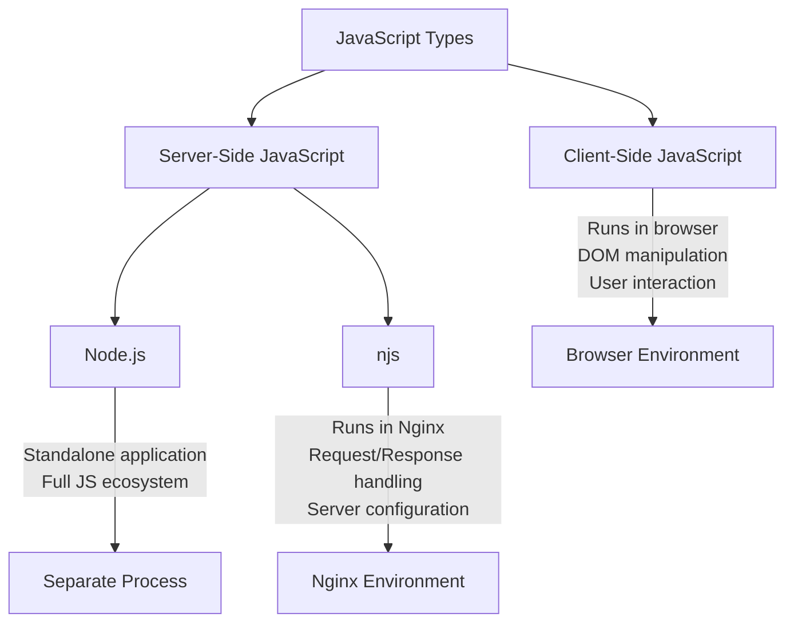

# Nginx JavaScript (njs)

## Introduction

Nginx JavaScript (njs) is a JavaScript implementation for extending and customizing Nginx functionality. Unlike client-side JavaScript that runs in browsers, njs runs on the server side within the Nginx environment. This powerful module allows developers to write JavaScript code that can intercept and modify HTTP requests and responses, implement complex access controls, and perform various server-side operations without requiring external processes.

In this guide, we'll explore how to use njs to enhance your Nginx server with custom logic and functionality that goes beyond what's possible with standard configuration directives.

## Prerequisites

Before diving into njs, you should have:

- Basic knowledge of Nginx configuration
- Familiarity with JavaScript
- Nginx installed with the njs module (version 1.0 or higher)

## Installing njs Module

To use njs, you first need to ensure the module is installed. On most systems, you can install it as follows:

### For Debian/Ubuntu:

```bash
sudo apt update
sudo apt install nginx-module-njs
```

### For CentOS/RHEL:

```bash
sudo yum install nginx-module-njs
```

After installation, you need to load the module in your Nginx configuration:

```nginx
load_module modules/ngx_http_js_module.so;
load_module modules/ngx_stream_js_module.so;
```

## Basic njs Configuration

Let's start with a simple example of how to set up and use njs in your Nginx configuration:

1. First, create a JavaScript file (e.g., `http.js`) with your njs code:

```javascript
function hello(r) {
    r.return(200, "Hello from njs!
");
}

export default {hello};
```

2. Then, reference this file in your Nginx configuration:

```nginx
http {
    js_import main from /etc/nginx/njs/http.js;
    
    server {
        listen 80;
        
        location /hello {
            js_content main.hello;
        }
    }
}
```

3. After reloading Nginx with `nginx -s reload`, when you access `/hello`, Nginx will execute your JavaScript function and return "Hello from njs!".

## njs vs Traditional Client-Side JavaScript

Let's understand how njs differs from client-side JavaScript:



## Core njs Concepts

### HTTP Request Object

In njs, the HTTP request object (typically denoted as `r`) provides access to request data and response methods:

```javascript
function handleRequest(r) {
    // Accessing request properties
    const method = r.method;           // GET, POST, etc.
    const uri = r.uri;                 // /path/to/resource
    const headers = r.headersIn;       // Request headers
    const args = r.args;               // Query parameters
    
    // Setting response
    r.return(200, `You requested ${uri} using ${method}
`);
}

export default {handleRequest};
```

### Setting Response Headers

You can manipulate response headers before sending the response:

```javascript
function customHeaders(r) {
    // Set custom headers
    r.headersOut['Content-Type'] = 'application/json';
    r.headersOut['X-Powered-By'] = 'njs';
    
    // Send JSON response
    r.return(200, JSON.stringify({
        message: "Success",
        timestamp: new Date().toISOString()
    }));
}

export default {customHeaders};
```

### Working with Request Body

For handling POST requests with a body:

```javascript
function processPost(r) {
    r.subrequest('/internal/read_body', {
        body: r.requestBody
    })
    .then(reply => {
        const data = JSON.parse(reply.responseBody);
        r.return(200, `Received data for user: ${data.username}
`);
    })
    .catch(e => {
        r.return(400, `Error processing request: ${e.message}
`);
    });
}

export default {processPost};
```

## Practical Examples

Let's explore some practical applications of njs in real-world scenarios.

### Example 1: Dynamic Content Rewriting

This example shows how to modify response content dynamically:

```javascript
function rewriteContent(r) {
    // Forward request to a backend server
    r.subrequest('/proxy/original')
        .then(reply => {
            // Replace specific text in the response
            let modifiedContent = reply.responseBody
                .toString()
                .replace(/Original Text/g, 'New Modified Text');
                
            r.return(reply.status, modifiedContent);
        })
        .catch(e => {
            r.return(500, `Error: ${e.message}
`);
        });
}

export default {rewriteContent};
```

Corresponding Nginx configuration:

```nginx
server {
    listen 80;
    
    js_import modify from /etc/nginx/njs/content_rewrite.js;
    
    location /modified {
        js_content modify.rewriteContent;
    }
    
    location /proxy/original {
        proxy_pass http://backend_server;
        internal; # Only accessible via subrequests
    }
}
```

### Example 2: Advanced Authentication

Implement a custom authentication mechanism:

```javascript
function authenticate(r) {
    // Get the Authorization header
    const authHeader = r.headersIn.Authorization;
    
    if (!authHeader || !authHeader.startsWith('Bearer ')) {
        r.return(401, "Authentication required
");
        return;
    }
    
    const token = authHeader.substring(7); // Remove 'Bearer ' prefix
    
    // For demonstration - in production, use proper token validation
    if (token === "secret-token-123") {
        // Add custom headers for upstream servers
        r.headersOut['X-User-Authenticated'] = 'true';
        r.headersOut['X-User-ID'] = 'user-12345';
        
        // Forward to protected content
        r.internalRedirect('@protected');
    } else {
        r.return(403, "Invalid authentication token
");
    }
}

export default {authenticate};
```

Nginx configuration:

```nginx
server {
    listen 80;
    
    js_import auth from /etc/nginx/njs/auth.js;
    
    location /secure {
        js_content auth.authenticate;
    }
    
    location @protected {
        proxy_pass http://backend_server;
        # Additional protection configurations
    }
}
```

### Example 3: Request Rate Limiting with Dynamic Rules

Implement a sophisticated rate limiting solution:

```javascript
// Simplified example - in production use Redis or similar for state
let requestCounts = {};

function rateLimit(r) {
    const clientIP = r.remoteAddress;
    const path = r.uri;
    const currentTime = Math.floor(Date.now() / 1000);
    
    // Create rate limit buckets per IP and path
    const key = `${clientIP}:${path}`;
    
    // Clean up old entries
    for (let k in requestCounts) {
        if (requestCounts[k].timestamp < currentTime - 60) {
            delete requestCounts[k];
        }
    }
    
    // Initialize or increment counter
    if (!requestCounts[key]) {
        requestCounts[key] = {
            count: 1,
            timestamp: currentTime
        };
    } else {
        requestCounts[key].count++;
    }
    
    // Check rate limit - example allows 10 requests per minute
    if (requestCounts[key].count > 10) {
        r.return(429, "Too Many Requests
");
        return;
    }
    
    // Allow the request to proceed
    r.internalRedirect('@allowed');
}

export default {rateLimit};
```

## Error Handling in njs

Proper error handling is essential in njs scripts:

```javascript
function safeHandler(r) {
    try {
        // Potentially risky operation
        const data = JSON.parse(r.requestBody || '{}');
        
        if (!data.username) {
            throw new Error("Username is required");
        }
        
        r.return(200, `Hello, ${data.username}!
`);
    } catch (e) {
        // Gracefully handle errors
        r.log(`Error in njs script: ${e.message}`);
        r.return(400, `Error: ${e.message}
`);
    }
}

export default {safeHandler};
```

## njs Limitations and Best Practices

When working with njs, keep in mind:

1. **Limited JavaScript API**: njs doesn't support the full JavaScript/ECMAScript standard
2. **No external modules**: You can't use npm packages or external libraries
3. **Performance considerations**: Complex JavaScript logic can impact Nginx performance

Best practices:

- Keep njs functions small and focused
- Use njs for logic that truly needs to be in Nginx
- For complex applications, consider using njs for routing and basic processing, while delegating complex operations to dedicated backend services
- Test thoroughly before deploying to production

## Debugging njs Scripts

To debug your njs scripts, you can use Nginx's error logs:

```javascript
function debugExample(r) {
    r.log("Debug: Function called with URI " + r.uri);
    
    try {
        // Your code here
        const result = someOperation();
        r.log("Debug: Operation result: " + JSON.stringify(result));
    } catch (e) {
        r.log("Error: " + e.message);
        r.return(500, "An error occurred");
    }
}
```

Make sure to configure appropriate logging in your Nginx settings:

```nginx
error_log /var/log/nginx/error.log debug;
```

## Summary

Nginx JavaScript (njs) provides a powerful way to extend Nginx functionality with custom JavaScript code. It enables developers to implement complex logic directly within Nginx without relying on external processes or services.

In this guide, we've covered:

- Setting up njs in your Nginx environment
- Basic njs concepts and syntax
- Handling HTTP requests and responses
- Practical examples for real-world scenarios
- Error handling and debugging techniques

With njs, you can transform your Nginx server from a simple web server or reverse proxy into a sophisticated application platform capable of handling complex routing, authentication, content transformation, and more.

## Further Learning

To continue your njs journey:

- Explore the [official njs documentation](http://nginx.org/en/docs/njs/)
- Practice by implementing simple use cases first, then moving to more complex scenarios
- Join the Nginx community forums to share experiences and ask questions

## Exercises

1. Create an njs script that redirects mobile users to a mobile-specific version of your website by checking the User-Agent header.

2. Implement a simple A/B testing system using njs that randomly directs users to different backend servers.

3. Develop an njs module that adds security headers to all responses from your Nginx server.

4. Create a custom logging module that records detailed information about requests in a format of your choice.