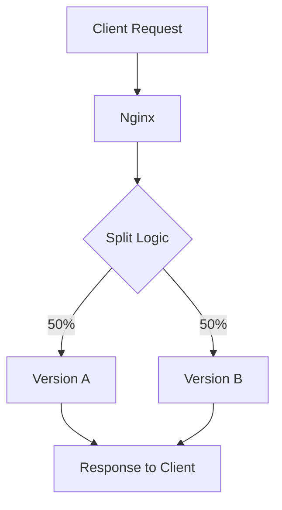

# Nginx Split Testing

## Introduction

Split testing (also known as A/B testing) is a method used to compare two or more versions of a website or application to determine which one performs better. With Nginx, you can implement split testing by distributing traffic between different server versions without requiring any client-side code.

In this tutorial, you'll learn how to use Nginx's advanced features to implement split testing for your web applications. We'll cover various methods, from basic random distribution to more sophisticated cookie-based persistence.

## Why Split Testing with Nginx?

Before diving into implementation, let's understand why Nginx is an excellent choice for split testing:

1. **Performance**: Nginx is designed for high performance and low resource consumption
2. **Layer of Abstraction**: Testing happens at the server level, requiring no changes to application code
3. **Flexibility**: Multiple methods available to distribute traffic
4. **Scalability**: Can handle high volumes of traffic while performing the split

## Basic Split Testing Setup

Let's start with a simple 50/50 split between two versions of a website.

### Prerequisites

- Nginx installed on your server
- Access to Nginx configuration files
- Two different versions of your website/application deployed

### Configuration Example

Here's a basic configuration that splits traffic randomly between two server groups:

```nginx
http {
    # Define upstream servers for version A
    upstream version_a {
        server 10.0.0.1:8080;
        server 10.0.0.2:8080 backup;
    }
    
    # Define upstream servers for version B
    upstream version_b {
        server 10.0.0.3:8080;
        server 10.0.0.4:8080 backup;
    }
    
    # Split testing logic
    split_clients "${remote_addr}${http_user_agent}" $variant {
        50%     version_a;
        *       version_b;
    }
    
    server {
        listen 80;
        server_name example.com;
        
        location / {
            proxy_pass http://$variant;
            proxy_set_header Host $host;
            proxy_set_header X-Real-IP $remote_ip;
        }
    }
}
```

In this configuration:

1. We define two upstream server groups: `version_a` and `version_b`
2. The `split_clients` directive distributes traffic based on a hash of the client's IP address and user agent
3. 50% of traffic goes to version A, while the remaining traffic goes to version B
4. We use a variable (`$variant`) to dynamically determine which upstream to route to

### How It Works

The flow of a request through this configuration can be visualized:



## Advanced Split Testing Techniques

Basic random splitting works for many cases, but sometimes you need more control. Let's explore some advanced techniques.

### Weight-Based Distribution

Instead of an equal split, you might want to send different percentages of traffic to each version:

```nginx
split_clients "${remote_addr}${http_user_agent}" $variant {
    20%     version_a;  # 20% of traffic
    *       version_b;  # 80% of traffic
}
```

This is useful when:
- You're gradually rolling out a new version
- You want to limit exposure to experimental features
- You're testing with a small sample before full deployment

### Cookie-Based Persistence

One limitation of the basic approach is that returning users might see a different version each time they visit. To ensure consistent experience, we can use cookies:

```nginx
map $cookie_ab_test $preset_variant {
    "version_a"     version_a;
    "version_b"     version_b;
    default         "";
}

# Only for users without the cookie
split_clients "${remote_addr}${http_user_agent}" $split_variant {
    50%     version_a;
    *       version_b;
}

# Use preset if cookie exists, otherwise use split result
map $preset_variant $variant {
    ""      $split_variant;
    default $preset_variant;
}

server {
    listen 80;
    server_name example.com;
    
    location / {
        proxy_pass http://$variant;
        
        # Set the cookie to maintain consistency
        add_header Set-Cookie "ab_test=$variant; Path=/; Max-Age=3600";
        
        proxy_set_header Host $host;
        proxy_set_header X-Real-IP $remote_ip;
    }
}
```

This configuration:
1. Checks if the user already has an `ab_test` cookie
2. If they do, it routes them to the same version they saw before
3. If not, it assigns them to a version based on the split logic
4. Sets a cookie so future visits maintain consistency

### Feature-Based Testing

Sometimes you want to test specific features rather than entire versions. You can split traffic for specific URLs:

```nginx
server {
    listen 80;
    server_name example.com;
    
    # Main site uses original version
    location / {
        proxy_pass http://original_version;
    }
    
    # New checkout process being tested
    location /checkout {
        split_clients "${remote_addr}" $checkout_variant {
            30%     new_checkout;
            *       original_checkout;
        }
        proxy_pass http://$checkout_variant;
    }
}
```

This allows you to test individual features while keeping the rest of the site consistent.

## Collecting and Analyzing Test Data

Split testing is only valuable if you can measure results. Here's how to send test data to your analytics system:

```nginx
server {
    listen 80;
    server_name example.com;
    
    location / {
        proxy_pass http://$variant;
        
        # Add custom header for analytics
        proxy_set_header X-AB-Variant $variant;
        
        # Log the variant for server-side analysis
        access_log /var/log/nginx/ab_test.log combined_ab;
    }
}

# Custom log format with variant information
log_format combined_ab '$remote_addr - $remote_user [$time_local] '
                      '"$request" $status $body_bytes_sent '
                      '"$http_referer" "$http_user_agent" '
                      '"$variant"';
```

With this configuration:
1. Each request includes which version was shown (in the `X-AB-Variant` header)
2. Server logs capture this information for analysis
3. You can pass this data to analytics tools to compare metrics between versions

## Real-World Example: Testing a New UI

Let's walk through a complete example of testing a new UI design:

```nginx
http {
    upstream original_ui {
        server 10.0.0.1:8080;
        server 10.0.0.2:8080;
    }
    
    upstream new_ui {
        server 10.0.0.3:8080;
        server 10.0.0.4:8080;
    }
    
    # Create variant mapping based on cookie or split
    map $cookie_ui_test $preset_variant {
        "original"  original_ui;
        "new"       new_ui;
        default     "";
    }
    
    split_clients "${remote_addr}${http_user_agent}" $split_variant {
        25%     new_ui;
        *       original_ui;
    }
    
    map $preset_variant $ui_variant {
        ""      $split_variant;
        default $preset_variant;
    }
    
    server {
        listen 80;
        server_name example.com;
        
        location / {
            # Route to the appropriate version
            proxy_pass http://$ui_variant;
            
            # Set cookie for consistency (30 days)
            add_header Set-Cookie "ui_test=$ui_variant; Path=/; Max-Age=2592000";
            
            # Add variant to response headers for client-side tracking
            add_header X-UI-Variant $ui_variant;
            
            # Standard proxy headers
            proxy_set_header Host $host;
            proxy_set_header X-Real-IP $remote_addr;
            proxy_set_header X-Forwarded-For $proxy_add_x_forwarded_for;
        }
        
        # Admin endpoint to force a specific version (for testing)
        location /set-version {
            if ($arg_version = "original") {
                add_header Set-Cookie "ui_test=original_ui; Path=/; Max-Age=2592000";
                add_header Content-Type text/plain;
                return 200 "Version set to original";
            }
            
            if ($arg_version = "new") {
                add_header Set-Cookie "ui_test=new_ui; Path=/; Max-Age=2592000";
                add_header Content-Type text/plain;
                return 200 "Version set to new";
            }
            
            return 400 "Invalid version specified";
        }
    }
}
```

This comprehensive example includes:
1. A 25/75 split between new and original UI
2. Cookie persistence for 30 days
3. Headers for analytics integration
4. An admin endpoint to force a specific version for testing

## Common Challenges and Solutions

### Challenge: Users Seeing Inconsistent Experiences

**Solution**: Use cookie-based persistence as shown in the examples above.

### Challenge: Results Contamination

**Problem**: Analytics data getting mixed between versions.

**Solution**:
```nginx
# Add version tracking to all internal requests
proxy_set_header X-AB-Variant $variant;

# Separate logs for each variant
map $variant $variant_log {
    version_a   /var/log/nginx/version_a.log;
    version_b   /var/log/nginx/version_b.log;
}

access_log $variant_log;
```

### Challenge: Caching Issues

**Problem**: Cached responses might not respect the split.

**Solution**:
```nginx
# Include variant in cache key
proxy_cache_key "$scheme$host$request_uri$variant";
```

## Summary

Nginx provides powerful tools for implementing split testing that can help you make data-driven decisions about your website or application. In this guide, we've covered:

- Basic random traffic splitting
- Weight-based distribution
- Cookie-based persistence for consistent user experience
- Feature-based testing
- Analytics integration
- A comprehensive real-world example

By implementing split testing with Nginx, you can test changes safely, gather valuable data, and improve your application based on user behavior rather than assumptions.

## Additional Resources

For further exploration of Nginx split testing capabilities:

- The official [Nginx Split Clients Module documentation](http://nginx.org/en/docs/http/ngx_http_split_clients_module.html)
- Learn more about [Nginx load balancing](http://nginx.org/en/docs/http/load_balancing.html)
- Explore the [Nginx Proxy Module](http://nginx.org/en/docs/http/ngx_http_proxy_module.html) for additional configuration options

## Exercises

To reinforce your understanding:

1. Set up a basic 50/50 split test between two versions of a simple web page
2. Modify the configuration to use a 70/30 split with cookie persistence
3. Implement a feature-based test that only splits traffic for a specific URL path
4. Add custom logging to track which version each user sees
5. Create a configuration that allows gradually increasing traffic to a new version over time