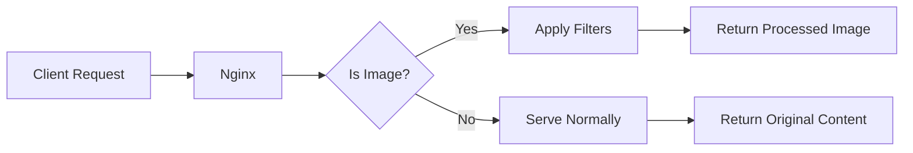

# Nginx Image Filtering

## Introduction

Nginx (pronounced "engine-x") is a powerful web server that can do much more than just serve static content. One of its advanced features is the ability to process and manipulate images on-the-fly without requiring additional server-side scripts. This feature is provided by the `ngx_http_image_filter_module`, which allows you to resize, crop, rotate, and perform other basic transformations on images as they're being served.

In this tutorial, we'll explore how to use Nginx's image filtering capabilities to optimize images for different devices, reduce bandwidth usage, and improve your website's loading times.

## Prerequisites

Before we begin, make sure you have:

- Nginx installed with the image filter module
- Basic knowledge of Nginx configuration
- Administrative access to your server

## Checking for the Image Filter Module

First, let's verify that your Nginx installation includes the image filter module:

```bash
nginx -V 2>&1 | grep image_filter
```

If the module is available, you'll see `--with-http_image_filter_module` in the output. If not, you'll need to recompile Nginx with this module enabled.

## How Nginx Image Filtering Works

Nginx's image filtering works by intercepting image requests and applying transformations before sending them to the client. Here's a simple diagram of how it works:



## Basic Configuration

To enable image filtering, you need to add the appropriate directives to your Nginx configuration. Here's a basic example:

```nginx
# Inside a server or location block
location /images/ {
    # Enable image filtering
    image_filter_buffer 10M;
    image_filter resize 300 200;
    
    # Set the root directory for images
    root /var/www/website;
}
```

This configuration will:
1. Apply image filtering to any requests under the `/images/` path
2. Allocate a 10MB buffer for image processing
3. Resize all images to 300×200 pixels

## Common Image Filter Directives

Nginx provides several directives for image manipulation:

### `image_filter`

The main directive for specifying what transformation to apply:

```nginx
# Resize to specific dimensions
image_filter resize 200 100;

# Resize proportionally by width
image_filter resize 200 -;

# Resize proportionally by height
image_filter resize - 100;

# Crop to specific dimensions
image_filter crop 200 100;

# Rotate image
image_filter rotate 90;

# Convert to specific format (jpeg, gif or png)
image_filter test;

# Just check if the file is a valid image
image_filter test;
```

### `image_filter_buffer`

Sets the maximum size of the image that can be processed:

```nginx
image_filter_buffer 10M;
```

### `image_filter_jpeg_quality`

Sets the quality of JPEG images (1-100):

```nginx
image_filter_jpeg_quality 75;
```

### `image_filter_sharpen`

Adds sharpening to images:

```nginx
image_filter_sharpen 10;
```

### `image_filter_transparency`

Controls how transparency is handled in PNG images:

```nginx
image_filter_transparency on;
```

### `image_filter_interlace`

Enables interlaced GIF output:

```nginx
image_filter_interlace on;
```

## Practical Examples

Let's look at some real-world applications of Nginx image filtering.

### Example 1: Responsive Images

Create different sizes of the same image for different devices:

```nginx
# Original images
location /images/ {
    root /var/www/website;
}

# Thumbnails for mobile
location /images/small/ {
    image_filter resize 200 -;
    image_filter_jpeg_quality 75;
    alias /var/www/website/images/;
}

# Medium size for tablets
location /images/medium/ {
    image_filter resize 600 -;
    image_filter_jpeg_quality 80;
    alias /var/www/website/images/;
}
```

With this configuration, the same original image can be accessed at different sizes:
- Original: `/images/photo.jpg`
- Mobile: `/images/small/photo.jpg`
- Tablet: `/images/medium/photo.jpg`

### Example 2: Creating Thumbnails on the Fly

Generate thumbnails automatically:

```nginx
location ~ ^/thumbnails/(\d+)/(.+)$ {
    # $1 is the width, $2 is the image path
    image_filter resize $1 -;
    image_filter_jpeg_quality 75;
    alias /var/www/website/images/$2;
    
    # Cache the results
    proxy_cache image_cache;
    proxy_cache_valid 200 24h;
}
```

This allows you to request an image at any width using a URL like `/thumbnails/300/photo.jpg`.

### Example 3: Watermarking with Nginx

While Nginx doesn't directly support watermarking, you can achieve similar results by using a proxy:

```nginx
location /watermarked/ {
    # Proxy to a service that adds watermarks
    proxy_pass http://image-processor;
    proxy_cache watermarked_cache;
    proxy_cache_valid 200 48h;
}
```

## Performance Considerations

Image processing can be CPU-intensive. Here are some tips to optimize performance:

1. **Use caching**: Configure Nginx's proxy cache to store processed images.
2. **Set appropriate buffer sizes**: Use `image_filter_buffer` to allocate enough memory.
3. **Limit dimensions**: Use `image_filter_max_width` and `image_filter_max_height` to prevent processing oversized images.

Example caching configuration:

```nginx
# Define a cache zone
proxy_cache_path /var/cache/nginx/images levels=1:2 keys_zone=image_cache:10m max_size=1g inactive=7d;

location /processed/ {
    image_filter resize 300 200;
    alias /var/www/website/images/;
    
    # Cache settings
    proxy_cache image_cache;
    proxy_cache_valid 200 7d;
    proxy_cache_use_stale error timeout updating;
    add_header X-Cache-Status $upstream_cache_status;
}
```

## Error Handling

Nginx provides options for handling image processing errors:

```nginx
# Return a blank image on error
image_filter_jpeg_quality 75;
image_filter resize 300 200;
image_filter_buffer 5M;
error_page 415 = /blank.jpg;

# Or redirect to the original image on error
error_page 415 = @original;

location @original {
    # Serve the original image
    try_files $uri =404;
}
```

## Complete Working Example

Let's put it all together with a complete example:

```nginx
http {
    # Cache configuration
    proxy_cache_path /var/cache/nginx/images levels=1:2 keys_zone=image_cache:10m max_size=1g inactive=30d;
    
    server {
        listen 80;
        server_name example.com;
        
        # Original images
        location /images/ {
            root /var/www/website;
            try_files $uri =404;
        }
        
        # Resized images
        location ~ ^/resize/(\d+)/(\d+)/(.+)$ {
            # $1 is width, $2 is height, $3 is the image path
            image_filter resize $1 $2;
            image_filter_jpeg_quality 80;
            image_filter_buffer 10M;
            
            # Path to the original image
            alias /var/www/website/images/$3;
            
            # Caching
            proxy_cache image_cache;
            proxy_cache_valid 200 30d;
            proxy_cache_use_stale error timeout updating;
            add_header X-Cache-Status $upstream_cache_status;
            
            # Error handling
            error_page 415 = @original;
        }
        
        # Cropped images
        location ~ ^/crop/(\d+)/(\d+)/(.+)$ {
            # $1 is width, $2 is height, $3 is the image path
            image_filter crop $1 $2;
            image_filter_jpeg_quality 80;
            image_filter_buffer 10M;
            
            alias /var/www/website/images/$3;
            
            # Caching
            proxy_cache image_cache;
            proxy_cache_valid 200 30d;
            add_header X-Cache-Status $upstream_cache_status;
        }
        
        # Fallback to original
        location @original {
            rewrite ^/resize/(\d+)/(\d+)/(.+)$ /images/$3 last;
            rewrite ^/crop/(\d+)/(\d+)/(.+)$ /images/$3 last;
        }
    }
}
```

With this configuration, you can:
- Access original images at: `/images/example.jpg`
- Get resized images at: `/resize/300/200/example.jpg`
- Get cropped images at: `/crop/300/200/example.jpg`

## Limitations and Alternatives

While Nginx's image filter module is useful, it has some limitations:

1. It only supports basic transformations (resize, crop, rotate)
2. It doesn't support more advanced operations like filters, effects, or watermarking
3. Processing large volumes of images can consume significant CPU resources

For more complex image processing needs, consider:

- Using a dedicated image processing service like ImageMagick or GraphicsMagick
- Implementing a CDN with image processing capabilities (like Cloudinary or imgix)
- Pre-processing images during upload rather than on-the-fly

## Summary

Nginx's image filtering module provides a powerful way to handle basic image transformations directly in your web server:

1. It allows resizing, cropping, and rotating images on-the-fly
2. It can significantly reduce bandwidth by serving appropriately sized images
3. With proper caching, it offers good performance for most websites
4. It integrates seamlessly with the rest of your Nginx configuration

By implementing image filtering, you can improve your website's performance and provide a better experience for users on various devices without maintaining multiple versions of each image.

## Further Resources

To learn more about Nginx image filtering:

- [Official Nginx Image Filter Module Documentation](http://nginx.org/en/docs/http/ngx_http_image_filter_module.html)
- Explore more advanced image manipulation tools like ImageMagick for complex transformations
- Consider implementing lazy loading of images with JavaScript for additional performance improvements

## Exercises

1. Configure Nginx to serve responsive images at three different resolutions
2. Set up a caching system for processed images to improve performance
3. Create a solution that automatically generates thumbnails for a gallery website
4. Implement error handling to serve appropriate fallback images when processing fails