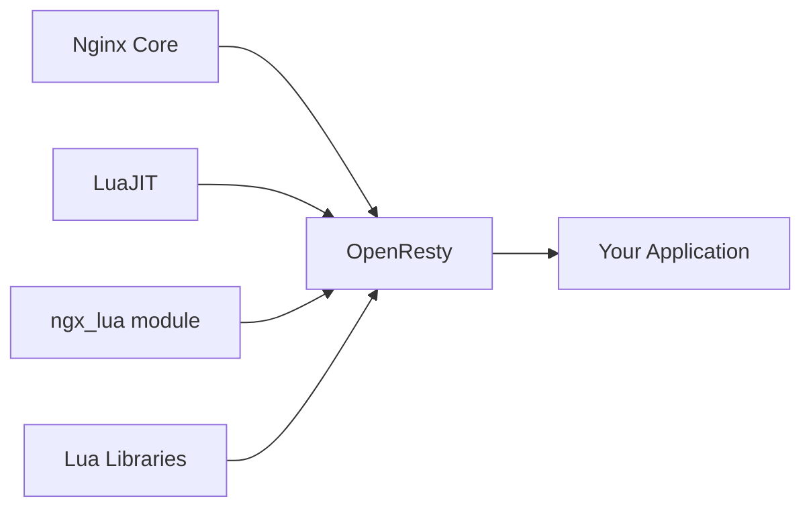

# Nginx Lua Integration

## Introduction

Nginx is renowned for its performance, stability, and extensive feature set as a web server and reverse proxy. While Nginx's static configuration files are powerful, sometimes you need more dynamic functionality. This is where Nginx Lua integration comes in.

Lua integration allows you to embed Lua code directly into your Nginx configuration, enabling dynamic request processing, complex routing logic, and even full web applications—all while maintaining Nginx's exceptional performance characteristics.

In this guide, we'll explore how to extend Nginx with Lua scripting to unlock powerful customizations for your web server.

## Prerequisites

Before diving into Nginx Lua integration, you should have:

- Basic knowledge of Nginx configuration
- Familiarity with programming concepts (functions, variables, conditionals)
- A server with Nginx installed

## Understanding OpenResty

While you can compile Nginx with Lua support manually, the most common approach is to use OpenResty—a distribution of Nginx that comes bundled with Lua support and many useful libraries.

OpenResty extends Nginx by bundling:

- The Lua JIT compiler
- The ngx_lua module
- Various Lua libraries specifically designed for Nginx



## Installation

Let's start by installing OpenResty:

### Ubuntu/Debian

```bash
# Add OpenResty repository
wget -qO - https://openresty.org/package/pubkey.gpg | sudo apt-key add -
sudo apt-get -y install software-properties-common
sudo add-apt-repository -y "deb http://openresty.org/package/ubuntu $(lsb_release -sc) main"
sudo apt-get update
sudo apt-get -y install openresty
```

### CentOS/RHEL

```bash
# Add OpenResty repository
sudo yum install yum-utils
sudo yum-config-manager --add-repo https://openresty.org/package/centos/openresty.repo
sudo yum install openresty
```

### macOS

```bash
brew tap openresty/brew
brew install openresty
```

Once installed, you can verify your installation:

```bash
openresty -v
```

You should see something like:

```
nginx version: openresty/1.19.3.1
```

## Basic Lua Integration

OpenResty provides several directives for embedding Lua code in your Nginx configuration:

- `content_by_lua_block`: Generates response content using Lua
- `access_by_lua_block`: Runs during access phase for authentication/authorization
- `header_filter_by_lua_block`: Modifies response headers
- `body_filter_by_lua_block`: Modifies response body
- `log_by_lua_block`: Runs after request completion, ideal for logging
- `init_by_lua_block`: Runs when Nginx starts

Let's look at a simple example:

```nginx
http {
    server {
        listen 80;
        
        location /hello {
            content_by_lua_block {
                ngx.say("Hello, Lua in Nginx!")
            }
        }
    }
}
```

When you request `/hello`, Nginx will execute the Lua code and return "Hello, Lua in Nginx!".

## The ngx.* API

OpenResty provides the `ngx.*` API for interacting with Nginx functionality:

### Accessing Request Data

```nginx
location /request-info {
    content_by_lua_block {
        ngx.say("URI: ", ngx.var.uri)
        ngx.say("Method: ", ngx.req.get_method())
        ngx.say("User-Agent: ", ngx.req.get_headers()["User-Agent"])
        
        -- Get query parameters
        ngx.req.read_body()  -- Read request body first
        local args, err = ngx.req.get_uri_args()
        
        if args.name then
            ngx.say("Hello, ", args.name, "!")
        else
            ngx.say("Hello, anonymous user!")
        end
    }
}
```

Try accessing: `/request-info?name=YourName`

Output:
```
URI: /request-info
Method: GET
User-Agent: Mozilla/5.0 (Windows NT 10.0; Win64; x64) AppleWebKit/537.36...
Hello, YourName!
```

### HTTP Response Control

```nginx
location /status-code {
    content_by_lua_block {
        local code = ngx.var.arg_code or 200
        
        ngx.status = code
        ngx.header["X-Custom-Header"] = "Custom Value"
        ngx.say("Responding with status code: ", code)
    }
}
```

Try accessing: `/status-code?code=404`

Output (with status code 404):
```
Responding with status code: 404
```

## External Lua Files

For better organization, you can store Lua code in separate files:

Create a file `/etc/openresty/lua/greeter.lua`:

```lua
local _M = {}

function _M.greet(name)
    if name then
        return "Hello, " .. name .. "!"
    else
        return "Hello, anonymous user!"
    end
end

return _M
```

Then in your Nginx configuration:

```nginx
http {
    # Set the search path for Lua modules
    lua_package_path "/etc/openresty/lua/?.lua;;";
    
    server {
        listen 80;
        
        location /greet {
            content_by_lua_block {
                local greeter = require "greeter"
                local name = ngx.var.arg_name
                
                ngx.say(greeter.greet(name))
            }
        }
    }
}
```

Try accessing: `/greet?name=World`

Output:
```
Hello, World!
```

## Practical Example: Simple Authentication

Let's create a simple authentication system using Lua:

Create a file `/etc/openresty/lua/auth.lua`:

```lua
local _M = {}

-- In production, use a database or secure storage
local users = {
    alice = {password = "secret1", role = "admin"},
    bob = {password = "secret2", role = "user"}
}

function _M.authenticate(username, password)
    local user = users[username]
    
    if user and user.password == password then
        return user
    else
        return nil, "Invalid username or password"
    end
end

return _M
```

Now implement authentication in your Nginx config:

```nginx
http {
    lua_package_path "/etc/openresty/lua/?.lua;;";
    
    server {
        listen 80;
        
        # Login endpoint
        location /login {
            content_by_lua_block {
                ngx.req.read_body()
                local args = ngx.req.get_post_args()
                
                if not args.username or not args.password then
                    ngx.status = 400
                    ngx.say("Username and password required")
                    return
                end
                
                local auth = require "auth"
                local user, err = auth.authenticate(args.username, args.password)
                
                if user then
                    -- Set a simple cookie (not secure for production!)
                    ngx.header["Set-Cookie"] = "user=" .. args.username .. "; Path=/"
                    ngx.say("Login successful! Welcome, " .. args.username)
                else
                    ngx.status = 401
                    ngx.say(err)
                end
            }
        }
        
        # Protected area
        location /protected {
            access_by_lua_block {
                local cookie = ngx.var.cookie_user
                
                if not cookie then
                    ngx.status = 401
                    ngx.say("Authentication required")
                    return ngx.exit(ngx.HTTP_OK)
                end
                
                local auth = require "auth"
                local users = {
                    alice = {password = "secret1", role = "admin"},
                    bob = {password = "secret2", role = "user"}
                }
                
                if not users[cookie] then
                    ngx.status = 401
                    ngx.say("Invalid session")
                    return ngx.exit(ngx.HTTP_OK)
                end
            }
            
            content_by_lua_block {
                ngx.say("Welcome to the protected area, ", ngx.var.cookie_user, "!")
            }
        }
    }
}
```

To test this:

1. First login with a POST request:
```bash
curl -X POST "http://localhost/login" -d "username=alice&password=secret1" -c cookies.txt
```

Output:
```
Login successful! Welcome, alice
```

2. Then access the protected area:
```bash
curl -b cookies.txt http://localhost/protected
```

Output:
```
Welcome to the protected area, alice!
```

## Advanced Example: Rate Limiting

Let's implement custom rate limiting using Lua and shared memory:

```nginx
http {
    # Define a shared memory zone for rate limiting
    lua_shared_dict my_limit_req_store 10m;
    
    server {
        listen 80;
        
        location /api {
            access_by_lua_block {
                local limit_req = require "resty.limit.req"
                
                -- Create a new rate limiter: 10 requests per second
                local lim, err = limit_req.new("my_limit_req_store", 10, 10)
                if not lim then
                    ngx.log(ngx.ERR, "failed to create limiter: ", err)
                    return ngx.exit(500)
                end
                
                -- Use the client IP as the key
                local key = ngx.var.remote_addr
                
                -- Check if this request exceeds the limit
                local delay, err = lim:incoming(key, true)
                
                if not delay then
                    if err == "rejected" then
                        return ngx.exit(429)  -- Too Many Requests
                    end
                    ngx.log(ngx.ERR, "failed to limit req: ", err)
                    return ngx.exit(500)
                end
                
                -- Optional: you can actually delay the request if you want
                if delay > 0 then
                    ngx.sleep(delay)
                end
            }
            
            content_by_lua_block {
                ngx.say("API response (rate limited to 10 req/sec)")
            }
        }
    }
}
```

This implementation:
1. Creates a shared memory zone to track request rates
2. Limits requests to 10 per second per IP address
3. Returns 429 Too Many Requests if the limit is exceeded

## Database Interaction

Lua can connect to databases. Let's see a simple Redis example:

```nginx
http {
    lua_package_path "/path/to/lua-resty-redis/lib/?.lua;;";
    
    server {
        listen 80;
        
        location /counter {
            content_by_lua_block {
                local redis = require "resty.redis"
                local red = redis:new()
                
                red:set_timeout(1000) -- 1 second
                
                local ok, err = red:connect("127.0.0.1", 6379)
                if not ok then
                    ngx.say("Failed to connect to Redis: ", err)
                    return
                end
                
                -- Increment a counter
                local count, err = red:incr("page_views")
                if not count then
                    ngx.say("Failed to increment counter: ", err)
                    return
                end
                
                ngx.say("You are visitor number ", count)
                
                -- Put connection back to pool
                local ok, err = red:set_keepalive(10000, 100)
                if not ok then
                    ngx.log(ngx.ERR, "Failed to set keepalive: ", err)
                end
            }
        }
    }
}
```

This example:
1. Connects to a Redis server
2. Increments a counter for each page view
3. Returns the counter value to the visitor

## Performance Considerations

While Lua in Nginx is fast, there are some best practices to follow:

1. **Use connection pooling**: For database connections, use connection pools to avoid the overhead of establishing new connections.

2. **Avoid blocking operations**: Nginx is event-driven; blocking operations will decrease performance.

3. **Use shared memory wisely**: Shared dictionaries are useful but limited in size.

4. **Cache expensive operations**: Use the `lua_shared_dict` to cache results of expensive operations.

Example of caching:

```nginx
lua_shared_dict cache 10m;

location /cached-data {
    content_by_lua_block {
        local cache = ngx.shared.cache
        local data = cache:get("my_data")
        
        if data then
            ngx.say("From cache: ", data)
            return
        end
        
        -- Simulate expensive operation
        ngx.sleep(1)
        data = "This data was expensive to generate: " .. ngx.time()
        
        -- Cache for 60 seconds
        cache:set("my_data", data, 60)
        
        ngx.say("Freshly generated: ", data)
    }
}
```

## Summary

Nginx Lua integration through OpenResty provides a powerful way to extend Nginx's capabilities with dynamic processing:

- **Key Benefits**:
  - Add dynamic processing to a high-performance web server
  - Access Nginx internals through the `ngx.*` API
  - Create sophisticated request handling logic
  - Build complete web applications within Nginx

- **Common Use Cases**:
  - Authentication and authorization
  - Rate limiting and traffic control
  - Content transformation and manipulation
  - API gateways
  - Dynamic configurations

- **Best Practices**:
  - Organize code in separate Lua modules
  - Use connection pooling for databases
  - Avoid blocking operations
  - Cache expensive operations
  - Be mindful of shared memory usage

## Further Resources

To continue learning about Nginx Lua integration:

1. [OpenResty Documentation](https://openresty.org/en/documentation.html)
2. [Lua Nginx Module Wiki](https://github.com/openresty/lua-nginx-module#readme)
3. [OpenResty Best Practices](https://github.com/openresty/lua-nginx-module/blob/master/doc/HttpLuaModule.wiki)
4. [Programming OpenResty](https://www.manning.com/books/programming-openresty) book

## Exercises

1. **Basic:** Create a simple endpoint that returns the current time in different formats based on a query parameter.

2. **Intermediate:** Implement a request logging system that records details about requests to a specific endpoint in a Redis database.

3. **Advanced:** Create a simple API gateway that routes requests to different backend services based on the URL path and adds authentication.

4. **Expert:** Build a complete URL shortener service with Redis for storage and custom rate limiting for creation of new shortened URLs.

By integrating Lua with Nginx, you gain the flexibility of a programming language while maintaining Nginx's performance advantages. This combination is particularly powerful for creating API gateways, custom authentication systems, and specialized web applications.