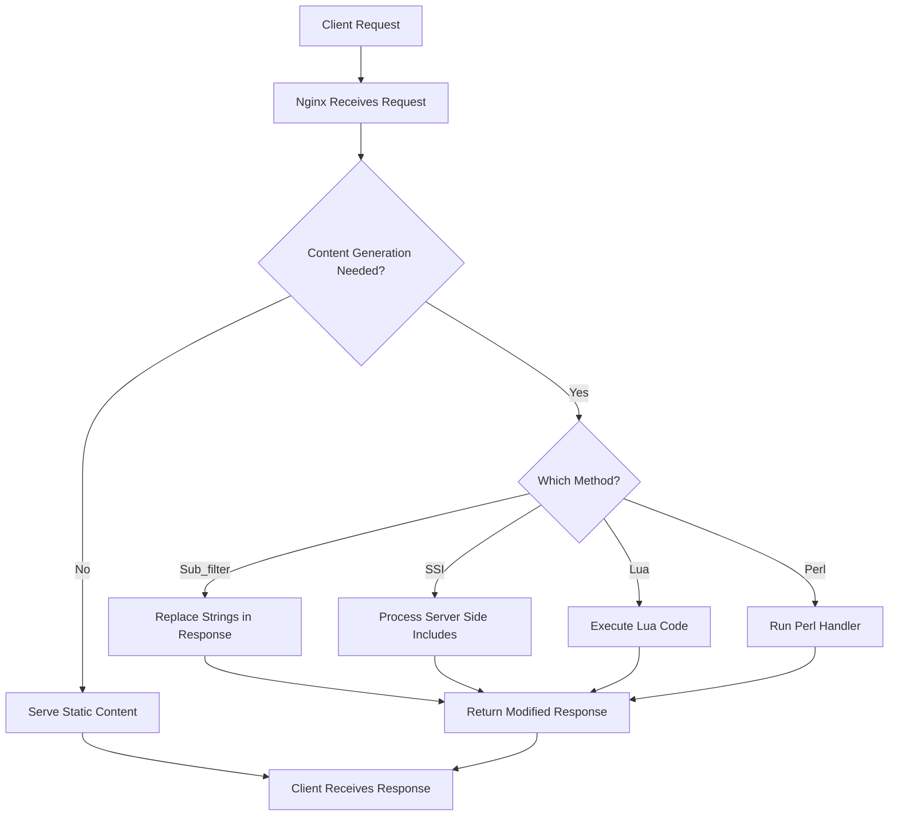

# Nginx Content Generation

## Introduction

When most developers think of Nginx, they think of a fast, efficient web server or reverse proxy. However, Nginx can do much more than just serve static files or forward requests to application servers. With the right modules and configuration, Nginx can actually generate or modify content on-the-fly, reducing the need for external application servers in many scenarios.

In this guide, we'll explore Nginx's content generation capabilities, which allow you to dynamically create or transform responses directly within Nginx. This approach can significantly improve performance by eliminating unnecessary network hops to application servers for certain types of content manipulation.

## Prerequisites

Before diving into Nginx content generation, you should have:

- Basic knowledge of Nginx and its configuration syntax
- Nginx installed on your system (version 1.18.0 or higher recommended)
- Basic understanding of HTTP request/response patterns

## Core Content Generation Features

### 1. Sub_filter Module

The `sub_filter` module allows you to search and replace strings in the response body. This is a simple yet powerful way to modify content without using an external application server.

#### Basic Usage

```nginx
location / {
    sub_filter 'old-text' 'new-text';
    sub_filter_once off; # Replace all occurrences, not just the first one
}
```

#### Example: Adding a Banner to HTML Pages

```nginx
server {
    listen 80;
    server_name example.com;
    
    location / {
        root /var/www/html;
        sub_filter '</body>' '<div class="banner">This site is under maintenance</div></body>';
        sub_filter_once on;
        sub_filter_types text/html; # Only apply to HTML content
    }
}
```

In this example, Nginx will add a banner to all HTML pages served from this location by inserting it just before the closing `</body>` tag.

#### Sub_filter Directives Explained

- `sub_filter`: Specifies the search and replace strings
- `sub_filter_once`: When set to `off`, replaces all occurrences; when set to `on`, replaces only the first occurrence
- `sub_filter_types`: Specifies the MIME types to apply the filter to (default is text/html)

### 2. SSI (Server Side Includes) Module

SSI allows you to include the contents of a file, the result of a command, or the value of a variable in the response.

#### Enabling SSI

```nginx
location / {
    ssi on;
    root /var/www/html;
}
```

#### Example: Including a Common Header

In your HTML file:

```html
<!DOCTYPE html>
<html>
<head>
    <title>My Website</title>
</head>
<body>
    <!--# include file="/includes/header.html" -->
    
    <div class="content">
        Main content here
    </div>
    
    <!--# include file="/includes/footer.html" -->
</body>
</html>
```

The Nginx SSI module will replace the comment-like SSI directives with the content of the specified files before sending the response to the client.

#### SSI Variables and Commands

SSI supports various commands:

```html
<!-- Display the current date -->
<!--# echo var="DATE_LOCAL" -->

<!-- Include the output of a CGI script -->
<!--# include virtual="/cgi-bin/counter.pl" -->

<!-- Conditional inclusion -->
<!--# if expr="$HTTP_USER_AGENT = /MSIE/" -->
    <p>You are using Internet Explorer</p>
<!--# else -->
    <p>You are not using Internet Explorer</p>
<!--# endif -->
```

### 3. Embedded Perl Module

For more complex content generation, Nginx offers the embedded Perl module that allows you to execute Perl code directly within Nginx.

#### Configuration

```nginx
http {
    perl_modules perl/lib;
    perl_require example.pm;
    
    server {
        location /perl {
            perl_handler Example::handler;
        }
    }
}
```

#### Example Perl Module (example.pm)

```perl
package Example;

use strict;
use warnings;

sub handler {
    my $r = shift;
    
    $r->send_http_header("text/html");
    
    my $name = $r->args =~ /name=([^&]*)/ ? $1 : "Guest";
    
    $r->print("Hello, $name! The time is: " . localtime());
    
    return OK;
}

1;
```

With this configuration, a request to `/perl?name=John` would generate a response like:

```
Hello, John! The time is: Fri Oct 15 15:30:45 2023
```

## Advanced Content Generation with Lua

The most powerful content generation capabilities in Nginx come from the Lua module (ngx_lua), which allows you to run Lua code at various phases of the request processing cycle.

### Installing OpenResty (Nginx with Lua)

Instead of adding the Lua module to Nginx, many developers use OpenResty, which is a distribution of Nginx with Lua and many other modules pre-installed.

```bash
# Ubuntu/Debian
sudo apt-get install openresty

# CentOS/RHEL
sudo yum install openresty
```

### Basic Lua Content Handler

```nginx
location /hello {
    content_by_lua_block {
        local name = ngx.var.arg_name or "World"
        ngx.say("Hello, ", name, "!")
    }
}
```

With this configuration, a request to `/hello?name=John` would return:

```
Hello, John!
```

### Generating JSON Content with Lua

```nginx
location /api/stats {
    content_by_lua_block {
        local cjson = require "cjson"
        
        -- Generate some stats data
        local stats = {
            visitors = 12345,
            page_views = 67890,
            bounce_rate = "23.5%",
            avg_time_on_site = "00:03:45"
        }
        
        -- Set content type header
        ngx.header.content_type = "application/json"
        
        -- Output JSON response
        ngx.say(cjson.encode(stats))
    }
}
```

This would generate a JSON response:

```json
{
    "visitors": 12345,
    "page_views": 67890,
    "bounce_rate": "23.5%",
    "avg_time_on_site": "00:03:45"
}
```

### Dynamic HTML Template Rendering with Lua

Using the Lua template engine:

```nginx
location /profile {
    content_by_lua_block {
        local template = require "resty.template"
        
        local user = {
            name = ngx.var.arg_name or "Guest",
            email = ngx.var.arg_email or "guest@example.com",
            role = ngx.var.arg_role or "Visitor"
        }
        
        template.render("profile.html", { user = user })
    }
}
```

With a template file `profile.html`:

```html
<!DOCTYPE html>
<html>
<head>
    <title>User Profile</title>
</head>
<body>
    <h1>Profile for: {{user.name}}</h1>
    <p>Email: {{user.email}}</p>
    <p>Role: {{user.role}}</p>
</body>
</html>
```

## Real-World Applications

### 1. A/B Testing Implementation

```nginx
split_clients "${remote_addr}${http_user_agent}" $variant {
    50%     "A";
    *       "B";
}

server {
    listen 80;
    server_name example.com;
    
    location / {
        root /var/www/html;
        
        if ($variant = "A") {
            sub_filter '</head>' '<link rel="stylesheet" href="/css/variant-a.css"></head>';
        }
        
        if ($variant = "B") {
            sub_filter '</head>' '<link rel="stylesheet" href="/css/variant-b.css"></head>';
        }
        
        sub_filter_once on;
        sub_filter_types text/html;
    }
}
```

This configuration randomly assigns visitors to variant A or B based on their IP address and user agent. Each variant gets a different CSS file, allowing you to test different designs.

### 2. Dynamic Configuration Based on Client Characteristics

```nginx
map $http_user_agent $is_mobile {
    default 0;
    ~*iPhone|Android|Mobile 1;
}

server {
    listen 80;
    server_name example.com;
    
    location / {
        root /var/www/html;
        
        if ($is_mobile = 1) {
            sub_filter '</head>' '<meta name="viewport" content="width=device-width, initial-scale=1.0"></head>';
            sub_filter '</body>' '<script src="/js/mobile-menu.js"></script></body>';
        }
        
        sub_filter_once on;
        sub_filter_types text/html;
    }
}
```

This configuration detects mobile devices and adds mobile-specific meta tags and JavaScript files to the response.

### 3. Edge-Side Includes (ESI) with Lua

ESI is a language for assembling dynamic web pages from different fragments. You can implement basic ESI functionality with Lua:

```nginx
location / {
    content_by_lua_block {
        local res = ngx.location.capture("/main-content")
        local content = res.body
        
        -- Process ESI includes
        content = string.gsub(content, '<esi:include src="([^"]+)"/>', function(src)
            local include_res = ngx.location.capture(src)
            return include_res.body
        end)
        
        ngx.print(content)
    }
}

location /main-content {
    internal;
    proxy_pass http://backend;
}

location /fragments/header {
    internal;
    return 200 "<header>Website Header</header>";
}

location /fragments/footer {
    internal;
    return 200 "<footer>Copyright 2023</footer>";
}
```

With this setup, if your backend returns content with `<esi:include src="/fragments/header"/>`, it will be replaced with the actual header content before the response is sent to the client.

## Workflow Diagram



## Performance Considerations

When implementing content generation in Nginx, keep the following performance considerations in mind:

1. **Resource Usage**: Lua and Perl handlers consume additional CPU and memory resources. Monitor your server's resource usage.

2. **Caching**: For content that doesn't need to be generated on every request, use Nginx's caching capabilities:

```nginx
proxy_cache_path /var/cache/nginx levels=1:2 keys_zone=content_cache:10m max_size=1g;

server {
    location / {
        proxy_cache content_cache;
        proxy_cache_valid 200 302 10m;
        proxy_cache_valid 404 1m;
        
        content_by_lua_block {
            -- Your content generation code here
        }
    }
}
```

3. **Minimize External Calls**: When using Lua, try to minimize subrequests (`ngx.location.capture`) where possible, as each adds latency.

4. **Benchmark**: Always benchmark your content generation setup against a traditional application server setup to ensure you're actually gaining performance.

## Summary

Nginx content generation provides powerful tools for modifying responses or creating dynamic content directly within the web server layer. This can significantly improve performance by reducing unnecessary round-trips to application servers.

The main approaches we've covered include:

- Using `sub_filter` for simple string replacements
- Server Side Includes (SSI) for including file contents
- Embedded Perl for server-side scripting
- Lua integration for advanced content generation and manipulation

By leveraging these features, you can offload many tasks from your application servers to Nginx, resulting in faster response times and reduced server load.

## Exercises

1. Configure Nginx to add a custom header and footer to all HTML pages using `sub_filter`.
2. Create a simple visitor counter using Lua that persists counts in a shared dictionary.
3. Implement a basic template system using SSI that includes different components based on the URL path.
4. Build a simple API endpoint using Lua that returns server statistics in JSON format.
5. Create an A/B testing setup that serves different content to users based on a cookie value.

## Additional Resources

- [Nginx Documentation](https://nginx.org/en/docs/)
- [OpenResty Documentation](https://openresty.org/en/)
- [Lua NgxLua Module Documentation](https://github.com/openresty/lua-nginx-module)
- [Nginx Sub Filter Module](https://nginx.org/en/docs/http/ngx_http_sub_module.html)
- [Nginx SSI Module](https://nginx.org/en/docs/http/ngx_http_ssi_module.html)