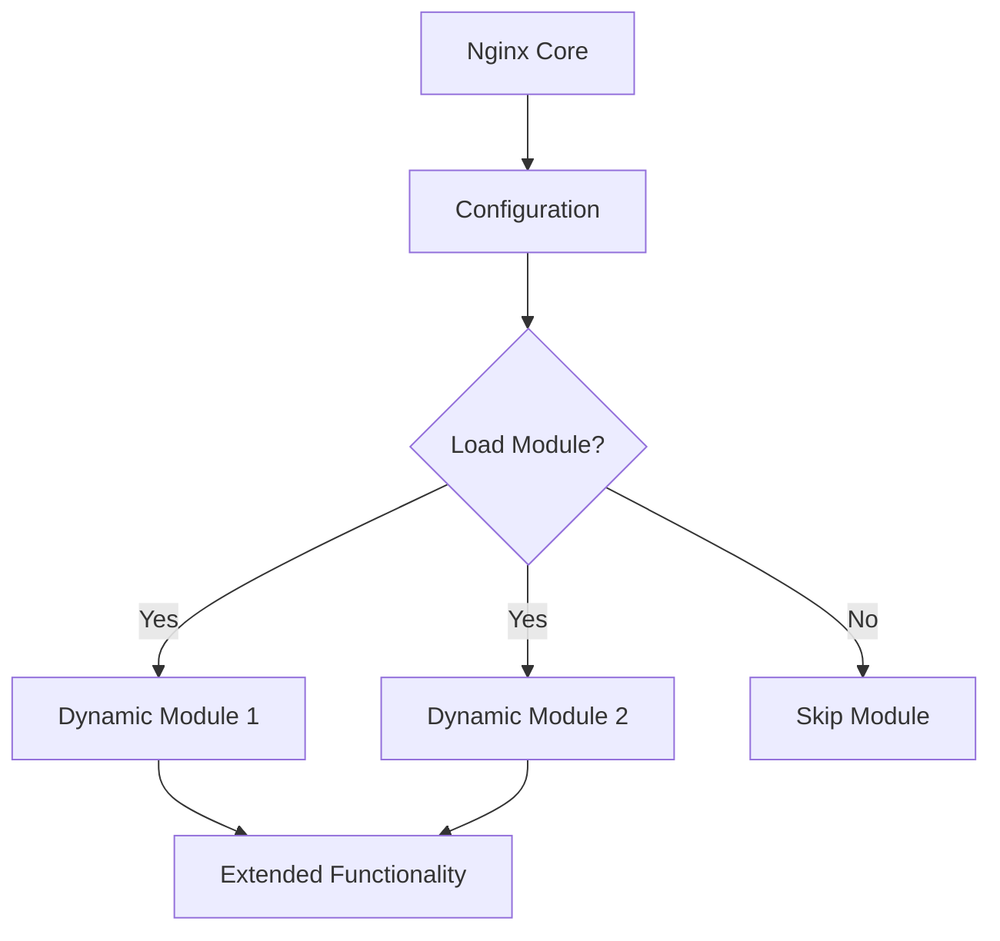

# Nginx Dynamic Modules

## Introduction

Nginx is a powerful, high-performance web server and reverse proxy that's known for its efficiency and flexibility. One of the features that makes Nginx so versatile is its modular architecture. Traditionally, Nginx modules were compiled statically into the main binary. However, since version 1.9.11, Nginx introduced **dynamic modules** - a game-changing feature that allows you to load and unload modules without recompiling the entire Nginx server.

Dynamic modules provide several advantages:

- They allow you to extend Nginx functionality on-demand
- You can update modules independently from the core Nginx
- They help keep the base Nginx installation lightweight
- They make it easier to manage third-party modules

In this guide, we'll explore how dynamic modules work in Nginx, how to use them, and even how to create your own custom modules.

## Understanding Dynamic Modules

### What Are Dynamic Modules?

Dynamic modules are shared libraries (`.so` files on Linux/Unix systems) that Nginx can load at runtime. They contain additional functionality that can be added to or removed from Nginx without rebuilding the entire application.

Here's how dynamic modules work in Nginx:



### Types of Nginx Modules

Nginx modules generally fall into these categories:

1. **Core modules** - Built into Nginx and cannot be disabled
2. **Standard modules** - Included with Nginx but can be disabled during compilation
3. **Third-party modules** - Created by the community to add extra functionality
4. **Custom modules** - Modules you develop yourself for specific requirements

Dynamic loading is available for standard, third-party, and custom modules.

## Working with Dynamic Modules

### Checking Available Modules

First, let's check what modules are available and loaded in your Nginx installation:

```bash
# Check Nginx compilation options including modules
nginx -V
```

Output example:

```
nginx version: nginx/1.22.1
built by gcc 11.3.0 (Ubuntu 11.3.0-1ubuntu1~22.04)
built with OpenSSL 3.0.2 15 Mar 2022
TLS SNI support enabled
configure arguments: --prefix=/etc/nginx --with-http_ssl_module --with-http_v2_module --with-http_realip_module --with-http_addition_module --with-http_sub_module --with-http_dav_module --with-http_flv_module --with-http_mp4_module --with-http_gunzip_module --with-http_gzip_static_module --with-http_random_index_module --with-http_secure_link_module --with-http_stub_status_module --with-http_auth_request_module --with-threads --with-stream --with-stream_ssl_module --with-stream_ssl_preread_module --with-stream_realip_module --with-http_slice_module --with-mail --with-mail_ssl_module --with-compat --with-file-aio --with-http_v3_module --add-dynamic-module=src/http_geoip2_module
```

### Loading a Dynamic Module

To use a dynamic module, you need to:

1. Install or build the module
2. Add a `load_module` directive in your Nginx configuration

Here's how to load a module in your Nginx configuration file:

```nginx
# In the main context (outside of http, server, or location blocks)
load_module modules/ngx_http_image_filter_module.so;

http {
    # Module-specific directives go here
    # ...
}
```

The `load_module` directive must appear before any directives from the module are used in the configuration file.

### Common Dynamic Modules

Let's look at some commonly used dynamic modules:

#### 1. HTTP Image Filter Module

This module allows Nginx to transform images on-the-fly.

```nginx
load_module modules/ngx_http_image_filter_module.so;

http {
    server {
        location /images/ {
            image_filter resize 200 200;
            image_filter_jpeg_quality 95;
            image_filter_buffer 10M;
        }
    }
}
```

With this configuration, any image accessed via the `/images/` location will be resized to 200x200 pixels.

#### 2. GeoIP2 Module

The GeoIP2 module allows Nginx to determine a visitor's geographical location based on their IP address.

```nginx
load_module modules/ngx_http_geoip2_module.so;

http {
    geoip2 /path/to/GeoLite2-Country.mmdb {
        auto_reload 5m;
        $geoip2_data_country_code country iso_code;
        $geoip2_data_country_name country names en;
    }

    server {
        location / {
            if ($geoip2_data_country_code = "US") {
                return 307 https://us.example.com$request_uri;
            }
        }
    }
}
```

This configuration redirects users from the United States to a country-specific site.

## Installing Dynamic Modules

### Using Package Managers

Many Linux distributions provide Nginx modules as separate packages:

```bash
# On Ubuntu/Debian
sudo apt update
sudo apt install nginx-module-geoip

# On CentOS/RHEL
sudo yum install nginx-module-geoip
```

### Building Modules from Source

For modules not available in package repositories, you can build them from source:

1. First, get the Nginx source code matching your installed version:

```bash
# Check your Nginx version
nginx -v
# Example output: nginx version: nginx/1.22.1

# Download matching source
wget https://nginx.org/download/nginx-1.22.1.tar.gz
tar -xzf nginx-1.22.1.tar.gz
cd nginx-1.22.1
```

2. Get the module source code:

```bash
git clone https://github.com/example/nginx-module.git
```

3. Configure and build the module:

```bash
# Get your current Nginx configuration
nginx -V
# Copy all the configure arguments from the output

./configure --add-dynamic-module=../nginx-module [other configure arguments]
make modules
```

4. Copy the resulting `.so` file to the Nginx modules directory:

```bash
sudo cp objs/ngx_http_example_module.so /etc/nginx/modules/
```

## Creating Your Own Dynamic Module

Let's create a simple "hello world" module to understand the basics of module development.

### Module Structure

A basic Nginx module needs these components:

1. Configuration structures
2. Module directives
3. Handler functions
4. Module definition

Here's a simple example:

```c
// ngx_http_hello_world_module.c

#include <ngx_config.h>
#include <ngx_core.h>
#include <ngx_http.h>

// Configuration structure
typedef struct {
    ngx_str_t message;
} ngx_http_hello_world_loc_conf_t;

// Function prototypes
static char *ngx_http_hello_world(ngx_conf_t *cf, ngx_command_t *cmd, void *conf);
static void *ngx_http_hello_world_create_loc_conf(ngx_conf_t *cf);
static char *ngx_http_hello_world_merge_loc_conf(ngx_conf_t *cf, void *parent, void *child);
static ngx_int_t ngx_http_hello_world_handler(ngx_http_request_t *r);

// Module directives
static ngx_command_t ngx_http_hello_world_commands[] = {
    {
        ngx_string("hello_world"),
        NGX_HTTP_LOC_CONF|NGX_CONF_TAKE1,
        ngx_http_hello_world,
        NGX_HTTP_LOC_CONF_OFFSET,
        offsetof(ngx_http_hello_world_loc_conf_t, message),
        NULL
    },
    ngx_null_command
};

// Module context
static ngx_http_module_t ngx_http_hello_world_module_ctx = {
    NULL,                                  /* preconfiguration */
    NULL,                                  /* postconfiguration */
    NULL,                                  /* create main configuration */
    NULL,                                  /* init main configuration */
    NULL,                                  /* create server configuration */
    NULL,                                  /* merge server configuration */
    ngx_http_hello_world_create_loc_conf,  /* create location configuration */
    ngx_http_hello_world_merge_loc_conf    /* merge location configuration */
};

// Module definition
ngx_module_t ngx_http_hello_world_module = {
    NGX_MODULE_V1,
    &ngx_http_hello_world_module_ctx,     /* module context */
    ngx_http_hello_world_commands,        /* module directives */
    NGX_HTTP_MODULE,                      /* module type */
    NULL,                                 /* init master */
    NULL,                                 /* init module */
    NULL,                                 /* init process */
    NULL,                                 /* init thread */
    NULL,                                 /* exit thread */
    NULL,                                 /* exit process */
    NULL,                                 /* exit master */
    NGX_MODULE_V1_PADDING
};

// Create location configuration
static void *ngx_http_hello_world_create_loc_conf(ngx_conf_t *cf) {
    ngx_http_hello_world_loc_conf_t *conf;

    conf = ngx_pcalloc(cf->pool, sizeof(ngx_http_hello_world_loc_conf_t));
    if (conf == NULL) {
        return NULL;
    }

    return conf;
}

// Merge location configuration
static char *ngx_http_hello_world_merge_loc_conf(ngx_conf_t *cf, void *parent, void *child) {
    ngx_http_hello_world_loc_conf_t *prev = parent;
    ngx_http_hello_world_loc_conf_t *conf = child;

    ngx_conf_merge_str_value(conf->message, prev->message, "Hello, World!");

    return NGX_CONF_OK;
}

// Process hello_world directive
static char *ngx_http_hello_world(ngx_conf_t *cf, ngx_command_t *cmd, void *conf) {
    ngx_http_core_loc_conf_t *clcf;

    clcf = ngx_http_conf_get_module_loc_conf(cf, ngx_http_core_module);
    clcf->handler = ngx_http_hello_world_handler;

    return ngx_conf_set_str_slot(cf, cmd, conf);
}

// Request handler
static ngx_int_t ngx_http_hello_world_handler(ngx_http_request_t *r) {
    ngx_int_t rc;
    ngx_buf_t *b;
    ngx_chain_t out;
    ngx_http_hello_world_loc_conf_t *hlcf;

    hlcf = ngx_http_get_module_loc_conf(r, ngx_http_hello_world_module);

    // Set content type and status
    r->headers_out.content_type.len = sizeof("text/plain") - 1;
    r->headers_out.content_type.data = (u_char *) "text/plain";
    r->headers_out.status = NGX_HTTP_OK;
    r->headers_out.content_length_n = hlcf->message.len;

    // Send headers
    rc = ngx_http_send_header(r);
    if (rc == NGX_ERROR || rc > NGX_OK || r->header_only) {
        return rc;
    }

    // Create buffer and chain
    b = ngx_create_temp_buf(r->pool, hlcf->message.len);
    if (b == NULL) {
        return NGX_HTTP_INTERNAL_SERVER_ERROR;
    }

    ngx_memcpy(b->pos, hlcf->message.data, hlcf->message.len);
    b->last = b->pos + hlcf->message.len;
    b->last_buf = 1;

    out.buf = b;
    out.next = NULL;

    // Send response body
    return ngx_http_output_filter(r, &out);
}
```

### Build Configuration

Create a `config` file for building the module:

```bash
# config file for ngx_http_hello_world_module

ngx_addon_name=ngx_http_hello_world_module

if test -n "$ngx_module_link"; then
    ngx_module_type=HTTP
    ngx_module_name=ngx_http_hello_world_module
    ngx_module_srcs="$ngx_addon_dir/ngx_http_hello_world_module.c"

    . auto/module
else
    HTTP_MODULES="$HTTP_MODULES ngx_http_hello_world_module"
    NGX_ADDON_SRCS="$NGX_ADDON_SRCS $ngx_addon_dir/ngx_http_hello_world_module.c"
fi
```

### Building the Module

Build your module using the Nginx source:

```bash
# Download matching Nginx source
wget https://nginx.org/download/nginx-1.22.1.tar.gz
tar -xzf nginx-1.22.1.tar.gz
cd nginx-1.22.1

# Configure and build
./configure --with-compat --add-dynamic-module=../hello_world_module
make modules
```

### Using Your Custom Module

Copy the module to your Nginx modules directory:

```bash
sudo cp objs/ngx_http_hello_world_module.so /etc/nginx/modules/
```

Update your Nginx configuration:

```nginx
load_module modules/ngx_http_hello_world_module.so;

http {
    server {
        location /hello {
            hello_world "Hello from my custom module!";
        }
    }
}
```

Test the configuration and restart Nginx:

```bash
sudo nginx -t
sudo systemctl restart nginx
```

Now, when you access `http://your-server/hello`, you should see:

```
Hello from my custom module!
```

## Debugging Dynamic Modules

When working with dynamic modules, you might encounter issues. Here are some debugging tips:

### Check Module Loading

Use error logs to verify modules are loading properly:

```nginx
# Enable debug logging
error_log /var/log/nginx/error.log debug;
```

### Common Issues and Solutions

1. **Module not found error**:
```
nginx: [emerg] dlopen() "/etc/nginx/modules/ngx_http_example_module.so" failed
   ```
- Ensure the module path is correct
- Check file permissions
- Verify the module is compatible with your Nginx version

2. **Symbol not found**:
```
nginx: [emerg] dlopen() failed: undefined symbol: ngx_module_name
   ```
- This usually means the module was built against a different Nginx version
- Rebuild the module with the matching Nginx source

3. **Configuration directive unknown**:
```
nginx: [emerg] unknown directive "module_directive"
   ```
- Ensure the `load_module` directive appears before any module-specific directives
- Verify the module is loading correctly

## Best Practices

When working with Nginx dynamic modules, follow these best practices:

1. **Use official modules when possible** - They're well-tested and maintained
2. **Keep modules updated** - Security vulnerabilities can exist in modules
3. **Load only what you need**