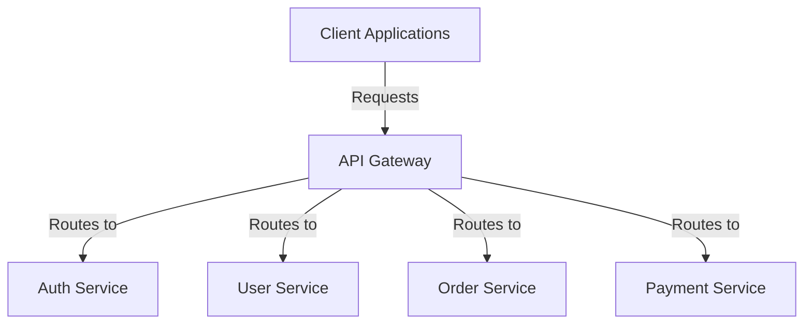
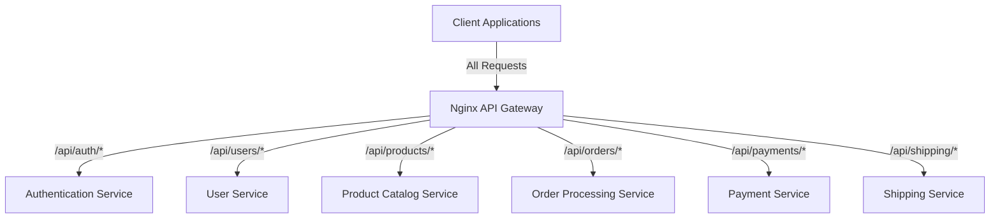

# Nginx API Gateway

## Introduction

An API Gateway serves as the single entry point for client requests in a microservices architecture. It routes requests to appropriate services, handles cross-cutting concerns like authentication, and can transform requests and responses. Nginx, with its powerful reverse proxy capabilities, makes an excellent API Gateway solution.

In this tutorial, we'll explore how to configure Nginx as an API Gateway, examining its benefits, core features, and practical implementations that you can apply to your own projects.

## What is an API Gateway?

Before diving into Nginx-specific configurations, let's understand what an API Gateway does:



An API Gateway handles:

- **Routing**: Directing requests to appropriate microservices
- **Load Balancing**: Distributing traffic across service instances
- **Authentication/Authorization**: Securing access to your APIs
- **Rate Limiting**: Protecting services from overuse
- **Request/Response Transformation**: Modifying data as needed
- **Monitoring**: Tracking performance and usage metrics
- **Caching**: Storing responses to improve performance

## Benefits of Using Nginx as an API Gateway

Nginx offers several advantages as an API Gateway:

- **Performance**: Designed for high concurrency with minimal resource usage
- **Reliability**: Battle-tested in production across countless websites
- **Flexibility**: Highly configurable with support for complex routing patterns
- **Ecosystem**: Rich ecosystem of modules and extensions
- **Community**: Strong community support and extensive documentation

## Basic Nginx API Gateway Configuration

Let's start with a simple API Gateway setup that routes requests to different backend services based on URL paths.

First, create a basic Nginx configuration file:

```nginx
http {
    # Define upstream servers (your microservices)
    upstream auth_service {
        server auth-service:8000;
    }
    
    upstream user_service {
        server user-service:8001;
    }
    
    upstream order_service {
        server order-service:8002;
    }
    
    # API Gateway server configuration
    server {
        listen 80;
        server_name api.example.com;
        
        # Authentication service endpoints
        location /api/auth {
            proxy_pass http://auth_service;
            proxy_set_header Host $host;
            proxy_set_header X-Real-IP $remote_addr;
        }
        
        # User service endpoints
        location /api/users {
            proxy_pass http://user_service;
            proxy_set_header Host $host;
            proxy_set_header X-Real-IP $remote_addr;
        }
        
        # Order service endpoints
        location /api/orders {
            proxy_pass http://order_service;
            proxy_set_header Host $host;
            proxy_set_header X-Real-IP $remote_addr;
        }
    }
}
```

This configuration:
1. Defines three microservices as "upstream" servers
2. Creates a server block that listens on port 80
3. Sets up location blocks to route requests to different services based on the URL path

## Adding Authentication

A key function of an API Gateway is to centralize authentication. Let's enhance our configuration to validate JWT tokens:

```nginx
# Requires the nginx-jwt-module
# https://github.com/TeslaGov/ngx-http-auth-jwt-module

http {
    # Previous upstream definitions here...
    
    server {
        listen 80;
        server_name api.example.com;
        
        # JWT validation settings
        auth_jwt_key "your-secret-key";
        auth_jwt_enabled on;
        
        # Public endpoints (no auth required)
        location /api/auth/login {
            auth_jwt_enabled off;
            proxy_pass http://auth_service;
            proxy_set_header Host $host;
            proxy_set_header X-Real-IP $remote_addr;
        }
        
        # Protected endpoints
        location /api/users {
            auth_jwt_enabled on;
            proxy_pass http://user_service;
            proxy_set_header Host $host;
            proxy_set_header X-Real-IP $remote_addr;
            proxy_set_header X-User-ID $jwt_claim_sub;
        }
        
        # More protected endpoints...
    }
}
```

This configuration:
1. Enables JWT validation for all routes by default
2. Disables authentication for the login endpoint
3. Passes user information to backend services through custom headers

## Implementing Rate Limiting

To protect your services from abuse, add rate limiting:

```nginx
http {
    # Previous definitions here...
    
    # Define rate limiting zones
    limit_req_zone $binary_remote_addr zone=api_limit:10m rate=5r/s;
    
    server {
        listen 80;
        server_name api.example.com;
        
        # Apply rate limiting to all API endpoints
        location /api/ {
            limit_req zone=api_limit burst=10 nodelay;
            
            # Other configurations...
        }
        
        # Service-specific endpoints with rate limits
        location /api/orders {
            limit_req zone=api_limit burst=5 nodelay;
            proxy_pass http://order_service;
            proxy_set_header Host $host;
            proxy_set_header X-Real-IP $remote_addr;
        }
    }
}
```

This configuration:
1. Creates a rate limiting zone that allows 5 requests per second
2. Applies a general rate limit to all API endpoints
3. Applies a more restrictive rate limit to the orders endpoint

## Request and Response Transformation

An API Gateway often needs to modify requests or responses. With the `ngx_http_sub_module`, you can perform simple text substitutions:

```nginx
http {
    # Previous definitions here...
    
    server {
        listen 80;
        server_name api.example.com;
        
        # Transform responses from the user service
        location /api/users {
            proxy_pass http://user_service;
            
            # Replace sensitive field names in responses
            sub_filter "\"ssn\":" "\"socialId\":";
            sub_filter "\"home_address\":" "\"address\":";
            sub_filter_once off;
            sub_filter_types application/json;
            
            # Headers
            proxy_set_header Host $host;
            proxy_set_header X-Real-IP $remote_addr;
        }
    }
}
```

For more complex transformations, you'll need to use Lua with the OpenResty platform or other Nginx modules.

## Load Balancing

When you have multiple instances of each service, load balancing becomes essential:

```nginx
http {
    # Define upstream servers with load balancing
    upstream auth_service {
        server auth-service-1:8000 weight=3;
        server auth-service-2:8000 weight=2;
        server auth-service-3:8000 weight=1;
        
        # Use least connections balancing algorithm
        least_conn;
    }
    
    upstream user_service {
        server user-service-1:8001;
        server user-service-2:8001;
        server user-service-3:8001;
        
        # Health checks
        health_check interval=10 fails=3 passes=2;
    }
    
    # Server configuration
    server {
        # Location blocks...
    }
}
```

This configuration:
1. Defines multiple instances for each service
2. Applies weighted distribution to the auth service
3. Uses the "least connections" algorithm for the auth service
4. Configures health checks for the user service

## API Versioning Support

Supporting multiple API versions is a common requirement:

```nginx
http {
    # Previous upstream definitions here...
    
    server {
        listen 80;
        server_name api.example.com;
        
        # Version 1 endpoints
        location ~ ^/api/v1/users {
            proxy_pass http://user_service_v1;
            proxy_set_header Host $host;
        }
        
        # Version 2 endpoints
        location ~ ^/api/v2/users {
            proxy_pass http://user_service_v2;
            proxy_set_header Host $host;
        }
        
        # Header-based versioning (alternative approach)
        location /api/users {
            if ($http_api_version = "1") {
                proxy_pass http://user_service_v1;
            }
            
            if ($http_api_version = "2") {
                proxy_pass http://user_service_v2;
            }
            
            # Default to latest version
            proxy_pass http://user_service_v2;
            proxy_set_header Host $host;
        }
    }
}
```

## Request Logging and Monitoring

Adding logging capabilities helps with debugging and monitoring:

```nginx
http {
    # Log format definition
    log_format api_gateway_log '$remote_addr - $remote_user [$time_local] '
                               '"$request" $status $body_bytes_sent '
                               '"$http_referer" "$http_user_agent" '
                               '$request_time $upstream_response_time $pipe';
    
    server {
        listen 80;
        server_name api.example.com;
        
        # Enable logging
        access_log /var/log/nginx/api_access.log api_gateway_log;
        error_log /var/log/nginx/api_error.log warn;
        
        # Add request ID for tracking
        add_header X-Request-ID $request_id;
        
        # Location blocks...
    }
}
```

## CORS Configuration

For web applications, Cross-Origin Resource Sharing (CORS) configuration is crucial:

```nginx
http {
    # Previous definitions here...
    
    server {
        listen 80;
        server_name api.example.com;
        
        # CORS settings
        add_header 'Access-Control-Allow-Origin' 'https://your-frontend-app.com' always;
        add_header 'Access-Control-Allow-Methods' 'GET, POST, OPTIONS, PUT, DELETE, PATCH' always;
        add_header 'Access-Control-Allow-Headers' 'DNT,User-Agent,X-Requested-With,If-Modified-Since,Cache-Control,Content-Type,Range,Authorization' always;
        add_header 'Access-Control-Expose-Headers' 'Content-Length,Content-Range' always;
        
        # Preflight requests
        if ($request_method = 'OPTIONS') {
            add_header 'Access-Control-Max-Age' 1728000;
            add_header 'Content-Type' 'text/plain; charset=utf-8';
            add_header 'Content-Length' 0;
            return 204;
        }
        
        # Location blocks...
    }
}
```

## Caching Responses

Implement caching to improve performance:

```nginx
http {
    # Cache definition
    proxy_cache_path /var/cache/nginx levels=1:2 keys_zone=api_cache:10m inactive=60m;
    
    server {
        listen 80;
        server_name api.example.com;
        
        # Cache read-only endpoints
        location /api/products {
            proxy_cache api_cache;
            proxy_cache_valid 200 302 10m;
            proxy_cache_valid 404 1m;
            proxy_cache_key $scheme$host$request_uri;
            
            proxy_pass http://product_service;
            proxy_set_header Host $host;
            
            # Add cache status header
            add_header X-Cache-Status $upstream_cache_status;
        }
        
        # Don't cache mutating endpoints
        location ~ ^/api/(users|orders) {
            proxy_no_cache 1;
            proxy_cache_bypass 1;
            
            proxy_pass http://backend_service;
            proxy_set_header Host $host;
        }
    }
}
```

## Complete Example Configuration

Let's put everything together in a comprehensive example:

```nginx
user nginx;
worker_processes auto;
error_log /var/log/nginx/error.log warn;
pid /var/run/nginx.pid;

events {
    worker_connections 4096;
}

http {
    include /etc/nginx/mime.types;
    default_type application/octet-stream;
    
    # Logging settings
    log_format api_gateway_log '$remote_addr - $remote_user [$time_local] '
                              '"$request" $status $body_bytes_sent '
                              '"$http_referer" "$http_user_agent" '
                              '$request_time $upstream_response_time $request_id';
    
    access_log /var/log/nginx/access.log api_gateway_log;
    
    # Timeouts
    send_timeout 10;
    keepalive_timeout 65;
    
    # Caching settings
    proxy_cache_path /var/cache/nginx levels=1:2 keys_zone=api_cache:10m inactive=60m;
    
    # Rate limiting settings
    limit_req_zone $binary_remote_addr zone=api_limit:10m rate=10r/s;
    
    # Upstream servers
    upstream auth_service {
        server auth-service-1:8000;
        server auth-service-2:8000 backup;
        keepalive 32;
    }
    
    upstream user_service {
        server user-service-1:8001;
        server user-service-2:8001;
        least_conn;
        keepalive 32;
    }
    
    upstream product_service {
        server product-service-1:8002;
        server product-service-2:8002;
        keepalive 32;
    }
    
    upstream order_service {
        server order-service-1:8003;
        server order-service-2:8003;
        keepalive 32;
    }
    
    # API Gateway server
    server {
        listen 80;
        server_name api.example.com;
        
        # HTTPS redirect
        return 301 https://$host$request_uri;
    }
    
    server {
        listen 443 ssl http2;
        server_name api.example.com;
        
        # SSL configuration
        ssl_certificate /etc/nginx/ssl/api.example.com.crt;
        ssl_certificate_key /etc/nginx/ssl/api.example.com.key;
        ssl_protocols TLSv1.2 TLSv1.3;
        ssl_ciphers HIGH:!aNULL:!MD5;
        
        # CORS headers
        add_header 'Access-Control-Allow-Origin' 'https://app.example.com' always;
        add_header 'Access-Control-Allow-Methods' 'GET, POST, OPTIONS, PUT, DELETE' always;
        add_header 'Access-Control-Allow-Headers' 'DNT,User-Agent,X-Requested-With,If-Modified-Since,Cache-Control,Content-Type,Range,Authorization' always;
        
        # Preflight requests
        if ($request_method = 'OPTIONS') {
            add_header 'Access-Control-Max-Age' 1728000;
            add_header 'Content-Type' 'text/plain; charset=utf-8';
            add_header 'Content-Length' 0;
            return 204;
        }
        
        # Request tracking
        add_header X-Request-ID $request_id always;
        
        # Authentication service endpoints
        location /api/auth {
            # No rate limit for authentication
            proxy_pass http://auth_service;
            proxy_set_header Host $host;
            proxy_set_header X-Real-IP $remote_addr;
            proxy_set_header X-Forwarded-For $proxy_add_x_forwarded_for;
            proxy_set_header X-Forwarded-Proto $scheme;
            
            # No caching for auth
            proxy_no_cache 1;
            proxy_cache_bypass 1;
        }
        
        # User service endpoints (with rate limiting)
        location /api/users {
            limit_req zone=api_limit burst=5 nodelay;
            
            proxy_pass http://user_service;
            proxy_set_header Host $host;
            proxy_set_header X-Real-IP $remote_addr;
            proxy_set_header X-Forwarded-For $proxy_add_x_forwarded_for;
            proxy_set_header X-Forwarded-Proto $scheme;
            
            # Auth header passes through
            proxy_set_header Authorization $http_authorization;
        }
        
        # Product service endpoints (with caching)
        location /api/products {
            limit_req zone=api_limit burst=10 nodelay;
            
            proxy_cache api_cache;
            proxy_cache_valid 200 5m;
            proxy_cache_methods GET HEAD;
            proxy_cache_key $scheme$host$request_uri;
            add_header X-Cache-Status $upstream_cache_status;
            
            proxy_pass http://product_service;
            proxy_set_header Host $host;
            proxy_set_header X-Real-IP $remote_addr;
            proxy_set_header X-Forwarded-For $proxy_add_x_forwarded_for;
            proxy_set_header X-Forwarded-Proto $scheme;
        }
        
        # Order service endpoints 
        location /api/orders {
            limit_req zone=api_limit burst=5 nodelay;
            
            proxy_pass http://order_service;
            proxy_set_header Host $host;
            proxy_set_header X-Real-IP $remote_addr;
            proxy_set_header X-Forwarded-For $proxy_add_x_forwarded_for;
            proxy_set_header X-Forwarded-Proto $scheme;
            
            # No caching for orders
            proxy_no_cache 1;
            proxy_cache_bypass 1;
        }
        
        # Health check endpoint
        location /health {
            access_log off;
            return 200 "API Gateway Operational
";
        }
        
        # Default response for undefined endpoints
        location / {
            return 404;
        }
    }
}
```

## Deploying Your Nginx API Gateway

You can deploy the Nginx API Gateway using Docker for easy setup:

```dockerfile
FROM nginx:latest

# Copy configuration
COPY nginx.conf /etc/nginx/nginx.conf

# Create cache directory
RUN mkdir -p /var/cache/nginx

# Expose ports
EXPOSE 80 443

# Start Nginx
CMD ["nginx", "-g", "daemon off;"]
```

Run this with:

```bash
docker build -t nginx-api-gateway .
docker run -p 80:80 -p 443:443 -v /path/to/ssl:/etc/nginx/ssl nginx-api-gateway
```

## Real-World Scenario: E-commerce API Gateway

Let's examine a real-world example for an e-commerce platform:



In this e-commerce setup:

1. The Product Catalog endpoints can be heavily cached
2. Order and Payment endpoints need stronger rate limiting
3. All endpoints except authentication require JWT validation
4. Payment endpoints need additional security headers

Here's how the configuration might look:

```nginx
# Abbreviated example focusing on key aspects

server {
    listen 443 ssl http2;
    server_name api.ecommerce-example.com;
    
    # SSL and other common configurations...
    
    # Products - heavy caching, high burst
    location /api/products {
        limit_req zone=api_limit burst=20 nodelay;
        
        # Aggressive caching for catalog
        proxy_cache product_cache;
        proxy_cache_valid 200 10m;
        proxy_cache_methods GET HEAD;
        proxy_cache_bypass $http_cache_control;
        add_header X-Cache-Status $upstream_cache_status;
        
        proxy_pass http://product_service;
        # Headers...
    }
    
    # Orders - no cache, moderate limits
    location /api/orders {
        limit_req zone=api_limit burst=5 nodelay;
        
        # JWT validation
        auth_jwt_enabled on;
        
        # No caching
        proxy_no_cache 1;
        proxy_cache_bypass 1;
        
        proxy_pass http://order_service;
        # Headers...
    }
    
    # Payments - strict limits, extra security
    location /api/payments {
        limit_req zone=payment_limit burst=3 nodelay;
        
        # Additional security headers
        add_header Strict-Transport-Security "max-age=31536000; includeSubDomains" always;
        add_header X-Content-Type-Options "nosniff" always;
        add_header X-Frame-Options "DENY" always;
        
        # JWT validation
        auth_jwt_enabled on;
        
        # No caching whatsoever
        proxy_no_cache 1;
        proxy_cache_bypass 1;
        
        proxy_pass http://payment_service;
        # Headers...
    }
}
```

## Common Challenges and Solutions

### Handling WebSockets

To proxy WebSocket connections:

```nginx
location /api/notifications {
    proxy_pass http://notification_service;
    proxy_http_version 1.1;
    proxy_set_header Upgrade $http_upgrade;
    proxy_set_header Connection "upgrade";
    proxy_set_header Host $host;
}
```

### Large File Uploads

For handling large file uploads:

```nginx
location /api/uploads {
    client_max_body_size 100M;
    proxy_request_buffering off;
    proxy_pass http://upload_service;
    # Other headers...
}
```

### Timeout Management

Managing timeouts appropriately:

```nginx
location /api/reports {
    # Extended timeouts for long-running operations
    proxy_connect_timeout 60s;
    proxy_send_timeout 60s;
    proxy_read_timeout 300s; # 5 minutes
    
    proxy_pass http://report_service;
    # Other headers...
}
```

## Best Practices for Nginx API Gateways

1. **Use HTTPS everywhere** - Always configure SSL/TLS for your API Gateway
2. **Implement proper logging** - Create comprehensive log formats for debugging
3. **Monitor performance** - Use tools like Prometheus and Grafana
4. **Set appropriate timeouts** - Configure connect, read, and send timeouts
5. **Use connection pooling** - Enables reuse of connections to backends
6. **Implement circuit breakers** - Handle failures gracefully
7. **Regularly test failover** - Ensure your redundancy measures work
8. **Version your APIs** - Support multiple API versions simultaneously
9. **Document your configuration** - Add comments explaining the purpose of settings
10. **Use configuration management** - Store configurations in version control

## Conclusion

Nginx makes an excellent API Gateway due to its performance, flexibility, and extensive feature set. By implementing the techniques covered in this tutorial, you can build a robust API Gateway that routes traffic efficiently, secures your services, and handles cross-cutting concerns like authentication and rate limiting.

As your microservices architecture grows, your API Gateway will evolve alongside it. With Nginx's modular approach, you can gradually add features and optimizations to meet your changing needs.

## Additional Resources

- [Nginx Official Documentation](https://nginx.org/en/docs/)
- [Microservices.io - API Gateway Pattern](https://microservices.io/patterns/apigateway.html)
- [OpenResty - Extending Nginx with Lua](https://openresty.org/en/)
- [Nginx Proxy Module Documentation](https://nginx.org/en/docs/http/ngx_http_proxy_module.html)

## Exercises

1. **Basic Gateway**: Set up a simple Nginx API Gateway that proxies requests to two different backend services based on URL path.

2. **Rate Limiting**: Configure rate limiting for your API Gateway that allows 5 requests per second with a burst of 10 requests.

3. **Authentication**: Implement a JWT validation mechanism for specific endpoints while leaving others publicly accessible.

4. **Load Balancing**: Configure load balancing for a service with three backend instances using different algorithms.

5. **Advanced Challenge**: Create a complete API Gateway for a microservices application with at least four different services, including authentication, rate limiting, caching for read-only endpoints, and proper error handling.