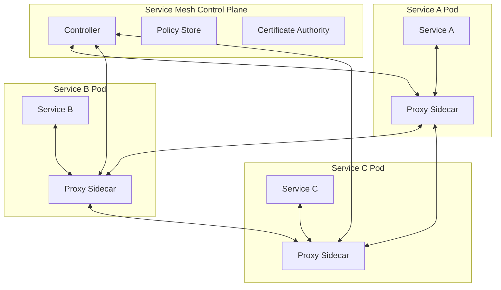

# Nginx Service Mesh

## Introduction

A service mesh is a dedicated infrastructure layer that controls service-to-service communication within microservice architectures. Nginx Service Mesh (NSM) is Nginx's implementation of this concept, providing traffic management, security, and observability for complex distributed applications without requiring changes to your application code.

In today's cloud-native world where applications are broken down into smaller, interconnected microservices, managing the communication between these services becomes increasingly complex. This is where Nginx Service Mesh comes in - adding a layer of intelligence to your network that handles service discovery, load balancing, encryption, authentication, and monitoring.

## Understanding Service Mesh Architecture

Before diving into Nginx Service Mesh specifically, let's understand the basic architecture of a service mesh:



A service mesh consists of two primary components:

1. **Data Plane**: A set of intelligent proxies (sidecars) deployed alongside each service instance. In NSM, these are powered by Nginx.
2. **Control Plane**: A centralized management component that configures the proxies and implements policies.

## Installing Nginx Service Mesh

Nginx Service Mesh is designed to run on Kubernetes. Here's how to get started with its installation:

### Prerequisites

- Kubernetes cluster (v1.19 or later)
- `kubectl` command-line tool
- Helm (optional, for chart installation)

### Installation Steps

1. First, download the Nginx Service Mesh installation package:

```bash
curl -L https://downloads.f5.com/nginx/nginx-service-mesh/latest/nginx-mesh-cli-linux.tar.gz | tar zxvf -
```

2. Move the binary to your PATH:

```bash
sudo mv nginx-mesh /usr/local/bin/
```

3. Deploy Nginx Service Mesh to your Kubernetes cluster:

```bash
nginx-mesh deploy
```

4. Verify the installation:

```bash
kubectl get pods -n nginx-mesh
```

Expected output:
```
NAME                           READY   STATUS    RESTARTS   AGE
nms-bootstrap-65b47965-s7vqd   1/1     Running   0          2m
nms-metrics-785bd746f-n4qcz    1/1     Running   0          2m
nms-control-66c44f5bdf-xvzpw   1/1     Running   0          2m
nms-registry-76dff9dc4-84q8p   1/1     Running   0          2m
```

## Key Features of Nginx Service Mesh

### 1. Traffic Management

Nginx Service Mesh provides sophisticated traffic routing capabilities:

```yaml
apiVersion: mesh.nginx.com/v1
kind: TrafficSplit
metadata:
  name: my-service-split
  namespace: demo
spec:
  service: my-service
  backends:
  - service: my-service-v1
    weight: 90
  - service: my-service-v2
    weight: 10
```

This configuration routes 90% of traffic to version 1 and 10% to version 2 of a service, enabling advanced deployment strategies like:

- **Canary Deployments**: Testing new versions with a small percentage of traffic
- **Blue/Green Deployments**: Maintaining two production environments for zero-downtime updates
- **A/B Testing**: Comparing different service implementations

### 2. Security Features

Nginx Service Mesh secures service-to-service communication through:

#### mTLS (Mutual TLS)

By default, NSM automatically encrypts all traffic between services:

```yaml
apiVersion: mesh.nginx.com/v1
kind: SecurityPolicy
metadata:
  name: mtls-policy
  namespace: demo
spec:
  mTLS:
    mode: STRICT  # Options: STRICT, PERMISSIVE, DISABLED
```

The modes determine how strictly mTLS is enforced:
- **STRICT**: Requires all traffic to be encrypted
- **PERMISSIVE**: Allows both encrypted and unencrypted traffic
- **DISABLED**: Turns off mTLS

#### Access Control

You can define who can access which services:

```yaml
apiVersion: mesh.nginx.com/v1
kind: AccessPolicy
metadata:
  name: payment-service-access
  namespace: demo
spec:
  source:
    - name: checkout-service
      namespace: demo
  destination:
    - name: payment-service
      namespace: demo
```

This policy only allows the `checkout-service` to communicate with the `payment-service`.

### 3. Observability

Nginx Service Mesh provides powerful monitoring capabilities through:

#### Metrics Collection

NSM automatically collects metrics from all services, including:
- Request rates
- Error rates
- Latency percentiles
- Traffic volume

These metrics can be visualized in Grafana dashboards:

```yaml
apiVersion: mesh.nginx.com/v1
kind: Instrumentation
metadata:
  name: default-instrumentation
spec:
  tracing:
    enabled: true
    sampling: 100
  metrics:
    prometheus:
      port: 9113
```

#### Distributed Tracing

Track requests as they flow through different services:

```yaml
apiVersion: mesh.nginx.com/v1
kind: Instrumentation
metadata:
  name: zipkin-config
spec:
  tracing:
    enabled: true
    provider: zipkin
    zipkin:
      url: http://zipkin.monitoring:9411/api/v2/spans
    sampling: 100
```

## Practical Example: Implementing Nginx Service Mesh

Let's walk through a complete example of deploying a simple microservice application with Nginx Service Mesh.

### 1. Create a Demo Namespace and Enable Injection

```bash
kubectl create namespace demo
kubectl annotate namespace demo mesh.nginx.com/injection=enabled
```

### 2. Deploy Sample Microservices

Create a file named `microservices.yaml`:

```yaml
apiVersion: apps/v1
kind: Deployment
metadata:
  name: frontend
  namespace: demo
spec:
  replicas: 2
  selector:
    matchLabels:
      app: frontend
  template:
    metadata:
      labels:
        app: frontend
    spec:
      containers:
      - name: frontend
        image: nginx:alpine
        ports:
        - containerPort: 80
---
apiVersion: v1
kind: Service
metadata:
  name: frontend
  namespace: demo
spec:
  selector:
    app: frontend
  ports:
  - port: 80
    targetPort: 80
---
apiVersion: apps/v1
kind: Deployment
metadata:
  name: backend
  namespace: demo
spec:
  replicas: 2
  selector:
    matchLabels:
      app: backend
  template:
    metadata:
      labels:
        app: backend
    spec:
      containers:
      - name: backend
        image: nginx:alpine
        ports:
        - containerPort: 80
---
apiVersion: v1
kind: Service
metadata:
  name: backend
  namespace: demo
spec:
  selector:
    app: backend
  ports:
  - port: 80
    targetPort: 80
```

Apply the configuration:

```bash
kubectl apply -f microservices.yaml
```

### 3. Configure Traffic Management

Create a file named `traffic-rules.yaml`:

```yaml
apiVersion: mesh.nginx.com/v1
kind: VirtualServer
metadata:
  name: frontend-vs
  namespace: demo
spec:
  host: frontend.example.com
  upstreams:
  - name: frontend
    service: frontend
    port: 80
  routes:
  - path: /
    action:
      pass: frontend
---
apiVersion: mesh.nginx.com/v1
kind: VirtualServer
metadata:
  name: backend-vs
  namespace: demo
spec:
  host: backend.example.com
  upstreams:
  - name: backend
    service: backend
    port: 80
  routes:
  - path: /
    action:
      pass: backend
```

Apply the configuration:

```bash
kubectl apply -f traffic-rules.yaml
```

### 4. Add Security Policies

Create a file named `security-policy.yaml`:

```yaml
apiVersion: mesh.nginx.com/v1
kind: SecurityPolicy
metadata:
  name: demo-security
  namespace: demo
spec:
  mTLS:
    mode: STRICT
---
apiVersion: mesh.nginx.com/v1
kind: AccessPolicy
metadata:
  name: frontend-to-backend-only
  namespace: demo
spec:
  source:
  - name: frontend
    namespace: demo
  destination:
  - name: backend
    namespace: demo
```

Apply the configuration:

```bash
kubectl apply -f security-policy.yaml
```

### 5. Monitor Your Services

Access the built-in monitoring dashboard:

```bash
kubectl port-forward -n nginx-mesh svc/nms-ui 8080:80
```

Then open your browser and navigate to `http://localhost:8080` to see your service mesh metrics and traffic flows.

## Troubleshooting Nginx Service Mesh

When working with NSM, you might encounter some common issues:

1. **Sidecar Injection Fails**:
   Check that your namespace is properly annotated:
   ```bash
   kubectl get namespace demo -o yaml | grep mesh.nginx.com/injection
   ```

2. **Services Can't Communicate**:
   Verify that proper access policies are in place:
   ```bash
   kubectl get accesspolicy -n demo
   ```

3. **High Latency**:
   Check resource allocation for the proxy containers:
   ```bash
   kubectl describe pod -n demo <pod-name>
   ```

## Service Mesh vs. API Gateway

Many beginners confuse service meshes with API gateways. Here's a quick comparison:

| Feature | Nginx Service Mesh | Nginx API Gateway |
|---------|-------------------|-------------------|
| **Primary Focus** | Internal service-to-service communication | External client-to-service communication |
| **Deployment** | Sidecar proxy with each service | Standalone at the edge of your network |
| **Use Case** | Managing microservice communication | Managing API endpoints for external consumers |
| **Security** | Internal mTLS, service-level access control | API keys, OAuth, rate limiting |

You can use both technologies together for comprehensive traffic management.

## Summary

Nginx Service Mesh provides a powerful solution for managing the complexity of microservice architectures. By implementing NSM, you gain:

- Intelligent traffic routing and load balancing
- Automated security with mTLS encryption
- Comprehensive observability without code changes
- Resilience through circuit breaking and retry mechanisms

As your applications grow in complexity, a service mesh becomes increasingly valuable for maintaining control, security, and visibility across your microservice ecosystem.

## Additional Resources

To further your learning:

- Practice implementing different traffic splitting strategies
- Try setting up more complex access policies
- Experiment with integrating NSM with popular monitoring tools like Prometheus and Grafana
- Explore more advanced NSM features like circuit breaking and fault injection

Remember that a service mesh adds some overhead to your system, so carefully evaluate whether the benefits outweigh the costs for your specific use case.