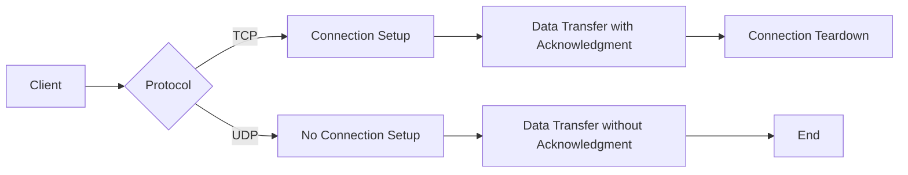

# Nginx UDP Load Balancing

## Introduction

While Nginx is well-known for its HTTP load balancing capabilities, it also provides robust support for UDP (User Datagram Protocol) load balancing. This feature is particularly important for applications that rely on UDP for communication, such as DNS servers, VoIP applications, streaming media, online gaming, and IoT devices.

UDP is a connectionless protocol that prioritizes speed over reliability. Unlike TCP, UDP doesn't establish a connection before sending data, making it faster but less reliable. Load balancing UDP traffic distributes this connectionless communication across multiple backend servers, improving performance and reliability.

In this guide, we'll explore how to configure Nginx as a UDP load balancer, understand its key features, and implement practical examples for real-world scenarios.

## Prerequisites

Before diving into UDP load balancing with Nginx, ensure you have:

- Nginx installed with the `stream` module enabled (included by default in Nginx 1.9.0+)
- Basic understanding of load balancing concepts
- Multiple backend servers running UDP services
- Root/sudo access to your system for configuration changes

## Understanding UDP Load Balancing

### How UDP Differs from TCP

Before we configure Nginx, it's important to understand why UDP load balancing requires special consideration:



UDP load balancing must account for:
- No connection state to track
- No built-in reliability mechanisms
- Typically smaller packet sizes
- Often time-sensitive applications

## Basic UDP Load Balancing Configuration

Nginx's UDP load balancing is configured in the `stream` context, which is separate from the more familiar `http` context.

Here's a basic configuration to get started:

```nginx
# Define in the main nginx.conf or include from a separate file
stream {
    # Define an upstream group of UDP servers
    upstream udp_backends {
        server backend1.example.com:53;
        server backend2.example.com:53;
        server backup.example.com:53 backup;
    }

    # Configure the UDP listener
    server {
        listen 53 udp;
        proxy_pass udp_backends;
    }
}
```

This configuration:
1. Creates an upstream group named `udp_backends` with three servers
2. Sets up a UDP listener on port 53 (commonly used for DNS)
3. Forwards UDP traffic to the upstream servers
4. Designates one server as a backup, which only receives traffic if the primary servers are unavailable

## Load Balancing Methods

Nginx offers several methods for distributing UDP traffic:

### Round Robin (Default)

Requests are distributed evenly across servers in sequential order.

```nginx
upstream udp_backends {
    server backend1.example.com:53;
    server backend2.example.com:53;
}
```

### Least Connections

Requests are sent to the server with the fewest active connections.

```nginx
upstream udp_backends {
    least_conn;
    server backend1.example.com:53;
    server backend2.example.com:53;
}
```

### IP Hash

Clients are directed to specific servers based on their IP address, ensuring session persistence.

```nginx
upstream udp_backends {
    ip_hash;
    server backend1.example.com:53;
    server backend2.example.com:53;
}
```

### Weighted Distribution

Servers can handle different amounts of traffic based on assigned weights.

```nginx
upstream udp_backends {
    server backend1.example.com:53 weight=3;
    server backend2.example.com:53 weight=1;
}
```

In this example, `backend1` will receive approximately 75% of the traffic.

## Advanced Configuration Options

### Health Checks

Health checks are crucial for maintaining reliable UDP services. They verify that backend servers are operational.

```nginx
stream {
    upstream udp_backends {
        server backend1.example.com:53;
        server backend2.example.com:53;
        
        # Active health checks
        health_check interval=10 passes=2 fails=3 udp;
    }
    
    server {
        listen 53 udp;
        proxy_pass udp_backends;
    }
}
```

This configuration:
- Checks backend health every 10 seconds
- Marks a server as healthy after 2 successful checks
- Marks a server as unhealthy after 3 failed checks
- Uses UDP for health checks (instead of TCP)

### Connection Timeouts

Setting appropriate timeouts is important for UDP load balancing:

```nginx
stream {
    upstream udp_backends {
        server backend1.example.com:53;
        server backend2.example.com:53;
    }
    
    server {
        listen 53 udp;
        proxy_pass udp_backends;
        
        # Timeouts
        proxy_timeout 10s;
        proxy_responses 1;
    }
}
```

The `proxy_timeout` directive sets how long Nginx waits for a response from the backend server.
The `proxy_responses` directive specifies how many datagrams to expect from the backend.

### Access Control

Restrict access to your UDP load balancer using IP-based allow/deny rules:

```nginx
stream {
    # Allow/deny specific IP addresses
    allow 192.168.1.0/24;
    deny all;
    
    upstream udp_backends {
        server backend1.example.com:53;
        server backend2.example.com:53;
    }
    
    server {
        listen 53 udp;
        proxy_pass udp_backends;
    }
}
```

## Real-World Application Examples

### Example 1: DNS Server Load Balancing

DNS servers typically use UDP on port 53. Here's how to load balance them:

```nginx
stream {
    upstream dns_servers {
        least_conn;
        server 10.0.0.1:53;
        server 10.0.0.2:53;
        server 10.0.0.3:53 backup;
    }
    
    server {
        listen 53 udp;
        proxy_pass dns_servers;
        proxy_timeout 5s;
        proxy_responses 1;
    }
}
```

This configuration:
- Uses the least connections algorithm
- Sets a 5-second timeout for DNS responses
- Expects one response datagram per request
- Includes a backup server for failover

### Example 2: VoIP/SIP Traffic

VoIP applications often use UDP for real-time voice communication:

```nginx
stream {
    upstream sip_servers {
        ip_hash; # Keep clients connected to the same server
        server voip1.example.com:5060;
        server voip2.example.com:5060;
    }
    
    server {
        listen 5060 udp;
        proxy_pass sip_servers;
        proxy_timeout 60s;
    }
}
```

This setup:
- Uses IP hash to maintain session persistence
- Sets a longer timeout (60s) for VoIP connections
- Listens on the standard SIP port (5060)

### Example 3: Game Server Load Balancing

Online games often use UDP for minimizing latency:

```nginx
stream {
    upstream game_servers {
        server game1.example.com:27015 max_fails=3 fail_timeout=30s;
        server game2.example.com:27015 max_fails=3 fail_timeout=30s;
    }
    
    server {
        listen 27015 udp;
        proxy_pass game_servers;
        proxy_timeout 30s;
    }
}
```

This configuration:
- Marks servers as failed after 3 consecutive unsuccessful attempts
- Prevents using failed servers for 30 seconds
- Sets an appropriate timeout for game traffic

## Performance Tuning

To optimize UDP load balancing performance, consider these adjustments:

### Worker Processes and Connections

```nginx
# In the main context (outside stream)
worker_processes auto;
worker_rlimit_nofile 65535;

events {
    worker_connections 65535;
    use epoll;
}
```

### Buffer Sizes

```nginx
stream {
    # Adjust UDP buffer sizes
    server {
        listen 53 udp;
        proxy_pass dns_servers;
        
        # Increase buffer size for larger UDP packets
        proxy_buffer_size 16k;
    }
}
```

### Enabling SO_REUSEPORT

The `reuseport` parameter can improve performance by allowing multiple worker processes to accept connections from the same port:

```nginx
stream {
    server {
        listen 53 udp reuseport;
        proxy_pass dns_servers;
    }
}
```

## Common Issues and Solutions

### Problem: Packet Loss or Timeouts

**Solution:**
- Increase buffer sizes:
```nginx
stream {
    server {
        listen 53 udp;
        proxy_buffer_size 16k;
        proxy_timeout 10s;
    }
}
```

### Problem: Uneven Load Distribution

**Solution:**
- Try different load balancing algorithms:
```nginx
upstream udp_backends {
    least_conn; # Instead of round-robin
    server backend1.example.com:53;
    server backend2.example.com:53;
}
```

### Problem: Health Checks Not Working

**Solution:**
- Ensure your UDP service responds to health check packets:
```nginx
health_check interval=5 passes=2 fails=3 udp;
```

## Testing Your UDP Load Balancer

After configuration, verify your UDP load balancer is working properly:

1. **Check Nginx Configuration:**
```bash
sudo nginx -t
```

2. **Reload Nginx:**
```bash
sudo systemctl reload nginx
```

3. **Test with UDP Client Tools:**

For DNS:
```bash
dig @your_load_balancer_ip example.com
```

For general UDP testing:
```bash
nc -u your_load_balancer_ip port
```

## Summary

Nginx UDP load balancing provides a powerful way to distribute connectionless traffic across multiple backend servers. Key points to remember:

- UDP load balancing is configured in the `stream` context
- Different load balancing algorithms can be used depending on your needs
- Health checks ensure traffic is only sent to operational servers
- Proper timeout configuration is essential for UDP services
- Access control can restrict who can use your load balancer
- Performance tuning helps handle high-volume UDP traffic

By implementing UDP load balancing, you can significantly improve the reliability, scalability, and performance of your UDP-based services.

## Additional Resources

- [Nginx Official Documentation on Stream Processing](https://nginx.org/en/docs/stream/ngx_stream_core_module.html)
- [UDP Protocol RFC 768](https://tools.ietf.org/html/rfc768)
- [Load Balancing Fundamentals](https://www.nginx.com/resources/glossary/load-balancing/)

## Exercises

1. Set up a simple UDP load balancer for DNS traffic using two backend servers.
2. Configure a UDP load balancer with health checks and test failover by temporarily disabling one backend server.
3. Compare the performance of different load balancing algorithms for a UDP service under high load.
4. Implement access control to allow UDP traffic only from specific network ranges.
5. Configure a UDP load balancer for a custom application using a non-standard port.