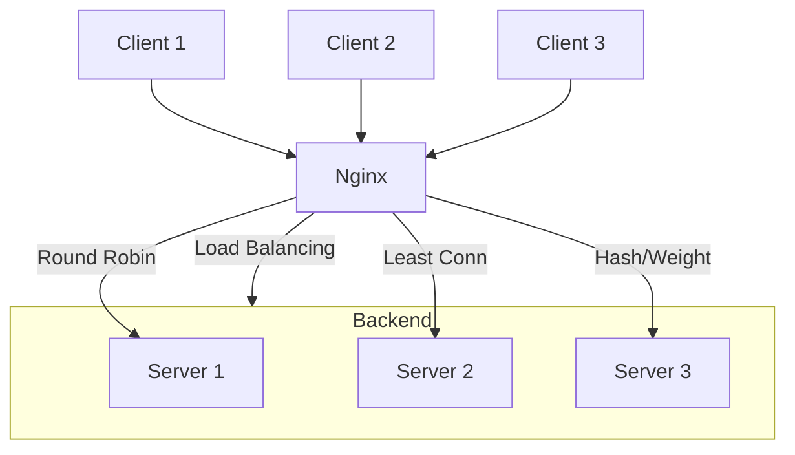

# Nginx TCP Load Balancing

## Introduction

While Nginx is widely known for HTTP load balancing, it also provides powerful capabilities for TCP load balancing. This feature allows you to distribute TCP connections across multiple backend servers, which is essential for applications that rely on TCP protocols like database services, mail servers, or custom TCP applications.

In this guide, we'll explore how to configure Nginx as a TCP load balancer, understand its key features, and implement practical configurations for real-world scenarios.

## Prerequisites

Before diving into TCP load balancing with Nginx, make sure you have:

- Nginx installed (version 1.9.0 or later) with the `ngx_stream_module` module
- Basic understanding of networking concepts
- Multiple backend servers or services to balance traffic between
- Root/sudo access to modify Nginx configuration

## Understanding TCP Load Balancing

Unlike HTTP load balancing that operates at Layer 7 (Application layer) of the OSI model, TCP load balancing works at Layer 4 (Transport layer). This means Nginx forwards raw TCP connections without inspecting the content of the packets.

### Key Benefits

- **Protocol Agnostic**: Works with any TCP-based protocol (MySQL, PostgreSQL, SMTP, etc.)
- **Lower Overhead**: Less processing compared to HTTP load balancing
- **Higher Performance**: Handles connections with minimal latency
- **Simpler Configuration**: Focuses on connection management rather than request content

## Setting Up Nginx for TCP Load Balancing

### Step 1: Ensure Stream Module is Available

First, verify that Nginx was compiled with the `stream` module:

```bash
nginx -V 2>&1 | grep with-stream
```

If you don't see "with-stream" in the output, you'll need to recompile Nginx with this module or install it using a package manager that includes it.

### Step 2: Configure the Stream Block

TCP load balancing is configured using the `stream` context in Nginx. Create or modify `/etc/nginx/nginx.conf` to include a stream block:

```nginx
# Main nginx.conf file
user nginx;
worker_processes auto;
error_log /var/log/nginx/error.log notice;
pid /var/run/nginx.pid;

events {
    worker_connections 1024;
}

# HTTP server configuration (existing)
http {
    # Your existing HTTP configurations
}

# TCP load balancing configuration
stream {
    # Stream configurations will go here
    include /etc/nginx/stream.d/*.conf;
}
```

### Step 3: Create a Configuration File for TCP Services

Create a directory for stream configurations:

```bash
mkdir -p /etc/nginx/stream.d
```

Now, create a configuration file for your specific TCP service. For example, to load balance a MySQL database:

```bash
touch /etc/nginx/stream.d/mysql.conf
```

Edit the file with your preferred text editor:

```nginx
# /etc/nginx/stream.d/mysql.conf
upstream mysql_servers {
    server 192.168.1.101:3306 weight=1;
    server 192.168.1.102:3306 weight=1;
    server 192.168.1.103:3306 backup;
}

server {
    listen 3306;
    proxy_pass mysql_servers;
    proxy_connect_timeout 1s;
}
```

### Step 4: Check and Reload Configuration

Verify your configuration for syntax errors:

```bash
nginx -t
```

If everything is correct, reload Nginx:

```bash
systemctl reload nginx
```

## Load Balancing Algorithms

Nginx supports several load balancing methods for TCP connections:

### Round Robin (Default)

Requests are distributed sequentially across the servers:

```nginx
upstream database_servers {
    server 10.0.0.1:5432;
    server 10.0.0.2:5432;
    server 10.0.0.3:5432;
}
```

### Least Connections

Connections are sent to the server with the fewest active connections:

```nginx
upstream database_servers {
    least_conn;
    server 10.0.0.1:5432;
    server 10.0.0.2:5432;
    server 10.0.0.3:5432;
}
```

### IP Hash

Clients are directed to the same server based on their IP address:

```nginx
upstream database_servers {
    hash $remote_addr consistent;
    server 10.0.0.1:5432;
    server 10.0.0.2:5432;
    server 10.0.0.3:5432;
}
```

### Server Weights

Control traffic distribution by assigning weights to servers:

```nginx
upstream database_servers {
    server 10.0.0.1:5432 weight=3;  # This server gets 3x more connections
    server 10.0.0.2:5432 weight=1;
    server 10.0.0.3:5432 weight=1;
}
```

## Advanced Configuration Options

### Connection Timeouts

```nginx
server {
    listen 5432;
    proxy_pass database_servers;
    proxy_connect_timeout 3s;      # Connection establishment timeout
    proxy_timeout 10m;             # Data transmission timeout
}
```

### Access Control

Restrict access based on IP addresses:

```nginx
server {
    listen 5432;
    
    # Only allow specific IP ranges
    allow 192.168.1.0/24;
    allow 10.0.0.0/8;
    deny all;
    
    proxy_pass database_servers;
}
```

### Health Checks

Actively check if backend servers are healthy:

```nginx
upstream database_servers {
    server 10.0.0.1:5432 max_fails=3 fail_timeout=30s;
    server 10.0.0.2:5432 max_fails=3 fail_timeout=30s;
    server 10.0.0.3:5432 max_fails=3 fail_timeout=30s;
}
```

This configuration:
- Tries a server up to 3 times before marking it as failed
- Waits 30 seconds before attempting to use a failed server again

### SSL/TLS Termination

Terminate SSL/TLS connections and forward unencrypted traffic to backends:

```nginx
server {
    listen 5432 ssl;
    
    ssl_certificate /etc/nginx/cert.pem;
    ssl_certificate_key /etc/nginx/cert.key;
    ssl_protocols TLSv1.2 TLSv1.3;
    
    proxy_pass database_servers;
}
```

## Real-World Examples

### Example 1: Load Balancing PostgreSQL

```nginx
stream {
    upstream postgres_cluster {
        least_conn;
        server pg1.example.com:5432 max_fails=2 fail_timeout=30s;
        server pg2.example.com:5432 max_fails=2 fail_timeout=30s;
        server pg3.example.com:5432 backup;
    }

    server {
        listen 5432;
        proxy_pass postgres_cluster;
        proxy_connect_timeout 5s;
        proxy_timeout 30m;
    }
}
```

In this example:
- We're load-balancing PostgreSQL connections
- Using the "least connections" algorithm
- Including a backup server that's only used when the other servers are unavailable
- Setting appropriate timeouts for database connections

### Example 2: Multi-Protocol Mail Server

```nginx
stream {
    # SMTP server load balancing
    upstream smtp_servers {
        server mail1.example.com:25;
        server mail2.example.com:25;
    }
    
    # IMAP server load balancing
    upstream imap_servers {
        server mail1.example.com:143;
        server mail2.example.com:143;
    }
    
    # POP3 server load balancing
    upstream pop3_servers {
        server mail1.example.com:110;
        server mail2.example.com:110;
    }
    
    # SMTP configuration
    server {
        listen 25;
        proxy_pass smtp_servers;
    }
    
    # IMAP configuration
    server {
        listen 143;
        proxy_pass imap_servers;
    }
    
    # POP3 configuration
    server {
        listen 110;
        proxy_pass pop3_servers;
    }
}
```

This configuration load balances all major mail protocols to a set of backend mail servers.

### Example 3: High-Availability Redis Cluster

```nginx
stream {
    upstream redis_cluster {
        hash $remote_addr consistent;
        
        server redis1.example.com:6379 weight=2;
        server redis2.example.com:6379 weight=2;
        server redis3.example.com:6379 weight=1;
    }
    
    server {
        listen 6379;
        proxy_pass redis_cluster;
        proxy_connect_timeout 1s;
        proxy_timeout 3s;
    }
}
```

This configuration:
- Uses consistent hashing to ensure clients always connect to the same Redis instance
- Assigns different weights to distribute load based on server capacity
- Sets aggressive timeouts to quickly detect connection issues

## Visual Representation

Here's a diagram showing how Nginx TCP load balancing works:



## Performance Considerations

When implementing TCP load balancing with Nginx, consider these performance factors:

1. **Worker Processes**: Set `worker_processes` to match your CPU cores
   ```nginx
   worker_processes auto;  # Automatically uses available cores
   ```

2. **File Descriptors**: Increase the limit to handle more concurrent connections
   ```bash
   # Add to /etc/security/limits.conf
   nginx soft nofile 65535
   nginx hard nofile 65535
   ```

3. **Backend Connection Limits**: Control connections to backend servers
   ```nginx
   upstream database_servers {
       server 10.0.0.1:5432 max_conns=100;  # Limit to 100 connections
       server 10.0.0.2:5432 max_conns=100;
       server 10.0.0.3:5432 max_conns=100;
   }
   ```

4. **Keep-alive Connections**: Reuse connections to backends when possible
   ```nginx
   upstream database_servers {
       server 10.0.0.1:5432;
       server 10.0.0.2:5432;
       keepalive 32;  # Keep up to 32 idle connections per worker
   }
   ```

## Troubleshooting

### Common Issues and Solutions

1. **Connection Refused**
   - Check if backend servers are running and listening on the specified ports
   - Verify firewall settings allow traffic between Nginx and backends

2. **Connection Timeouts**
   - Increase `proxy_connect_timeout` if backends are slow to respond
   - Check network latency between Nginx and backend servers

3. **Traffic Not Being Balanced**
   - Verify upstream server configurations
   - Check load balancing algorithm settings

### Monitoring TCP Load Balancing

Enable advanced logging to troubleshoot issues:

```nginx
stream {
    log_format basic '$remote_addr [$time_local] '
                     '$protocol $status $bytes_sent $bytes_received '
                     '$session_time "$upstream_addr" '
                     '"$upstream_bytes_sent" "$upstream_bytes_received" "$upstream_connect_time"';

    access_log /var/log/nginx/stream-access.log basic;
    
    # Rest of your configuration...
}
```

## Summary

Nginx TCP load balancing provides a powerful way to distribute TCP connections across multiple backend servers. Key takeaways include:

- TCP load balancing works at Layer 4, making it protocol-agnostic
- Configuration happens in the `stream` context of Nginx
- Various load balancing algorithms can be used based on your needs
- Advanced features like health checks, SSL termination, and access control enhance functionality
- Real-world applications include database clusters, mail servers, and custom TCP services

By implementing TCP load balancing with Nginx, you can improve the reliability, scalability, and performance of your TCP-based services.

## Practice Exercises

1. Set up a TCP load balancer for a Redis cache with three backend servers.
2. Implement health checks for your TCP load balancer.
3. Configure different load balancing algorithms and benchmark their performance.
4. Set up TCP load balancing with SSL/TLS termination for a secure database connection.
5. Create a high-availability setup with primary and backup servers.

## Additional Resources

- [Nginx Official Documentation on TCP/UDP Load Balancing](https://nginx.org/en/docs/stream/ngx_stream_core_module.html)
- [Nginx Plus Features for Advanced TCP Load Balancing](https://www.nginx.com/products/nginx/load-balancing/)
- [TCP Load Balancing Best Practices](https://www.nginx.com/blog/tcp-load-balancing-nginx-plus/)