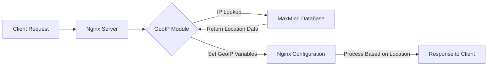

# Nginx GeoIP Module

## Introduction

The Nginx GeoIP module is a powerful feature that allows you to determine a visitor's geographic location based on their IP address. This capability opens up numerous possibilities for customizing content, implementing region-specific features, and enhancing security through geographic access controls.

In this guide, you'll learn how to install, configure, and utilize the GeoIP module to create location-aware web applications. Whether you want to display localized content, block certain regions, or track visitor demographics, the GeoIP module provides an efficient solution directly within your Nginx server.

## Prerequisites

Before diving into the GeoIP module, you should have:
- A working Nginx installation
- Basic understanding of Nginx configuration syntax
- Administrative (sudo) access to your server
- Familiarity with IP addresses and networking concepts

## How GeoIP Works

The GeoIP module works by comparing visitor IP addresses against a database of IP-to-location mappings. When a request comes in, Nginx looks up the IP address in this database and sets variables that your configuration can use to make decisions.



## Installing the GeoIP Module

### Step 1: Install Required Packages

First, you'll need to install the necessary packages:

For Debian/Ubuntu:

```bash
sudo apt update
sudo apt install nginx-module-geoip libgeoip-dev geoip-database
```

For CentOS/RHEL:

```bash
sudo yum install nginx-module-geoip GeoIP GeoIP-devel
```

### Step 2: Download GeoIP Databases

For more accurate and up-to-date geolocation data, you can download databases from MaxMind:

```bash
mkdir -p /etc/nginx/geoip
cd /etc/nginx/geoip
wget https://dl.miyuru.lk/geoip/maxmind/country/maxmind.dat.gz
wget https://dl.miyuru.lk/geoip/maxmind/city/maxmind.dat.gz
gunzip maxmind.dat.gz
gunzip maxmind.dat.gz
mv maxmind.dat GeoIP.dat
mv maxmind.dat GeoLiteCity.dat
```

:::note
The free GeoLite2 databases have replaced the legacy GeoIP databases. You'll need to create a free MaxMind account to access these databases directly from their website.
:::

### Step 3: Configure Nginx to Load the GeoIP Module

Edit your Nginx configuration file (usually at `/etc/nginx/nginx.conf`):

```nginx
load_module modules/ngx_http_geoip_module.so;

http {
    # GeoIP configuration
    geoip_country /etc/nginx/geoip/GeoIP.dat;
    geoip_city /etc/nginx/geoip/GeoLiteCity.dat;
    
    # Rest of your http configuration...
}
```

### Step 4: Verify Installation

After restarting Nginx, you can verify that the module is loaded correctly:

```bash
sudo nginx -t
sudo systemctl restart nginx
nginx -V 2>&1 | grep --color geoip
```

If everything is set up correctly, you should see the GeoIP module listed in the output.

## GeoIP Variables

Once configured, the GeoIP module provides a set of variables that you can use in your Nginx configuration:

### Country Variables

| Variable | Description | Example Value |
|----------|-------------|---------------|
| `$geoip_country_code` | Two-letter country code | US, CA, UK |
| `$geoip_country_code3` | Three-letter country code | USA, CAN, GBR |
| `$geoip_country_name` | Full country name | United States, Canada |

### City Variables

| Variable | Description | Example Value |
|----------|-------------|---------------|
| `$geoip_city` | City name | New York, London |
| `$geoip_region` | Region or state | NY, CA |
| `$geoip_postal_code` | Postal/ZIP code | 10001 |
| `$geoip_latitude` | Latitude | 40.7128 |
| `$geoip_longitude` | Longitude | -74.0060 |

## Practical Examples

Let's explore some common use cases for the GeoIP module:

### Example 1: Redirecting Based on Country

This example redirects visitors from specific countries to localized versions of your website:

```nginx
server {
    listen 80;
    server_name example.com;

    if ($geoip_country_code = US) {
        return 301 https://us.example.com$request_uri;
    }
    
    if ($geoip_country_code = CA) {
        return 301 https://ca.example.com$request_uri;
    }
    
    # Default content for other countries
    location / {
        root /var/www/html/global;
        index index.html;
    }
}
```

### Example 2: Displaying Custom Content

You can serve different content based on the visitor's location:

```nginx
server {
    listen 80;
    server_name example.com;
    
    root /var/www/html;
    
    # Set default country for local testing
    set $country_name "Unknown";
    
    # Override with actual country if available
    if ($geoip_country_name) {
        set $country_name $geoip_country_name;
    }
    
    # Pass variable to your application
    location / {
        proxy_pass http://backend_app;
        proxy_set_header X-Country-Name $country_name;
        proxy_set_header X-Country-Code $geoip_country_code;
    }
}
```

Your backend application can then read these headers to customize content.

### Example 3: Geo-Blocking

This example blocks access from specific countries, which might be useful for regulatory compliance or security reasons:

```nginx
map $geoip_country_code $allowed_country {
    default yes;
    CN no;  # Block China
    RU no;  # Block Russia
    # Add more countries to block as needed
}

server {
    listen 80;
    server_name example.com;
    
    if ($allowed_country = no) {
        return 403;
    }
    
    location / {
        root /var/www/html;
        index index.html;
    }
    
    # Custom error page for blocked countries
    error_page 403 /blocked.html;
    location = /blocked.html {
        root /var/www/html/errors;
        internal;
    }
}
```

### Example 4: Logging Location Data

This example adds geographic information to your access logs:

```nginx
http {
    # Define custom log format with GeoIP variables
    log_format geo '$remote_addr - $remote_user [$time_local] '
                   '"$request" $status $body_bytes_sent '
                   '"$http_referer" "$http_user_agent" '
                   '"$geoip_country_name" "$geoip_city"';
    
    server {
        listen 80;
        server_name example.com;
        
        # Use custom log format
        access_log /var/log/nginx/access.log geo;
        
        location / {
            root /var/www/html;
            index index.html;
        }
    }
}
```

Sample log output:
```
192.168.1.1 - - [01/Jan/2023:12:34:56 +0000] "GET / HTTP/1.1" 200 1234 "-" "Mozilla/5.0" "United States" "New York"
```

### Example 5: Location-Based Rate Limiting

Combine GeoIP with rate limiting to apply different limits based on country:

```nginx
# Define rate limit zones per country
geo $limit_rate {
    default 10m;
    US 50m;  # Higher limit for US
    GB 30m;  # Medium limit for UK
}

limit_req_zone $binary_remote_addr zone=global:10m rate=10r/s;
limit_req_zone $geoip_country_code$binary_remote_addr zone=percountry:10m rate=5r/s;

server {
    listen 80;
    server_name example.com;
    
    location / {
        limit_req zone=global burst=20 nodelay;
        limit_req zone=percountry burst=10 nodelay;
        limit_rate $limit_rate;
        
        root /var/www/html;
        index index.html;
    }
}
```

## Working with IPv6

The standard GeoIP module may not fully support IPv6 addresses. For IPv6 support, you might need to use the GeoIP2 module instead, which is based on MaxMind's newer GeoIP2 database format.

To install and configure GeoIP2:

```bash
# Install dependencies
sudo apt install libnginx-mod-http-geoip2

# Download GeoIP2 databases (requires MaxMind account)
cd /etc/nginx/geoip
wget https://download.maxmind.com/app/geoip_download?edition_id=GeoLite2-Country&license_key=YOUR_LICENSE_KEY&suffix=tar.gz -O GeoLite2-Country.tar.gz
wget https://download.maxmind.com/app/geoip_download?edition_id=GeoLite2-City&license_key=YOUR_LICENSE_KEY&suffix=tar.gz -O GeoLite2-City.tar.gz
tar -xzf GeoLite2-Country.tar.gz
tar -xzf GeoLite2-City.tar.gz
```

Then configure in your nginx.conf:

```nginx
load_module modules/ngx_http_geoip2_module.so;

http {
    geoip2 /etc/nginx/geoip/GeoLite2-Country_DATE/GeoLite2-Country.mmdb {
        auto_reload 5d;
        $geoip2_data_country_code country iso_code;
        $geoip2_data_country_name country names en;
    }

    geoip2 /etc/nginx/geoip/GeoLite2-City_DATE/GeoLite2-City.mmdb {
        $geoip2_data_city_name city names en;
        $geoip2_data_postal_code postal code;
        $geoip2_data_latitude location latitude;
        $geoip2_data_longitude location longitude;
    }
}
```

## Performance Considerations

The GeoIP module adds some processing overhead to each request. Here are some tips to optimize performance:

1. **Use memory-mapped databases**: The module uses memory-mapped files by default, which is efficient.
2. **Consider caching**: For high-traffic sites, consider caching the GeoIP results.
3. **Be selective**: Only enable GeoIP lookups for routes that actually need location data.
4. **Monitor performance**: Watch for any impact on response times after implementing GeoIP features.

## Troubleshooting

If you're having issues with the GeoIP module, here are some common problems and solutions:

### Variables Not Set

If GeoIP variables are empty, check:
- Database paths are correct
- Database files are readable by Nginx
- IP addresses are not being masked by proxies

For proxied requests, you'll need to use the real client IP:

```nginx
# When using a proxy
set_real_ip_from 10.0.0.0/8;
real_ip_header X-Forwarded-For;
```

### Location Accuracy

GeoIP databases vary in accuracy. For better results:
- Update your databases regularly
- Consider premium database options for critical applications
- Use city-level databases for more precise location data

## Summary

The Nginx GeoIP module is a versatile tool that enables location-aware web applications directly at the web server level. By determining visitor locations based on their IP addresses, you can personalize content, implement region-specific access controls, and collect valuable geographic insights about your user base.

Key takeaways from this guide:
- The GeoIP module maps IP addresses to geographic locations
- Installation requires both the module and up-to-date databases
- Various variables provide country, city, and coordinate information
- Common use cases include redirections, content customization, and geo-blocking
- Performance impact is generally minimal but should be monitored

## Additional Resources

To continue learning about Nginx GeoIP:

- [Official Nginx GeoIP Module Documentation](https://nginx.org/en/docs/http/ngx_http_geoip_module.html)
- [MaxMind GeoIP Databases](https://dev.maxmind.com/geoip/)
- [Nginx HTTP Rewrite Module](https://nginx.org/en/docs/http/ngx_http_rewrite_module.html) (useful for redirects based on GeoIP)

## Exercises

To practice what you've learned:

1. Set up the GeoIP module on a test server and create a simple page that displays the visitor's country and city.
2. Create a configuration that serves content in different languages based on the visitor's country.
3. Implement a rate-limiting strategy that applies stricter limits to specific countries known for abuse.
4. Build a simple analytics dashboard that records visitor countries and visualizes the data.
5. Configure a hybrid approach that uses GeoIP for initial country detection but allows users to override their location preference.