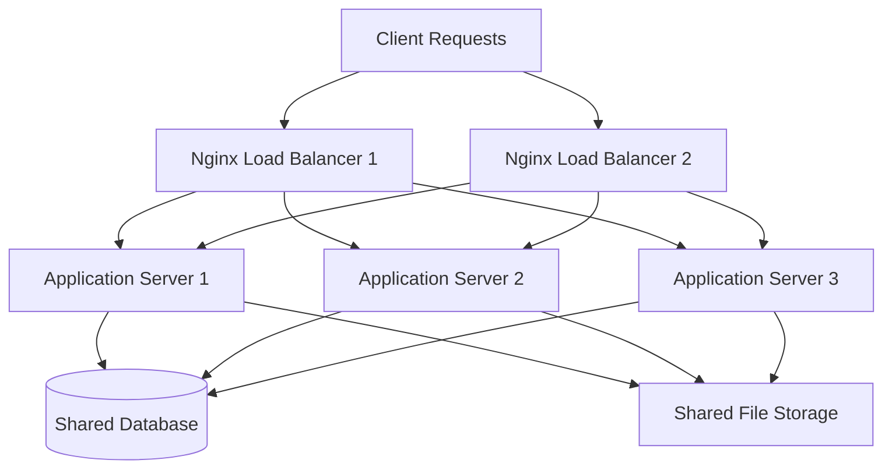

# Nginx Clustering

## Introduction

Nginx clustering is a powerful approach to ensuring high availability and scalability for your web applications. By distributing traffic across multiple Nginx instances, you can eliminate single points of failure, handle increased loads, and ensure your services remain available even if individual servers encounter issues.

In this guide, we'll explore how to set up and configure Nginx clustering, focusing on practical implementations that help maintain service reliability and performance.

## What is Nginx Clustering?

Nginx clustering involves configuring multiple Nginx instances to work together as a unified system. This approach provides several key benefits:

- **High Availability**: If one server fails, others continue to serve requests
- **Load Distribution**: Traffic is spread across multiple servers to prevent overloading
- **Scalability**: Add more servers to the cluster as your traffic grows
- **Maintenance Flexibility**: Perform updates on individual servers without downtime

## Basic Clustering Architecture

A typical Nginx cluster consists of:

1. **Frontend Load Balancers**: Nginx instances that receive client requests
2. **Backend Application Servers**: Servers running your applications
3. **Shared Storage** (optional): For content that needs to be consistent across instances
4. **Configuration Management**: To ensure consistent configuration across the cluster



## Setting Up a Basic Nginx Cluster

Let's walk through creating a simple Nginx cluster with two load balancers and multiple backend servers.

### Step 1: Install Nginx on All Servers

First, we need to install Nginx on each server that will be part of our cluster:

```bash
# On Ubuntu/Debian
sudo apt update
sudo apt install nginx

# On CentOS/RHEL
sudo yum install epel-release
sudo yum install nginx

# Start and enable Nginx
sudo systemctl start nginx
sudo systemctl enable nginx
```

### Step 2: Configure Load Balancer Nodes

On your load balancer servers, configure Nginx to distribute traffic to your backend servers. Create a configuration file called `/etc/nginx/conf.d/load-balancer.conf`:

```nginx
upstream backend_servers {
    # The backend servers
    server 192.168.1.101:80 weight=1 max_fails=3 fail_timeout=30s;
    server 192.168.1.102:80 weight=1 max_fails=3 fail_timeout=30s;
    server 192.168.1.103:80 weight=1 max_fails=3 fail_timeout=30s;
    
    # Enable session persistence (optional)
    ip_hash;
    
    # Optional: active health checks
    # health_check interval=10 fails=3 passes=2;
}

server {
    listen 80;
    server_name example.com www.example.com;

    access_log /var/log/nginx/example.access.log;
    error_log /var/log/nginx/example.error.log;

    location / {
        proxy_pass http://backend_servers;
        proxy_set_header Host $host;
        proxy_set_header X-Real-IP $remote_addr;
        proxy_set_header X-Forwarded-For $proxy_add_x_forwarded_for;
        proxy_set_header X-Forwarded-Proto $scheme;
        
        # Set timeouts
        proxy_connect_timeout 5s;
        proxy_send_timeout 60s;
        proxy_read_timeout 60s;
    }
}
```

In this configuration:
- We create an `upstream` block that defines our backend servers
- Each server has a weight (priority), max_fails (failure threshold), and fail_timeout parameters
- We enable `ip_hash` for session persistence, ensuring that requests from the same client IP go to the same backend server
- In the server block, we use `proxy_pass` to forward requests to our backend servers

### Step 3: Configure Backend Application Servers

On each backend server, configure Nginx to serve your application. Here's a basic configuration for a static website:

```nginx
server {
    listen 80;
    server_name _;  # Accept any hostname

    root /var/www/html;
    index index.html index.htm;

    access_log /var/log/nginx/backend.access.log;
    error_log /var/log/nginx/backend.error.log;

    location / {
        try_files $uri $uri/ =404;
    }
}
```

For a dynamic application like a Node.js app:

```nginx
server {
    listen 80;
    server_name _;  # Accept any hostname

    access_log /var/log/nginx/backend.access.log;
    error_log /var/log/nginx/backend.error.log;

    location / {
        proxy_pass http://localhost:3000;  # Your Node.js app
        proxy_set_header Host $host;
        proxy_set_header X-Real-IP $remote_addr;
    }
}
```

### Step 4: High Availability for Load Balancers

To ensure high availability for your load balancers, you can use Keepalived to create a virtual IP that floats between them. Install Keepalived on both load balancer servers:

```bash
# Install Keepalived
sudo apt install keepalived   # Ubuntu/Debian
sudo yum install keepalived   # CentOS/RHEL
```

Configure the primary load balancer by creating `/etc/keepalived/keepalived.conf`:

```
vrrp_script check_nginx {
    script "pidof nginx"
    interval 2
    weight 2
}

vrrp_instance VI_1 {
    state MASTER
    interface eth0
    virtual_router_id 51
    priority 101
    advert_int 1
    authentication {
        auth_type PASS
        auth_pass YourSecretPassword
    }
    
    virtual_ipaddress {
        192.168.1.100/24
    }
    
    track_script {
        check_nginx
    }
}
```

Configure the backup load balancer with a similar configuration, but set `state` to `BACKUP` and use a lower `priority` value:

```
vrrp_script check_nginx {
    script "pidof nginx"
    interval 2
    weight 2
}

vrrp_instance VI_1 {
    state BACKUP
    interface eth0
    virtual_router_id 51
    priority 100
    advert_int 1
    authentication {
        auth_type PASS
        auth_pass YourSecretPassword
    }
    
    virtual_ipaddress {
        192.168.1.100/24
    }
    
    track_script {
        check_nginx
    }
}
```

Start Keepalived on both servers:

```bash
sudo systemctl start keepalived
sudo systemctl enable keepalived
```

Now, the virtual IP (192.168.1.100) will automatically float to the backup server if the primary fails.

## Advanced Clustering Techniques

### Load Balancing Methods

Nginx offers several load balancing methods:

```nginx
upstream backend {
    # Round Robin (default) - requests distributed evenly
    server backend1.example.com;
    server backend2.example.com;
    
    # OR use weighted distribution
    server backend1.example.com weight=3;  # Gets 3x traffic
    server backend2.example.com weight=1;
    
    # OR use least connections
    least_conn;
    server backend1.example.com;
    server backend2.example.com;
    
    # OR use IP hash for session persistence
    ip_hash;
    server backend1.example.com;
    server backend2.example.com;
}
```

### Passive Health Checks

Nginx can automatically detect failed backend servers:

```nginx
upstream backend {
    server backend1.example.com max_fails=3 fail_timeout=30s;
    server backend2.example.com max_fails=3 fail_timeout=30s;
}
```

This configuration will:
- Mark a server as failed after 3 failed attempts
- Keep it marked as failed for 30 seconds before trying again

### Active Health Checks

With Nginx Plus (commercial version), you can perform active health checks:

```nginx
upstream backend {
    server backend1.example.com;
    server backend2.example.com;
    
    health_check interval=5s passes=3 fails=2;
}
```

### Configuration Synchronization

To keep configurations in sync across your cluster, consider using configuration management tools like:

- Ansible
- Chef
- Puppet
- Salt

These tools can help deploy consistent configurations across all your Nginx instances.

## Real-World Example: Complete Clustering Setup

Let's put everything together in a real-world example for a web application:

### DNS Round-Robin

First, set up DNS round-robin for basic load distribution:

```
www.example.com.    IN    A    203.0.113.1
www.example.com.    IN    A    203.0.113.2
```

### Load Balancer Configuration

Create a comprehensive load balancer configuration:

```nginx
# Load balancing configuration
upstream backend_web {
    # Backend servers with weights and failure detection
    server 10.0.0.101:80 weight=2 max_fails=2 fail_timeout=30s;
    server 10.0.0.102:80 weight=2 max_fails=2 fail_timeout=30s;
    server 10.0.0.103:80 backup;  # Backup server, only used when others fail
    
    keepalive 16;  # Keep connections open
}

# Static content servers
upstream static_servers {
    server 10.0.0.201:80 weight=1;
    server 10.0.0.202:80 weight=1;
    
    least_conn;  # Use least connections method
}

# Rate limiting zone
limit_req_zone $binary_remote_addr zone=one:10m rate=10r/s;

server {
    listen 80;
    listen [::]:80;
    server_name example.com www.example.com;
    
    # Redirect HTTP to HTTPS
    return 301 https://$host$request_uri;
}

server {
    listen 443 ssl http2;
    listen [::]:443 ssl http2;
    server_name example.com www.example.com;
    
    # SSL Configuration
    ssl_certificate /etc/nginx/ssl/example.com.crt;
    ssl_certificate_key /etc/nginx/ssl/example.com.key;
    ssl_session_timeout 1d;
    ssl_session_cache shared:SSL:50m;
    ssl_protocols TLSv1.2 TLSv1.3;
    ssl_ciphers ECDHE-ECDSA-AES128-GCM-SHA256:ECDHE-RSA-AES128-GCM-SHA256:ECDHE-ECDSA-AES256-GCM-SHA384:ECDHE-RSA-AES256-GCM-SHA384:ECDHE-ECDSA-CHACHA20-POLY1305:ECDHE-RSA-CHACHA20-POLY1305:DHE-RSA-AES128-GCM-SHA256:DHE-RSA-AES256-GCM-SHA384;
    ssl_prefer_server_ciphers off;
    
    # HSTS
    add_header Strict-Transport-Security "max-age=63072000" always;
    
    # Logging
    access_log /var/log/nginx/example.access.log;
    error_log /var/log/nginx/example.error.log;
    
    # Static content
    location ~* \.(jpg|jpeg|png|gif|ico|css|js)$ {
        proxy_pass http://static_servers;
        proxy_cache_valid 200 302 60m;
        proxy_cache_valid 404 1m;
        expires 30d;
        add_header Cache-Control "public";
    }
    
    # API rate limiting
    location /api/ {
        limit_req zone=one burst=20 nodelay;
        proxy_pass http://backend_web;
        proxy_set_header Host $host;
        proxy_set_header X-Real-IP $remote_addr;
        proxy_set_header X-Forwarded-For $proxy_add_x_forwarded_for;
        proxy_set_header X-Forwarded-Proto $scheme;
    }
    
    # Main application
    location / {
        proxy_pass http://backend_web;
        proxy_set_header Host $host;
        proxy_set_header X-Real-IP $remote_addr;
        proxy_set_header X-Forwarded-For $proxy_add_x_forwarded_for;
        proxy_set_header X-Forwarded-Proto $scheme;
        
        # WebSocket support
        proxy_http_version 1.1;
        proxy_set_header Upgrade $http_upgrade;
        proxy_set_header Connection "upgrade";
        
        # Timeouts
        proxy_connect_timeout 5s;
        proxy_send_timeout 60s;
        proxy_read_timeout 60s;
    }
}
```

### Backend Server Configuration

Configure your backend servers to handle application requests:

```nginx
server {
    listen 80;
    server_name _;
    
    # App specific configuration
    root /var/www/myapp;
    index index.php index.html;
    
    # Enable gzip compression
    gzip on;
    gzip_types text/plain text/css application/json application/javascript text/xml application/xml application/xml+rss text/javascript;
    
    # PHP handling
    location ~ \.php$ {
        fastcgi_pass unix:/var/run/php/php7.4-fpm.sock;
        fastcgi_index index.php;
        fastcgi_param SCRIPT_FILENAME $document_root$fastcgi_script_name;
        include fastcgi_params;
    }
    
    location / {
        try_files $uri $uri/ /index.php?$query_string;
    }
}
```

## Monitoring Your Nginx Cluster

Monitoring is crucial for maintaining a healthy cluster. Consider these tools:

1. **Nginx Status Page**: Enable the status page in your configuration:

```nginx
server {
    listen 8080;
    server_name localhost;
    
    location /status {
        stub_status on;
        allow 127.0.0.1;  # Only allow local access
        deny all;
    }
}
```

2. **Prometheus and Grafana**: Use the Nginx Prometheus exporter to collect metrics and visualize them with Grafana.

3. **ELK Stack**: Collect and analyze Nginx logs using Elasticsearch, Logstash, and Kibana.

## Troubleshooting Common Clustering Issues

Here are solutions to common issues you might encounter:

### Uneven Load Distribution

If one server receives significantly more traffic:

1. Check load balancing method (round-robin vs. ip_hash)
2. Verify server weights
3. Look for sessions that might be keeping connections alive

### Backend Server Failures

If backend servers are being marked as failed:

1. Check backend server logs
2. Verify server resources (CPU, memory)
3. Adjust `max_fails` and `fail_timeout` parameters
4. Implement more robust health checks

### Session Persistence Issues

If user sessions are being lost:

1. Configure `ip_hash` in your upstream block
2. Consider using sticky cookies for session persistence
3. Implement shared session storage across backend servers

## Summary

Nginx clustering provides a powerful solution for high availability and scalability. By implementing proper load balancing, health checking, and failover mechanisms, you can ensure your web applications remain available and responsive even under heavy load or during server failures.

In this guide, we've covered:

- Basic clustering architecture and components
- Setting up load balancers with Nginx
- Configuring backend servers
- Implementing high availability with Keepalived
- Advanced techniques for load balancing and health checking
- Real-world examples and configurations
- Monitoring and troubleshooting your cluster

## Additional Resources

To continue learning about Nginx clustering and high availability:

- Practice implementing the examples in a test environment
- Try setting up a cluster with different load balancing algorithms
- Experiment with custom health checks
- Implement shared storage for session persistence

## Exercises

1. Set up a basic Nginx cluster with two load balancers and three backend servers using the configurations provided in this guide.
2. Implement Keepalived for high availability between your load balancers.
3. Create a custom health check script that verifies your application is functioning correctly.
4. Configure different load balancing methods and test how they affect request distribution.
5. Implement rate limiting to protect your backend servers from traffic spikes.