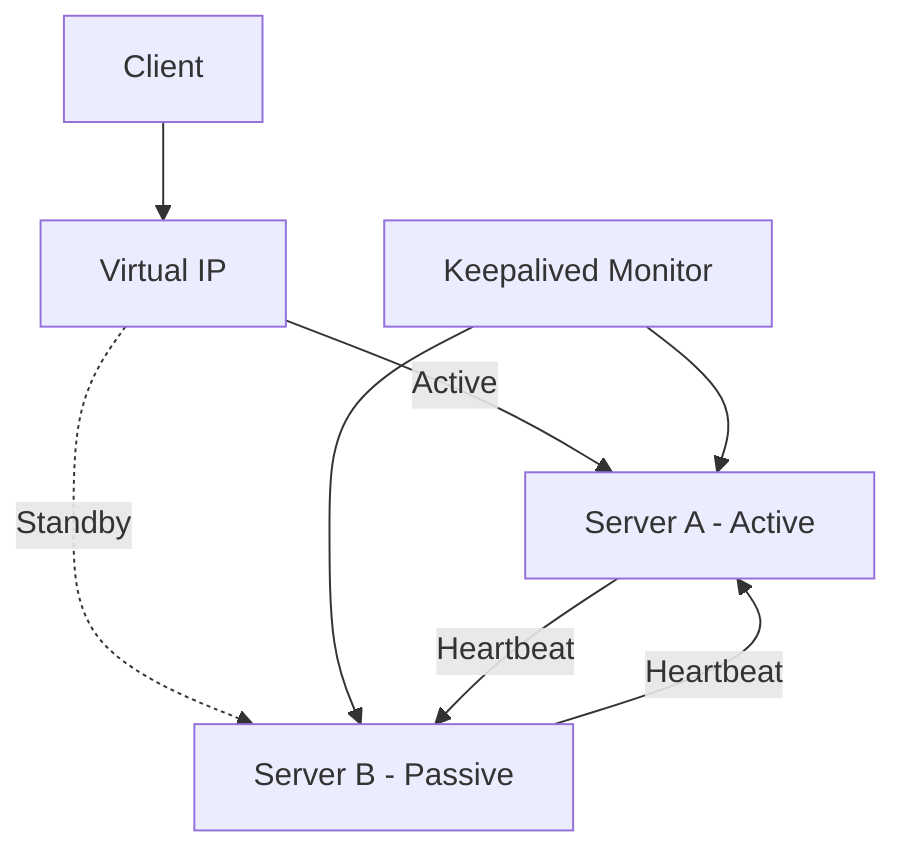

# Nginx Active-Passive Setup

## Introduction

High availability is a critical aspect of modern web infrastructure. It ensures that your web applications remain accessible even when hardware fails or during maintenance periods. One common approach to achieving high availability with Nginx is the **Active-Passive** setup.

In an Active-Passive configuration, two or more Nginx servers are deployed where only one server (the active or primary node) handles all the traffic at any given time. The other servers (passive or standby nodes) remain on standby, ready to take over if the active server fails. This approach provides failover capability with minimal complexity.

## Prerequisites

Before we dive into the setup, make sure you have:

- At least two servers with Nginx installed
- Basic knowledge of Linux commands
- Sudo/root access to your servers
- Understanding of basic networking concepts

## How Active-Passive Works

In an Nginx Active-Passive configuration:

1. The active server handles all incoming requests
2. A monitoring system constantly checks the health of the active server
3. If the active server fails, the passive server is promoted to active
4. Traffic is automatically redirected to the newly active server

Let's visualize this architecture:



## Setting Up an Nginx Active-Passive Configuration

Let's walk through the process of creating an Active-Passive setup using Nginx and Keepalived.

### Step 1: Install Required Software

First, we need to install Nginx and Keepalived on both servers:

```bash
# On both servers
sudo apt update
sudo apt install nginx keepalived
```

### Step 2: Configure Nginx

The basic Nginx configuration will be similar on both servers. Here's a simple example:

```nginx
# /etc/nginx/nginx.conf
user www-data;
worker_processes auto;
pid /run/nginx.pid;
include /etc/nginx/modules-enabled/*.conf;

events {
    worker_connections 768;
}

http {
    include /etc/nginx/mime.types;
    default_type application/octet-stream;
    
    access_log /var/log/nginx/access.log;
    error_log /var/log/nginx/error.log;
    
    include /etc/nginx/conf.d/*.conf;
    include /etc/nginx/sites-enabled/*;
}
```

### Step 3: Configure Keepalived on the Primary Server

Keepalived will manage the virtual IP (VIP) and handle failover. Here's the configuration for the primary server:

```bash
# /etc/keepalived/keepalived.conf on PRIMARY server
global_defs {
    router_id nginx_primary
}

vrrp_script check_nginx {
    script "/usr/bin/pgrep nginx"
    interval 2
    weight 2
}

vrrp_instance VI_1 {
    state MASTER
    interface eth0  # Change to your network interface
    virtual_router_id 51
    priority 101
    advert_int 1
    
    authentication {
        auth_type PASS
        auth_pass secret_password  # Change this to a secure password
    }
    
    virtual_ipaddress {
        192.168.1.100  # Virtual IP address - change to your network
    }
    
    track_script {
        check_nginx
    }
}
```

### Step 4: Configure Keepalived on the Secondary Server

The configuration for the secondary server is similar but with a lower priority:

```bash
# /etc/keepalived/keepalived.conf on SECONDARY server
global_defs {
    router_id nginx_secondary
}

vrrp_script check_nginx {
    script "/usr/bin/pgrep nginx"
    interval 2
    weight 2
}

vrrp_instance VI_1 {
    state BACKUP
    interface eth0  # Change to your network interface
    virtual_router_id 51
    priority 100  # Lower priority than primary
    advert_int 1
    
    authentication {
        auth_type PASS
        auth_pass secret_password  # Same password as primary
    }
    
    virtual_ipaddress {
        192.168.1.100  # Same virtual IP as primary
    }
    
    track_script {
        check_nginx
    }
}
```

### Step 5: Create a Health Check Script (Optional but Recommended)

For more robust health checking, create a script that verifies Nginx is not just running but serving correctly:

```bash
# /etc/keepalived/check_nginx.sh
#!/bin/bash

# Check if nginx is running
if ! pgrep nginx > /dev/null; then
    exit 1
fi

# Check if nginx can serve a page
if ! curl -s --head http://localhost | grep -q "200 OK"; then
    exit 1
fi

# All checks passed
exit 0
```

Make the script executable:

```bash
sudo chmod +x /etc/keepalived/check_nginx.sh
```

Then update your Keepalived configuration to use this script:

```bash
vrrp_script check_nginx {
    script "/etc/keepalived/check_nginx.sh"
    interval 2
    weight 2
}
```

### Step 6: Start Services

Now start Nginx and Keepalived on both servers:

```bash
# On both servers
sudo systemctl start nginx
sudo systemctl enable nginx
sudo systemctl start keepalived
sudo systemctl enable keepalived
```

## Testing the Setup

To verify your active-passive setup is working correctly, perform these tests:

### Test 1: Verify Virtual IP Assignment

Check that the VIP is assigned to the primary server:

```bash
# On the primary server
ip addr show eth0
```

You should see the virtual IP (192.168.1.100 in our example) listed.

### Test 2: Test Failover

1. Send traffic to the virtual IP
2. Shut down Nginx on the primary server:
   ```bash
   sudo systemctl stop nginx
   ```
3. Check that the VIP has moved to the secondary server:
   ```bash
   # On the secondary server
   ip addr show eth0
   ```
4. Verify traffic is still being served correctly

### Expected Output:

When you check the IP address on the primary server before failover:

```
2: eth0: <BROADCAST,MULTICAST,UP,LOWER_UP> mtu 1500 qdisc pfifo_fast state UP group default qlen 1000
    link/ether 00:0c:29:3d:5e:ce brd ff:ff:ff:ff:ff:ff
    inet 192.168.1.10/24 brd 192.168.1.255 scope global eth0
    inet 192.168.1.100/32 scope global eth0
    inet6 fe80::20c:29ff:fe3d:5ece/64 scope link
       valid_lft forever preferred_lft forever
```

After stopping Nginx on the primary, the VIP should appear on the secondary server:

```
2: eth0: <BROADCAST,MULTICAST,UP,LOWER_UP> mtu 1500 qdisc pfifo_fast state UP group default qlen 1000
    link/ether 00:0c:29:4d:6f:df brd ff:ff:ff:ff:ff:ff
    inet 192.168.1.11/24 brd 192.168.1.255 scope global eth0
    inet 192.168.1.100/32 scope global eth0
    inet6 fe80::20c:29ff:fe4d:6fdf/64 scope link
       valid_lft forever preferred_lft forever
```

## Real-World Scenarios and Best Practices

### Scenario 1: Maintenance with Zero Downtime

When you need to update your Nginx configuration or perform server maintenance:

1. Perform changes on the passive server first
2. Test the passive server configuration
3. Manually trigger failover to the passive server
4. Once traffic is on the newly active server, update the now-passive server

### Scenario 2: Handling Network Partitions

Network issues can cause "split-brain" scenarios where both servers think they're active. To prevent this:

1. Set up a third monitoring point (witness server)
2. Configure fencing mechanisms
3. Use a lower `advert_int` value for faster detection

### Best Practices

1. **Synchronize configuration files**: Use a file synchronization tool like `rsync` to keep Nginx configurations identical across servers
   ```bash
   rsync -avz /etc/nginx/ secondary-server:/etc/nginx/
   ```

2. **Monitor both servers**: Set up monitoring for both active and passive servers
   ```bash
   # Example Prometheus Node Exporter setup
   sudo apt install prometheus-node-exporter
   ```

3. **Test failover regularly**: Schedule periodic failover tests to ensure the mechanism works
   ```bash
   # Test script example
   #!/bin/bash
   echo "Stopping Nginx on primary..."
   ssh primary-server "sudo systemctl stop nginx"
   sleep 10
   echo "Checking if secondary took over..."
   curl -I http://virtual-ip
   echo "Restarting Nginx on primary..."
   ssh primary-server "sudo systemctl start nginx"
   ```

4. **Secure your keepalived password**: Use a strong password in the authentication section

## Enhanced Configuration: Adding Email Notifications

To receive alerts when failover occurs, add email notifications to your Keepalived configuration:

```bash
# Add to global_defs section
global_defs {
    router_id nginx_primary
    notification_email {
        admin@example.com
    }
    notification_email_from keepalived@example.com
    smtp_server 127.0.0.1
    smtp_connect_timeout 30
}
```

## Summary

An Nginx Active-Passive setup provides a straightforward way to achieve high availability for your web services. By using Keepalived to manage a virtual IP address and monitor the health of your Nginx servers, you can ensure that your services remain available even when a server fails.

Key points to remember:
- Only one server (active) handles traffic at any time
- Failover is automatic when the active server fails
- Configuration should be synchronized between servers
- Regular testing ensures reliable failover

## Additional Resources and Exercises

### Further Learning

- Nginx official documentation: [High Availability Guide](https://docs.nginx.com/)
- Keepalived documentation: [Keepalived User Guide](https://keepalived.org/doc/)

### Exercises

1. **Basic**: Set up an Active-Passive configuration in a virtual environment or cloud provider
2. **Intermediate**: Add custom health checks that verify application functionality, not just Nginx
3. **Advanced**: Expand the setup to include three servers for added redundancy
4. **Expert**: Integrate with a configuration management system like Ansible to automate the setup and synchronization

By mastering Nginx Active-Passive setups, you'll have a solid foundation for building highly available web infrastructure that keeps your applications running smoothly even during server failures.