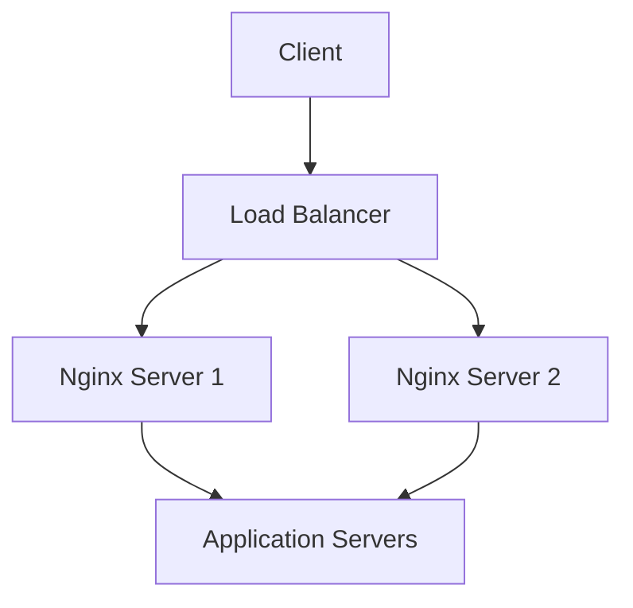
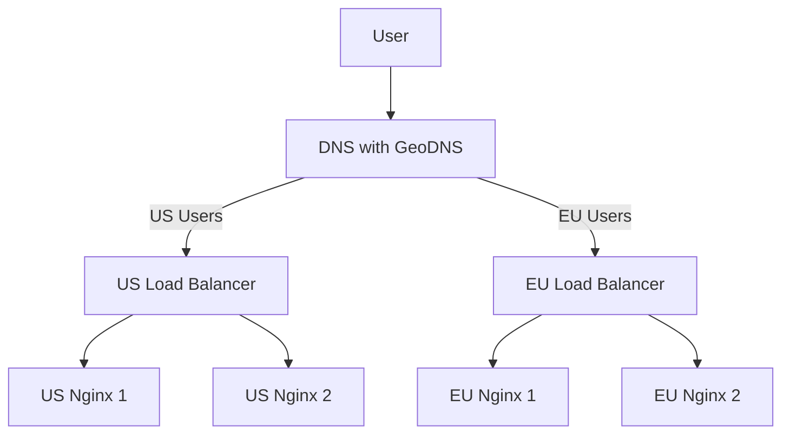

# Nginx Active-Active Setup

## Introduction

High availability is a critical aspect of modern web infrastructure that ensures your applications remain accessible even when components fail. In this guide, we'll explore the **Active-Active** setup for Nginx, which is one of the most powerful high availability architectures.

An Active-Active setup consists of multiple Nginx instances that simultaneously handle traffic, distributing the load while providing redundancy. Unlike Active-Passive setups where standby servers remain idle until needed, Active-Active setups maximize resource utilization by keeping all servers operational.

## Active-Active vs. Active-Passive

Before diving into implementation, let's understand the key differences:

| Feature | Active-Active | Active-Passive |
|---------|--------------|----------------|
| Resource Utilization | All servers actively handle traffic | Standby servers remain idle until failover |
| Scalability | Higher - can handle more concurrent traffic | Lower - limited to capacity of active server |
| Complexity | Higher - requires load balancing and state sharing | Lower - simpler failover mechanism |
| Cost | Higher initial cost but better resource utilization | Lower initial cost but wasted standby resources |

## Prerequisites

Before setting up an Active-Active configuration, ensure you have:

- At least two servers with Nginx installed
- Basic understanding of networking concepts
- A load balancer (hardware or software)
- DNS management access (for certain setups)

## Basic Active-Active Architecture



## Step-by-Step Implementation

### Step 1: Set Up Multiple Nginx Instances

First, we need to install and configure Nginx on multiple servers. Let's assume we have two servers with IPs `192.168.1.10` and `192.168.1.11`.

On both servers, install Nginx:

```bash
# For Ubuntu/Debian
sudo apt update
sudo apt install nginx

# For CentOS/RHEL
sudo yum install epel-release
sudo yum install nginx
```

### Step 2: Configure Identical Nginx Instances

Each Nginx server should have identical configurations to ensure consistent behavior. Here's a basic configuration for both servers:

```nginx
# /etc/nginx/nginx.conf
user nginx;
worker_processes auto;
error_log /var/log/nginx/error.log warn;
pid /var/run/nginx.pid;

events {
    worker_connections 1024;
}

http {
    include /etc/nginx/mime.types;
    default_type application/octet-stream;
    
    log_format main '$remote_addr - $remote_user [$time_local] "$request" '
                    '$status $body_bytes_sent "$http_referer" '
                    '"$http_user_agent" "$http_x_forwarded_for"';
    
    access_log /var/log/nginx/access.log main;
    
    sendfile on;
    keepalive_timeout 65;
    
    # Include server configurations
    include /etc/nginx/conf.d/*.conf;
}
```

Now, create a server configuration:

```nginx
# /etc/nginx/conf.d/default.conf
server {
    listen 80;
    server_name example.com;

    location / {
        root /usr/share/nginx/html;
        index index.html;
        
        # Add X-Server header to identify which server responded
        add_header X-Server $hostname;
    }
}
```

The `add_header X-Server $hostname;` line adds a custom header that helps identify which server processed the request – useful for testing your setup.

### Step 3: Set Up Load Balancing

There are several ways to implement load balancing. We'll cover two common approaches:

#### Option A: Using a Dedicated Load Balancer

You can use HAProxy, a popular software load balancer. On your load balancer server:

```bash
# Install HAProxy on Ubuntu/Debian
sudo apt update
sudo apt install haproxy
```

Configure HAProxy:

```
# /etc/haproxy/haproxy.cfg
global
    log /dev/log local0
    log /dev/log local1 notice
    user haproxy
    group haproxy
    daemon

defaults
    log global
    mode http
    option httplog
    option dontlognull
    timeout connect 5000
    timeout client 50000
    timeout server 50000

frontend http_front
    bind *:80
    default_backend http_back

backend http_back
    balance roundrobin
    option httpchk HEAD / HTTP/1.1\r
Host:\ example.com
    server nginx1 192.168.1.10:80 check
    server nginx2 192.168.1.11:80 check
```

#### Option B: Using Nginx as a Load Balancer

Alternatively, you can use another Nginx instance as a load balancer:

```nginx
# Load balancer Nginx configuration
http {
    # ...existing configuration...
    
    upstream backend {
        server 192.168.1.10:80;
        server 192.168.1.11:80;
        
        # Optional: Advanced load balancing methods
        # least_conn; # Use least connections method
        # ip_hash;    # Session persistence based on client IP
    }
    
    server {
        listen 80;
        server_name example.com;
        
        location / {
            proxy_pass http://backend;
            proxy_set_header Host $host;
            proxy_set_header X-Real-IP $remote_addr;
            proxy_set_header X-Forwarded-For $proxy_add_x_forwarded_for;
        }
    }
}
```

### Step 4: Configure Session Persistence (if needed)

For applications that require session persistence, you have several options:

#### IP Hash Method

```nginx
upstream backend {
    ip_hash;
    server 192.168.1.10:80;
    server 192.168.1.11:80;
}
```

This method ensures that requests from the same client IP always go to the same server.

#### Cookie-Based Persistence

```nginx
upstream backend {
    server 192.168.1.10:80;
    server 192.168.1.11:80;
}

server {
    # ...
    
    location / {
        proxy_pass http://backend;
        
        # Enable sticky sessions
        proxy_cookie_path / "/; SameSite=strict; HttpOnly";
        
        # Add a cookie to track which server was used
        add_header Set-Cookie "srv=$upstream_addr;Path=/;";
    }
}
```

### Step 5: Health Checks and Monitoring

Implement health checks to ensure traffic is only sent to healthy servers:

```nginx
# HAProxy health check (already shown above)
option httpchk HEAD / HTTP/1.1\r
Host:\ example.com

# Nginx health check (in load balancer configuration)
upstream backend {
    server 192.168.1.10:80 max_fails=3 fail_timeout=30s;
    server 192.168.1.11:80 max_fails=3 fail_timeout=30s;
}
```

For more advanced monitoring, consider setting up:

```nginx
server {
    # ...
    
    location /nginx_status {
        stub_status on;
        allow 127.0.0.1;  # Only allow local access
        deny all;
    }
}
```

### Step 6: Synchronizing Content

To ensure consistent content across all servers, you can use:

#### Option A: Shared Storage

Mount a shared NFS volume on both servers:

```bash
# On NFS server
sudo apt install nfs-kernel-server
echo "/usr/share/nginx/html *(rw,sync,no_subtree_check)" >> /etc/exports
sudo exportfs -a

# On Nginx servers
sudo apt install nfs-common
sudo mount nfs-server:/usr/share/nginx/html /usr/share/nginx/html
```

Add to `/etc/fstab` for persistence:

```
nfs-server:/usr/share/nginx/html /usr/share/nginx/html nfs defaults 0 0
```

#### Option B: Rsync for Content Synchronization

Create a script to sync content:

```bash
#!/bin/bash
# sync_content.sh

rsync -avz --delete /usr/share/nginx/html/ nginx2:/usr/share/nginx/html/
```

Set up a cron job to run regularly:

```bash
# Run every 5 minutes
*/5 * * * * /path/to/sync_content.sh
```

## Real-World Example: E-commerce Website

Let's apply this to a real-world scenario - an e-commerce website with static content, API endpoints, and user sessions.

### Configuration Example

```nginx
# Load balancer configuration
upstream frontend_servers {
    ip_hash;  # Keep users on the same server for session consistency
    server 192.168.1.10:80 max_fails=3 fail_timeout=30s;
    server 192.168.1.11:80 max_fails=3 fail_timeout=30s;
}

upstream api_servers {
    least_conn;  # Use server with fewest connections for API calls
    server 192.168.1.10:80 max_fails=3 fail_timeout=30s;
    server 192.168.1.11:80 max_fails=3 fail_timeout=30s;
}

server {
    listen 80;
    server_name shop.example.com;
    
    # Static content
    location / {
        proxy_pass http://frontend_servers;
        proxy_set_header Host $host;
        proxy_set_header X-Real-IP $remote_addr;
        
        # Cache control for static assets
        location ~* \.(jpg|jpeg|png|gif|ico|css|js)$ {
            proxy_pass http://frontend_servers;
            expires 30d;
            add_header Cache-Control "public, max-age=2592000";
        }
    }
    
    # API endpoints
    location /api/ {
        proxy_pass http://api_servers;
        proxy_set_header Host $host;
        proxy_set_header X-Real-IP $remote_addr;
        
        # No caching for API responses
        add_header Cache-Control "no-store, no-cache, must-revalidate";
    }
}
```

On each Nginx server, we set up the application configuration:

```nginx
# Application server configuration (/etc/nginx/conf.d/shop.conf)
server {
    listen 80;
    
    root /usr/share/nginx/html/shop;
    index index.html;
    
    # Static content handling
    location / {
        try_files $uri $uri/ /index.html;
    }
    
    # API proxy to application server
    location /api/ {
        proxy_pass http://localhost:3000;
        proxy_http_version 1.1;
        proxy_set_header Upgrade $http_upgrade;
        proxy_set_header Connection 'upgrade';
        proxy_set_header Host $host;
        proxy_cache_bypass $http_upgrade;
    }
}
```

## Testing Your Active-Active Setup

After setting everything up, test your configuration to ensure it works as expected:

1. **Basic connectivity test**:
   ```bash
   curl -I http://example.com
   ```

2. **Server identification test** (to verify both servers are being used):
   ```bash
   # Run multiple times to see different servers responding
   for i in {1..10}; do curl -s -I http://example.com | grep X-Server; done
   ```

3. **Failover test** (stop one server and check if traffic routes correctly):
   ```bash
   # On one Nginx server
   sudo systemctl stop nginx
   
   # Then test if the site is still accessible
   curl -I http://example.com
   ```

## Common Challenges and Solutions

### Challenge 1: Session Persistence Issues

**Problem**: Users get logged out when switching between servers.

**Solution**: Implement sticky sessions using IP hash or cookies, or use a centralized session store like Redis:

```nginx
# Redis session store in your application
# Then configure Nginx for basic load balancing without requiring sticky sessions
upstream backend {
    least_conn;  # Can use round-robin since sessions are stored externally
    server 192.168.1.10:80;
    server 192.168.1.11:80;
}
```

### Challenge 2: Uneven Load Distribution

**Problem**: One server receives more traffic than others.

**Solution**: Adjust load balancing methods or server weights:

```nginx
upstream backend {
    server 192.168.1.10:80 weight=3;  # This server gets 3x the connections
    server 192.168.1.11:80 weight=1;
}
```

### Challenge 3: Content Synchronization Delays

**Problem**: Content updates don't appear simultaneously across all servers.

**Solution**: Use a shared file system or implement a deployment pipeline that updates all servers concurrently.

## Advanced Configuration: Geographic Distribution

For globally distributed applications, you can set up Active-Active across multiple regions:



## Summary

An Active-Active Nginx setup provides several key benefits:

- **High Availability**: If one server fails, others continue serving traffic
- **Scalability**: Easily add more servers to handle increased load
- **Load Distribution**: Distribute traffic across multiple servers for better performance
- **No Wasted Resources**: All servers actively handle requests, maximizing resource utilization

Setting up an Active-Active configuration involves:
1. Installing Nginx on multiple servers
2. Configuring identical server setups
3. Implementing a load balancing mechanism
4. Setting up health checks and monitoring
5. Ensuring content consistency across servers

By following these steps, you can create a robust, high-availability infrastructure that keeps your applications running smoothly even in the face of server failures or traffic spikes.

## Additional Resources

- [Nginx Official Documentation](https://nginx.org/en/docs/)
- [Nginx Load Balancing Guide](https://docs.nginx.com/nginx/admin-guide/load-balancer/http-load-balancer/)
- [HAProxy Documentation](http://www.haproxy.org/#docs)

## Exercises

1. **Basic Setup**: Configure a simple Active-Active setup with two Nginx servers and a load balancer.
2. **Failover Testing**: Create a script that simulates server failure and tests the failover process.
3. **Performance Comparison**: Benchmark performance difference between a single Nginx server and an Active-Active setup under heavy load.
4. **Session Persistence**: Implement and test different session persistence methods to determine which works best for your application.
5. **Geographic Distribution**: Design a globally distributed Active-Active setup with servers in multiple regions and appropriate routing logic.