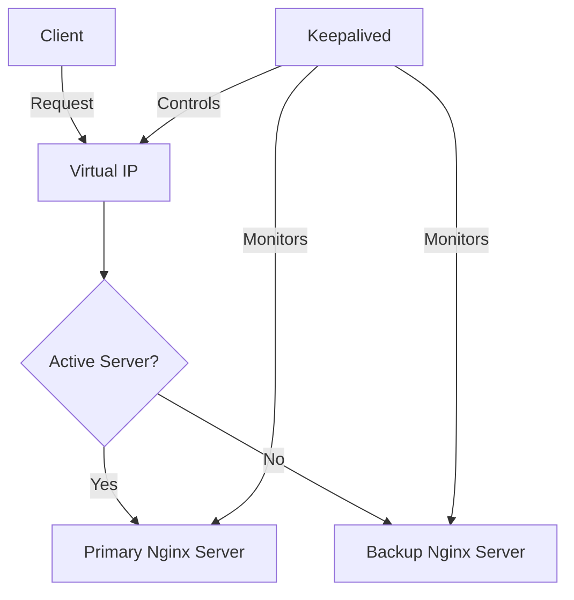

# Nginx Keepalived Integration

## Introduction

In today's digital landscape, ensuring your websites and applications remain accessible without downtime is critical. When your Nginx server goes down, users may encounter service interruptions, resulting in poor user experience and potential loss of business. **Nginx Keepalived Integration** solves this problem by providing high availability for your Nginx deployments.

This guide explores how to integrate Keepalived with Nginx to create a failover system where if your primary server fails, a backup server automatically takes over, ensuring continuous service availability.

## What is Keepalived?

Keepalived is an open-source software that provides high availability functionality through VRRP (Virtual Router Redundancy Protocol). It enables automatic failover by:

1. Monitoring the health of Nginx instances
2. Managing a shared virtual IP address (VIP)
3. Transferring the VIP to a healthy backup server when the primary server fails

## How Nginx and Keepalived Work Together



In this architecture:
- Multiple Nginx servers are configured identically
- Keepalived monitors the health of Nginx on each server
- A virtual IP address floats between servers
- When the active server fails, Keepalived moves the virtual IP to a healthy backup

## Prerequisites

Before we begin, ensure you have:

- Two or more servers (physical or virtual)
- Root or sudo access on each server
- Basic understanding of networking concepts
- Nginx installed on all servers
- Linux operating system (Ubuntu/Debian or CentOS/RHEL)

## Step-by-Step Implementation

### Step 1: Install Keepalived

#### On Debian/Ubuntu:

```bash
sudo apt update
sudo apt install keepalived
```

#### On CentOS/RHEL:

```bash
sudo yum install keepalived
```

### Step 2: Configure Nginx

Ensure Nginx is installed and configured similarly on both servers.

Create a simple status page to check Nginx's health:

```bash
sudo mkdir -p /usr/share/nginx/html/status
sudo sh -c 'echo "OK" > /usr/share/nginx/html/status/index.html'
```

Add a status location to your Nginx configuration:

```nginx
server {
    listen 80;
    
    # Other server configurations
    
    location /status {
        access_log off;
        return 200 'OK';
    }
}
```

Restart Nginx to apply changes:

```bash
sudo systemctl restart nginx
```

### Step 3: Create a Keepalived Check Script

Create a script to check if Nginx is running correctly:

```bash
sudo nano /etc/keepalived/check_nginx.sh
```

Add the following content:

```bash
#!/bin/bash

# Check if nginx process is running
if [ -z "$(pidof nginx)" ]; then
    exit 1
fi

# Check if nginx is responding
if [ -z "$(curl -s http://localhost/status)" ]; then
    exit 1
fi

exit 0
```

Make the script executable:

```bash
sudo chmod +x /etc/keepalived/check_nginx.sh
```

### Step 4: Configure Keepalived

#### On Primary Server:

```bash
sudo nano /etc/keepalived/keepalived.conf
```

Add the following configuration:

```
vrrp_script check_nginx {
    script "/etc/keepalived/check_nginx.sh"
    interval 2   # Check every 2 seconds
    weight 2     # Add 2 points if check is successful
    fall 2       # Require 2 failures to mark as failed
    rise 1       # Require 1 success to mark as recovered
}

vrrp_instance VI_1 {
    state MASTER
    interface eth0          # Update with your network interface
    virtual_router_id 51    # Must be the same on all nodes
    priority 101            # Higher value means higher priority
    advert_int 1
    
    authentication {
        auth_type PASS
        auth_pass YourSecurePassword  # Use a secure password
    }
    
    virtual_ipaddress {
        192.168.1.100/24   # Your virtual IP address
    }
    
    track_script {
        check_nginx
    }
}
```

#### On Backup Server:

Use the same configuration but change:

```
state BACKUP
priority 100            # Lower than the MASTER priority
```

### Step 5: Enable IP Forwarding

On both servers:

```bash
sudo sysctl -w net.ipv4.ip_nonlocal_bind=1
sudo sysctl -w net.ipv4.ip_forward=1
```

To make these changes permanent:

```bash
echo "net.ipv4.ip_nonlocal_bind=1" | sudo tee -a /etc/sysctl.conf
echo "net.ipv4.ip_forward=1" | sudo tee -a /etc/sysctl.conf
```

### Step 6: Start and Enable Keepalived Service

On both servers:

```bash
sudo systemctl start keepalived
sudo systemctl enable keepalived
```

## Testing the Setup

### Check Virtual IP Assignment

On the primary server:

```bash
ip addr show eth0
```

You should see the virtual IP (192.168.1.100) assigned to the interface.

### Test Failover

1. Simulate failure on the primary server:

```bash
sudo systemctl stop nginx   # Or stop keepalived
```

2. Check if the virtual IP moves to the backup server:

```bash
# On backup server
ip addr show eth0
```

3. Verify client requests still work:

```bash
curl http://192.168.1.100   # Should return response from backup server
```

## Real-World Applications

### E-commerce Website

For an online store, you could implement:

```nginx
upstream backend {
    server app1.example.com;
    server app2.example.com backup;
}

server {
    listen 80;
    server_name shop.example.com;
    
    location / {
        proxy_pass http://backend;
        proxy_set_header Host $host;
        proxy_set_header X-Real-IP $remote_addr;
    }
}
```

With Keepalived managing the virtual IP, customers won't experience downtime even during server maintenance.

### API Gateway

For a microservices architecture:

```nginx
server {
    listen 80;
    server_name api.example.com;
    
    location /users {
        proxy_pass http://users-service;
    }
    
    location /products {
        proxy_pass http://products-service;
    }
    
    location /status {
        access_log off;
        return 200 'OK';
    }
}
```

Combined with Keepalived, this ensures your API gateway remains reliable.

## Common Issues and Troubleshooting

### Virtual IP Not Assigned

If the virtual IP isn't assigned:

```bash
# Check keepalived logs
sudo journalctl -u keepalived

# Ensure firewalls allow VRRP traffic (port 112)
sudo iptables -A INPUT -p vrrp -j ACCEPT
```

### Both Servers Claiming the Virtual IP

This split-brain issue can occur if servers can't communicate:

```bash
# Ensure servers can ping each other
ping otherserver

# Check for correct virtual_router_id in configs
sudo grep virtual_router_id /etc/keepalived/keepalived.conf
```

### Nginx Health Check Failing

If Nginx checks fail but Nginx is running:

```bash
# Test the check script manually
sudo /etc/keepalived/check_nginx.sh
echo $?  # Should return 0 if successful

# Check if the status URL is accessible
curl http://localhost/status
```

## Advanced Configuration

### Multiple Virtual IPs

You can configure multiple services with different virtual IPs:

```
vrrp_instance WEB_1 {
    virtual_ipaddress {
        192.168.1.100/24   # Web service VIP
    }
}

vrrp_instance API_1 {
    virtual_ipaddress {
        192.168.1.101/24   # API service VIP
    }
}
```

### Email Notifications

Add email notifications when failover occurs:

```
global_defs {
    notification_email {
        admin@example.com
    }
    notification_email_from keepalived@example.com
    smtp_server 127.0.0.1
    smtp_connect_timeout 30
}
```

## Summary

Integrating Nginx with Keepalived provides a robust high availability solution that ensures your web services remain accessible even when individual servers fail. This setup is particularly valuable for production environments where downtime must be minimized.

By implementing Nginx Keepalived integration, you've learned:
- How to set up automatic failover for Nginx servers
- How to configure health checks for reliable operation
- How to manage a virtual IP that floats between servers
- Real-world applications for high availability Nginx

## Additional Resources

- [Keepalived Official Documentation](http://www.keepalived.org/doc/)
- [Nginx Documentation](https://nginx.org/en/docs/)
- [Understanding VRRP Protocol](https://tools.ietf.org/html/rfc5798)

## Practice Exercises

1. Set up a three-node Keepalived cluster with one master and two backup servers.
2. Configure different priorities for backup servers to create a specific failover order.
3. Create custom notification scripts that send alerts through different channels (Slack, Teams, etc.) when failover occurs.
4. Implement a scenario where different services failover independently to different backup servers.
5. Design and implement a geographic failover setup where backup servers are in different data centers.