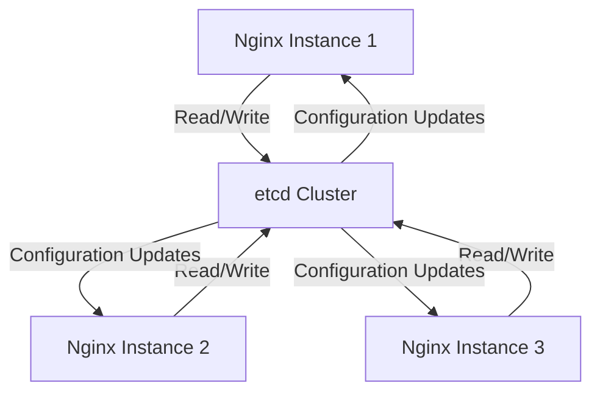

# Nginx State Sharing

When running multiple Nginx instances for high availability, one challenge you'll face is how to share state information between these instances. This is crucial for features like session persistence, rate limiting across a cluster, and maintaining consistent configurations.

## Introduction to State Sharing

In a high availability setup, multiple Nginx instances work together to ensure your web services remain accessible even if one instance fails. However, these instances need to coordinate and share certain information to function as a cohesive unit.

State sharing in Nginx refers to the mechanisms that allow multiple Nginx instances to exchange and synchronize data, such as:

- Session information
- Rate limiting counters
- SSL session caches
- Runtime configurations

Without proper state sharing, issues like inconsistent user experiences, broken sticky sessions, and uneven rate limiting can occur.

## Why State Sharing Matters

Consider this scenario:

1. A user logs into your application, and their session is handled by Nginx instance A
2. Instance A fails or becomes unavailable
3. The user's next request is routed to instance B
4. Without state sharing, instance B has no knowledge of the user's session

This creates a poor user experience as the user may need to log in again or lose their progress.

Let's explore the various methods to implement state sharing in Nginx.

## Common State Sharing Methods

### 1. Sticky Sessions with IP Hash

One straightforward approach is to ensure that requests from the same client always go to the same Nginx instance using sticky sessions.

```nginx
upstream backend {
    ip_hash;
    server backend1.example.com;
    server backend2.example.com;
    server backend3.example.com;
}
```

The `ip_hash` directive ensures that clients from the same IP address are consistently routed to the same backend server. While simple, this approach has limitations:

- It doesn't truly share state; it just avoids the need to
- If a server fails, sessions for clients assigned to that server are lost
- Clients behind a shared NAT appear as a single IP address

### 2. Shared Memory Zones

Nginx Plus (the commercial version) supports shared memory zones that can be used across multiple Nginx instances on the same machine.

```nginx
# Define a shared memory zone for rate limiting
limit_req_zone $binary_remote_addr zone=mylimit:10m rate=1r/s;

server {
    location /api/ {
        # Use the shared memory zone
        limit_req zone=mylimit burst=5;
        proxy_pass http://backend;
    }
}
```

This approach works well for instances on the same physical machine but doesn't help with cross-server state sharing.

### 3. External State Store

For true cross-server state sharing, you'll need an external data store. Common options include:

#### Redis for Session Storage

```nginx
http {
    # Load the Redis module
    load_module modules/ngx_http_redis_module.so;
    
    # Set up upstream Redis servers
    upstream redis_servers {
        server redis1.example.com:6379;
        server redis2.example.com:6379 backup;
    }
    
    server {
        location / {
            # Use Redis for session storage
            set $redis_key "session:$cookie_sessionid";
            redis_pass redis_servers;
        }
    }
}
```

#### Using Lua with External Datastores

With the Lua module (OpenResty), you can implement custom state sharing logic:

```nginx
http {
    lua_shared_dict sessions 10m;
    
    init_by_lua_block {
        local redis = require "resty.redis"
        -- Initialize Redis connection pool
    }
    
    server {
        location / {
            access_by_lua_block {
                -- Check if session exists in local shared dictionary
                local session = ngx.shared.sessions:get(ngx.var.cookie_sessionid)
                
                if not session then
                    -- If not in local cache, check Redis
                    local redis = redis:new()
                    redis:connect("redis.example.com", 6379)
                    session = redis:get("session:" .. ngx.var.cookie_sessionid)
                    
                    -- Store in local cache for future requests
                    if session then
                        ngx.shared.sessions:set(ngx.var.cookie_sessionid, session, 3600)
                    end
                end
                
                -- Use session data
            }
        }
    }
}
```

## Key-Value Store for Configuration Sharing

Let's examine how to use a key-value store like etcd for sharing configuration:



Implementation using Nginx Plus API:

```nginx
http {
    server {
        listen 8080;
        
        # API endpoint for configuration management
        location /api/ {
            api;
            # Restrict access to internal networks
            allow 127.0.0.1;
            allow 192.168.0.0/24;
            deny all;
        }
    }
}
```

Then, you can use a script that:
1. Monitors the key-value store for changes
2. Updates the Nginx configuration via the API when changes occur

## Implementing Sticky Sessions with Consistent Hashing

For more advanced load balancing with better state distribution, consistent hashing provides advantages over simple ip_hash:

```nginx
upstream backend {
    hash $cookie_jsessionid consistent;
    
    server backend1.example.com:8080 max_fails=3 fail_timeout=30s;
    server backend2.example.com:8080 max_fails=3 fail_timeout=30s;
    server backend3.example.com:8080 max_fails=3 fail_timeout=30s;
}

server {
    listen 80;
    
    location / {
        proxy_pass http://backend;
        proxy_set_header Host $host;
        proxy_set_header X-Real-IP $remote_addr;
        
        # Set and pass along the session cookie
        proxy_cookie_path / "/; HttpOnly; SameSite=Lax";
    }
}
```

The `consistent` parameter ensures that when a server is added or removed, only a minimal portion of requests are redistributed.

## SSL Session Cache Sharing

To improve SSL performance across multiple Nginx instances, you can share the SSL session cache:

```nginx
http {
    # Configure shared SSL session cache
    ssl_session_cache shared:SSL:10m;
    ssl_session_timeout 10m;
    
    server {
        listen 443 ssl;
        server_name example.com;
        
        ssl_certificate /etc/nginx/ssl/example.com.crt;
        ssl_certificate_key /etc/nginx/ssl/example.com.key;
        
        # Use the shared SSL session cache
        ssl_session_cache shared:SSL:10m;
    }
}
```

For cross-server SSL session sharing, you can use the following approach with a Redis backend and Lua:

```nginx
http {
    lua_shared_dict ssl_sessions 10m;
    
    init_by_lua_block {
        local ssl = require "ngx.ssl"
        local redis = require "resty.redis"
        
        -- Function to save sessions to Redis
        function save_session(session_id, session_data)
            local red = redis:new()
            red:connect("redis.example.com", 6379)
            red:set("ssl:session:" .. session_id, session_data)
            red:expire("ssl:session:" .. session_id, 3600)  -- 1 hour expiry
        end
        
        -- Function to load sessions from Redis
        function load_session(session_id)
            local red = redis:new()
            red:connect("redis.example.com", 6379)
            return red:get("ssl:session:" .. session_id)
        end
    }
    
    server {
        listen 443 ssl;
        server_name example.com;
        
        ssl_certificate /etc/nginx/ssl/example.com.crt;
        ssl_certificate_key /etc/nginx/ssl/example.com.key;
        
        ssl_session_fetch_by_lua_block {
            local ssl = require "ngx.ssl"
            local session_id = ssl.get_session_id()
            
            -- Try to get from local cache first
            local session = ngx.shared.ssl_sessions:get(session_id)
            
            if not session then
                -- If not in local cache, check Redis
                session = load_session(session_id)
                
                -- Store in local cache
                if session then
                    ngx.shared.ssl_sessions:set(session_id, session, 3600)
                end
            end
            
            if session then
                ssl.set_session(session)
            end
        }
        
        ssl_session_store_by_lua_block {
            local ssl = require "ngx.ssl"
            local session_id = ssl.get_session_id()
            local session = ssl.get_session()
            
            -- Store in local cache
            ngx.shared.ssl_sessions:set(session_id, session, 3600)
            
            -- Store in Redis for other Nginx instances
            save_session(session_id, session)
        }
    }
}
```

## Rate Limiting Across Multiple Nginx Instances

Distributed rate limiting ensures that limits are properly enforced across your entire cluster:

```nginx
# Using Redis for distributed rate limiting
http {
    lua_shared_dict rate_limit 10m;
    
    init_by_lua_block {
        local redis = require "resty.redis"
        local limit_req = require "resty.limit.req"
        
        -- Create a limit_req instance with Redis storage
        limiter = limit_req.new("rate_limit", 10, 5)
    }
    
    server {
        location /api/ {
            access_by_lua_block {
                local key = ngx.var.binary_remote_addr
                local delay, err = limiter:incoming(key, true)
                
                if not delay then
                    if err == "rejected" then
                        return ngx.exit(429)  -- Too Many Requests
                    end
                    ngx.log(ngx.ERR, "failed to limit request: ", err)
                    return ngx.exit(500)
                end
                
                if delay > 0 then
                    ngx.sleep(delay)
                end
            }
            
            # Continue with normal request processing
            proxy_pass http://backend;
        }
    }
}
```

## Practical Example: Complete High Availability Setup

Let's put everything together in a practical example that includes state sharing for a high availability Nginx setup:

```nginx
# Main Nginx configuration with state sharing
user nginx;
worker_processes auto;
error_log /var/log/nginx/error.log warn;
pid /var/run/nginx.pid;

events {
    worker_connections 1024;
}

http {
    include /etc/nginx/mime.types;
    default_type application/octet-stream;
    
    log_format main '$remote_addr - $remote_user [$time_local] "$request" '
                     '$status $body_bytes_sent "$http_referer" '
                     '"$http_user_agent" "$http_x_forwarded_for"';
    
    access_log /var/log/nginx/access.log main;
    
    # Load required modules
    load_module modules/ngx_http_lua_module.so;
    
    # Shared memory zone for local caching
    lua_shared_dict sessions 10m;
    lua_shared_dict rate_limits 10m;
    
    # Initialize Lua with Redis connection
    init_by_lua_block {
        local redis = require "resty.redis"
        
        -- Function to get Redis connection
        function get_redis()
            local red = redis:new()
            red:set_timeout(1000)  -- 1 second timeout
            
            local ok, err = red:connect("redis.example.com", 6379)
            if not ok then
                ngx.log(ngx.ERR, "Failed to connect to Redis: ", err)
                return nil
            end
            
            -- Optional: Authentication
            -- local ok, err = red:auth("password")
            
            return red
        end
        
        -- Function to release Redis connection
        function close_redis(red)
            if red then
                -- Put connection back into the pool
                local ok, err = red:set_keepalive(10000, 100)
                if not ok then
                    ngx.log(ngx.ERR, "Failed to set keepalive: ", err)
                end
            end
        end
    }
    
    # Upstream backend servers
    upstream app_servers {
        hash $cookie_sessionid consistent;
        
        server app1.example.com:8080 max_fails=3 fail_timeout=30s;
        server app2.example.com:8080 max_fails=3 fail_timeout=30s;
        server app3.example.com:8080 max_fails=3 fail_timeout=30s;
    }
    
    # Main server configuration
    server {
        listen 80;
        server_name example.com;
        
        # Redirect to HTTPS
        return 301 https://$host$request_uri;
    }
    
    server {
        listen 443 ssl;
        server_name example.com;
        
        # SSL configuration
        ssl_certificate /etc/nginx/ssl/example.com.crt;
        ssl_certificate_key /etc/nginx/ssl/example.com.key;
        ssl_protocols TLSv1.2 TLSv1.3;
        ssl_prefer_server_ciphers on;
        ssl_ciphers 'ECDHE-ECDSA-AES128-GCM-SHA256:ECDHE-RSA-AES128-GCM-SHA256:ECDHE-ECDSA-AES256-GCM-SHA384:ECDHE-RSA-AES256-GCM-SHA384';
        
        # Session sharing with Redis for SSL sessions
        ssl_session_fetch_by_lua_block {
            local ssl = require "ngx.ssl"
            local session_id = ssl.get_session_id()
            
            -- Try local cache first
            local session = ngx.shared.sessions:get("ssl:" .. session_id)
            
            if not session then
                -- Try Redis
                local red = get_redis()
                if red then
                    session = red:get("ssl:session:" .. session_id)
                    close_redis(red)
                    
                    -- Store in local cache if found
                    if session then
                        ngx.shared.sessions:set("ssl:" .. session_id, session, 3600)
                    end
                end
            end
            
            if session then
                ssl.set_session(session)
            end
        }
        
        ssl_session_store_by_lua_block {
            local ssl = require "ngx.ssl"
            local session_id = ssl.get_session_id()
            local session = ssl.get_session()
            
            -- Store in local cache
            ngx.shared.sessions:set("ssl:" .. session_id, session, 3600)
            
            -- Store in Redis
            local red = get_redis()
            if red then
                red:setex("ssl:session:" .. session_id, 3600, session)
                close_redis(red)
            end
        }
        
        # API rate limiting with Redis
        location /api/ {
            access_by_lua_block {
                local key = ngx.var.binary_remote_addr
                local limit = 10  -- requests per second
                local window = 1  -- 1 second window
                
                -- Try local cache first
                local current = ngx.shared.rate_limits:get(key) or 0
                
                if current == 0 then
                    -- Check Redis for current count
                    local red = get_redis()
                    if red then
                        current = red:get("rate:limit:" .. key) or 0
                        current = tonumber(current)
                        close_redis(red)
                    end
                end
                
                -- Increment counter
                current = current + 1
                
                -- Update local cache
                ngx.shared.rate_limits:set(key, current, window)
                
                -- Update Redis
                local red = get_redis()
                if red then
                    -- Use Redis for atomic increment and expiry
                    red:incr("rate:limit:" .. key)
                    red:expire("rate:limit:" .. key, window)
                    close_redis(red)
                end
                
                -- Check if limit exceeded
                if current > limit then
                    ngx.status = 429
                    ngx.header["Content-Type"] = "application/json"
                    ngx.say('{"error": "Too many requests"}')
                    return ngx.exit(429)
                end
            }
            
            # Proxy to backend
            proxy_pass http://app_servers;
            proxy_set_header Host $host;
            proxy_set_header X-Real-IP $remote_addr;
            proxy_set_header X-Forwarded-For $proxy_add_x_forwarded_for;
            proxy_set_header X-Forwarded-Proto $scheme;
        }
        
        # Session management for regular web traffic
        location / {
            access_by_lua_block {
                -- Get session ID from cookie
                local session_id = ngx.var.cookie_sessionid
                
                if session_id then
                    -- Try to get session from local cache
                    local session = ngx.shared.sessions:get("session:" .. session_id)
                    
                    if not session then
                        -- Try to get from Redis
                        local red = get_redis()
                        if red then
                            session = red:get("session:" .. session_id)
                            close_redis(red)
                            
                            -- Update local cache if found
                            if session then
                                ngx.shared.sessions:set("session:" .. session_id, session, 3600)
                            end
                        end
                    end
                    
                    -- Set session data in variable for potential use
                    if session then
                        ngx.var.session_data = session
                    end
                end
            }
            
            # Set custom header with session information if needed
            proxy_set_header X-Session-Data $session_data;
            
            # Proxy to backend
            proxy_pass http://app_servers;
            proxy_set_header Host $host;
            proxy_set_header X-Real-IP $remote_addr;
            proxy_set_header X-Forwarded-For $proxy_add_x_forwarded_for;
            proxy_set_header X-Forwarded-Proto $scheme;
            
            # Set cookie path for better security
            proxy_cookie_path / "/; HttpOnly; SameSite=Lax; Secure";
            
            # Handle session updates from backend
            header_filter_by_lua_block {
                -- Check for new session cookie
                local cookies = ngx.header["Set-Cookie"]
                if cookies then
                    -- Parse cookies to find session ID
                    if type(cookies) == "table" then
                        for _, cookie in ipairs(cookies) do
                            local session_id = string.match(cookie, "sessionid=([^;]+)")
                            if session_id then
                                -- Get session data from response headers
                                local session_data = ngx.resp.get_headers()["X-Session-Data"]
                                if session_data then
                                    -- Store in local cache
                                    ngx.shared.sessions:set("session:" .. session_id, session_data, 3600)
                                    
                                    -- Store in Redis
                                    local red = get_redis()
                                    if red then
                                        red:setex("session:" .. session_id, 3600, session_data)
                                        close_redis(red)
                                    end
                                end
                            end
                        end
                    else
                        local session_id = string.match(cookies, "sessionid=([^;]+)")
                        if session_id then
                            -- Similar processing for single cookie
                            -- (Code omitted for brevity but would be similar to above)
                        end
                    end
                end
            }
        }
    }
}
```

## Monitoring State Sharing

To ensure your state sharing solution is working correctly, monitor:

1. Redis metrics (if using Redis):
   - Memory usage
   - Connection counts
   - Command latency

2. Nginx state metrics:
   - Cache hit/miss ratios
   - Session expiry/eviction counts
   - Rate limiting statistics

You can use tools like Prometheus with the Nginx VTS module or the Nginx Plus API for monitoring.

## Summary

State sharing is essential for building robust high availability Nginx setups. In this guide, we've covered:

- The importance of state sharing in Nginx clusters
- Various methods for implementing state sharing:
  - Sticky sessions (simple but limited)
  - Shared memory zones (for single-machine setups)
  - External data stores like Redis (for true distributed state)
- Practical implementations for:
  - Session management
  - SSL session caching
  - Rate limiting
  - Configuration synchronization
- A complete example that combines multiple state sharing techniques

By implementing proper state sharing, you can ensure consistent user experiences, effective rate limiting, and seamless failover in your Nginx high availability setup.

## Additional Resources

- [Nginx Plus Documentation on Session Persistence](https://docs.nginx.com/nginx/admin-guide/load-balancer/http-load-balancer/#session-persistence)
- [OpenResty's Redis Library](https://github.com/openresty/lua-resty-redis)
- [Redis Documentation](https://redis.io/documentation)
- [Etcd Documentation for Configuration Management](https://etcd.io/docs/)

## Exercises

1. **Basic Exercise**: Set up a simple sticky session configuration using the `ip_hash` directive and test with multiple clients.

2. **Intermediate Exercise**: Implement a Redis-based session store using Lua and test session persistence across Nginx restarts.

3. **Advanced Exercise**: Build a complete high availability setup with:
   - Distributed rate limiting
   - Session sharing
   - SSL session caching
   - Configuration synchronization via a key-value store