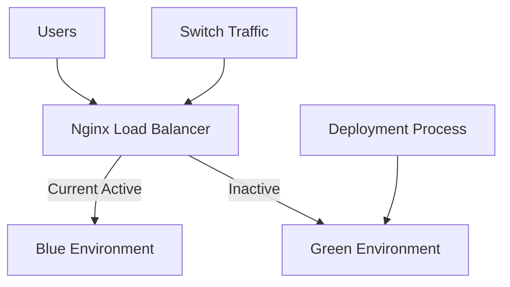

# Nginx Blue-Green Deployment

## Introduction

Blue-green deployment is a technique that reduces downtime and risk by running two identical production environments called Blue and Green. At any time, only one of the environments is live, serving all production traffic. As you prepare a new version of your application, you implement it in the environment that is not live (e.g., Green if Blue is currently live). Once the new version is tested and ready, you switch the router (in our case, Nginx) to direct traffic to the new environment. This approach ensures zero-downtime deployments and provides an instant rollback capability if something goes wrong.

In this guide, we'll explore how to implement blue-green deployments using Nginx as a reverse proxy to seamlessly transition between application versions.

## Why Use Blue-Green Deployments?

Before diving into implementation, let's understand the key benefits:

- **Zero downtime** during deployments
- **Immediate rollback** capability if issues are detected
- **Testing in production-like environment** before going live
- **Reduced risk** when deploying new versions
- **Simplified disaster recovery** process

## How Blue-Green Deployment Works

Here's a high-level overview of the blue-green deployment process:



The process typically follows these steps:

1. **Initial setup**: Deploy your application to both Blue and Green environments, with only one active
2. **Prepare new version**: Deploy the new version to the inactive environment
3. **Test new version**: Verify the new version works correctly in the inactive environment
4. **Switch traffic**: Update Nginx configuration to direct traffic to the newly updated environment
5. **Verify**: Monitor the new active environment to ensure everything works as expected
6. **Rollback (if needed)**: If issues are detected, switch back to the previous environment

## Implementation with Nginx

Let's implement a blue-green deployment setup using Nginx as our reverse proxy.

### Prerequisites

- Two server environments (Blue and Green) running your application
- Nginx installed on a separate server as a load balancer
- Basic understanding of Nginx configuration

### Step 1: Set Up Application Servers

First, we need to set up our two environments. For demonstration purposes, let's say we have:

- Blue environment running on server: `10.0.0.1:8080`
- Green environment running on server: `10.0.0.2:8080`

Each server should have your application installed, but they might be running different versions.

### Step 2: Basic Nginx Configuration

Here's a basic Nginx configuration for blue-green deployment:

```nginx
http {
    # Define upstream servers
    upstream blue {
        server 10.0.0.1:8080;
    }

    upstream green {
        server 10.0.0.2:8080;
    }

    # Create a variable to control which environment is live
    # Default to blue environment
    map $uri $pool {
        default "blue";
    }

    server {
        listen 80;
        server_name example.com;

        location / {
            proxy_pass http://$pool;
            proxy_set_header Host $host;
            proxy_set_header X-Real-IP $remote_addr;
            proxy_set_header X-Forwarded-For $proxy_add_x_forwarded_for;
            proxy_set_header X-Forwarded-Proto $scheme;
        }
    }
}
```

In this configuration, we've:

1. Defined two upstream server groups: `blue` and `green`
2. Created a `$pool` variable that determines which environment receives traffic
3. Set up a server block that uses the `$pool` variable to proxy requests

### Step 3: Using Nginx For Blue-Green Switching

To implement blue-green switching, we have several options:

#### Option 1: Using Symbolic Links

We can use symbolic links to point to the active configuration:

```bash
# Initial setup with blue as active
cd /etc/nginx/conf.d/
ln -sf blue-green-blue.conf blue-green-active.conf
nginx -s reload

# Switch to green when ready
ln -sf blue-green-green.conf blue-green-active.conf
nginx -s reload
```

The configuration files would look like:

**blue-green-blue.conf**:
```nginx
map $uri $pool {
    default "blue";
}
```

**blue-green-green.conf**:
```nginx
map $uri $pool {
    default "green";
}
```

And your main Nginx configuration would include:

```nginx
include /etc/nginx/conf.d/blue-green-active.conf;
```

#### Option 2: Using Environment Variables

We can use Nginx environment variables to control which environment is active:

```nginx
# In nginx.conf
env DEPLOY_ENV;

http {
    # Use environment variable with default fallback to "blue"
    map $env_DEPLOY_ENV $pool {
        default "blue";
        "green" "green";
    }
    
    # Rest of the configuration remains the same
}
```

To switch environments:

```bash
# Switch to green
DEPLOY_ENV=green nginx -s reload

# Switch back to blue
DEPLOY_ENV=blue nginx -s reload
```

#### Option 3: Using Nginx Plus API

If you're using Nginx Plus, you can leverage its API to dynamically switch between environments:

```nginx
# In nginx.conf for Nginx Plus
http {
    upstream blue {
        zone blue 64k;
        server 10.0.0.1:8080;
    }
    
    upstream green {
        zone green 64k;
        server 10.0.0.2:8080;
    }
    
    # Enable API for dynamic configuration
    server {
        listen 8080;
        
        location /api {
            api;
            allow 127.0.0.1;
            deny all;
        }
    }
    
    # Variable for active pool, defaults to blue
    map $uri $pool {
        default "blue";
    }
    
    # Main server block
    server {
        listen 80;
        
        location / {
            proxy_pass http://$pool;
            # Other proxy settings as before
        }
    }
}
```

To switch using the API:

```bash
# Switch upstream state
curl -X PATCH -d '{"server":"10.0.0.1:8080", "down":true}' \
  http://127.0.0.1:8080/api/6/http/upstreams/blue/servers/0

curl -X PATCH -d '{"server":"10.0.0.2:8080", "down":false}' \
  http://127.0.0.1:8080/api/6/http/upstreams/green/servers/0
```

### Step 4: Testing and Validation

Before switching production traffic, you should test the new version running in the inactive environment. 

You can set up a test domain or use HTTP headers to route specific test traffic to the new environment:

```nginx
map $http_x_test_env $test_pool {
    "green" "green";
    default $pool;
}

server {
    # ... other configuration
    
    location / {
        proxy_pass http://$test_pool;
        # Other proxy settings
    }
}
```

Now you can send test requests with a special header:

```bash
curl -H "X-Test-Env: green" http://example.com
```

## Real-World Implementation Example

Let's walk through a complete real-world example of implementing blue-green deployment for a Node.js web application.

### Project Structure

Here's our example project structure:

```
/deployment/
  ├── nginx/
  │   ├── nginx.conf
  │   ├── blue.conf
  │   ├── green.conf
  │   └── switch.sh
  │
  ├── blue/
  │   ├── app.js
  │   └── ...
  │
  └── green/
      ├── app.js
      └── ...
```

### Nginx Configuration Files

**nginx.conf**:
```nginx
user nginx;
worker_processes auto;
error_log /var/log/nginx/error.log warn;
pid /var/run/nginx.pid;

events {
    worker_connections 1024;
}

http {
    include /etc/nginx/mime.types;
    default_type application/octet-stream;
    
    log_format main '$remote_addr - $remote_user [$time_local] "$request" '
                    '$status $body_bytes_sent "$http_referer" '
                    '"$http_user_agent" "$http_x_forwarded_for"';
    
    access_log /var/log/nginx/access.log main;
    
    sendfile on;
    keepalive_timeout 65;
    
    # Include our active deployment config
    include /etc/nginx/conf.d/*.conf;
}
```

**blue.conf**:
```nginx
upstream app_servers {
    server 10.0.0.1:3000;
}

server {
    listen 80;
    server_name example.com;
    
    # Add version indicator in headers for debugging
    add_header X-Environment "blue";
    
    location / {
        proxy_pass http://app_servers;
        proxy_http_version 1.1;
        proxy_set_header Upgrade $http_upgrade;
        proxy_set_header Connection 'upgrade';
        proxy_set_header Host $host;
        proxy_cache_bypass $http_upgrade;
    }
}
```

**green.conf**:
```nginx
upstream app_servers {
    server 10.0.0.2:3000;
}

server {
    listen 80;
    server_name example.com;
    
    # Add version indicator in headers for debugging
    add_header X-Environment "green";
    
    location / {
        proxy_pass http://app_servers;
        proxy_http_version 1.1;
        proxy_set_header Upgrade $http_upgrade;
        proxy_set_header Connection 'upgrade';
        proxy_set_header Host $host;
        proxy_cache_bypass $http_upgrade;
    }
}
```

**switch.sh**:
```bash
#!/bin/bash

# Script to switch between blue and green environments

NGINX_CONF_DIR="/etc/nginx/conf.d"
BLUE_CONF="blue.conf"
GREEN_CONF="green.conf"
ACTIVE_CONF="active-deployment.conf"

current_target() {
    if [ -L "$NGINX_CONF_DIR/$ACTIVE_CONF" ]; then
        echo "Current active deployment: $(basename $(readlink $NGINX_CONF_DIR/$ACTIVE_CONF))"
    else
        echo "No active deployment configured"
    fi
}

case "$1" in
    blue)
        echo "Switching to blue environment..."
        ln -sf "$NGINX_CONF_DIR/$BLUE_CONF" "$NGINX_CONF_DIR/$ACTIVE_CONF"
        ;;
    green)
        echo "Switching to green environment..."
        ln -sf "$NGINX_CONF_DIR/$GREEN_CONF" "$NGINX_CONF_DIR/$ACTIVE_CONF"
        ;;
    status)
        current_target
        exit 0
        ;;
    *)
        echo "Usage: $0 {blue|green|status}"
        exit 1
esac

# Reload Nginx configuration
nginx -t && nginx -s reload

if [ $? -eq 0 ]; then
    echo "Successfully switched to $1 environment"
    exit 0
else
    echo "Failed to switch environment"
    exit 1
fi
```

### Deployment Process

Now let's walk through a typical deployment process using this setup:

1. **Initial Deployment**:
   ```bash
   # Set up both environments with the same version initially
   cd /deployment/blue
   npm install
   npm start
   
   cd /deployment/green
   npm install
   npm start
   
   # Set blue as active
   ./deployment/nginx/switch.sh blue
   ```

2. **Deploy New Version**:
   ```bash
   # Assuming blue is currently active, deploy to green
   cd /deployment/green
   git pull origin main
   npm install
   npm start
   
   # Test the new version
   curl -H "Host: example.com" http://10.0.0.2:3000
   ```

3. **Switch Traffic**:
   ```bash
   # Switch to green environment
   ./deployment/nginx/switch.sh green
   ```

4. **Verify Everything Works**:
   ```bash
   # Check response headers to confirm we're on green
   curl -I http://example.com
   
   # If all looks good, eventually update blue
   cd /deployment/blue
   git pull origin main
   npm install
   npm start
   ```

5. **Rollback (if needed)**:
   ```bash
   # If issues are found, quickly switch back to blue
   ./deployment/nginx/switch.sh blue
   ```

## Advanced Techniques

### Gradual Traffic Migration

Instead of switching all traffic at once, you can gradually shift traffic from blue to green using Nginx's `split_clients` directive:

```nginx
split_clients "${remote_addr}AAA" $pool {
    20.0%    green;
    *        blue;
}

server {
    listen 80;
    server_name example.com;
    
    location / {
        proxy_pass http://$pool;
        # Other proxy settings
    }
}
```

This configuration sends 20% of traffic to green and 80% to blue. You can gradually increase the percentage as confidence in the new deployment grows.

### Health Checks

Incorporate health checks to ensure the environment is ready before switching:

```nginx
upstream blue {
    server 10.0.0.1:8080 max_fails=3 fail_timeout=30s;
    check interval=5000 rise=2 fall=3 timeout=1000 type=http;
    check_http_send "GET /health HTTP/1.0\r
\r
";
    check_http_expect_alive http_2xx http_3xx;
}

upstream green {
    server 10.0.0.2:8080 max_fails=3 fail_timeout=30s;
    check interval=5000 rise=2 fall=3 timeout=1000 type=http;
    check_http_send "GET /health HTTP/1.0\r
\r
";
    check_http_expect_alive http_2xx http_3xx;
}
```

Note: The health check module (`ngx_http_healthcheck_module`) is available in Nginx Plus or can be compiled into open-source Nginx.

### Session Persistence

If your application requires session persistence, you can use sticky sessions:

```nginx
upstream blue {
    server 10.0.0.1:8080;
    sticky cookie srv_id expires=1h domain=example.com path=/;
}

upstream green {
    server 10.0.0.2:8080;
    sticky cookie srv_id expires=1h domain=example.com path=/;
}
```

## Automating Blue-Green Deployments

To fully leverage blue-green deployments, you should automate the process using CI/CD tools. Here's a basic Github Actions workflow example:

```yaml
name: Blue-Green Deployment

on:
  push:
    branches: [ main ]

jobs:
  deploy:
    runs-on: ubuntu-latest
    steps:
      - uses: actions/checkout@v2
      
      - name: Identify current environment
        run: |
          CURRENT_ENV=$(ssh deploy@example.com "./deployment/nginx/switch.sh status | grep -o 'blue\|green'")
          if [ "$CURRENT_ENV" == "blue" ]; then
            TARGET_ENV="green"
          else
            TARGET_ENV="blue"
          fi
          echo "TARGET_ENV=$TARGET_ENV" >> $GITHUB_ENV
          
      - name: Deploy to target environment
        run: |
          ssh deploy@example.com "cd /deployment/$TARGET_ENV && git pull && npm install && npm start"
          
      - name: Run tests on target environment
        run: |
          TEST_RESULT=$(curl -s -o /dev/null -w "%{http_code}" http://example.com)
          if [ "$TEST_RESULT" != "200" ]; then
            echo "Tests failed with status $TEST_RESULT"
            exit 1
          fi
          
      - name: Switch traffic to target environment
        run: |
          ssh deploy@example.com "./deployment/nginx/switch.sh $TARGET_ENV"
```

## Common Challenges and Solutions

### Challenge: Database Schema Changes

When your application update includes database schema changes, synchronizing these changes with your blue-green deployment can be challenging.

**Solution**: Use database migration strategies that support backward compatibility:

1. **Expand and Contract Pattern**:
   - Add new fields/tables without removing old ones (Expand)
   - Update application to use new schema
   - Remove old fields/tables after blue-green switch is complete (Contract)

2. **Feature Toggles**: Use feature flags to control when new database features are accessed.

### Challenge: Shared Resources

If both environments share resources like caches or session stores, conflicts might occur.

**Solution**: Version your shared resources or use environment-specific resources:

```nginx
location /api/ {
    # Pass environment name in headers
    proxy_set_header X-Environment $pool;
    proxy_pass http://$pool;
}
```

Then in your application, use the environment name to namespace resources:

```javascript
const redisPrefix = process.env.ENVIRONMENT || 'blue';
const cacheKey = `${redisPrefix}:user:${userId}`;
```

### Challenge: Long-Running Processes

If your application has long-running processes or WebSocket connections, switching environments might cause disruptions.

**Solution**: Implement a graceful shutdown process:

1. Stop accepting new connections in the old environment
2. Wait for existing connections to complete (with a timeout)
3. Then shut down the old environment

## Summary

Blue-green deployment with Nginx offers a robust strategy for achieving zero-downtime deployments and reducing the risk of introducing new application versions. The key benefits include immediate rollback capability, testing in a production-like environment, and minimal user impact during deployments.

In this guide, we've covered:

- The fundamental concepts of blue-green deployment
- How to configure Nginx as a reverse proxy for blue-green switching
- Multiple implementation approaches, from simple to advanced
- A complete real-world example with deployment scripts
- Advanced techniques for gradual migration and health checks
- Solutions for common challenges like database migrations and shared resources

By implementing blue-green deployments, you'll significantly improve your application's availability and reliability while reducing the stress associated with deployments.

## Next Steps and Exercises

To deepen your understanding of blue-green deployments with Nginx, try these exercises:

1. **Basic**: Set up a simple blue-green deployment with two simple web servers (e.g., nginx serving static content) and implement the switching mechanism.

2. **Intermediate**: Add health checks to your blue-green setup and automate the switching process based on health status.

3. **Advanced**: Implement a gradual traffic migration strategy that increases traffic to the new environment over time.

4. **Expert**: Create a complete CI/CD pipeline that automates the entire blue-green deployment process, including testing and verification.

## Additional Resources

- [Nginx Documentation](https://nginx.org/en/docs/)
- [Nginx Plus API Documentation](https://nginx.org/en/docs/http/ngx_http_api_module.html)
- [Martin Fowler's Article on Blue-Green Deployment](https://martinfowler.com/bliki/BlueGreenDeployment.html)
- [Continuous Delivery by Jez Humble and David Farley](https://continuousdelivery.com/)