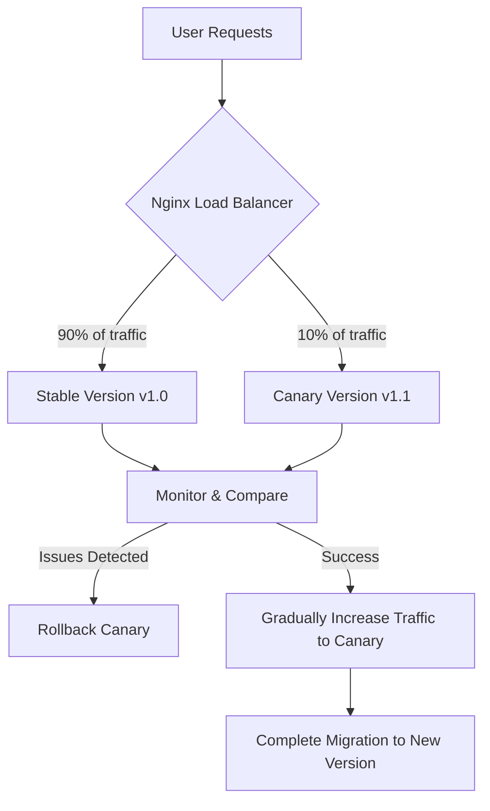

# Nginx Canary Deployment

## Introduction

Canary deployment is a powerful technique for safely rolling out application updates by initially exposing new versions to only a small subset of users. Named after the historical practice of using canaries in coal mines to detect toxic gases, this approach allows you to test new features in production with minimal risk. If issues arise with the new version, only a small percentage of users are affected, giving you time to roll back before widespread impact occurs.

In this guide, we'll explore how to implement canary deployments using Nginx, a powerful and versatile web server and load balancer. By leveraging Nginx's routing capabilities, we can direct controlled portions of traffic to newer versions of our application while maintaining most traffic to the stable version.

## Understanding Canary Deployments

Before diving into the technical implementation, let's understand the key concepts behind canary deployments:

1. **Progressive Rollout**: Rather than replacing the entire production environment at once, canary deployments introduce changes incrementally.

2. **Risk Mitigation**: By limiting the exposure of new code, you reduce the potential impact of bugs or performance issues.

3. **Real-world Validation**: Testing with actual user traffic provides insights that staging environments cannot fully replicate.

4. **Quick Rollback**: If issues arise, reverting to the stable version is straightforward and affects only a small portion of users.

Let's visualize the canary deployment process:



## Setting Up Nginx for Canary Deployments

### Prerequisites

- Nginx installed on your server
- Two or more instances of your application (stable and canary versions)
- Basic understanding of Nginx configuration

### Basic Configuration Structure

Here's the structure we'll implement:

1. Configure upstream server groups for both stable and canary versions
2. Set up traffic splitting based on a percentage
3. Configure monitoring to track performance and errors
4. Implement methods to adjust traffic distribution or rollback if needed

Let's start with a basic Nginx configuration:

```nginx
http {
    # Define upstream server groups
    upstream stable_servers {
        server 192.168.1.101:8080;
        server 192.168.1.102:8080;
    }
    
    upstream canary_servers {
        server 192.168.1.201:8080;
    }
    
    # Server configuration
    server {
        listen 80;
        server_name example.com;
        
        location / {
            # Default to stable version
            proxy_pass http://stable_servers;
        }
    }
}
```

This configuration sets up two server groups but doesn't implement canary routing yet. Let's add that next.

## Implementing Percentage-Based Traffic Splitting

There are several methods to implement traffic splitting in Nginx. We'll cover the two most common approaches:

### Method 1: Using the Split Clients Module

The `split_clients` module in Nginx provides an elegant way to distribute traffic based on percentages:

```nginx
http {
    # Define upstream server groups
    upstream stable_servers {
        server 192.168.1.101:8080;
        server 192.168.1.102:8080;
    }
    
    upstream canary_servers {
        server 192.168.1.201:8080;
    }
    
    # Split traffic: 90% to stable, 10% to canary
    split_clients "${remote_addr}${http_user_agent}" $upstream_group {
        10%     canary_servers;
        *       stable_servers;
    }
    
    # Server configuration
    server {
        listen 80;
        server_name example.com;
        
        location / {
            proxy_pass http://$upstream_group;
            
            # Standard proxy settings
            proxy_set_header Host $host;
            proxy_set_header X-Real-IP $remote_addr;
            proxy_set_header X-Forwarded-For $proxy_add_x_forwarded_for;
            proxy_set_header X-Forwarded-Proto $scheme;
        }
    }
}
```

In this configuration:
- The `split_clients` directive uses a combination of the client's IP address and user agent as a key to consistently route the same users to the same server group
- 10% of traffic goes to the canary version
- The remaining 90% goes to the stable version

### Method 2: Using Cookies or Request Headers

For more control, you might want to direct specific users to the canary version. This can be achieved using cookies or request headers:

```nginx
http {
    # Define upstream server groups
    upstream stable_servers {
        server 192.168.1.101:8080;
        server 192.168.1.102:8080;
    }
    
    upstream canary_servers {
        server 192.168.1.201:8080;
    }
    
    map $cookie_canary $upstream_group {
        "true"  canary_servers;
        default stable_servers;
    }
    
    # Server configuration
    server {
        listen 80;
        server_name example.com;
        
        # Route to canary for specific user IDs (optional)
        if ($arg_user_id ~ "^(101|102|103)$") {
            add_header Set-Cookie "canary=true;Path=/;Max-Age=3600";
        }
        
        location / {
            proxy_pass http://$upstream_group;
            
            # Standard proxy settings
            proxy_set_header Host $host;
            proxy_set_header X-Real-IP $remote_addr;
            proxy_set_header X-Forwarded-For $proxy_add_x_forwarded_for;
            proxy_set_header X-Forwarded-Proto $scheme;
        }
    }
}
```

This configuration:
- Routes users with a `canary=true` cookie to the canary servers
- Has an optional mechanism to set this cookie for specific user IDs
- Could be adapted to use request headers or other criteria instead

## Advanced Canary Deployment Techniques

### Gradual Traffic Shifting

Once your canary version proves stable, you may want to gradually increase its traffic share. This can be done by simply adjusting the percentage in the `split_clients` directive and reloading Nginx:

```nginx
# Start with 10% to canary
split_clients "${remote_addr}${http_user_agent}" $upstream_group {
    10%     canary_servers;
    *       stable_servers;
}

# After monitoring, increase to 25%
split_clients "${remote_addr}${http_user_agent}" $upstream_group {
    25%     canary_servers;
    *       stable_servers;
}

# Later, increase to 50%
split_clients "${remote_addr}${http_user_agent}" $upstream_group {
    50%     canary_servers;
    *       stable_servers;
}

# And finally, 100% (full deployment)
split_clients "${remote_addr}${http_user_agent}" $upstream_group {
    100%    canary_servers;
    *       stable_servers;
}
```

### Header-Based Routing for Internal Testing

Before exposing changes to real users, you might want to test with internal staff. This can be achieved using custom headers:

```nginx
map $http_x_canary $upstream_group {
    "true"  canary_servers;
    default stable_servers;
}

server {
    listen 80;
    server_name example.com;
    
    location / {
        proxy_pass http://$upstream_group;
        # Other proxy settings...
    }
}
```

Internal testers can then use browser extensions to add the `X-Canary: true` header to their requests.

### Geographic or Time-Based Canary Deployments

You might want to limit your canary deployment to specific regions or time periods:

```nginx
# Geo-based canary (deploy to US users first)
geo $geo_canary {
    default     0;
    10.0.0.0/8  1; # Internal network
    172.16.0.0/12 1; # VPN users
    US          1; # US users
}

# Time-based canary (business hours only)
map $time_iso8601 $time_canary {
    default 0;
    "~*T(09|10|11|12|13|14|15|16):.*" 1;  # 9 AM to 5 PM
}

# Combined decision
map "$geo_canary:$time_canary" $use_canary {
    "1:1"   1;  # Both conditions met
    default 0;
}

# Final upstream selection
map $use_canary $upstream_group {
    1       canary_servers;
    default stable_servers;
}
```

## Monitoring and Observability

Canary deployments require careful monitoring to detect any issues with the new version. Nginx can help with basic logging, but you'll want to integrate with more comprehensive monitoring solutions.

### Enhanced Logging for Canary Requests

```nginx
log_format canary '$remote_addr - $remote_user [$time_local] '
                   '"$request" $status $body_bytes_sent '
                   '"$http_referer" "$http_user_agent" '
                   '"$upstream_group" $upstream_response_time';

server {
    # ... other configuration ...
    
    access_log /var/log/nginx/access.log canary;
    
    # Track error rates specifically for canary
    location / {
        proxy_pass http://$upstream_group;
        
        # Add version header to response
        add_header X-Version $upstream_group;
        
        # Other proxy settings...
    }
}
```

### Health Checks for Automatic Rollback

Nginx Plus (the commercial version) supports health checks that can automatically remove unhealthy servers:

```nginx
upstream canary_servers {
    server 192.168.1.201:8080 max_fails=3 fail_timeout=30s;
    
    # With Nginx Plus:
    # health_check interval=5s fails=3 passes=2;
}
```

For open-source Nginx, you can implement basic health checks using a separate monitoring system that updates the Nginx configuration when issues are detected.

## Complete Example: A Robust Canary Deployment Setup

Let's bring everything together into a more comprehensive example:

```nginx
http {
    # Define upstream server groups
    upstream stable_servers {
        server 192.168.1.101:8080 weight=1;
        server 192.168.1.102:8080 weight=1;
    }
    
    upstream canary_servers {
        server 192.168.1.201:8080 max_fails=2 fail_timeout=10s;
    }
    
    # Enhanced logging format
    log_format canary '$remote_addr - $remote_user [$time_local] '
                      '"$request" $status $body_bytes_sent '
                      '"$http_referer" "$http_user_agent" '
                      '"$upstream_group" $upstream_response_time';
    
    # Traffic splitting: 10% to canary, controlled by cookie for specific users
    map $cookie_canary $force_canary {
        "true"     1;
        default    0;
    }
    
    split_clients "${remote_addr}${http_user_agent}" $random_canary {
        10%     1;
        *       0;
    }
    
    map "$force_canary:$random_canary" $use_canary {
        "1:0"   1;  # Cookie-based override
        "1:1"   1;  # Cookie-based override (redundant but clear)
        "0:1"   1;  # Random selection for canary
        default 0;  # Default to stable
    }
    
    map $use_canary $upstream_group {
        1       canary_servers;
        default stable_servers;
    }
    
    # Server configuration
    server {
        listen 80;
        server_name example.com;
        
        # Use enhanced logging
        access_log /var/log/nginx/access.log canary;
        
        # Optional: Set canary cookie for specific test users
        if ($arg_enable_canary = "1") {
            add_header Set-Cookie "canary=true;Path=/;Max-Age=3600";
            return 302 $scheme://$host$request_uri;
        }
        
        # Canary opt-out mechanism
        if ($arg_disable_canary = "1") {
            add_header Set-Cookie "canary=false;Path=/;Max-Age=3600";
            return 302 $scheme://$host$request_uri;
        }
        
        location / {
            # Route based on the calculated upstream group
            proxy_pass http://$upstream_group;
            
            # Add version header for debugging
            add_header X-Version $upstream_group;
            
            # Standard proxy settings
            proxy_set_header Host $host;
            proxy_set_header X-Real-IP $remote_addr;
            proxy_set_header X-Forwarded-For $proxy_add_x_forwarded_for;
            proxy_set_header X-Forwarded-Proto $scheme;
            proxy_set_header X-Canary $use_canary;
            
            # Larger timeouts for canary to catch performance issues
            proxy_connect_timeout 10s;
            proxy_send_timeout 30s;
            proxy_read_timeout 30s;
        }
        
        # Special health check endpoint
        location /health {
            access_log off;
            return 200 "OK
";
        }
    }
}
```

This comprehensive setup provides:
- 10% traffic allocation to the canary version
- Cookie-based control for specific test users
- Ability to opt in/out of the canary version
- Enhanced logging to track which upstream handled each request
- Response headers identifying which version served the request
- Basic error handling with `max_fails` settings

## Step-by-Step Implementation Walkthrough

Let's walk through implementing a canary deployment for a simple web application:

### Step 1: Set Up Your Application Versions

1. Ensure you have your stable version running on its servers (e.g., `192.168.1.101` and `192.168.1.102`)
2. Deploy your canary version to a separate server (e.g., `192.168.1.201`)
3. Verify both versions can be accessed directly using their IP addresses

### Step 2: Configure Basic Nginx Load Balancing

Create a basic Nginx configuration file (e.g., `/etc/nginx/sites-available/myapp.conf`):

```nginx
upstream stable {
    server 192.168.1.101:8080;
    server 192.168.1.102:8080;
}

server {
    listen 80;
    server_name myapp.example.com;
    
    location / {
        proxy_pass http://stable;
        proxy_set_header Host $host;
        proxy_set_header X-Real-IP $remote_addr;
    }
}
```

Enable the configuration:

```bash
sudo ln -s /etc/nginx/sites-available/myapp.conf /etc/nginx/sites-enabled/
sudo nginx -t  # Test the configuration
sudo systemctl reload nginx
```

### Step 3: Add Canary Configuration

Modify your Nginx configuration to include canary routing:

```nginx
upstream stable {
    server 192.168.1.101:8080;
    server 192.168.1.102:8080;
}

upstream canary {
    server 192.168.1.201:8080;
}

# Split 10% of traffic to canary
split_clients "${remote_addr}" $upstream_group {
    10%     canary;
    *       stable;
}

server {
    listen 80;
    server_name myapp.example.com;
    
    location / {
        proxy_pass http://$upstream_group;
        proxy_set_header Host $host;
        proxy_set_header X-Real-IP $remote_addr;
        add_header X-Version $upstream_group;
    }
}
```

Test and reload:

```bash
sudo nginx -t
sudo systemctl reload nginx
```

### Step 4: Monitor and Adjust

1. Set up monitoring to track metrics for both versions
2. Watch for error rates, response times, and user feedback
3. If issues are detected, either fix the canary version or revert to 100% stable

For a gradual rollout, modify the split percentage over time:

```nginx
# Initially: 10% to canary
split_clients "${remote_addr}" $upstream_group {
    10%     canary;
    *       stable;
}

# After validation: 25% to canary
split_clients "${remote_addr}" $upstream_group {
    25%     canary;
    *       stable;
}

# Later: 50% to canary
split_clients "${remote_addr}" $upstream_group {
    50%     canary;
    *       stable;
}

# Final: 100% to canary (full deployment)
split_clients "${remote_addr}" $upstream_group {
    100%    canary;
    *       stable;
}
```

After successful validation, you can update your "stable" servers with the new version and revert to a simple configuration.

## Real-World Applications and Benefits

### Case Study: E-commerce Platform Update

Imagine an e-commerce company needs to update its checkout process. Using canary deployments:

1. They deploy the new version to one server
2. Configure Nginx to route 5% of traffic to this server
3. Monitor conversion rates, error logs, and performance
4. When satisfied, gradually increase traffic to 20%, then 50%, then 100%
5. If any issues arise, they can immediately revert to the original version

This approach minimized risk during a critical update to their revenue-generating system.

### Case Study: API Version Migration

When updating an API service:

1. Deploy the new API version alongside the existing one
2. Configure Nginx to route 10% of traffic to the new version
3. Monitor for error rates, performance degradation, or complaints
4. Roll out to more users over a period of days or weeks
5. Eventually decommission the old API version once all clients have adjusted

This strategy gave API consumers time to adapt to changes without disrupting their service.

## Common Challenges and Solutions

### Challenge: Maintaining Session Consistency

**Problem**: Users getting inconsistent experiences when switching between versions

**Solution**: Use sticky sessions based on IP or cookies

```nginx
# Use IP hash for session stickiness
upstream stable {
    ip_hash;
    server 192.168.1.101:8080;
    server 192.168.1.102:8080;
}

upstream canary {
    ip_hash;
    server 192.168.1.201:8080;
}
```

### Challenge: Database Schema Changes

**Problem**: The canary version requires database changes

**Solution**: Design schema changes to be backward compatible or use a database proxy layer

### Challenge: Detecting Subtle Issues

**Problem**: Some bugs only manifest after extended use

**Solution**: Implement comprehensive monitoring and consider A/B testing tools

```nginx
# Add extended logging
log_format detailed '[$time_local] $remote_addr "$request" '
                    '$status $body_bytes_sent "$http_referer" '
                    '"$http_user_agent" $request_time '
                    'upstream=$upstream_addr '
                    'upstream_connect_time=$upstream_connect_time '
                    'upstream_response_time=$upstream_response_time';

access_log /var/log/nginx/detailed.log detailed;
```

## Summary

Nginx canary deployments provide a powerful way to reduce risk when rolling out application updates. By controlling the percentage of traffic directed to new versions, you can:

1. Test new features with real users in production
2. Detect issues before they affect your entire user base
3. Gradually increase confidence in new versions
4. Quickly roll back problematic changes with minimal impact

The key components of an Nginx canary deployment include:
- Upstream server groups for stable and canary versions
- Traffic splitting mechanisms using `split_clients` or request attributes
- Monitoring and observability to detect issues
- Gradual traffic adjustment strategies

When implemented correctly, canary deployments significantly reduce the risk associated with application updates and help maintain high availability during the deployment process.

## Additional Resources

### Further Learning

- [Nginx Official Documentation](https://nginx.org/en/docs/) - Comprehensive reference for all Nginx directives
- [Nginx Plus Features](https://www.nginx.com/products/nginx/) - Advanced features available in the commercial version
- [Progressive Delivery](https://www.redhat.com/en/topics/devops/what-is-progressive-delivery) - The broader methodology including canary deployments

### Practice Exercises

1. **Basic Setup**: Configure a simple canary deployment with 10% traffic splitting
2. **Cookie-Based Control**: Implement a cookie-based mechanism to allow specific users to opt-in to the canary version
3. **Monitoring Integration**: Set up enhanced logging and connect it to a monitoring system
4. **Advanced Routing**: Implement geographic or time-based canary routing
5. **Automated Rollback**: Create a script that monitors error rates and automatically reverts to the stable version if problems are detected

By mastering Nginx canary deployments, you'll add a powerful technique to your DevOps toolkit that helps you deliver changes more safely and confidently.