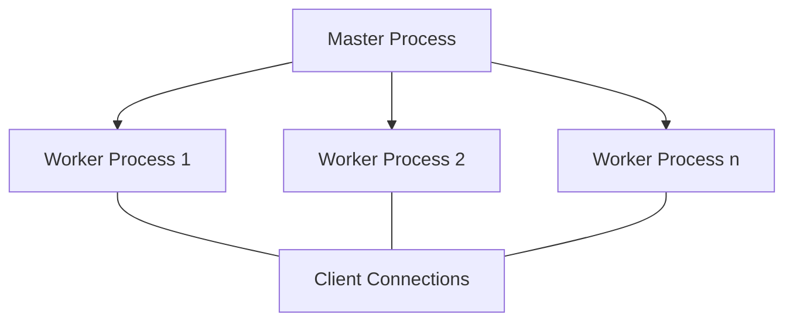

# Nginx Zero Downtime Updates

## Introduction

When managing web applications in production environments, one critical requirement is the ability to make changes to your server configuration without causing service interruptions. This concept is known as "zero downtime updates" or "seamless configuration reloads," and it's essential for maintaining high availability of your services.

In this guide, we'll explore how Nginx, a popular web server and reverse proxy, enables zero downtime updates through its signal handling system. You'll learn the practical techniques to update your Nginx configuration, apply changes, and ensure your users experience uninterrupted service even during maintenance operations.

## Why Zero Downtime Updates Matter

Imagine you're running a busy e-commerce website. Every minute of downtime potentially means lost sales and frustrated customers. Traditional server updates often require a complete restart, causing a brief but noticeable service interruption. For high-traffic sites, even seconds of downtime can impact thousands of users.

Nginx solves this problem with its architecture that allows for seamless configuration reloads. Let's understand how it works and how to implement it properly.

## How Nginx Handles Configuration Reloads

Nginx uses a master-worker process architecture:

1. **Master Process**: Manages worker processes and handles configuration
2. **Worker Processes**: Handle actual client connections and requests



When you reload Nginx configuration, here's what happens:

1. The master process receives a reload signal
2. Master process checks the new configuration for syntax errors
3. If valid, master process starts new worker processes with the new configuration
4. New worker processes begin accepting new connections
5. Master process signals old worker processes to gracefully shutdown
6. Old worker processes stop accepting new connections but complete existing ones
7. Once all existing connections are completed, old worker processes terminate

This process ensures zero downtime because at no point are client connections dropped or rejected.

## Commands for Zero Downtime Updates

The primary command used for zero downtime updates in Nginx is:

```bash
nginx -s reload
```

This sends the `SIGHUP` signal to the master process, initiating the reload sequence described above.

Alternatively, you can send the signal directly with:

```bash
kill -HUP $NGINX_MASTER_PID
```

Where `$NGINX_MASTER_PID` is the process ID of the Nginx master process, which you can find with:

```bash
ps -ef | grep nginx
# OR
cat /var/run/nginx.pid
```

## Step-by-Step Guide to Zero Downtime Updates

Let's walk through a complete example of updating Nginx configuration with zero downtime:

### 1. Modify Your Configuration File

First, let's modify the Nginx configuration file to add a new server block:

```nginx
# /etc/nginx/nginx.conf or /etc/nginx/conf.d/mysite.conf

http {
    # Existing configuration...
    
    server {
        listen 80;
        server_name example.com;
        
        location / {
            proxy_pass http://backend_servers;
            proxy_set_header Host $host;
            proxy_set_header X-Real-IP $remote_addr;
        }
    }
    
    # New server block we're adding
    server {
        listen 80;
        server_name api.example.com;
        
        location / {
            proxy_pass http://api_backend;
            proxy_set_header Host $host;
            proxy_set_header X-Real-IP $remote_addr;
        }
    }
}
```

### 2. Test Configuration Syntax

Before applying changes, always test your configuration:

```bash
nginx -t
```

You should see output similar to:

```
nginx: the configuration file /etc/nginx/nginx.conf syntax is ok
nginx: configuration file /etc/nginx/nginx.conf test is successful
```

### 3. Apply Changes with Zero Downtime

Now, reload Nginx to apply changes:

```bash
nginx -s reload
```

Or using systemd:

```bash
systemctl reload nginx
```

### 4. Verify the Changes

Check that your new configuration is active:

```bash
curl -I -H "Host: api.example.com" http://localhost
```

You should receive a response from your API backend server.

## Real-World Scenario: Adding SSL to an Existing Site

Let's walk through a practical scenario where zero downtime updates are crucial. Imagine you need to add SSL/TLS to an existing website without interrupting service.

### 1. Original Configuration

```nginx
# Current configuration
server {
    listen 80;
    server_name secure-example.com;
    
    location / {
        root /var/www/html;
        index index.html;
    }
}
```

### 2. Updated Configuration with SSL

```nginx
# New configuration with SSL
server {
    listen 80;
    server_name secure-example.com;
    
    # Redirect HTTP to HTTPS
    return 301 https://$host$request_uri;
}

server {
    listen 443 ssl;
    server_name secure-example.com;
    
    ssl_certificate /etc/nginx/ssl/secure-example.com.crt;
    ssl_certificate_key /etc/nginx/ssl/secure-example.com.key;
    ssl_protocols TLSv1.2 TLSv1.3;
    ssl_ciphers HIGH:!aNULL:!MD5;
    
    location / {
        root /var/www/html;
        index index.html;
    }
}
```

### 3. Test and Apply Changes

Test configuration:

```bash
nginx -t
```

Apply changes with zero downtime:

```bash
nginx -s reload
```

This update achieves:
- Adding SSL/TLS encryption
- Redirecting HTTP traffic to HTTPS
- Maintaining service continuity throughout the update

## Best Practices for Nginx Zero Downtime Updates

1. **Always Test Configuration**: Use `nginx -t` before applying changes.

2. **Use Version Control**: Keep Nginx configurations in a version control system like Git.

3. **Automate Deployments**: Use automation tools (Ansible, Chef, etc.) to manage configuration changes:

```yaml
# Example Ansible task
- name: Update Nginx configuration
  template:
    src: templates/nginx.conf.j2
    dest: /etc/nginx/nginx.conf
  register: nginx_config

- name: Test Nginx configuration
  command: nginx -t
  register: nginx_test
  changed_when: false
  failed_when: nginx_test.rc != 0

- name: Reload Nginx if configuration is valid
  command: nginx -s reload
  when: nginx_config.changed and nginx_test.rc == 0
```

4. **Monitor During Reloads**: Watch logs and metrics during reloads to ensure everything transitions smoothly.

5. **Prepare Rollback Plans**: Have mechanisms to quickly revert to previous configurations if issues appear.

## Common Pitfalls to Avoid

1. **Syntax Errors**: A syntax error will prevent Nginx from reloading, potentially leaving your configuration in an inconsistent state.

2. **File Permissions**: Ensure SSL certificates and other files referenced in your configuration are accessible to the Nginx user.

3. **Resource Limits**: During reload, Nginx temporarily uses more system resources. Ensure your server has sufficient capacity.

4. **Long-lived Connections**: Be aware that existing connections can keep old worker processes running for some time. Consider adding timeout directives if needed:

```nginx
keepalive_timeout 65;
```

5. **Connection Draining**: In high-traffic environments, you might want to configure a more graceful shutdown:

```nginx
worker_shutdown_timeout 60s;  # Available in newer Nginx versions
```

## Monitoring Nginx During Reloads

To ensure your reload process is working as expected, monitor:

1. **Process List**: Watch Nginx worker processes appear and disappear:

```bash
watch "ps aux | grep nginx"
```

2. **Log Files**: Check for any errors during reload:

```bash
tail -f /var/log/nginx/error.log
```

3. **Connection Status**: Monitor active connections:

```bash
watch "netstat -anp | grep nginx | wc -l"
```

## Summary

Nginx's zero downtime update capability is a powerful feature that allows you to maintain high availability while making configuration changes. By understanding the master-worker architecture and following the proper procedures, you can ensure your services remain available to users even during maintenance operations.

Key points to remember:
- Nginx uses a master-worker architecture to handle seamless reloads
- Always test configuration before applying changes with `nginx -t`
- Use `nginx -s reload` to apply changes without downtime
- Monitor the reload process to ensure it completes successfully
- Follow best practices to avoid common pitfalls

## Practice Exercises

1. Set up a test Nginx server and practice modifying the configuration with zero downtime.
2. Create a configuration that includes rate limiting and apply it with zero downtime.
3. Implement a blue-green deployment strategy using Nginx as a reverse proxy.
4. Write a shell script that automates the process of testing and applying Nginx configuration changes.

## Additional Resources

- [Nginx Official Documentation on Signal Processing](https://nginx.org/en/docs/control.html)
- [Nginx High Performance](https://www.nginx.com/blog/nginx-high-performance-caching/)
- [Nginx Admin Guide](https://docs.nginx.com/nginx/admin-guide/)