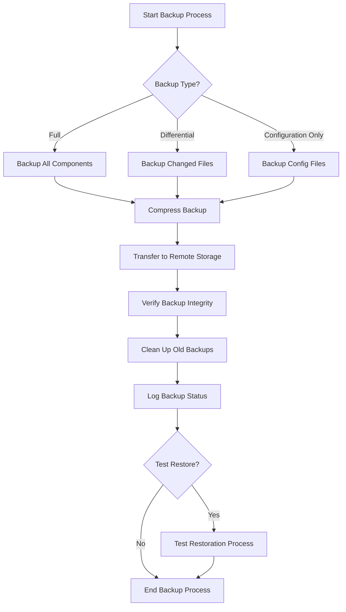

# Nginx Backup Strategies

## Introduction

Maintaining high availability in production web servers requires not only redundant systems but also robust backup strategies. Even with the most reliable infrastructure, having proper backups ensures that you can quickly recover from unexpected failures, configuration errors, or data corruption.

In this guide, we'll explore various approaches to backing up Nginx, focusing on what to back up, how frequently to do it, and how to automate the process. These strategies are essential for minimizing downtime and ensuring business continuity.

## What to Back Up in Nginx

Before diving into backup strategies, let's identify the critical components of Nginx that need to be backed up:

1. **Configuration files** - All files in `/etc/nginx/` directory
2. **SSL certificates** - Usually stored in `/etc/ssl/` or custom locations
3. **Website content** - Static files served by Nginx
4. **Access and error logs** - For auditing and troubleshooting
5. **Custom modules** - If you've compiled Nginx with custom modules

Let's examine each of these components in detail.

### Configuration Files

The Nginx configuration files are the most critical components to back up. These files define how your web server behaves, including virtual hosts, proxy settings, and security configurations.

```bash
# Typical locations for Nginx configuration files
/etc/nginx/nginx.conf            # Main configuration file
/etc/nginx/conf.d/               # Additional configuration files
/etc/nginx/sites-available/      # Available site configurations
/etc/nginx/sites-enabled/        # Enabled site configurations
```

A simple backup command for Nginx configuration would be:

```bash
# Create a timestamped backup of Nginx configuration
sudo tar -czf nginx-config-$(date +%Y%m%d-%H%M%S).tar.gz /etc/nginx/
```

### SSL Certificates

SSL certificates are crucial for secure communications. Losing these can result in service disruption as HTTPS connections would fail.

```bash
# Typical locations for SSL certificates
/etc/ssl/certs/                  # Public certificates
/etc/ssl/private/                # Private keys
/etc/letsencrypt/                # Let's Encrypt certificates
```

For Let's Encrypt certificates, you might use:

```bash
# Backup Let's Encrypt certificates
sudo tar -czf letsencrypt-$(date +%Y%m%d-%H%M%S).tar.gz /etc/letsencrypt/
```

### Website Content

Your website files need regular backups, especially if they change frequently:

```bash
# Backup website content
sudo tar -czf website-content-$(date +%Y%m%d-%H%M%S).tar.gz /var/www/
```

### Logs

While logs can be regenerated, they contain valuable information for troubleshooting and audit purposes:

```bash
# Backup Nginx logs
sudo tar -czf nginx-logs-$(date +%Y%m%d-%H%M%S).tar.gz /var/log/nginx/
```

## Backup Strategies and Best Practices

Now that we understand what to back up, let's explore various backup strategies:

### 1. Manual Backups

Manual backups are the simplest approach but require discipline and consistency.

```bash
#!/bin/bash
# Simple manual backup script for Nginx

BACKUP_DIR="/backup/nginx"
DATE=$(date +%Y%m%d-%H%M%S)
FILENAME="nginx-full-backup-$DATE.tar.gz"

# Create backup directory if it doesn't exist
mkdir -p $BACKUP_DIR

# Create the backup
tar -czf $BACKUP_DIR/$FILENAME /etc/nginx/ /etc/ssl/ /var/www/ /var/log/nginx/

echo "Backup completed: $BACKUP_DIR/$FILENAME"
```

### 2. Automated Backups with Cron

Scheduling regular backups ensures consistency and removes human error:

```bash
#!/bin/bash
# Automated Nginx backup script

BACKUP_DIR="/backup/nginx"
DATE=$(date +%Y%m%d-%H%M%S)
CONFIG_BACKUP="nginx-config-$DATE.tar.gz"
CONTENT_BACKUP="website-content-$DATE.tar.gz"
LOG_BACKUP="nginx-logs-$DATE.tar.gz"
SSL_BACKUP="ssl-certs-$DATE.tar.gz"

# Create backup directory if it doesn't exist
mkdir -p $BACKUP_DIR

# Backup Nginx configuration
tar -czf $BACKUP_DIR/$CONFIG_BACKUP /etc/nginx/

# Backup website content
tar -czf $BACKUP_DIR/$CONTENT_BACKUP /var/www/

# Backup logs (optional depending on size)
tar -czf $BACKUP_DIR/$LOG_BACKUP /var/log/nginx/

# Backup SSL certificates
tar -czf $BACKUP_DIR/$SSL_BACKUP /etc/ssl/ /etc/letsencrypt/

# Clean up old backups (keep last 7 days)
find $BACKUP_DIR -name "nginx-*" -type f -mtime +7 -delete
find $BACKUP_DIR -name "website-*" -type f -mtime +7 -delete
find $BACKUP_DIR -name "ssl-*" -type f -mtime +7 -delete

echo "Nginx backup completed on $(date)"
```

To schedule this script with cron:

```bash
# Edit crontab
crontab -e

# Add this line to run daily at 2 AM
0 2 * * * /path/to/nginx-backup-script.sh >> /var/log/nginx-backup.log 2>&1
```

### 3. Configuration Management with Version Control

For configuration files, using version control like Git provides additional benefits:

```bash
# Initialize a Git repository for Nginx configuration
cd /etc/nginx/
git init
git add .
git commit -m "Initial Nginx configuration"

# After making changes
git add .
git commit -m "Updated configuration: description of changes"
```

This approach provides:
- History of all configuration changes
- Ability to roll back to previous configurations
- Collaboration when multiple administrators are involved

### 4. Differential Backups

For large websites, full backups might be resource-intensive. Differential backups can be more efficient:

```bash
#!/bin/bash
# Differential backup script for website content

BACKUP_DIR="/backup/nginx/website"
FULL_BACKUP_DAY="Sunday"
WEBSITE_DIR="/var/www/"
DATE=$(date +%Y%m%d)
CURRENT_DAY=$(date +%A)

mkdir -p $BACKUP_DIR

if [ "$CURRENT_DAY" = "$FULL_BACKUP_DAY" ]; then
    # Full backup on Sundays
    tar -czf $BACKUP_DIR/full-$DATE.tar.gz $WEBSITE_DIR
    # Create reference file for differential backups
    find $WEBSITE_DIR -type f -print0 | xargs -0 stat -c "%n %Y" > $BACKUP_DIR/reference-$DATE.txt
else
    # Get the latest reference file
    REFERENCE_FILE=$(ls -t $BACKUP_DIR/reference-*.txt | head -1)
    
    # Create a list of files changed since the reference
    while read -r FILE TIMESTAMP; do
        CURRENT_TIMESTAMP=$(stat -c "%Y" "$FILE" 2>/dev/null)
        if [ "$CURRENT_TIMESTAMP" != "$TIMESTAMP" ]; then
            echo "$FILE"
        fi
    done < "$REFERENCE_FILE" > changed_files.txt
    
    # Create differential backup
    tar -czf $BACKUP_DIR/diff-$DATE.tar.gz -T changed_files.txt
    rm changed_files.txt
fi

# Remove backups older than 30 days
find $BACKUP_DIR -name "*.tar.gz" -type f -mtime +30 -delete
find $BACKUP_DIR -name "reference-*.txt" -type f -mtime +30 -delete
```

## Remote Backup Solutions

Storing backups on the same server defeats the purpose of disaster recovery. Here are strategies for remote backups:

### 1. Rsync to Remote Server

```bash
# Sync backups to a remote server
rsync -avz --delete /backup/nginx/ backup-user@backup-server:/backup/nginx/
```

### 2. Object Storage (S3, Google Cloud Storage, etc.)

Using cloud storage provides durability and accessibility:

```bash
# Install AWS CLI
sudo apt-get install awscli

# Configure AWS credentials
aws configure

# Upload backups to S3
aws s3 sync /backup/nginx/ s3://my-nginx-backups/
```

## Testing Your Backups

A backup is only as good as its ability to be restored. Regular testing ensures your backups are valid:

```bash
#!/bin/bash
# Script to test Nginx configuration backup

# Create a temporary directory
TEST_DIR=$(mktemp -d)

# Extract the latest configuration backup
LATEST_BACKUP=$(ls -t /backup/nginx/nginx-config-*.tar.gz | head -1)
tar -xzf $LATEST_BACKUP -C $TEST_DIR

# Test the configuration
nginx -t -c $TEST_DIR/etc/nginx/nginx.conf

# Clean up
rm -rf $TEST_DIR

echo "Backup test completed"
```

## Restoration Process

Having a documented restoration process is crucial for quick recovery:

```bash
#!/bin/bash
# Nginx restore script

if [ "$#" -ne 1 ]; then
    echo "Usage: $0 /path/to/backup.tar.gz"
    exit 1
fi

BACKUP_FILE=$1

# Stop Nginx
sudo systemctl stop nginx

# Backup current configuration just in case
sudo tar -czf /tmp/nginx-pre-restore-$(date +%Y%m%d-%H%M%S).tar.gz /etc/nginx/

# Extract backup
sudo tar -xzf $BACKUP_FILE -C /

# Check configuration
if sudo nginx -t; then
    # Start Nginx if configuration is valid
    sudo systemctl start nginx
    echo "Restoration successful!"
else
    echo "Restored configuration is invalid. Reverting..."
    sudo tar -xzf /tmp/nginx-pre-restore-*.tar.gz -C /
    sudo systemctl start nginx
fi
```

## Backup Strategy Workflow

Let's visualize a complete backup workflow:



## Implementing a Complete Solution

Let's combine everything into a comprehensive backup solution:

```bash
#!/bin/bash
# Comprehensive Nginx backup solution

# Configuration
BACKUP_DIR="/backup/nginx"
REMOTE_DIR="backup-user@backup-server:/backup/nginx/"
S3_BUCKET="s3://my-nginx-backups/"
DATE=$(date +%Y%m%d-%H%M%S)
BACKUP_RETENTION=30 # days
LOG_FILE="/var/log/nginx-backup.log"

# Function to log messages
log_message() {
    echo "[$(date +"%Y-%m-%d %H:%M:%S")] $1" >> $LOG_FILE
    echo "$1"
}

# Create backup directory
mkdir -p $BACKUP_DIR

# 1. Back up Nginx configuration
log_message "Backing up Nginx configuration..."
CONFIG_BACKUP="$BACKUP_DIR/nginx-config-$DATE.tar.gz"
tar -czf $CONFIG_BACKUP /etc/nginx/ 2>> $LOG_FILE

# 2. Back up SSL certificates
log_message "Backing up SSL certificates..."
SSL_BACKUP="$BACKUP_DIR/ssl-certs-$DATE.tar.gz"
tar -czf $SSL_BACKUP /etc/ssl/ /etc/letsencrypt/ 2>> $LOG_FILE

# 3. Back up website content
log_message "Backing up website content..."
CONTENT_BACKUP="$BACKUP_DIR/website-content-$DATE.tar.gz"
tar -czf $CONTENT_BACKUP /var/www/ 2>> $LOG_FILE

# 4. Back up logs (optional)
if [ "$(date +%u)" -eq 7 ]; then  # Sunday only for logs
    log_message "Backing up Nginx logs..."
    LOGS_BACKUP="$BACKUP_DIR/nginx-logs-$DATE.tar.gz"
    tar -czf $LOGS_BACKUP /var/log/nginx/ 2>> $LOG_FILE
fi

# 5. Create a full backup package
FULL_BACKUP="$BACKUP_DIR/nginx-full-backup-$DATE.tar.gz"
tar -czf $FULL_BACKUP $CONFIG_BACKUP $SSL_BACKUP $CONTENT_BACKUP 2>> $LOG_FILE

# 6. Transfer to remote server
log_message "Transferring backups to remote server..."
rsync -avz --delete $BACKUP_DIR/ $REMOTE_DIR 2>> $LOG_FILE

# 7. Transfer to cloud storage
log_message "Transferring backups to S3..."
aws s3 sync $BACKUP_DIR/ $S3_BUCKET 2>> $LOG_FILE

# 8. Test the configuration backup
log_message "Testing configuration backup..."
TEST_DIR=$(mktemp -d)
tar -xzf $CONFIG_BACKUP -C $TEST_DIR 2>> $LOG_FILE
if nginx -t -c $TEST_DIR/etc/nginx/nginx.conf 2>> $LOG_FILE; then
    log_message "Configuration backup test: PASSED"
else
    log_message "Configuration backup test: FAILED"
    # Send alert notification here
fi
rm -rf $TEST_DIR

# 9. Clean up old backups
log_message "Cleaning up old backups..."
find $BACKUP_DIR -type f -mtime +$BACKUP_RETENTION -delete

log_message "Nginx backup completed successfully"
```

## Summary

Implementing a robust backup strategy for Nginx is essential for ensuring high availability and quick recovery in case of failures. In this guide, we've covered:

1. **Critical components to back up**: Configuration files, SSL certificates, website content, and logs
2. **Backup strategies**: Manual, automated, version-controlled, and differential approaches
3. **Remote backup solutions**: Using rsync or cloud storage for off-site backups
4. **Testing and restoration**: Ensuring backups can be restored when needed
5. **Comprehensive solutions**: Combining all approaches into a complete backup strategy

Remember that a backup strategy is only as good as its most recent successful restoration test. Regularly test your backups to ensure they can be restored when needed.

## Additional Resources and Exercises

### Resources
- [Nginx Documentation](https://nginx.org/en/docs/)
- [Linux Backup and Recovery Best Practices](https://www.linuxjournal.com/content/linux-backup-and-recovery-best-practices)
- [AWS S3 CLI Documentation](https://docs.aws.amazon.com/cli/latest/reference/s3/index.html)

### Exercises

1. **Basic Setup**: Create a simple backup script for your Nginx configuration and schedule it with cron.
2. **Version Control**: Set up a Git repository for your Nginx configuration and make it automatically commit changes whenever Nginx reloads.
3. **Restoration Drill**: Practice restoring your Nginx configuration from a backup to a test environment.
4. **Monitoring**: Add monitoring to your backup process to alert you if backups fail or exceed a certain size.
5. **Disaster Recovery**: Document a complete disaster recovery process for your Nginx setup, including estimated recovery time.

By implementing these backup strategies, you'll significantly improve the resilience of your Nginx deployment and ensure high availability even in the face of unexpected failures.