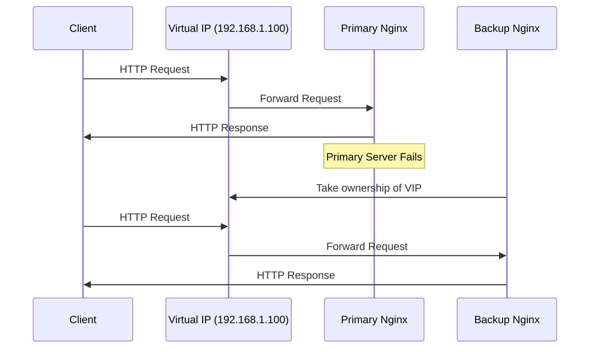
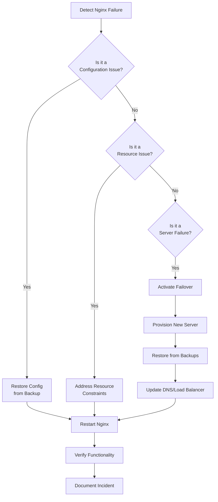

# Nginx Disaster Recovery

## Introduction

Disaster recovery is a critical aspect of maintaining high availability in Nginx environments. It involves planning, procedures, and tools to recover your Nginx infrastructure after unexpected events such as hardware failures, network outages, or software issues. 

In this guide, we'll explore comprehensive disaster recovery strategies specific to Nginx servers. You'll learn how to prepare for potential disasters, implement reliable backup solutions, configure failover mechanisms, and execute recovery plans to minimize downtime and data loss.

## Understanding Nginx Disaster Recovery

Disaster recovery for Nginx spans several key areas:

1. **Backup strategies** - Regular backups of configuration, content, and data
2. **Configuration management** - Version-controlled Nginx configurations
3. **Failover mechanisms** - Automated systems to redirect traffic when failures occur
4. **Recovery procedures** - Step-by-step plans to restore service
5. **Testing and validation** - Regular testing of recovery processes

Let's examine each of these components in detail.

## Nginx Backup Strategies

### Configuration Backups

Your Nginx configuration files are the blueprint of your web server setup. Losing them can make recovery significantly more difficult.

#### Key Files to Back Up

```bash
/etc/nginx/nginx.conf
/etc/nginx/conf.d/
/etc/nginx/sites-available/
/etc/nginx/sites-enabled/
/etc/nginx/ssl/
```

#### Creating Automated Configuration Backups

Here's a simple bash script that backs up your Nginx configuration files:

```bash
#!/bin/bash

# Set variables
BACKUP_DIR="/backup/nginx"
DATE=$(date +%Y%m%d-%H%M%S)
FILENAME="nginx-config-$DATE.tar.gz"

# Create backup directory if it doesn't exist
mkdir -p $BACKUP_DIR

# Create backup
tar -czf $BACKUP_DIR/$FILENAME /etc/nginx/

# Retain only the last 10 backups
ls -tr $BACKUP_DIR/nginx-config-*.tar.gz | head -n -10 | xargs -r rm

echo "Nginx configuration backed up to $BACKUP_DIR/$FILENAME"
```

Save this script as `backup-nginx-config.sh` and make it executable:

```bash
chmod +x backup-nginx-config.sh
```

Schedule it to run daily using cron:

```bash
crontab -e

# Add this line to run daily at 2 AM
0 2 * * * /path/to/backup-nginx-config.sh
```

### Content and Data Backups

Besides configurations, you need to back up website content and data:

```bash
#!/bin/bash

# Set variables
BACKUP_DIR="/backup/website-content"
DATE=$(date +%Y%m%d-%H%M%S)
FILENAME="website-content-$DATE.tar.gz"
WEBSITE_ROOT="/var/www/html"

# Create backup directory if it doesn't exist
mkdir -p $BACKUP_DIR

# Create backup
tar -czf $BACKUP_DIR/$FILENAME $WEBSITE_ROOT

# Retain only the last 7 backups
ls -tr $BACKUP_DIR/website-content-*.tar.gz | head -n -7 | xargs -r rm

echo "Website content backed up to $BACKUP_DIR/$FILENAME"
```

## Configuration Management for Disaster Recovery

Version control systems like Git provide an excellent way to manage Nginx configurations:

```bash
# Initialize a Git repository for Nginx configs
cd /etc/nginx
git init
git add .
git commit -m "Initial Nginx configuration"

# After making changes to the configuration
git add .
git commit -m "Updated server block for example.com"
```

This approach allows you to:
- Track configuration changes over time
- Revert to previous working configurations
- Document changes through commit messages
- Share configurations across multiple servers

## Implementing Failover Mechanisms

### Active-Passive Nginx Failover with Keepalived

Keepalived enables automatic failover between Nginx servers using Virtual IP (VIP):

1. Install Keepalived on both servers:

```bash
apt-get update
apt-get install keepalived
```

2. Configure the primary server (`/etc/keepalived/keepalived.conf`):

```
vrrp_script check_nginx {
    script "/usr/bin/killall -0 nginx"
    interval 2
    weight 2
}

vrrp_instance VI_1 {
    state MASTER
    interface eth0
    virtual_router_id 51
    priority 101
    advert_int 1
    authentication {
        auth_type PASS
        auth_pass your_password
    }
    virtual_ipaddress {
        192.168.1.100
    }
    track_script {
        check_nginx
    }
}
```

3. Configure the backup server (similar configuration but with `state BACKUP` and `priority 100`):

```
vrrp_script check_nginx {
    script "/usr/bin/killall -0 nginx"
    interval 2
    weight 2
}

vrrp_instance VI_1 {
    state BACKUP
    interface eth0
    virtual_router_id 51
    priority 100
    advert_int 1
    authentication {
        auth_type PASS
        auth_pass your_password
    }
    virtual_ipaddress {
        192.168.1.100
    }
    track_script {
        check_nginx
    }
}
```

4. Start the Keepalived service on both servers:

```bash
systemctl start keepalived
systemctl enable keepalived
```

This setup automatically transitions the Virtual IP to the backup server if the primary server fails.

### Visualization of Failover Process



## Disaster Recovery Procedures

### Step-by-Step Recovery Plan

#### Scenario 1: Nginx Server Failure

1. **Diagnose the issue**:

```bash
systemctl status nginx
journalctl -u nginx
tail -f /var/log/nginx/error.log
```

2. **Attempt to restart Nginx**:

```bash
systemctl restart nginx
```

3. **If restart fails, check for configuration errors**:

```bash
nginx -t
```

4. **If configuration is valid but Nginx still fails, check for system resources**:

```bash
free -m                 # Check memory
df -h                   # Check disk space
top                     # Check CPU usage
```

5. **If system resources are adequate, restore from backup**:

```bash
# Restore Nginx configuration
cd /tmp
tar -xzf /backup/nginx/nginx-config-YYYYMMDD-HHMMSS.tar.gz
cp -r /tmp/etc/nginx/* /etc/nginx/

# Validate the restored configuration
nginx -t

# Restart Nginx
systemctl restart nginx
```

#### Scenario 2: Full Server Failure (Restore to New Server)

1. **Provision a new server with the same OS**

2. **Install Nginx**:

```bash
apt-get update
apt-get install nginx
```

3. **Restore Nginx configuration**:

```bash
# Extract backup to temporary location
cd /tmp
tar -xzf /backup/nginx/nginx-config-YYYYMMDD-HHMMSS.tar.gz

# Copy configuration files
cp -r /tmp/etc/nginx/* /etc/nginx/

# Verify configuration
nginx -t
```

4. **Restore website content**:

```bash
# Extract website content
cd /tmp
tar -xzf /backup/website-content/website-content-YYYYMMDD-HHMMSS.tar.gz

# Copy to web root
cp -r /tmp/var/www/html/* /var/www/html/
```

5. **Restore SSL certificates if needed**:

```bash
# Ensure permissions are correct
chmod 600 /etc/nginx/ssl/*.key
chmod 644 /etc/nginx/ssl/*.crt
```

6. **Start Nginx and verify functionality**:

```bash
systemctl start nginx
systemctl enable nginx
```

7. **Update DNS or load balancer settings to point to the new server**

## Automating Recovery with Scripts

Create scripts to automate common recovery tasks:

```bash
#!/bin/bash
# nginx-recovery.sh - Automated Nginx recovery script

# Check if Nginx is running
if ! systemctl is-active --quiet nginx; then
    echo "Nginx is not running. Attempting recovery..."
    
    # Check for configuration errors
    if nginx -t; then
        echo "Configuration is valid, attempting restart..."
        systemctl restart nginx
    else
        echo "Configuration error detected, restoring from latest backup..."
        
        # Find latest backup
        LATEST_BACKUP=$(ls -t /backup/nginx/nginx-config-*.tar.gz | head -1)
        
        if [ -n "$LATEST_BACKUP" ]; then
            echo "Restoring from $LATEST_BACKUP"
            temp_dir=$(mktemp -d)
            tar -xzf "$LATEST_BACKUP" -C "$temp_dir"
            cp -r "$temp_dir"/etc/nginx/* /etc/nginx/
            rm -rf "$temp_dir"
            
            if nginx -t; then
                echo "Restored configuration is valid, restarting Nginx..."
                systemctl restart nginx
            else
                echo "Restored configuration is invalid. Manual intervention required."
                exit 1
            fi
        else
            echo "No backup found. Manual recovery required."
            exit 1
        fi
    fi
    
    # Check if recovery was successful
    if systemctl is-active --quiet nginx; then
        echo "Recovery successful. Nginx is now running."
    else
        echo "Recovery failed. Manual intervention required."
        exit 1
    fi
else
    echo "Nginx is running normally."
fi
```

## Testing Your Disaster Recovery Plan

Regular testing is crucial to ensure your disaster recovery procedures work when needed:

1. **Schedule regular drills** - Conduct practice recovery scenarios quarterly
2. **Document test results** - Record successes, failures, and areas for improvement
3. **Measure recovery metrics** - Track:
   - Recovery Time Objective (RTO): How long recovery takes
   - Recovery Point Objective (RPO): How much data could be lost

### Sample Testing Checklist

```bash
# Test 1: Configuration Restore
nginx -s stop
mv /etc/nginx/nginx.conf /etc/nginx/nginx.conf.bak
# Attempt recovery script
./nginx-recovery.sh
# Verify Nginx is running
curl -I http://localhost

# Test 2: Failover Mechanism
# Simulate primary server failure
systemctl stop nginx
# Verify traffic routes to backup server
curl -I http://192.168.1.100

# Test 3: Full Server Recovery
# Follow full server recovery procedure on a test VM
# Time the process and identify bottlenecks
```

## Disaster Recovery Flow Diagram



## Best Practices for Nginx Disaster Recovery

1. **Maintain multiple backups** at different locations (local and remote)
2. **Document all configurations** with clear comments
3. **Use infrastructure as code** tools like Ansible to automate deployments
4. **Implement monitoring and alerting** to detect issues early
5. **Establish clear roles and responsibilities** for recovery team members
6. **Keep recovery documentation up-to-date** and easily accessible
7. **Encrypt sensitive backup data** such as SSL private keys
8. **Perform regular security updates** to prevent disasters
9. **Consider cloud-based disaster recovery** solutions for larger deployments
10. **Set up logging aggregation** to help with post-disaster analysis

## Summary

Implementing a comprehensive disaster recovery strategy for Nginx servers is essential for maintaining high availability and business continuity. By focusing on regular backups, configuration management, failover mechanisms, and well-documented recovery procedures, you can minimize downtime and data loss when unexpected events occur.

The key to successful disaster recovery is preparation and testing. Regularly practicing your recovery procedures ensures that you can respond effectively when a real disaster strikes.

## Exercises

1. Create a simple Nginx configuration backup script and schedule it to run daily.
2. Set up a test environment with two Nginx servers and implement Keepalived for failover.
3. Develop a comprehensive disaster recovery playbook for your specific Nginx environment.
4. Simulate a disaster by stopping Nginx services and practice restoring from backups.
5. Implement version control for your Nginx configuration files using Git.

## Additional Resources

- Nginx Documentation: High Availability Guide
- Linux System Administration for Web Servers
- Introduction to Keepalived and Load Balancing
- Bash Scripting for Automation
- Version Control with Git for Configuration Management