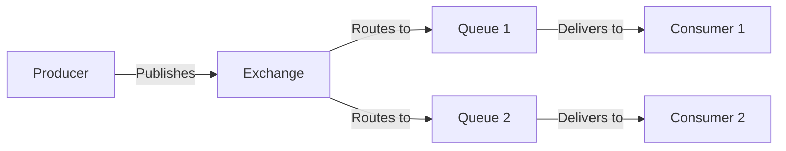
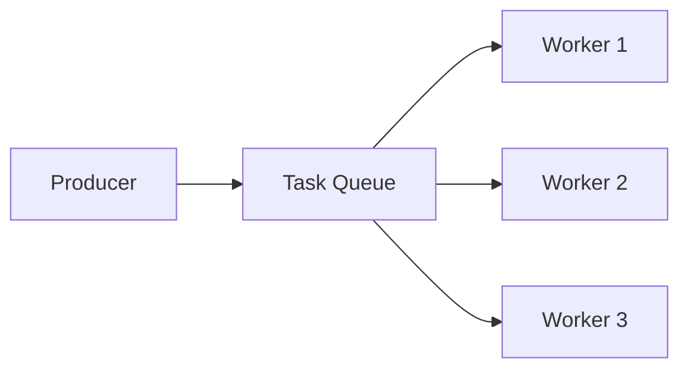
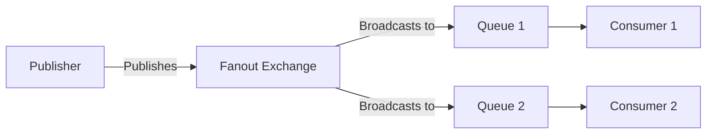
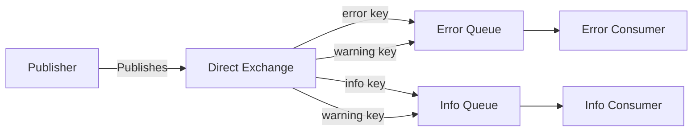
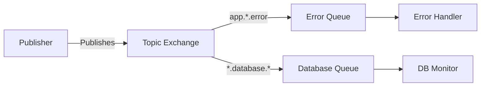
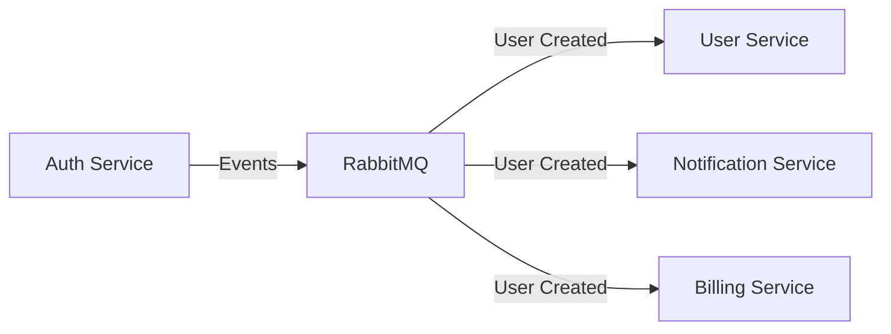
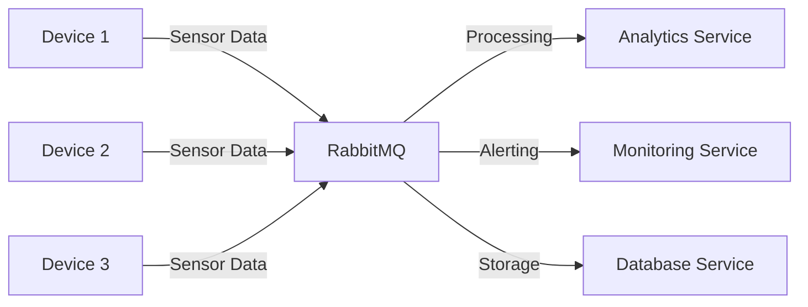

# RabbitMQ Introduction

## What is RabbitMQ?

RabbitMQ is an open-source message broker software that acts as an intermediary for messaging between applications, services, and systems. It implements the Advanced Message Queuing Protocol (AMQP) and offers a reliable way to exchange information between distributed components.

Think of RabbitMQ as a post office for your applications. One application drops off a message, and RabbitMQ ensures it gets delivered to the right recipient(s), even if they're not available at the time the message is sent.

## Why Use RabbitMQ?

Message brokers like RabbitMQ solve several challenges in distributed systems:

1. **Decoupling** - Services don't need to know about each other directly
2. **Scalability** - Handle peaks in message traffic without overwhelming systems
3. **Resilience** - Messages persist even if consumers are temporarily unavailable
4. **Load Balancing** - Distribute work evenly among multiple consumers
5. **Asynchronous Communication** - Sender doesn't need to wait for the receiver to process the message

## Key Concepts

### The RabbitMQ Architecture



The architecture consists of:

- **Producers**: Applications that send messages
- **Exchanges**: Entities that receive messages from producers and route them to queues
- **Queues**: Buffers that store messages
- **Consumers**: Applications that receive and process messages from queues

### Message Flow

1. A producer publishes a message to an exchange
2. The exchange routes the message to one or more queues based on rules
3. The message waits in the queue until a consumer is ready
4. A consumer connects to the queue and processes the message

### Exchange Types

RabbitMQ supports several exchange types, each with different routing behaviors:

- **Direct**: Routes messages to queues based on an exact match of routing keys
- **Topic**: Routes messages based on pattern matching of routing keys
- **Fanout**: Broadcasts messages to all bound queues
- **Headers**: Routes based on message header attributes instead of routing keys

## Installing RabbitMQ

Before we dive into code examples, you'll need to install RabbitMQ:

### Using Docker

```bash
docker run -d --hostname my-rabbit --name rabbitmq -p 5672:5672 -p 15672:15672 rabbitmq:management
```

### On Ubuntu/Debian

```bash
# Add apt repository
echo "deb https://dl.bintray.com/rabbitmq/debian $(lsb_release -sc) main" | sudo tee /etc/apt/sources.list.d/rabbitmq.list

# Add trusted key
wget -O- https://www.rabbitmq.com/rabbitmq-release-signing-key.asc | sudo apt-key add -

# Update package lists
sudo apt-get update

# Install RabbitMQ server
sudo apt-get install rabbitmq-server

# Enable management plugin
sudo rabbitmq-plugins enable rabbitmq_management
```

### Verifying Installation

After installation, the RabbitMQ Management UI should be available at http://localhost:15672/ with default credentials:
- Username: `guest`
- Password: `guest`

## Your First RabbitMQ Application

Let's create a simple producer and consumer in JavaScript using the `amqplib` library:

### Setting Up

First, create a new Node.js project and install the AMQP library:

```bash
mkdir rabbitmq-example
cd rabbitmq-example
npm init -y
npm install amqplib
```

### Producer: Sending Messages

Create a file named `producer.js`:

```javascript
const amqp = require('amqplib');

async function sendMessage() {
  try {
    // Create connection
    const connection = await amqp.connect('amqp://localhost');
    
    // Create channel
    const channel = await connection.createChannel();
    
    // Declare queue
    const queueName = 'hello';
    await channel.assertQueue(queueName, { durable: false });
    
    // Send message
    const message = 'Hello World!';
    channel.sendToQueue(queueName, Buffer.from(message));
    console.log(`[x] Sent: ${message}`);
    
    // Close connection after 1 second
    setTimeout(() => {
      connection.close();
      process.exit(0);
    }, 1000);
  } catch (error) {
    console.error(`Error: ${error.message}`);
  }
}

sendMessage();
```

### Consumer: Receiving Messages

Create a file named `consumer.js`:

```javascript
const amqp = require('amqplib');

async function receiveMessages() {
  try {
    // Create connection
    const connection = await amqp.connect('amqp://localhost');
    
    // Create channel
    const channel = await connection.createChannel();
    
    // Declare queue
    const queueName = 'hello';
    await channel.assertQueue(queueName, { durable: false });
    
    console.log(`[*] Waiting for messages in queue: ${queueName}. To exit press CTRL+C`);
    
    // Consume messages
    channel.consume(queueName, (message) => {
      if (message !== null) {
        console.log(`[x] Received: ${message.content.toString()}`);
        channel.ack(message);
      }
    });
  } catch (error) {
    console.error(`Error: ${error.message}`);
  }
}

receiveMessages();
```

### Running the Example

1. Start the consumer in one terminal:
   ```bash
   node consumer.js
   ```

2. Run the producer in another terminal:
   ```bash
   node producer.js
   ```

You should see the consumer receiving the message sent by the producer:

**Producer Output:**
```
[x] Sent: Hello World!
```

**Consumer Output:**
```
[*] Waiting for messages in queue: hello. To exit press CTRL+C
[x] Received: Hello World!
```

## Message Acknowledgments

In the example above, we used `channel.ack(message)` to acknowledge that a message was received and processed successfully. This is important for ensuring reliability:

- If a consumer crashes before acknowledging a message, RabbitMQ will redeliver it to another consumer
- If all consumers crash, the message won't be lost and will be redelivered when a consumer reconnects

## Work Queues (Task Distribution)

A common use case for RabbitMQ is distributing tasks among multiple workers:



Let's modify our example to simulate a work queue with messages that take time to process:

### New Work Producer (new_task.js):

```javascript
const amqp = require('amqplib');

async function sendTask() {
  try {
    const connection = await amqp.connect('amqp://localhost');
    const channel = await connection.createChannel();
    
    const queue = 'task_queue';
    
    // Make queue durable
    await channel.assertQueue(queue, { durable: true });
    
    // Get message from command line or use default
    const message = process.argv.slice(2).join(' ') || 'Hello...';
    
    // Mark message as persistent
    channel.sendToQueue(queue, Buffer.from(message), { persistent: true });
    console.log(`[x] Sent '${message}'`);
    
    setTimeout(() => {
      connection.close();
      process.exit(0);
    }, 500);
  } catch (error) {
    console.error(`Error: ${error.message}`);
  }
}

sendTask();
```

### New Worker (worker.js):

```javascript
const amqp = require('amqplib');

async function worker() {
  try {
    const connection = await amqp.connect('amqp://localhost');
    const channel = await connection.createChannel();
    
    const queue = 'task_queue';
    
    // Make queue durable
    await channel.assertQueue(queue, { durable: true });
    
    // Process only one message at a time
    channel.prefetch(1);
    
    console.log(`[*] Waiting for messages in queue: ${queue}. To exit press CTRL+C`);
    
    channel.consume(queue, (msg) => {
      const message = msg.content.toString();
      console.log(`[x] Received '${message}'`);
      
      // Simulate processing time with dots indicating complexity
      const timeToProcess = message.split('.').length - 1;
      
      setTimeout(() => {
        console.log(`[x] Done processing '${message}'`);
        channel.ack(msg);
      }, timeToProcess * 1000);
    }, { noAck: false });
  } catch (error) {
    console.error(`Error: ${error.message}`);
  }
}

worker();
```

### Running the Work Queue Example

1. Start multiple workers in different terminals:
   ```bash
   node worker.js
   ```

2. Send tasks with different complexity (number of dots = seconds to process):
   ```bash
   node new_task.js "First task."
   node new_task.js "Second task.."
   node new_task.js "Third task..."
   node new_task.js "Fourth task...."
   ```

You'll see that the tasks are distributed among the workers, with each worker processing one task at a time.

## Publish/Subscribe Pattern

Sometimes you need to broadcast messages to multiple consumers. This can be achieved using the fanout exchange:



### Publisher (emit_logs.js):

```javascript
const amqp = require('amqplib');

async function publishLogs() {
  try {
    const connection = await amqp.connect('amqp://localhost');
    const channel = await connection.createChannel();
    
    const exchange = 'logs';
    
    // Declare a fanout exchange
    await channel.assertExchange(exchange, 'fanout', { durable: false });
    
    // Get message from command line or use default
    const message = process.argv.slice(2).join(' ') || 'info: Hello World!';
    
    // Publish to exchange
    channel.publish(exchange, '', Buffer.from(message));
    console.log(`[x] Sent: ${message}`);
    
    setTimeout(() => {
      connection.close();
      process.exit(0);
    }, 500);
  } catch (error) {
    console.error(`Error: ${error.message}`);
  }
}

publishLogs();
```

### Subscriber (receive_logs.js):

```javascript
const amqp = require('amqplib');

async function subscribeLogs() {
  try {
    const connection = await amqp.connect('amqp://localhost');
    const channel = await connection.createChannel();
    
    const exchange = 'logs';
    
    // Declare a fanout exchange
    await channel.assertExchange(exchange, 'fanout', { durable: false });
    
    // Create temporary queue with random name
    const { queue } = await channel.assertQueue('', { exclusive: true });
    
    // Bind queue to exchange
    await channel.bindQueue(queue, exchange, '');
    
    console.log(`[*] Waiting for logs. To exit press CTRL+C`);
    
    channel.consume(queue, (message) => {
      if (message !== null) {
        console.log(`[x] Received: ${message.content.toString()}`);
      }
    }, { noAck: true });
  } catch (error) {
    console.error(`Error: ${error.message}`);
  }
}

subscribeLogs();
```

### Running the Publish/Subscribe Example

1. Start multiple subscribers in different terminals:
   ```bash
   node receive_logs.js
   ```

2. Emit some logs:
   ```bash
   node emit_logs.js "Warning: System running low on memory!"
   ```

All subscribers will receive the same log message.

## Routing

The direct exchange type allows selective message routing based on routing keys:



## Topics

For more flexible pattern-based routing, RabbitMQ offers topic exchanges:



## RabbitMQ in Real-World Applications

RabbitMQ is widely used in various scenarios:

### Microservices Communication

Microservices can communicate asynchronously without direct dependencies, improving fault tolerance:



### Background Processing

Move time-consuming tasks to background workers to keep your application responsive:

- Image/video processing
- Report generation
- Email sending
- Data imports/exports

### Activity Tracking

Collect user activity events without impacting the user experience:

- Page views
- Feature usage
- Error reporting

### IoT Data Collection

Collect and process data from thousands of IoT devices reliably:



## Best Practices

1. **Make Messages Durable**: Set `durable: true` for queues and `persistent: true` for messages

2. **Use Proper Acknowledgments**: Always acknowledge messages after successful processing

3. **Set Prefetch Count**: Limit the number of unacknowledged messages per consumer with `channel.prefetch(n)`

4. **Implement Message TTL**: Set time-to-live for messages that shouldn't stay in queues indefinitely

5. **Plan for Failures**: Implement dead letter exchanges for handling failed message processing

6. **Monitor Your System**: Use the RabbitMQ Management UI or monitoring tools to track queue size, message rates, etc.

## Summary

RabbitMQ is a powerful message broker that enables reliable communication between distributed systems. In this introduction, we've covered:

- Basic concepts: producers, consumers, exchanges, and queues
- Different messaging patterns: simple queues, work distribution, publish/subscribe, routing
- Code examples for sending and receiving messages
- Real-world applications and best practices

With these fundamentals, you're now ready to integrate RabbitMQ into your applications for more resilient, scalable, and loosely coupled systems.

## Additional Resources

- [Official RabbitMQ Tutorials](https://www.rabbitmq.com/getstarted.html)
- [RabbitMQ Documentation](https://www.rabbitmq.com/documentation.html)
- [CloudAMQP Blog](https://www.cloudamqp.com/blog/index.html) (managed RabbitMQ service with great tutorials)

## Exercises

1. Modify the work queue example to implement priorities for tasks
2. Create a chat application using RabbitMQ's topic exchange
3. Implement a retry mechanism for failed message processing using a dead-letter exchange
4. Build a simple monitoring dashboard that shows queue statistics
5. Extend the publish/subscribe example to implement a simple logging service