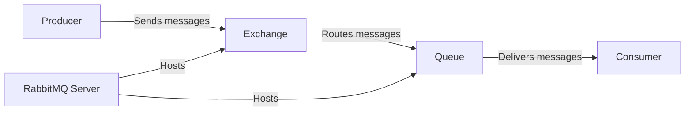

# RabbitMQ Installation

## Introduction

RabbitMQ is a powerful open-source message broker that implements the Advanced Message Queuing Protocol (AMQP). It acts as an intermediary for messaging, enabling applications to communicate asynchronously by sending and receiving messages. Before diving into RabbitMQ's capabilities, we need to set it up properly on your system.

This guide will walk you through the installation process for different operating systems, verify your installation, and help you understand the basic configuration options available to you as a beginner.

## Prerequisites

Before installing RabbitMQ, ensure you have:

- Administrative privileges on your system
- Internet connection for downloading packages
- Erlang/OTP installed (RabbitMQ is written in Erlang)

## Installation Process

### Installing Erlang/OTP

RabbitMQ is built on the Erlang programming language, so we need to install Erlang first.

#### On Windows

1. Download the Erlang installer from the [official Erlang website](https://www.erlang.org/downloads)
2. Run the installer and follow the on-screen instructions
3. Make sure to add Erlang to your PATH environment variable

#### On macOS

Using Homebrew:

```bash
brew update
brew install erlang
```

#### On Ubuntu/Debian

```bash
sudo apt-get update
sudo apt-get install -y erlang
```

#### On CentOS/RHEL

```bash
sudo yum install -y erlang
```

### Installing RabbitMQ

Now that Erlang is installed, let's proceed with installing RabbitMQ.

#### On Windows

1. Download the RabbitMQ installer from the [official RabbitMQ website](https://www.rabbitmq.com/download.html)
2. Run the installer and follow the on-screen instructions
3. The installer should set up RabbitMQ as a Windows service that starts automatically

#### On macOS

Using Homebrew:

```bash
brew update
brew install rabbitmq
```

After installation, add the RabbitMQ bin directory to your PATH:

```bash
export PATH=$PATH:/usr/local/opt/rabbitmq/sbin
```

#### On Ubuntu/Debian

```bash
sudo apt-get update
sudo apt-get install -y rabbitmq-server
```

#### On CentOS/RHEL

```bash
sudo rpm --import https://packagecloud.io/rabbitmq/rabbitmq-server/gpgkey
sudo yum install -y rabbitmq-server
```

## Starting RabbitMQ Server

After installation, you'll need to start the RabbitMQ server.

#### On Windows

RabbitMQ should be installed as a service and start automatically. If it doesn't:

1. Open the Start menu
2. Search for "Services"
3. Find "RabbitMQ" in the list and right-click to start it

Alternatively, you can use the command prompt (as administrator):

```bash
net start RabbitMQ
```

#### On macOS

```bash
brew services start rabbitmq
```

Or manually:

```bash
rabbitmq-server
```

#### On Linux (Ubuntu, Debian, CentOS, RHEL)

```bash
sudo systemctl start rabbitmq-server
sudo systemctl enable rabbitmq-server  # To ensure it starts on boot
```

## Verifying Installation

Let's make sure RabbitMQ is running correctly:

```bash
rabbitmqctl status
```

You should see output containing various details about your RabbitMQ installation, including the version, runtime, OS information, and more. The important part is that it responds without errors.

## Enabling the Management Plugin

RabbitMQ comes with a web-based management UI that is very helpful for beginners to visualize what's happening. Let's enable it:

```bash
rabbitmq-plugins enable rabbitmq_management
```

After enabling the plugin, you can access the management interface by navigating to `http://localhost:15672` in your web browser.

The default login credentials are:
- Username: `guest`
- Password: `guest`

Note that the `guest` user can only connect from localhost by default.

## Creating a New User

For security reasons, it's recommended to create a new administrator user:

```bash
rabbitmqctl add_user admin strong_password
rabbitmqctl set_user_tags admin administrator
rabbitmqctl set_permissions -p / admin ".*" ".*" ".*"
```

This creates a new user named `admin` with administrator privileges and full permissions on the default virtual host.

## Basic Configuration

RabbitMQ works well with its default configuration for development purposes, but let's understand some basic configuration options:

### Configuration File Location

RabbitMQ uses a configuration file for advanced settings. The location depends on your OS:

- **Windows**: `%APPDATA%\RabbitMQ\rabbitmq.conf`
- **Linux**: `/etc/rabbitmq/rabbitmq.conf`
- **macOS**: `/usr/local/etc/rabbitmq/rabbitmq.conf`

### Sample Configuration

Here's a basic configuration example (create this file if it doesn't exist):

```
# rabbitmq.conf
listeners.tcp.default = 5672
management.tcp.port = 15672
```

For most beginners, the default configuration is sufficient. You'll only need to modify these settings for specific use cases or production deployments.

## RabbitMQ Architecture

Understanding the basic architecture will help you use RabbitMQ effectively:



## Hello World Example

Let's create a simple "Hello World" example with RabbitMQ using Node.js:

First, create a new directory and initialize a Node.js project:

```bash
mkdir rabbitmq-hello-world
cd rabbitmq-hello-world
npm init -y
npm install amqplib
```

### Producer (send.js)

Create a file named `send.js`:

```javascript
const amqp = require('amqplib/callback_api');

// Connect to RabbitMQ server
amqp.connect('amqp://localhost', (error0, connection) => {
  if (error0) {
    throw error0;
  }
  
  // Create a channel
  connection.createChannel((error1, channel) => {
    if (error1) {
      throw error1;
    }
    
    const queue = 'hello';
    const msg = 'Hello World!';
    
    // Declare a queue
    channel.assertQueue(queue, {
      durable: false
    });
    
    // Send a message to the queue
    channel.sendToQueue(queue, Buffer.from(msg));
    console.log(" [x] Sent %s", msg);
  });
  
  // Close the connection after 500ms
  setTimeout(() => {
    connection.close();
    process.exit(0);
  }, 500);
});
```

### Consumer (receive.js)

Create a file named `receive.js`:

```javascript
const amqp = require('amqplib/callback_api');

// Connect to RabbitMQ server
amqp.connect('amqp://localhost', (error0, connection) => {
  if (error0) {
    throw error0;
  }
  
  // Create a channel
  connection.createChannel((error1, channel) => {
    if (error1) {
      throw error1;
    }
    
    const queue = 'hello';
    
    // Declare the same queue
    channel.assertQueue(queue, {
      durable: false
    });
    
    console.log(" [*] Waiting for messages in %s. To exit press CTRL+C", queue);
    
    // Consume messages from the queue
    channel.consume(queue, (msg) => {
      console.log(" [x] Received %s", msg.content.toString());
    }, {
      noAck: true
    });
  });
});
```

### Running the Example

First, start the consumer in one terminal:

```bash
node receive.js
```

Then run the producer in another terminal:

```bash
node send.js
```

**Output from producer:**
```
[x] Sent Hello World!
```

**Output from consumer:**
```
[*] Waiting for messages in hello. To exit press CTRL+C
[x] Received Hello World!
```

This simple example demonstrates how a producer sends a message to a queue and a consumer receives it. The consumer will keep listening for messages until you terminate it.

## Troubleshooting Common Issues

### RabbitMQ Service Won't Start

1. Check if Erlang is properly installed:
   ```bash
   erl -eval 'erlang:display(erlang:system_info(otp_release)), halt().'
   ```

2. Verify port availability (RabbitMQ uses ports 5672, 15672, and others):
   ```bash
   # On Windows
   netstat -ano | findstr 5672
   
   # On Linux/macOS
   netstat -tulpn | grep 5672
   ```

3. Check the RabbitMQ logs:
   - Windows: `%APPDATA%\RabbitMQ\log`
   - Linux: `/var/log/rabbitmq`
   - macOS: `/usr/local/var/log/rabbitmq`

### Connection Refused

If you get "connection refused" errors when trying to connect to RabbitMQ:

1. Ensure the RabbitMQ service is running
2. Check your firewall settings
3. Verify you're using the correct port (default is 5672 for AMQP)

### Authentication Failed

If you see authentication errors:

1. Make sure you're using the correct credentials
2. Remember that the default `guest` user can only connect from localhost
3. Check user permissions with:
   ```bash
   rabbitmqctl list_users
   rabbitmqctl list_permissions
   ```

## Summary

In this guide, we've learned how to:

1. Install Erlang, which is required for RabbitMQ
2. Install RabbitMQ on various operating systems
3. Start and verify the RabbitMQ server
4. Enable the management plugin for a web-based UI
5. Create a new administrator user
6. Understand basic configuration options
7. Create a simple "Hello World" messaging example
8. Troubleshoot common installation issues

RabbitMQ is now successfully installed on your system, and you've taken your first steps with this powerful message broker. In the next sections of "RabbitMQ Fundamentals," we'll explore more advanced messaging patterns and features.

## Additional Resources

- Official [RabbitMQ Documentation](https://www.rabbitmq.com/documentation.html)
- [RabbitMQ Tutorials](https://www.rabbitmq.com/getstarted.html)
- [Erlang Documentation](https://www.erlang.org/docs)

## Exercises

1. Create a producer that sends multiple messages with different content to a queue.
2. Modify the consumer to acknowledge messages only after processing them.
3. Create multiple consumers for the same queue and observe how messages are distributed.
4. Enable message persistence and restart RabbitMQ to verify messages aren't lost.
5. Experiment with different exchange types (direct, topic, fanout) to understand message routing.