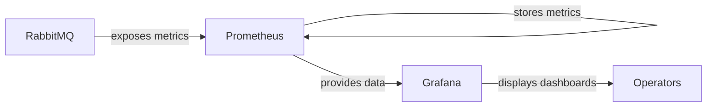
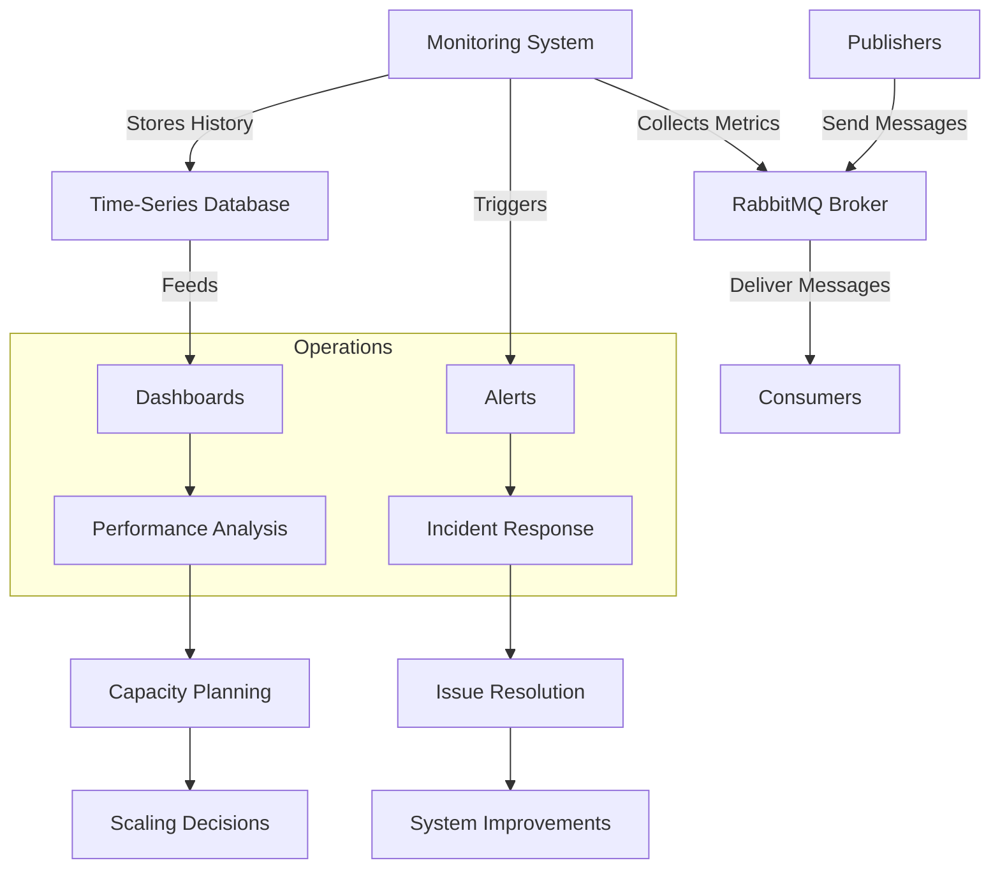

# RabbitMQ Monitoring

## Introduction

Monitoring is a critical aspect of maintaining a healthy RabbitMQ deployment. As a message broker that often serves as the backbone of distributed systems, ensuring RabbitMQ operates optimally is essential for the overall health of your applications. This guide will introduce you to RabbitMQ monitoring concepts, tools, and best practices to help you maintain a reliable messaging infrastructure.

## Why Monitor RabbitMQ?

RabbitMQ, like any critical infrastructure component, requires proper monitoring to:

- Detect potential issues before they become serious problems
- Understand resource usage patterns
- Plan for capacity needs
- Ensure message delivery reliability
- Troubleshoot performance bottlenecks
- Validate configuration changes

## Key Metrics to Monitor

### Node Health Metrics

These metrics provide insights into the overall health of your RabbitMQ nodes:

1. **Memory Usage**: RabbitMQ has configurable memory thresholds that trigger flow control when reached
2. **Disk Space**: Critical for message persistence and queue operations
3. **File Descriptors/Handles**: RabbitMQ needs sufficient file handles for connections
4. **Erlang Process Count**: Shows internal process activity
5. **CPU Usage**: High CPU can indicate processing bottlenecks

### Queue Metrics

Queue metrics help you understand message flow and potential bottlenecks:

1. **Queue Depth**: Number of messages waiting in queues
2. **Queue Growth Rate**: How quickly queues are growing or shrinking
3. **Consumer Utilization**: Percentage of time consumers are active
4. **Message Rates**: Publishing and delivery rates
5. **Redelivery Rates**: Messages that required redelivery

### Connection & Channel Metrics

These metrics help monitor client connectivity:

1. **Connection Count**: Total number of client connections
2. **Channel Count**: Total number of channels
3. **Connection Churn**: Rate of connections being created and closed
4. **Network Traffic**: Bandwidth usage for message delivery

## Built-in Monitoring Tools

### Management UI

RabbitMQ's Management UI provides a web interface for monitoring and management. To enable it, run:

```bash
rabbitmq-plugins enable rabbitmq_management
```

Once enabled, access the UI at `http://your-server:15672` with default credentials `guest/guest` (for local deployments only).

The Management UI offers:

- Real-time queue, exchange, and binding information
- Connection and channel details
- Node status and resource usage
- Message rates visualization
- User management

### HTTP API

The Management Plugin also provides an HTTP API that you can query programmatically:

```bash
# Example: Get overview information
curl -u guest:guest http://localhost:15672/api/overview

# Example: Get queue information
curl -u guest:guest http://localhost:15672/api/queues
```

### RabbitMQ CLI Tools

RabbitMQ ships with command-line tools for monitoring:

```bash
# List queues with message counts and other details
rabbitmqctl list_queues name messages consumers memory

# Check node status
rabbitmqctl status

# Monitor what consumers are doing
rabbitmqctl list_consumers
```

### Management Plugin Extensions

Several plugins extend the management interface with additional monitoring capabilities:

```bash
# Enable the Shovel management plugin
rabbitmq-plugins enable rabbitmq_shovel_management

# Enable the federation management plugin
rabbitmq-plugins enable rabbitmq_federation_management
```

## Integrating with External Monitoring Systems

### Prometheus and Grafana

Prometheus is an excellent choice for monitoring RabbitMQ. The RabbitMQ Prometheus plugin exposes metrics in Prometheus format.

```bash
# Enable the Prometheus plugin
rabbitmq-plugins enable rabbitmq_prometheus
```

Metrics will be available at `http://your-server:15692/metrics`

A simple Prometheus configuration to scrape RabbitMQ:

```yaml
scrape_configs:
  - job_name: 'rabbitmq'
    static_configs:
      - targets: ['rabbitmq:15692']
```

Pair Prometheus with Grafana for visualization:



### Collecting Metrics with Telegraf

[Telegraf](https://www.influxdata.com/time-series-platform/telegraf/) can collect RabbitMQ metrics and send them to various backends.

Sample Telegraf configuration for RabbitMQ:

```toml
[[inputs.rabbitmq]]
  url = "http://localhost:15672"
  username = "guest"
  password = "guest"
  
  # Gather metrics about exchanges
  gather_exchange_metrics = true
  
  # Gather metrics about queues
  gather_queue_metrics = true
  
  # Gather metrics about nodes
  gather_node_metrics = true
```

## Setting Up Alerts

Effective monitoring includes alerting when metrics exceed thresholds. Here are some critical alerts to consider:

1. **High Memory Watermark Approaching**: Alert when memory usage reaches 80% of the configured high watermark
2. **Disk Space Running Low**: Alert when free disk space drops below 2GB
3. **Queue Growth Rate Abnormal**: Alert when queues grow faster than they are consumed
4. **No Consumers on Queue**: Alert when important queues have zero consumers
5. **High Message Redelivery Rate**: Alert when message redelivery exceeds normal thresholds

Example Prometheus alerting rule for node memory:

```yaml
groups:
  - name: rabbitmq_alerts
    rules:
      - alert: RabbitMQHighMemoryUsage
        expr: rabbitmq_node_mem_used / rabbitmq_node_mem_limit > 0.8
        for: 5m
        labels:
          severity: warning
        annotations:
          summary: "RabbitMQ high memory usage"
          description: "RabbitMQ node {{ $labels.node }} is using more than 80% of its available memory"
```

## Monitoring Best Practices

1. **Monitor All Nodes**: In a cluster, monitor every node individually
2. **Set Appropriate Baselines**: Understand normal behavior before setting thresholds
3. **Correlate Metrics**: Look at related metrics together (e.g., queue depth and consumer count)
4. **Historical Data**: Keep historical data to analyze trends and plan capacity
5. **Document Dashboards**: Include explanations with your dashboards for team knowledge sharing
6. **Regular Review**: Periodically review monitoring setup and alert thresholds

## Implementing a Simple Node Monitor

Here's a simple Node.js script that checks RabbitMQ health and reports issues:

```javascript
const axios = require('axios');

// Configuration
const config = {
  rabbitmqUrl: 'http://localhost:15672/api',
  username: 'guest',
  password: 'guest',
  thresholds: {
    memoryWarningPercent: 70,
    queueLengthWarning: 1000
  }
};

// Authentication for HTTP requests
const auth = {
  username: config.username,
  password: config.password
};

async function checkNodeHealth() {
  try {
    // Get node information
    const nodeResponse = await axios.get(`${config.rabbitmqUrl}/nodes`, { auth });
    const nodes = nodeResponse.data;
    
    // Check each node
    nodes.forEach(node => {
      // Memory check
      const memUsedMB = node.mem_used / 1024 / 1024;
      const memLimitMB = node.mem_limit / 1024 / 1024;
      const memPercentUsed = (memUsedMB / memLimitMB) * 100;
      
      console.log(`Node: ${node.name}`);
      console.log(`Memory: ${memUsedMB.toFixed(2)}MB / ${memLimitMB.toFixed(2)}MB (${memPercentUsed.toFixed(2)}%)`);
      
      if (memPercentUsed > config.thresholds.memoryWarningPercent) {
        console.warn(`⚠️ WARNING: Memory usage is high (${memPercentUsed.toFixed(2)}%)`);
      }
      
      // Process count check
      console.log(`Erlang processes: ${node.proc_used} / ${node.proc_total}`);
      
      // Disk space check
      const diskFreeMB = node.disk_free / 1024 / 1024;
      console.log(`Disk free: ${diskFreeMB.toFixed(2)}MB`);
    });
    
    // Get queue information
    const queueResponse = await axios.get(`${config.rabbitmqUrl}/queues`, { auth });
    const queues = queueResponse.data;
    
    console.log('
Queue Status:');
    queues.forEach(queue => {
      console.log(`Queue: ${queue.name} (${queue.vhost})`);
      console.log(`Messages: ${queue.messages}, Consumers: ${queue.consumers}`);
      
      if (queue.messages > config.thresholds.queueLengthWarning) {
        console.warn(`⚠️ WARNING: Queue length is high (${queue.messages})`);
      }
      
      if (queue.messages > 0 && queue.consumers === 0) {
        console.warn(`⚠️ WARNING: Queue has messages but no consumers`);
      }
    });
    
  } catch (error) {
    console.error('Error monitoring RabbitMQ:', error.message);
  }
}

// Run the check
checkNodeHealth();
```

To use this script, save it as `monitor-rabbitmq.js` and install dependencies:

```bash
npm install axios
node monitor-rabbitmq.js
```

Example output:

```
Node: rabbit@my-broker
Memory: 150.25MB / 1024.00MB (14.67%)
Erlang processes: 1082 / 1048576
Disk free: 10240.50MB

Queue Status:
Queue: tasks (/)
Messages: 42, Consumers: 2
Queue: notifications (/)
Messages: 1500, Consumers: 1
⚠️ WARNING: Queue length is high (1500)
Queue: dead-letter (/)
Messages: 27, Consumers: 0
⚠️ WARNING: Queue has messages but no consumers
```

## Visualizing RabbitMQ Performance

Here's a simple visualization of how monitoring fits into the RabbitMQ operational flow:



## Common Monitoring Challenges and Solutions

| Challenge | Solution |
|-----------|----------|
| Too many alerts | Implement proper thresholds based on historical data |
| Missing important events | Use composite alerts that look at multiple related metrics |
| High cardinality of metrics | Focus on key metrics and use labels wisely |
| Understanding queue bottlenecks | Monitor consumer utilization and message rates together |
| Cluster-wide visibility | Aggregate node metrics but preserve per-node details |

## Summary

Effective RabbitMQ monitoring is essential for maintaining a reliable messaging system. By monitoring node health, queue performance, and connection metrics, you can ensure your RabbitMQ deployment meets your application's needs. We've covered built-in tools like the Management UI and rabbitmqctl, as well as integration with external systems like Prometheus and Grafana.

Remember these key points:

- Monitor both system-level resources (memory, disk, CPU) and RabbitMQ-specific metrics
- Set up alerts for critical thresholds to catch issues early
- Keep historical data for trend analysis and capacity planning
- Use visualization tools to make complex metrics easier to understand
- Regularly review and update your monitoring configuration

## Additional Resources

- [RabbitMQ Monitoring Documentation](https://www.rabbitmq.com/monitoring.html)
- [Prometheus RabbitMQ Exporter](https://github.com/rabbitmq/rabbitmq-prometheus)
- [Grafana Dashboard for RabbitMQ](https://grafana.com/grafana/dashboards/10991-rabbitmq-overview/)

## Exercises

1. Set up the RabbitMQ Management plugin and explore the web UI
2. Configure Prometheus to scrape metrics from RabbitMQ
3. Create a simple Grafana dashboard with the most important RabbitMQ metrics
4. Write a script that checks queue depths and sends an alert if they exceed a threshold
5. Implement a monitoring solution that tracks message rates over time