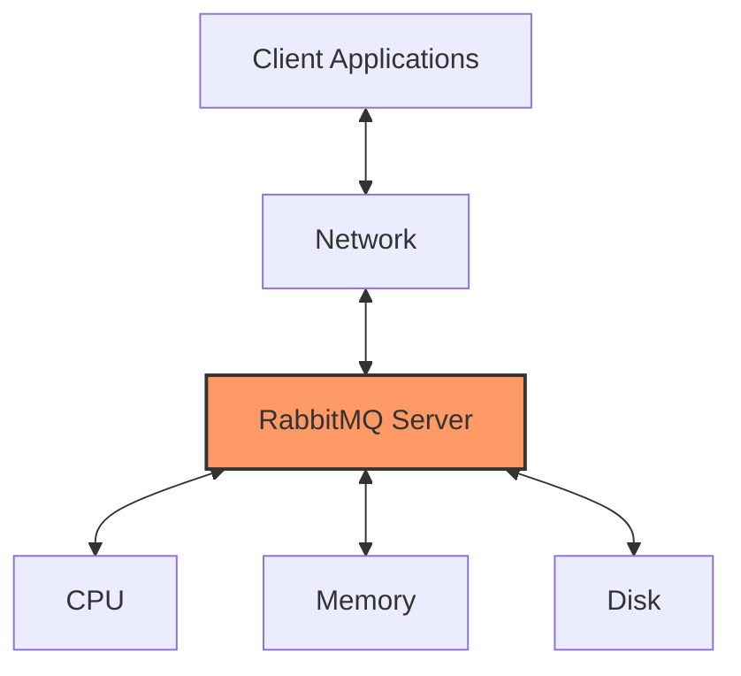
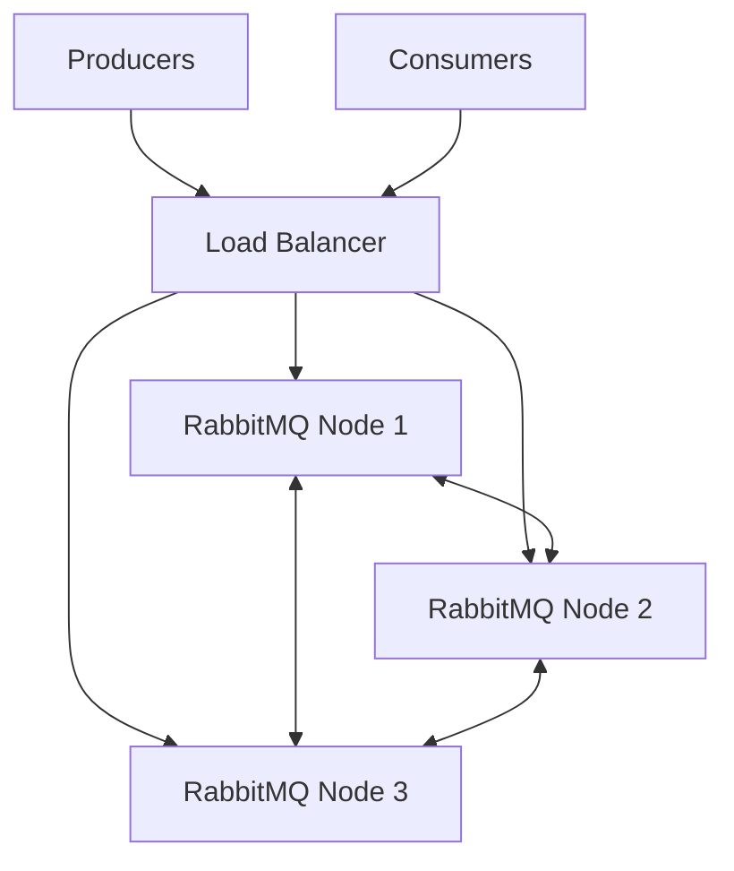

# RabbitMQ Performance

## Introduction

Performance is a critical aspect of any messaging system, and RabbitMQ is no exception. As your application grows, understanding how to optimize RabbitMQ becomes essential for maintaining reliability and efficiency. This guide will explore the key factors that affect RabbitMQ performance and provide practical strategies for optimization.

RabbitMQ can handle thousands of connections and millions of messages per second when properly configured. However, achieving optimal performance requires understanding various factors that influence message throughput, latency, and resource consumption.

## Key Performance Factors

### Hardware Considerations

The performance of RabbitMQ is directly affected by the hardware it runs on. Key hardware factors include:

- **CPU**: Multiple cores benefit RabbitMQ as it can parallelize operations
- **Memory**: Sufficient RAM is crucial, especially for queues that store messages in memory
- **Disk I/O**: Fast storage is important for persistent messages and when using disk-based queues
- **Network**: High throughput and low latency are essential for distributed deployments

Let's visualize how these components interact with RabbitMQ:



### Messaging Patterns and Configuration

Different messaging patterns have varying performance characteristics:

1. **Direct Exchange**: Fastest, with minimal routing overhead
2. **Topic Exchange**: More overhead due to pattern matching
3. **Fanout Exchange**: Efficient for broadcasting but can create load with many queues
4. **Headers Exchange**: Most complex routing logic and higher overhead

### Queue Properties

Queue configuration significantly impacts performance:

- **Durable vs. Transient**: Persistent messages have higher latency due to disk writes
- **Exclusive vs. Shared**: Exclusive queues can be more efficient for specific use cases
- **Auto-delete vs. Manual**: Auto-delete queues incur cleanup overhead
- **Lazy Queues**: Store messages on disk faster, reducing memory pressure but with higher latency

## Performance Benchmarking

Before optimizing, it's essential to establish performance baselines. RabbitMQ provides several tools for this purpose:

### Using PerfTest Tool

RabbitMQ's PerfTest is a Java-based utility for benchmarking performance:

```bash
# Basic producer-consumer benchmark
./runjava com.rabbitmq.perf.PerfTest -x 1 -y 2 -u "throughput-test" -a --id "test1"

# Test with different message sizes
./runjava com.rabbitmq.perf.PerfTest -x 1 -y 1 -u "size-test" -s 10000 --id "test2"

# Measure latency
./runjava com.rabbitmq.perf.PerfTest -x 1 -y 1 -u "latency-test" --id "test3" -T
```

### Management UI Metrics

The RabbitMQ Management UI provides valuable performance metrics:

1. Queue depth and message rates
2. Connection and channel counts
3. Node resource usage (memory, disk, CPU)
4. Exchange and binding information

## Optimization Strategies

Now, let's explore practical strategies to optimize RabbitMQ performance:

### 1. Connection and Channel Management

Connections and channels are expensive resources:

```javascript
// Instead of this (creating a connection per message)
function sendMessage(message) {
  const connection = await amqp.connect('amqp://localhost');
  const channel = await connection.createChannel();
  await channel.sendToQueue('my_queue', Buffer.from(message));
  await channel.close();
  await connection.close();
}

// Do this (reuse connections and channels)
const connection = await amqp.connect('amqp://localhost');
const channel = await connection.createChannel();

function sendMessage(message) {
  return channel.sendToQueue('my_queue', Buffer.from(message));
}
```

Best practices include:

- Reuse connections and channels when possible
- Use connection pools for scaling
- Implement proper connection lifecycle management
- Monitor connection and channel counts

### 2. Publisher Confirms and Consumer Acknowledgments

For reliability with optimal performance:

```javascript
// Publisher confirms
const channel = await connection.createChannel();
await channel.confirmSelect();

// Publish with confirms
channel.publish('exchange', 'routing_key', Buffer.from('message'), {}, 
  (err, ok) => {
    if (err) {
      console.error('Message was nacked!', err);
    } else {
      console.log('Message was confirmed');
    }
  }
);

// Consumer with manual acknowledgments and prefetch
await channel.prefetch(100);
await channel.consume('my_queue', async (message) => {
  try {
    await processMessage(message);
    channel.ack(message);
  } catch (error) {
    channel.nack(message, false, true); // Requeue the message
  }
}, { noAck: false });
```

Performance considerations:

- Set appropriate prefetch counts based on consumer processing capacity
- Balance between reliability (confirms/acks) and throughput
- Batch acknowledgments when possible

### 3. Message Properties Optimization

Message properties affect both size and processing overhead:

```javascript
// Minimize headers and properties for better performance
channel.publish('exchange', 'routing_key', Buffer.from(message), {
  persistent: true,  // Only use when needed
  // Avoid unnecessary properties
  // contentType: 'application/json',
  // messageId: uuid(),
  // timestamp: Date.now(),
  // etc.
});
```

### 4. Queue Management

Optimize queue configurations:

```javascript
// Regular queue with moderate throughput requirements
await channel.assertQueue('standard_queue', {
  durable: true,
  arguments: {
    'x-max-length': 10000,
    'x-overflow': 'reject-publish'
  }
});

// High-throughput queue with memory optimization
await channel.assertQueue('high_throughput_queue', {
  durable: true,
  arguments: {
    'x-queue-mode': 'lazy',
    'x-max-length': 1000000,
    'x-max-length-bytes': 1073741824  // 1GB
  }
});
```

Important queue optimizations:

- Use lazy queues for very large queues
- Implement TTL (Time-To-Live) for messages
- Set maximum queue length limits
- Configure dead letter exchanges for unprocessed messages

### 5. Cluster Configuration

For larger deployments, proper cluster configuration is essential:



Clustering considerations:

- Distribute queue masters across nodes
- Use queue mirroring selectively
- Configure proper network partitioning handling
- Monitor cluster-wide metrics

## Practical Example: Optimizing a High-Throughput System

Let's examine a real-world scenario where we need to process 10,000 messages per second with minimal latency:

```javascript
// Node.js implementation with optimized settings
const amqp = require('amqplib');

async function setupOptimizedMessageSystem() {
  // Use a connection pool with optimal connection count
  const connectionPool = await createConnectionPool({
    urls: ['amqp://rabbitmq1', 'amqp://rabbitmq2', 'amqp://rabbitmq3'],
    connectionLimit: 5  // Based on CPU cores and application needs
  });
  
  // Publisher setup with confirms and batching
  const publishChannel = await connectionPool.getChannel();
  await publishChannel.confirmSelect();
  
  // Use batch publishing for higher throughput
  const batch = publishChannel.batch();
  for (let i = 0; i < 1000; i++) {
    batch.publish('events', 'user.action', Buffer.from(JSON.stringify({
      userId: `user-${i}`,
      action: 'login',
      timestamp: Date.now()
    })), { persistent: true });
  }
  await batch.commit();
  
  // Consumer setup with optimal prefetch
  const consumeChannel = await connectionPool.getChannel();
  await consumeChannel.prefetch(250);  // Tuned based on message processing time
  
  // Process messages in parallel for higher throughput
  await consumeChannel.consume('user_events', async (message) => {
    const promises = [];
    for (let i = 0; i < 10; i++) {
      promises.push(processMessage(message));
    }
    await Promise.all(promises);
    consumeChannel.ack(message);
  }, { noAck: false });
}

async function processMessage(message) {
  // Fast, non-blocking processing
  return Promise.resolve();
}
```

This example demonstrates:

1. Connection pooling for optimal resource usage
2. Batch publishing for higher throughput
3. Proper prefetch configuration
4. Parallel message processing
5. Strategic acknowledgment patterns

## Performance Testing and Monitoring

Continuous monitoring is essential for maintaining optimal performance:

### Key Metrics to Monitor

1. **Message rates**: Publishing and consumption rates
2. **Queue depths**: Number of messages waiting in queues
3. **Connection/channel counts**: Resource usage by clients
4. **Node metrics**: CPU, memory, disk, and network utilization
5. **Latency**: End-to-end message delivery times

### Monitoring Tools

```javascript
// Example: Monitoring RabbitMQ with the HTTP API
const monitorRabbitMQ = async () => {
  const response = await fetch('http://rabbitmq-server:15672/api/queues/vhost/queue-name', {
    headers: {
      'Authorization': 'Basic ' + Buffer.from('username:password').toString('base64')
    }
  });
  
  const queueStats = await response.json();
  console.log(`Queue depth: ${queueStats.messages}`);
  console.log(`Message rate: ${queueStats.message_stats.publish_details.rate}/s`);
  console.log(`Consumer count: ${queueStats.consumers}`);
};
```

## Common Performance Pitfalls

Avoid these common issues:

1. **Too many connections**: Create excessive overhead
2. **Unbounded queues**: Can consume all available memory
3. **Message accumulation**: Indicates consumer capacity issues
4. **Microbatching**: Very small messages have higher overhead per byte
5. **Synchronous processing**: Blocks the event loop and reduces throughput

## Summary

Optimizing RabbitMQ performance involves multiple considerations across hardware, configuration, and application design. Key takeaways include:

- Connection and channel management is critical
- Message persistence has performance implications
- Queue properties significantly impact performance
- Hardware resources must match your workload
- Continuous monitoring is essential

By applying these principles and continuously measuring your system's performance, you can build highly efficient messaging systems with RabbitMQ that scale with your application's needs.

## Additional Resources

- [RabbitMQ Performance Documentation](https://www.rabbitmq.com/performance.html)
- [Monitoring with Prometheus and Grafana](https://www.rabbitmq.com/prometheus.html)
- [RabbitMQ Clustering Guide](https://www.rabbitmq.com/clustering.html)

## Exercises

1. Set up a RabbitMQ instance and use PerfTest to benchmark different exchange types.
2. Experiment with different prefetch values and measure their impact on throughput.
3. Implement a producer-consumer application with connection pooling and compare its performance to a naive implementation.
4. Create a monitoring dashboard for RabbitMQ using Prometheus and Grafana.
5. Design and implement a high-availability RabbitMQ cluster with optimized queue configurations for a hypothetical high-load application.