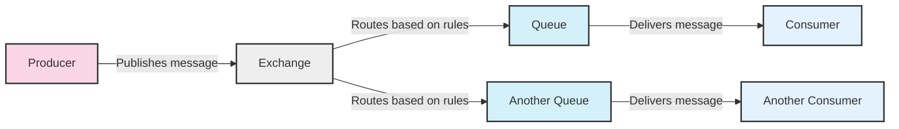
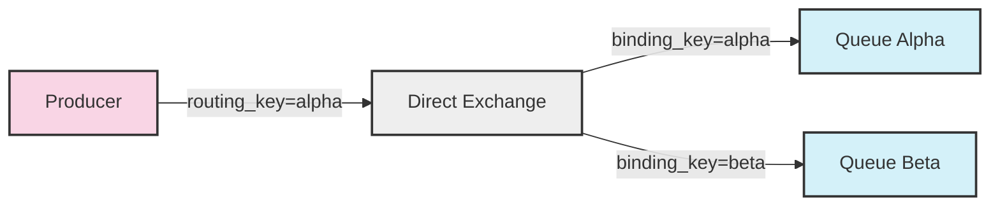
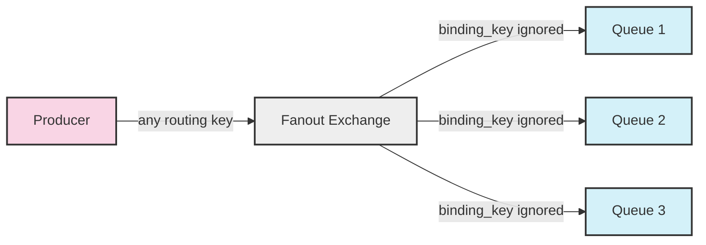
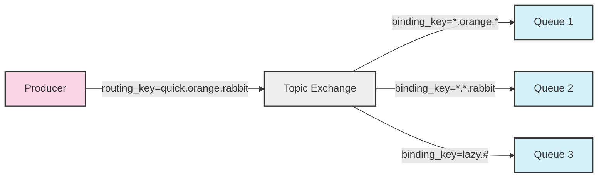
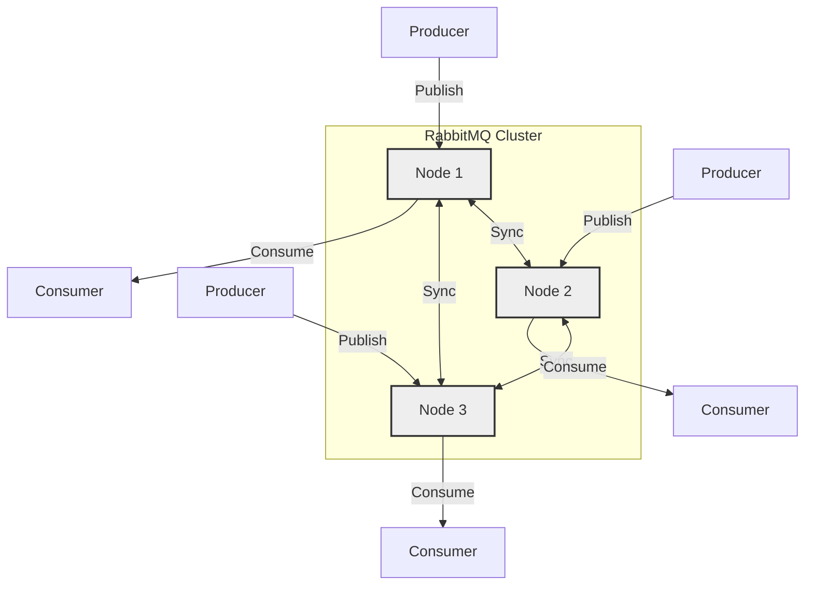

# RabbitMQ Architecture

## Introduction

RabbitMQ is an open-source message broker that implements the Advanced Message Queuing Protocol (AMQP). It acts as an intermediary for messaging, providing a common platform for sending and receiving messages. This allows different parts of your application to communicate without needing to know about each other directly - a pattern known as loose coupling.

In this guide, we'll explore the architecture of RabbitMQ, understand its key components, and see how these elements work together to create a robust messaging system.

## Core Architectural Components

RabbitMQ's architecture consists of several key components that work together to facilitate message routing and delivery:

### 1. Producer

A producer is any application that sends messages to RabbitMQ. Producers don't send messages directly to queues; instead, they send messages to exchanges.

### 2. Exchange

Exchanges are message routing agents responsible for routing messages to different queues. When a producer sends a message to RabbitMQ, it's actually sending it to an exchange. The exchange then routes the message to the appropriate queue(s) based on specific rules called bindings and routing keys.

### 3. Queue

Queues are where messages live until they're consumed by applications. They're essentially message buffers, bound to exchanges, that store messages until a consumer is ready to receive them. Queues have properties like:
- Durability (survive broker restarts)
- Exclusivity (used by only one connection)
- Auto-delete (delete when last consumer unsubscribes)

### 4. Bindings

Bindings are rules that exchanges use to route messages to queues. A binding is a link between an exchange and a queue. It often includes a routing key to determine which messages should be routed to which queues.

### 5. Consumer

A consumer is any application that receives messages from RabbitMQ. Consumers subscribe to queues to receive messages.

### 6. Virtual Hosts (vhosts)

Virtual hosts provide logical grouping and separation of resources. Each virtual host is essentially a mini-RabbitMQ server with its own exchanges, queues, and bindings. They're isolated from each other, so a client connected to one virtual host cannot access resources in another.

## Architectural Flow

Let's visualize the typical message flow in RabbitMQ:



1. A producer publishes a message to an exchange
2. The exchange receives the message and routes it to one or more queues
3. Messages remain in the queue until they're consumed or expire
4. A consumer subscribes to a queue and processes messages

## Exchange Types

RabbitMQ offers several types of exchanges, each with different routing behavior:

### Direct Exchange

Direct exchanges route messages to queues based on a message routing key. A message goes to the queues whose binding key exactly matches the routing key of the message.



### Fanout Exchange

Fanout exchanges route messages to all of the queues that are bound to it, regardless of routing keys.



### Topic Exchange

Topic exchanges route messages to queues based on wildcard matches between the routing key and the binding pattern.



In topic exchanges:
- `*` (star) substitutes exactly one word
- `#` (hash) substitutes zero or more words

### Headers Exchange

Headers exchanges use message headers instead of routing keys for routing. A message is routed to a queue if the headers match the binding arguments.

## Practical Implementation

Let's look at a practical example implementing these concepts using the Node.js `amqplib` library. We'll create a simple producer and consumer that communicate through RabbitMQ.

### Producer Example

```javascript
const amqp = require('amqplib');

async function sendMessage() {
  try {
    // Connect to RabbitMQ server
    const connection = await amqp.connect('amqp://localhost');
    const channel = await connection.createChannel();
    
    // Declare exchange and queue
    const exchangeName = 'my_exchange';
    const queueName = 'my_queue';
    const routingKey = 'my_key';
    
    await channel.assertExchange(exchangeName, 'direct', { durable: true });
    await channel.assertQueue(queueName, { durable: true });
    await channel.bindQueue(queueName, exchangeName, routingKey);
    
    // Send a message
    const message = {
      id: Math.floor(Math.random() * 1000),
      text: 'Hello from RabbitMQ!',
      timestamp: new Date().toISOString()
    };
    
    channel.publish(
      exchangeName,
      routingKey,
      Buffer.from(JSON.stringify(message)),
      { persistent: true }
    );
    
    console.log(`Message sent: ${JSON.stringify(message)}`);
    
    // Close the connection
    setTimeout(() => {
      connection.close();
    }, 500);
  } catch (error) {
    console.error('Error:', error);
  }
}

sendMessage();
```

### Consumer Example

```javascript
const amqp = require('amqplib');

async function receiveMessages() {
  try {
    // Connect to RabbitMQ server
    const connection = await amqp.connect('amqp://localhost');
    const channel = await connection.createChannel();
    
    // Declare the same queue as in producer
    const queueName = 'my_queue';
    await channel.assertQueue(queueName, { durable: true });
    
    // Only get one message at a time
    channel.prefetch(1);
    
    console.log(`Waiting for messages from ${queueName}...`);
    
    // Consume messages
    channel.consume(queueName, (msg) => {
      if (msg !== null) {
        const content = JSON.parse(msg.content.toString());
        console.log(`Received message: ${JSON.stringify(content)}`);
        
        // Acknowledge message (remove from queue)
        setTimeout(() => {
          channel.ack(msg);
          console.log('Message processed and acknowledged');
        }, 1000);
      }
    });
  } catch (error) {
    console.error('Error:', error);
  }
}

receiveMessages();
```

### Expected Output

When you run the producer:
```
Message sent: {"id":423,"text":"Hello from RabbitMQ!","timestamp":"2023-08-15T15:20:45.123Z"}
```

When you run the consumer:
```
Waiting for messages from my_queue...
Received message: {"id":423,"text":"Hello from RabbitMQ!","timestamp":"2023-08-15T15:20:45.123Z"}
Message processed and acknowledged
```

## Advanced Architectural Features

Beyond the basic components, RabbitMQ offers several advanced architectural features:

### 1. Clustering

RabbitMQ can be deployed in a cluster, where multiple nodes share users, virtual hosts, queues, exchanges, bindings, and runtime parameters. This provides high availability and scalability.



### 2. Mirrored Queues

Queues can be mirrored across multiple nodes in a cluster, ensuring that if a node fails, the messages in the queue are not lost.

### 3. Shovel Plugin

The Shovel plugin allows you to reliably move messages from one broker to another, which is useful for connecting brokers across unreliable networks or data centers.

### 4. Federation Plugin

The Federation plugin allows exchanges and queues to be federated across multiple brokers, which can span WANs and different administrative domains.

### 5. Message TTL (Time-to-Live)

Messages can be set to expire after a certain time, either by setting TTL on individual messages or on entire queues.

### 6. Dead Letter Exchanges

Messages that are rejected or expire can be routed to special exchanges called Dead Letter Exchanges, where they can be handled separately.

## RabbitMQ vs. Other Messaging Systems

To better understand RabbitMQ's architectural choices, it's helpful to compare it with other messaging systems:

| Feature | RabbitMQ | Kafka | ActiveMQ | Amazon SQS |
|---------|----------|-------|----------|------------|
| Primary Protocol | AMQP | Custom | OpenWire, STOMP, AMQP | HTTP/HTTPS |
| Message Routing | Complex routing with exchanges | Topic-based partitioning | Multiple protocols and patterns | Simple queue-based |
| Delivery Guarantee | At-most-once, at-least-once, exactly-once | At-least-once | Multiple options | At-least-once |
| Performance | High throughput | Very high throughput | Moderate throughput | Scalable but limited throughput |
| Message Retention | Until delivered (or TTL) | Configurable retention | Until delivered (or TTL) | Up to 14 days |
| Primary Use Case | Complex routing, traditional messaging | High-throughput event streaming | Traditional enterprise messaging | Simple cloud-native queuing |

## When to Use RabbitMQ

RabbitMQ's architecture makes it particularly well-suited for:

1. **Complex routing scenarios** - When you need different routing logic for different types of messages
2. **Traditional work queues** - When you need to distribute tasks among multiple workers
3. **Guaranteed delivery** - When message delivery must be ensured, even if consumers are offline
4. **Legacy system integration** - When you need to connect systems using standardized protocols
5. **Publish/Subscribe patterns** - When you need multiple consumers to receive the same messages

## Summary

RabbitMQ's architecture is built around the AMQP protocol and centers on the concept of exchanges routing messages to queues, from which consumers receive them. Its flexible exchange types, binding mechanisms, and virtual hosts make it a powerful solution for a wide range of messaging needs.

Understanding the core components—producers, exchanges, queues, bindings, and consumers—is key to designing effective messaging systems with RabbitMQ. The more advanced features like clustering, mirrored queues, and plugins extend its capabilities to meet enterprise requirements for reliability, scalability, and geographic distribution.

## Exercises

1. Create a simple RabbitMQ setup with a direct exchange and two queues, and write a producer that can send messages to either queue based on a routing key.

2. Implement a topic exchange with three binding patterns, and test it with messages using different routing keys.

3. Set up a dead letter exchange that captures expired messages, and write a consumer that processes these dead-lettered messages.

4. Create a fanout exchange with three bound queues, and observe how a single message gets delivered to all three queues.

5. Experiment with message TTL and queue-per-message TTL to understand how message expiration works.

## Additional Resources

- [Official RabbitMQ Documentation](https://www.rabbitmq.com/documentation.html)
- [RabbitMQ Tutorial Series](https://www.rabbitmq.com/getstarted.html)
- [AMQP 0-9-1 Protocol Reference](https://www.rabbitmq.com/amqp-0-9-1-reference.html)
- [Clustering Guide](https://www.rabbitmq.com/clustering.html)
- [RabbitMQ in Depth (Book)](https://www.manning.com/books/rabbitmq-in-depth)