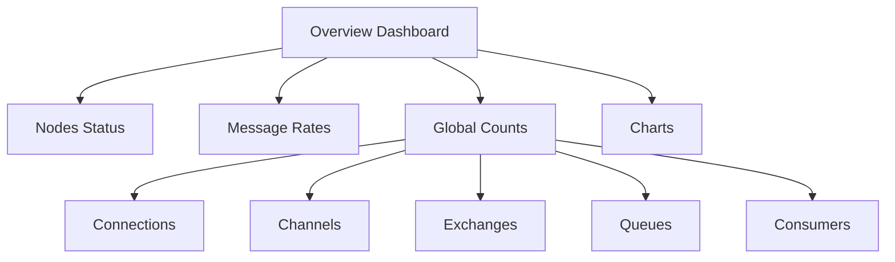

# RabbitMQ Management UI

## Introduction

The RabbitMQ Management UI is a powerful web-based interface that allows you to monitor, manage, and troubleshoot your RabbitMQ message broker. As a beginner working with message queues, having a visual tool makes it significantly easier to understand how messages flow through your system, track performance, and configure various components without writing code.

In this tutorial, you'll learn how to:
- Access and navigate the Management UI
- Monitor queues, exchanges, and connections
- Publish and receive messages through the interface
- Configure users and permissions
- View performance statistics

## Accessing the Management UI

The Management UI is provided through a plugin that comes pre-installed with RabbitMQ but needs to be enabled.

### Enabling the Management Plugin

If you're using a default RabbitMQ installation, you'll need to enable the management plugin first:

```bash
# On Windows
rabbitmq-plugins enable rabbitmq_management

# On Linux/MacOS
sudo rabbitmq-plugins enable rabbitmq_management
```

Once enabled, you can access the Management UI by opening a web browser and navigating to:

```
http://localhost:15672/
```

The default credentials are:
- Username: `guest`
- Password: `guest`

:::note
The default `guest` user can only connect from localhost for security reasons. For remote connections, you'll need to create a new user with appropriate permissions.
:::

## Navigating the Management UI

After logging in, you'll see a dashboard with several tabs. Let's explore each one:

### Overview Tab

The Overview tab provides a high-level summary of your RabbitMQ installation:

- **Nodes**: Shows the status of your RabbitMQ nodes
- **Message Rates**: Displays publish/deliver rates across your system
- **Global Counts**: Shows totals for connections, channels, exchanges, queues, and consumers
- **Charts**: Visual representation of message rates and queue depths

This dashboard is particularly useful for getting a quick sense of your system's health and activity.



### Connections Tab

The Connections tab shows all active connections to your RabbitMQ server. For each connection, you can see:

- Client IP address and port
- Username used for the connection
- Virtual host
- Time since connection was established
- Data rates (bytes in/out)
- Channels created on this connection

This information helps you monitor which applications are connecting to your broker and how they're performing.

### Channels Tab

Channels are lightweight connections created within a connection. The Channels tab shows:

- Channel ID
- Connection it belongs to
- Prefetch count (maximum number of unacknowledged messages)
- Messages unacknowledged
- Messages unconfirmed
- Consumer count

Monitoring channels helps you understand how your applications are interacting with RabbitMQ at a more granular level.

## Working with Exchanges

Exchanges are the routing mechanisms in RabbitMQ. The Exchanges tab allows you to:

### Viewing Exchanges

Navigate to the "Exchanges" tab to see all exchanges in your system. By default, you'll see several built-in exchanges:

- `amq.direct`: Direct exchange for point-to-point routing
- `amq.fanout`: Fanout exchange for broadcast routing
- `amq.topic`: Topic exchange for pattern-based routing
- `amq.headers`: Headers exchange for attribute-based routing

### Creating a New Exchange

Let's create a simple direct exchange:

1. Click the "Add a new exchange" button
2. Enter the following details:
   - Name: `my_direct_exchange`
   - Type: `direct`
   - Durability: `Durable` (survives broker restarts)
   - Auto delete: `No` (won't be deleted when no longer used)
3. Click "Add exchange"

```javascript
// Equivalent code to create this exchange in JavaScript
channel.assertExchange('my_direct_exchange', 'direct', {
  durable: true,
  autoDelete: false
});
```

### Testing the Exchange

You can publish a test message to your new exchange:

1. Click on your `my_direct_exchange` in the list
2. Scroll down to "Publish message"
3. Enter a routing key, for example: `user.created`
4. Type a message in the Payload field: `{"id": 123, "name": "John Doe"}`
5. Click "Publish message"

Note that since no queues are bound to this exchange yet, the message will be discarded.

## Working with Queues

Queues store messages until they are consumed by applications. The Queues tab is one of the most frequently used sections.

### Creating a Queue

Let's create a queue and bind it to our exchange:

1. Navigate to the "Queues" tab
2. Click "Add a new queue"
3. Enter these details:
   - Type: `Classic`
   - Name: `user_notifications`
   - Durability: `Durable`
   - Auto delete: `No`
4. Click "Add queue"

```javascript
// Equivalent code to create this queue in JavaScript
channel.assertQueue('user_notifications', {
  durable: true,
  autoDelete: false
});
```

### Binding a Queue to an Exchange

Now, let's bind our queue to the exchange:

1. Click on your `user_notifications` queue in the list
2. Scroll down to "Bindings"
3. Under "Add binding from exchange":
   - Select `my_direct_exchange` from the dropdown
   - Enter `user.created` as the routing key
4. Click "Bind"

```javascript
// Equivalent code for binding in JavaScript
channel.bindQueue('user_notifications', 'my_direct_exchange', 'user.created');
```

### Publishing and Receiving Messages

Now that we have a complete setup, let's publish a message and see it appear in the queue:

1. Go back to the "Exchanges" tab
2. Click on `my_direct_exchange`
3. Publish a message with routing key `user.created` and payload `{"id": 456, "name": "Jane Smith"}`
4. Navigate back to the "Queues" tab
5. Click on `user_notifications`
6. You should see 1 message in the queue
7. Click "Get messages" to view the message
8. Select "Ack mode: Automatic" and click "Get Message"

The message content should appear on your screen.

## User Management

The Management UI allows you to create and manage users and their permissions.

### Creating a New User

1. Navigate to the "Admin" tab
2. Click "Add a user"
3. Enter credentials and tags (e.g., "administrator" for full access)
4. Click "Add user"

### Setting Permissions

1. Click on the username in the users list
2. Set permissions for a virtual host:
   - Configure regexp: `.*` (can configure any resource)
   - Write regexp: `.*` (can write to any resource)
   - Read regexp: `.*` (can read from any resource)
3. Click "Set permission"

## Practical Example: Monitoring a Simple Messaging Application

Let's imagine you have a web application that processes user registrations. When a user registers, a message is sent to RabbitMQ, and then processed by a background worker.

Here's how you'd use the Management UI to monitor this flow:

1. **Check message rates**: On the Overview tab, watch the publish/deliver rates during periods of high registration
2. **Monitor queue depth**: If the `user_registrations` queue is growing, it might indicate your workers aren't keeping up
3. **Inspect problematic messages**: If processing is failing, you can use "Get messages" on the queue to inspect the messages that might be causing issues
4. **Track consumer activity**: Check how many consumers are connected and their activity rates

## Troubleshooting with the Management UI

The Management UI is invaluable for troubleshooting. Here are some common scenarios:

### Detecting Dead Letter Exchanges

If messages are being rejected and sent to a Dead Letter Exchange:

1. Navigate to the "Queues" tab
2. Look for queues with names starting with "DLX" or similar
3. Inspect messages in these queues to understand why they were rejected

### Identifying Connection Issues

If applications are having trouble connecting:

1. Check the "Connections" tab for frequent connect/disconnect patterns
2. Look at the "Channels" tab to see if channels are being opened and closed rapidly
3. Check the Overview charts for unusual patterns in connection counts

## Performance Optimization

The Management UI provides several visualizations that can help you optimize performance:

### Memory Usage

In the "Overview" tab, check the memory usage charts:

1. If memory is consistently high, consider adding more nodes to your cluster
2. Check which queues are consuming the most memory in the "Queues" tab

### Message Rate Monitoring

Track message rates over time:

1. Use the "Charts" section in the Overview tab
2. Look for patterns in publish/deliver rates
3. Identify peak usage times to plan capacity

## Summary

The RabbitMQ Management UI is an essential tool for anyone working with RabbitMQ. It provides:

- Visual representation of your messaging system
- Tools for configuration and administration
- Real-time monitoring of performance
- Troubleshooting capabilities
- Message publishing and consumption for testing

As you continue to work with RabbitMQ, the Management UI will be your go-to tool for understanding what's happening in your messaging system without having to write code or run commands.

## Exercises

1. **Basic Queue Management**:
   - Create a new durable queue named `exercise_queue`
   - Publish 5 messages to it through the UI
   - Consume those messages using the "Get messages" feature

2. **Exchange Configuration**:
   - Create a topic exchange named `exercise_topic`
   - Create two queues: `animals.mammals` and `animals.birds`
   - Bind the first queue with routing key `animals.mammal.*`
   - Bind the second queue with routing key `animals.bird.*`
   - Publish messages to test the routing

3. **Monitoring Challenge**:
   - Write a simple script that publishes 100 messages to an exchange
   - Use the Management UI to track the message rates
   - Take screenshots of the charts showing the message spike

## Additional Resources

- [Official RabbitMQ Management UI Documentation](https://www.rabbitmq.com/management.html)
- [RabbitMQ Best Practices](https://www.rabbitmq.com/best-practices.html)
- [RabbitMQ Clustering and High Availability](https://www.rabbitmq.com/clustering.html)

By mastering the Management UI, you're well on your way to becoming proficient with RabbitMQ as a whole. The visual feedback it provides bridges the gap between conceptual understanding and practical application, making it an invaluable learning tool.