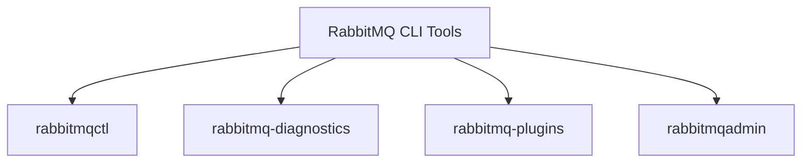

# RabbitMQ Command Line

## Introduction

RabbitMQ is a powerful message broker that implements the Advanced Message Queuing Protocol (AMQP). While RabbitMQ offers a web-based management UI, the command-line tools provide more flexibility and automation capabilities for managing your RabbitMQ server. This guide will walk you through the essential command-line tools that come with RabbitMQ, helping you become proficient in managing your messaging infrastructure from the terminal.

## Prerequisites

Before diving into RabbitMQ command-line tools, ensure you have:

- RabbitMQ server installed
- Command-line access to the server where RabbitMQ is running
- Basic understanding of RabbitMQ concepts (queues, exchanges, bindings)

## RabbitMQ Command-Line Tools Overview

RabbitMQ provides several command-line tools, but the most commonly used ones are:



Let's explore each of these tools in detail.

## The `rabbitmqctl` Command

The `rabbitmqctl` is the primary command-line tool for managing RabbitMQ nodes. It allows you to perform node management, user management, policy management, and monitoring operations.

### Basic Syntax

```bash
rabbitmqctl [options] command [command_options]
```

### Common Commands

#### 1. Node Management

**Check node status:**

```bash
rabbitmqctl status
```

Example output:

```
Status of node rabbit@hostname ...
Runtime

OS PID: 12345
OS: Linux
Uptime (seconds): 3600
RabbitMQ version: 3.11.2
...
```

**Stop the RabbitMQ application but leave the Erlang node running:**

```bash
rabbitmqctl stop_app
```

**Start the RabbitMQ application:**

```bash
rabbitmqctl start_app
```

**Reset a node to its virgin state (delete all data):**

```bash
rabbitmqctl reset
```

#### 2. User Management

**List all users:**

```bash
rabbitmqctl list_users
```

Example output:

```
Listing users ...
user    tags
guest   [administrator]
```

**Add a new user:**

```bash
rabbitmqctl add_user username password
```

**Set user tags (roles):**

```bash
rabbitmqctl set_user_tags username administrator
```

**Set permissions for a user:**

```bash
rabbitmqctl set_permissions -p vhost username ".*" ".*" ".*"
```

This grants the user configure, write, and read permissions on all resources in the specified vhost.

#### 3. Queue Management

**List queues:**

```bash
rabbitmqctl list_queues [options]
```

Example output:

```
Listing queues ...
name    messages
tasks    15
notifications    3
```

**For more detailed information:**

```bash
rabbitmqctl list_queues name messages consumers memory state
```

**Purge a queue:**

```bash
rabbitmqctl purge_queue queue_name
```

#### 4. Exchange and Binding Management

**List exchanges:**

```bash
rabbitmqctl list_exchanges
```

Example output:

```
Listing exchanges ...
name    type
amq.direct    direct
amq.fanout    fanout
amq.topic    topic
...
```

**List bindings:**

```bash
rabbitmqctl list_bindings
```

## The `rabbitmq-diagnostics` Command

The `rabbitmq-diagnostics` tool is used for diagnosing and health checking a RabbitMQ node.

### Basic Syntax

```bash
rabbitmq-diagnostics [options] command [command_options]
```

### Common Commands

**Check if the RabbitMQ server is running:**

```bash
rabbitmq-diagnostics ping
```

Example output:

```
Ping succeeded
```

**Get a complete health check:**

```bash
rabbitmq-diagnostics check_running
rabbitmq-diagnostics check_port_connectivity
rabbitmq-diagnostics check_virtual_hosts
```

**Get memory usage report:**

```bash
rabbitmq-diagnostics memory_breakdown
```

Example output:

```
Breakdown of memory usage by category in bytes:
connection_readers: 0
connection_writers: 0
connection_channels: 0
connection_other: 0
queue_procs: 0
queue_slave_procs: 0
...
```

## The `rabbitmq-plugins` Command

The `rabbitmq-plugins` tool is used to manage plugins for the RabbitMQ server.

### Basic Syntax

```bash
rabbitmq-plugins [options] command [command_options]
```

### Common Commands

**List all plugins:**

```bash
rabbitmq-plugins list
```

Example output:

```
Listing plugins with pattern ".*" ...
 Configured: E = explicitly enabled; e = implicitly enabled
 | Status: * = running on rabbit@hostname
 |/
[E*] rabbitmq_management               3.11.2
[e*] rabbitmq_management_agent         3.11.2
[e*] rabbitmq_web_dispatch             3.11.2
...
```

**Enable a plugin:**

```bash
rabbitmq-plugins enable rabbitmq_management
```

**Disable a plugin:**

```bash
rabbitmq-plugins disable rabbitmq_management
```

## The `rabbitmqadmin` Command

The `rabbitmqadmin` is a Python-based command-line tool that uses the RabbitMQ HTTP API. It's not installed by default but comes with the management plugin.

### Installing rabbitmqadmin

First, enable the management plugin:

```bash
rabbitmq-plugins enable rabbitmq_management
```

Then download the rabbitmqadmin script:

```bash
curl -O http://localhost:15672/cli/rabbitmqadmin
chmod +x rabbitmqadmin
mv rabbitmqadmin /usr/local/bin/
```

### Basic Syntax

```bash
rabbitmqadmin [options] command [command_options]
```

### Common Commands

**List queues:**

```bash
rabbitmqadmin list queues
```

**Create a queue:**

```bash
rabbitmqadmin declare queue name=my_queue durable=true
```

**Publish a message:**

```bash
rabbitmqadmin publish exchange=amq.default routing_key=my_queue payload="Hello, World!"
```

**Get a message from a queue:**

```bash
rabbitmqadmin get queue=my_queue
```

Example output:

```
+-------------+----------+---------------+--------------+------------------+-------------+
| routing_key | exchange | message_count | payload      | payload_encoding | redelivered |
+-------------+----------+---------------+--------------+------------------+-------------+
| my_queue    |          | 0             | Hello, World!| string           | False       |
+-------------+----------+---------------+--------------+------------------+-------------+
```

**Delete a queue:**

```bash
rabbitmqadmin delete queue name=my_queue
```

## Practical Examples

### Example 1: Setting Up a New RabbitMQ Instance

```bash
# Start the RabbitMQ server
sudo service rabbitmq-server start

# Check if it's running
rabbitmq-diagnostics ping

# Enable the management plugin
rabbitmq-plugins enable rabbitmq_management

# Create a new admin user
rabbitmqctl add_user admin StrongPassword123
rabbitmqctl set_user_tags admin administrator
rabbitmqctl set_permissions -p / admin ".*" ".*" ".*"

# Delete the default guest user (security best practice)
rabbitmqctl delete_user guest
```

### Example 2: Monitoring Queue Activity

Create a simple Bash script to monitor queue activity:

```bash
#!/bin/bash
# save as monitor_queues.sh

while true; do
    echo "Queue Status at $(date)"
    rabbitmqctl list_queues name messages consumers
    echo "------------------------"
    sleep 10
done
```

Make it executable and run:

```bash
chmod +x monitor_queues.sh
./monitor_queues.sh
```

### Example 3: Setting Up High Availability

Setting up a mirrored queue for high availability:

```bash
# Set policy for mirroring all queues starting with 'ha.'
rabbitmqctl set_policy ha-all "^ha\." '{"ha-mode":"all"}' --apply-to queues
```

## Troubleshooting with Command-Line Tools

### Problem: RabbitMQ Node Not Starting

```bash
# Check for errors in logs
rabbitmq-diagnostics log_tail

# Check for Erlang VM issues
rabbitmq-diagnostics erlang_cookie_sources

# Check file permissions and ownership
rabbitmq-diagnostics status
```

### Problem: Performance Issues

```bash
# Check memory consumption
rabbitmq-diagnostics memory_breakdown

# Check for slow consumers
rabbitmqctl list_queues name messages consumers consumer_utilisation
```

### Problem: Connection Issues

```bash
# Check connections
rabbitmqctl list_connections

# Check for blocked connections
rabbitmqctl list_connections state

# Check listener status
rabbitmq-diagnostics listeners
```

## Summary

RabbitMQ command-line tools are essential for effectively managing, monitoring, and troubleshooting your message broker. We've covered the four main tools:

1. `rabbitmqctl` for general management
2. `rabbitmq-diagnostics` for health checking and troubleshooting
3. `rabbitmq-plugins` for plugin management
4. `rabbitmqadmin` for HTTP-API based operations

Mastering these tools enables you to automate RabbitMQ operations, integrate with CI/CD pipelines, and effectively manage your messaging infrastructure in production environments.

## Exercises

1. Create a script that monitors queue depth and alerts when it exceeds a threshold.
2. Set up a user with limited permissions that can only publish to specific exchanges.
3. Create a queue with a message TTL and dead-letter exchange configuration using the command line.
4. Write a script that regularly backs up RabbitMQ definitions.

## Additional Resources

- [RabbitMQ Command Line Tools Documentation](https://www.rabbitmq.com/cli.html)
- [RabbitMQ Management HTTP API](https://www.rabbitmq.com/management.html#http-api)
- [RabbitMQ Best Practices](https://www.rabbitmq.com/production-checklist.html)

Happy messaging with RabbitMQ!