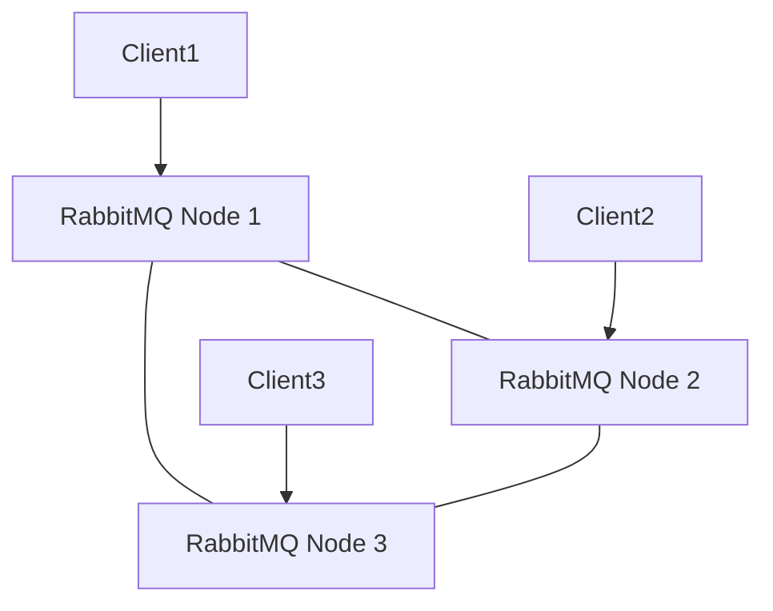

# RabbitMQ Configuration

## Introduction

Configuring RabbitMQ properly is essential for ensuring your message broker operates efficiently, securely, and reliably. In this guide, we'll explore the various configuration options available in RabbitMQ and how to implement them for your specific needs. Whether you're setting up RabbitMQ for development or production, understanding these configuration options will help you build robust messaging systems.

## Configuration Files and Formats

RabbitMQ uses several configuration files that control different aspects of its behavior. Let's examine the main configuration files:

### rabbitmq.conf

The primary configuration file is `rabbitmq.conf`, which uses a simple key-value format:

```
# This is a comment
disk_free_limit.absolute = 50MB
log.file.level = info
```

This replaced the older `rabbitmq.config` file in newer versions of RabbitMQ.

### advanced.config

For more complex configurations that cannot be expressed in the simple format, RabbitMQ provides `advanced.config` which uses Erlang terms:

```erlang
[
  {rabbit, [
    {tcp_listeners, [5672]},
    {ssl_listeners, [5671]}
  ]}
].
```

### rabbitmq-env.conf

This file contains environment variables that affect RabbitMQ server behavior:

```
# Example environment settings
RABBITMQ_NODE_IP_ADDRESS=127.0.0.1
RABBITMQ_NODE_PORT=5672
```

## Basic Configuration Settings

Let's look at some essential configuration settings you'll want to consider:

### Node Name and Networking

```
# Node name
node.name = rabbit@localhost

# Networking
listeners.tcp.default = 5672
listeners.ssl.default = 5671
```

The node name is important, especially in clustered environments. The TCP and SSL listeners define which ports RabbitMQ will use for connections.

### Memory and Disk Limits

To prevent RabbitMQ from consuming too many resources:

```
# Memory threshold - when to start paging messages to disk
vm_memory_high_watermark.relative = 0.4

# Disk free space limit - when to stop accepting messages
disk_free_limit.absolute = 1GB
```

These settings are crucial for production environments to ensure RabbitMQ doesn't crash due to resource exhaustion.

## User Management and Authentication

### Creating Users

You can create users and assign permissions using the rabbitmqctl command-line tool:

```bash
# Add a user
rabbitmqctl add_user myuser mypassword

# Set user tags (roles)
rabbitmqctl set_user_tags myuser administrator

# Set permissions
rabbitmqctl set_permissions -p / myuser ".*" ".*" ".*"
```

### Configuration File Authentication

For more advanced authentication, you can configure it in the configuration file:

```
# Enable authentication backends
auth_backends.1 = internal
auth_backends.2 = ldap

# LDAP configuration
auth_ldap.servers.1 = ldap.example.com
auth_ldap.user_dn_pattern = cn=${username},ou=People,dc=example,dc=com
```

## Virtual Hosts

Virtual hosts in RabbitMQ provide isolation between applications. You can configure them like this:

```bash
# Create a virtual host
rabbitmqctl add_vhost my_vhost

# Set permissions on the virtual host
rabbitmqctl set_permissions -p my_vhost myuser ".*" ".*" ".*"
```

## Queues and Exchanges Configuration

### Durable Queues

Durable queues survive broker restarts. You can create them using the client library:

```javascript
// Node.js example with amqplib
channel.assertQueue('my_durable_queue', { durable: true });
```

### Lazy Queues

Lazy queues store messages on disk as much as possible, reducing RAM usage:

```
# Set all queues as lazy by default
queue_master_locator = min-masters
queue_index_embed_msgs_below = 0
```

Or for specific queues:

```javascript
// Node.js example
channel.assertQueue('my_lazy_queue', { 
  durable: true,
  arguments: {'x-queue-mode': 'lazy'}
});
```

## Clustering Configuration

RabbitMQ can be set up in a cluster for high availability and scalability:



### Basic Cluster Setup

```bash
# On node2
rabbitmqctl stop_app
rabbitmqctl reset
rabbitmqctl join_cluster rabbit@node1
rabbitmqctl start_app

# On node3
rabbitmqctl stop_app
rabbitmqctl reset
rabbitmqctl join_cluster rabbit@node1
rabbitmqctl start_app
```

### Cluster Configuration in rabbitmq.conf

```
# Enable cluster formation
cluster_formation.peer_discovery_backend = rabbit_peer_discovery_classic_config
cluster_formation.classic_config.nodes.1 = rabbit@node1
cluster_formation.classic_config.nodes.2 = rabbit@node2
cluster_formation.classic_config.nodes.3 = rabbit@node3
```

## High Availability Configuration

### Mirrored Queues

Mirrored queues replicate data across multiple nodes:

```bash
# Set policy for queue mirroring
rabbitmqctl set_policy ha-all "^" '{"ha-mode":"all"}'
```

The above command creates a policy named `ha-all` that applies to all queues (the `^` pattern matches everything) and sets the high availability mode to "all", meaning the queue will be mirrored to all nodes in the cluster.

### Quorum Queues

For even better reliability, RabbitMQ 3.8+ supports quorum queues:

```javascript
// Node.js example
channel.assertQueue('my_quorum_queue', { 
  durable: true,
  arguments: {
    'x-queue-type': 'quorum',
    'x-quorum-initial-group-size': 3
  }
});
```

## Performance Tuning

### Connection and Channel Limits

To prevent resource exhaustion:

```
# Maximum connections
connection_max = 1000

# Maximum channels per connection
channel_max = 200
```

### Message Size Limits

```
# Maximum message size (in bytes)
max_message_size = 134217728  # 128MB
```

### Prefetch Count

Prefetch count is set on the client side but is crucial for performance:

```javascript
// Node.js example - limit to processing 10 messages at a time
channel.prefetch(10);
```

## Logging Configuration

Proper logging helps with troubleshooting:

```
# Log levels: debug, info, warning, error
log.file.level = info
log.console = true
log.console.level = warning

# Log file location
log.file = true
log.file.path = /var/log/rabbitmq/rabbit.log
```

## Plugins Configuration

RabbitMQ functionality can be extended with plugins:

```bash
# Enable management plugin
rabbitmq-plugins enable rabbitmq_management

# Enable shovel plugin
rabbitmq-plugins enable rabbitmq_shovel
```

Configuration for plugins in rabbitmq.conf:

```
# Management plugin configuration
management.listener.port = 15672
management.listener.ssl = true
```

## Example: Complete Production Configuration

Here's a more comprehensive example for a production environment:

```
# Node and cluster configuration
node.name = rabbit@prod-mq-01
cluster_formation.peer_discovery_backend = rabbit_peer_discovery_classic_config
cluster_formation.classic_config.nodes.1 = rabbit@prod-mq-01
cluster_formation.classic_config.nodes.2 = rabbit@prod-mq-02
cluster_formation.classic_config.nodes.3 = rabbit@prod-mq-03

# Resource limits
vm_memory_high_watermark.relative = 0.4
disk_free_limit.absolute = 5GB
connection_max = 2000
channel_max = 200

# SSL configuration
listeners.ssl.default = 5671
ssl_options.cacertfile = /path/to/ca_certificate.pem
ssl_options.certfile = /path/to/server_certificate.pem
ssl_options.keyfile = /path/to/server_key.pem
ssl_options.verify = verify_peer
ssl_options.fail_if_no_peer_cert = true

# Management plugin
management.listener.port = 15672
management.listener.ssl = true

# Logging
log.file.level = info
log.console = false
```

## Real-World Application: Message Processing System

Let's look at a real-world example of configuring RabbitMQ for a message processing system:

1. First, set up your RabbitMQ configuration:

```
# rabbitmq.conf
vm_memory_high_watermark.relative = 0.6
disk_free_limit.absolute = 10GB

# Enable shovel plugin for message transfer between brokers
management.listener.port = 15672
```

2. Create the appropriate exchanges and queues:

```javascript
// Node.js setup code
const amqp = require('amqplib');

async function setup() {
  const connection = await amqp.connect('amqp://localhost');
  const channel = await connection.createChannel();
  
  // Create exchange
  await channel.assertExchange('orders', 'topic', {durable: true});
  
  // Create queues
  await channel.assertQueue('new_orders', {
    durable: true,
    arguments: {'x-queue-type': 'quorum'}
  });
  
  await channel.assertQueue('order_processing', {
    durable: true,
    arguments: {
      'x-queue-type': 'quorum',
      'x-message-ttl': 3600000  // 1 hour TTL
    }
  });
  
  // Bind queues to exchange
  await channel.bindQueue('new_orders', 'orders', 'order.new');
  await channel.bindQueue('order_processing', 'orders', 'order.processing');
  
  // Set up dead letter exchange for failed messages
  await channel.assertExchange('dead_letters', 'fanout', {durable: true});
  await channel.assertQueue('failed_orders', {
    durable: true,
    arguments: {
      'x-dead-letter-exchange': 'orders',
      'x-dead-letter-routing-key': 'order.retry'
    }
  });
  await channel.bindQueue('failed_orders', 'dead_letters', '');
  
  console.log('RabbitMQ setup completed');
  await channel.close();
  await connection.close();
}

setup().catch(console.error);
```

This setup creates a robust system where:
- Orders flow through different queues based on their state
- Quorum queues ensure high availability
- TTLs prevent messages from being stuck forever
- Dead letter exchanges handle failed messages

## Summary

Proper RabbitMQ configuration is essential for creating reliable, secure, and efficient messaging systems. We've covered:

- Basic configuration files and formats
- Node and network configuration
- Memory and disk management
- User authentication and authorization
- Virtual hosts for application isolation
- Queue and exchange settings
- Clustering for high availability
- Performance tuning options
- Logging configuration
- Plugin management

By understanding these configuration options, you can tailor RabbitMQ to your specific requirements, whether you're building a simple development environment or a complex, high-throughput production system.

## Additional Resources

- Practice setting up RabbitMQ with different configuration options to understand their effects
- Experiment with creating different types of exchanges and queues
- Try implementing a clustering setup in a test environment
- Set up monitoring for your RabbitMQ instance to observe how configuration changes impact performance

## Exercises

1. Configure RabbitMQ to use SSL/TLS for secure connections
2. Set up a three-node RabbitMQ cluster with mirrored queues
3. Create a policy that automatically makes all queues with names starting with "important-" highly available
4. Configure RabbitMQ to authenticate against an external LDAP server
5. Implement a message processing pipeline with dead-letter exchanges and TTLs